# Jquery 确认

> 原文：<https://www.educba.com/jquery-confirm/>

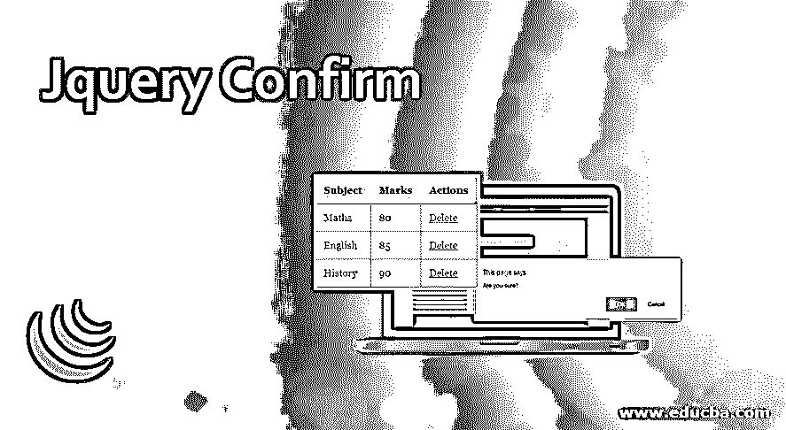


## jQuery 确认简介

jQuery confirm 是一个多用途的插件，集警告、确认和对话于一体。

它提供了更多的功能，下面列出了其中的一些。

<small>网页开发、编程语言、软件测试&其他</small>

*   聆听键盘按键
*   通过 AJAX 直接加载内容
*   指定时间后自动关闭对话框
*   防止后台点击时关闭对话框
*   支持回调功能
*   主题
*   动画等等。

### jQuery 确认的实现

下面是实现:

**安装**

要开始使用 confirm 库，您需要在代码中包含一些源文件。

这些文件可以通过以下方式使用。

1.  使用来自的单个文件
2.  在您的服务器上本地下载并安装文件。
3.  使用 NPM 或鲍尔软件包管理器。

**通过 CDN:**

```
<link rel="stylesheet" href="//cdnjs.cloudflare.com/ajax/libs/jquery-confirm/3.3.2/jquery-confirm.min.css">
```

```
<script src="//cdnjs.cloudflare.com/ajax/libs/jquery-confirm/3.3.2/jquery-confirm.min.js"></script>
```

**via Bower:**

```
$ bower install jquery-confirm
```

**途经 NPM:**

```
$ npm install jquery-confirm
```

### Jquery Confirm 示例

下面举几个例子

#### 示例#1

下面是一个非常简单的例子来演示 jQuery confirm 的工作。

**代码:**

```
<html>
<head>
<script src="https://ajax.googleapis.com/ajax/libs/jquery/3.3.1/jquery.min.js"></script>
<script src="https://cdnjs.cloudflare.com/ajax/libs/popper.js/1.12.9/umd/popper.min.js"></script>
<script>
$(document).ready(function () {
$(".member").click(function () {
if (confirm("Are you sure?")) {
alert("Confirmed! Item deleted");
} else alert("Delete Action Canceled!");
});
});
</script>
<style>
div {
margin-left: 500px;
margin-top: 100px;
background-color: lightslategrey;
width: 250px;
height: 150px;
}
.member {
padding-top: 10px;
padding-bottom: 10px;
margin-left: 60px;
margin-top: 50px;
text-align: center;
font-weight: bold;
font-size: medium;
background-color: cadetblue;
}
</style>
<body>
<div>
<button class="member">
Delete Product
</button>
</div>
</body>
</head>
</html>
```

**输出**

*   执行上述源代码时，屏幕显示如下。

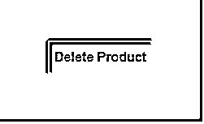


*   单击按钮将弹出一个对话框，要求用户确认操作，如下所示。

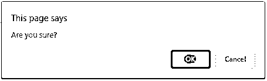


*   如果点击"确定"，屏幕显示如下弹出。

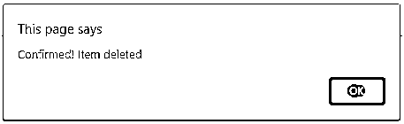


*   如果点击"取消"，屏幕弹出下图所示。

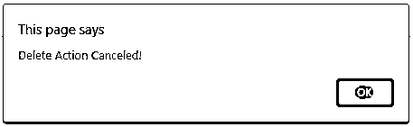


#### 实施例 2

这是另一个演示 confirm 用法的例子。

**代码:**

```
<html>
<head>
<script src="https://cdnjs.cloudflare.com/ajax/libs/jquery/2.1.3/jquery.min.js"></script>
<script>
$(document).ready(function () {
$(".deleteConfirm").click(function () {
var answer = confirm("Are you sure?");
return answer;
});
});
</script>
<style>
div{
margin-left: 300px;
margin-top: 100px;
}
body {
font-family:Georgia, 'Times New Roman', Times, serif;
font-size: 90%;
padding: 1px;
}
a {
color: #0091de;
}
.table {
border-collapse: collapse;
}
.table th {
background-color: lightblue;
padding: 0.8em;
}
.table td {
padding: 0.8em;
}
.table-bordered,
.table-bordered th,
.table-bordered td {
border: 1px solid #bbb;
}
.deleteConfirm {
color:red;
}
</style>
<body>
<div>
<table class="table table-bordered">
<thead>
<tr>
<th>Subject</th>
<th>Marks</th>
<th>Actions</th>
</tr>
</thead>
<tbody>
<tr>
</tr>
</thead>
<tbody>
<tr>
<td>Maths</td>
<td>80</td>
<td>
<a href="#" class="deleteConfirm">Delete</a>
</td>
</tr>
<tr>
<td>English</td>
<td>85</td>
<td>
<a href="#" class="deleteConfirm">Delete</a>
</td>
</tr>
<tr>
<td>History</td>
<td>90</td>
<td>
<a href="#" class="deleteConfirm">Delete</a>
</td>
</tr>
</tr>
</tbody>
</table>
</div>
</body>
</head>
</html>
```

**输出**

*   下面的屏幕显示了代码首次执行的时间。

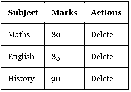


*   单击删除链接时，将显示以下屏幕进行确认。

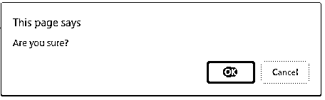


#### 实施例 3

让我们再考虑一个例子来说明 jQuery confirm 的用法。

**代码:**

```
<!DOCTYPE html>
<html lang="en">
<head>
<meta charset="utf-8" />
<title>jQuery confirm example</title>
<link
rel="stylesheet"
href="http://ajax.googleapis.com/ajax/libs/jqueryui/1.10.3/themes/smoothness/jquery-ui.css"
/>
<script src="https://ajax.googleapis.com/ajax/libs/jquery/1.9.1/jquery.min.js"></script>
<script src="https://ajax.googleapis.com/ajax/libs/jqueryui/1.10.3/jquery-ui.min.js"></script>
<script>
$(function () {
$("#dialog").dialog({
autoOpen: false,
modal: true,
buttons: {
Confirm: function () {
alert("You have confirmed!");
},
Cancel: function () {
$(this).dialog("close");
},
},
});
$("#callConfirm").on("click", function (e) {
e.preventDefault();
$("#dialog").dialog("open");
});
});
</script>
<style>
#divstyle {
margin-left: 500px;
margin-top: 100px;
background-color: lightslategrey;
width: 250px;
height: 150px;
}
#callConfirm {
padding-top: 10px;
padding-bottom: 10px;
margin-left: 60px;
margin-top: 50px;
text-align: center;
font-weight: bold;
font-size: medium;
background-color: cadetblue;
}
</style>
</head>
<body>
<div id="divstyle">
<button id="callConfirm">Click to confirm</button>
</div>
<div id="dialog" title="Confirmation Required">
Are you sure about this?
</div>
</body>
</html>
```

**输出**

*   第一次执行代码时，会出现下面的屏幕。

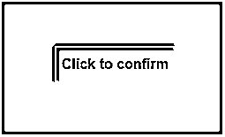


*   单击该按钮时，会弹出一个确认窗口，要求用户确认该操作。

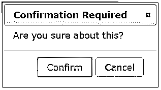


*   单击“确认”按钮时，将显示一条提示消息，显示确认信息。

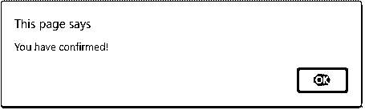


#### 实施例 4

这是另一个说明确认插件功能的例子

**代码:**

```
<!DOCTYPE html>
<html lang="en">
<head>
<meta charset="utf-8" />
<title>jQuery confirm example</title>
<link rel="stylesheet" href="https://cdnjs.cloudflare.com/ajax/libs/jquery-confirm/3.3.2/jquery-confirm.min.css">
<script src="https://ajax.googleapis.com/ajax/libs/jquery/1.9.1/jquery.min.js"></script>
<script src="https://cdnjs.cloudflare.com/ajax/libs/jquery-confirm/3.3.2/jquery-confirm.min.js"></script>
<script>
$(function () {
var askConfirmation = true;
$('#formname').submit(function(e) {
if (askConfirmation) {
e.preventDefault();
$.confirm({
title: "Confirm Delete",
content: "Are you sure?",
buttons: {
confirm: {
text: "Delete",
btnClass: 'btn-danger',
action: function() {
askConfirmation = false;
alert("The item has been deleted.");
}
},
cancel: {
text: "Cancel",
btnClass: 'btn-default'
}
}
});
}
})
});
</script>
<style>
#divstyle {
margin-left: 500px;
margin-top: 100px;
background-color: lightslategrey;
width: 250px;
height: 150px;
}
#confirm-button {
padding-top: 10px;
padding-bottom: 10px;
margin-left: 60px;
margin-top: 50px;
text-align: center;
font-weight: bold;
font-size: medium;
background-color: cadetblue;
}
</style>
</head>
</head>
<body>
<div id="divstyle">
<form action="#" method="post" id="formname">
<input type="text" name="someinput">
<button id="confirm-button" type="submit">Submit</button>
</form>
</div>
</body>
</html>
```

**输出**

*   第一次执行代码时，屏幕显示如下。

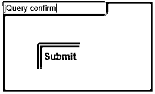


*   点击“提交”按钮，弹出确认窗口，如下图所示。

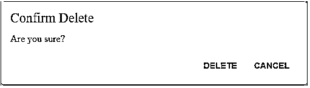


*   单击“确认”时，会显示一条警告消息，提示“该项目已被删除”。


### 结论

*   在本文中，我们讨论了 jQuery confirm 插件，它将警告、确认和对话框功能合二为一。
*   这是一个多用途的插件，用于提醒、确认和更多的对话。
*   这个插件可以让你轻松地创建带有自定义样式和动画的提醒、确认、提示对话框。

### 推荐文章

这是一个 Jquery 确认指南。为了更好地理解，我们在这里讨论 jQuery confirm 的实现以及相应的例子。您也可以阅读以下文章，了解更多信息——

1.  [jQuery Datepicker](https://www.educba.com/jquery-datepicker/)
2.  [jQuery 就绪](https://www.educba.com/jquery-ready/)
3.  [jQuery 自动完成](https://www.educba.com/jquery-autocomplete/)
4.  [jQuery 变更()](https://www.educba.com/jquery-change/)


