# jQuery 选择值

> 原文：<https://www.educba.com/jquery-select-value/>

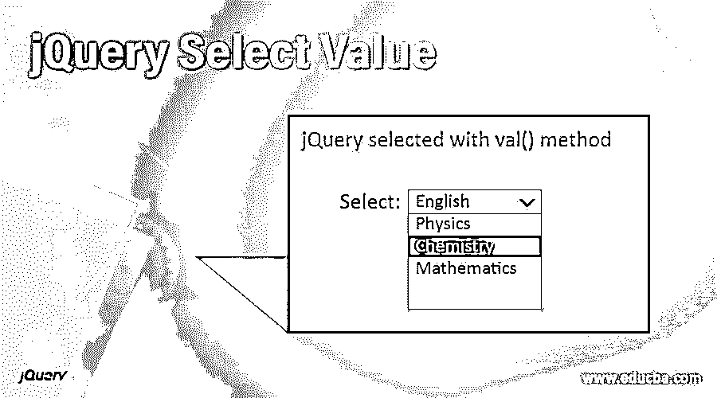


## jQuery 选择值简介

jQuery select value 允许您从选择框和下拉框中获取所选选项的值。jQuery 提供了两种方法，val()和 text()来实现这一点。jQuery: selected selector 与 val()或 text()方法结合使用，在选择框或下拉列表中查找所选选项的值。使用 val()方法，我们获得要发送到服务器的值，使用 text()方法，我们获得所选元素的文本值。

**语法:**

<small>网页开发、编程语言、软件测试&其他</small>

**1。使用 val()方法:** val()方法用于返回所选元素的值

```
$("#selectedId option : selected").val()
```

**2。使用 text()方法:** text()方法用于返回所选元素的文本值(字符串)

```
$("#selectedId option : selected").text()
```

其中，val()和 text()不接受任何参数。

### jQuery 选择值是如何工作的？

Select 元素基本上有两个可以访问的值。第一个值将被发送到服务器，我们可以使用 val()获得它。第二个值是所选元素的文本值，我们可以使用 text()方法获得它。

```
<option value = "books">English</option>
```

其中，books 是 val()方法返回的值。Englishis 是 text()方法返回的值。

*   每当在下拉列表中选择一个项目时，就会执行 jQuery OnChange 事件处理程序，其中 val()或 text()方法获取所选项目的值，然后对它们执行各种操作。

### jQuery 选择值的示例

让我们通过几个例子来理解如何使用 jQuery 从选择框中获取选择值。

#### 示例#1

这个例子演示了 jQuery select value 如何与 val()方法一起工作。

**代码:**

```
<!DOCTYPE html>
<head>
<title>jQuery Get Selected Option Value</title>
<script src="https://code.jquery.com/jquery-1.12.4.js"></script>
<script>
$(document).ready(function () {
$("#SubjectsList").change(function () {
var selectedSubject = $("#SubjectsList option:selected").val();
alert("You have selected the country - " + selectedSubject);
});
});
</script>
<style>
#divstyle {
width: 500px;
height: 250px;
padding-top: 20px;
padding-left: 5px;
font-size: 24px;
text-align: center;
color: maroon;
background-color: cadetblue;
}
</style>
</head>
<body>
<div id ="divstyle">
<h3>jQuery select value using val() method</h3>
<label style="font-size: 20px;">Select:</label>
<select id="SubjectsList">
<option value="eng">English</option>
<option value="phy">Physics</option>
<option value="chem">Chemistry</option>
<option value="maths">Mathematics</option>
</select>
</div>
</body>
</html>
```

**输出:**

*   当上面的代码被执行时，下面的屏幕显示。
*   默认情况下，我们在给定的下拉列表中选择了“英语”选项。


*   现在，我们将选中的选项更改为“化学”。我们使用 jQuery :selected with val()方法在下拉列表中查找选中的值。

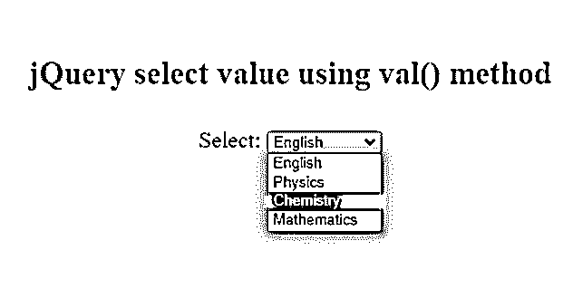


*   执行此操作时，OnChange 事件处理程序执行，提取所选选项的值并显示在如下所示的警告框 a 中。

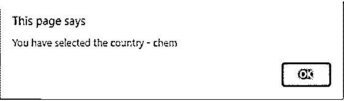


*   现在，我们选择了“化学”选项。

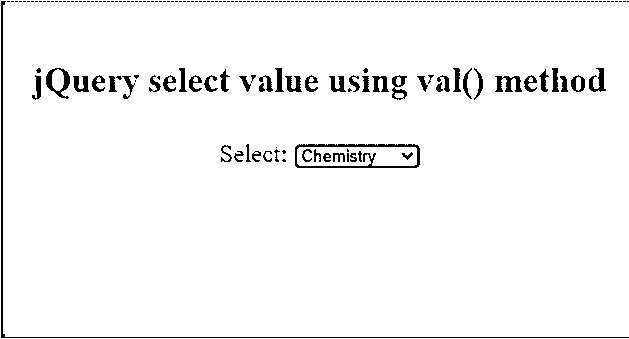


#### 实施例 2

这个例子演示了 jQuery select value 如何与 text()方法一起工作。

**代码:**

```
<!DOCTYPE html>
<head>
<title>jQuery Get Selected Option Value</title>
<script src="https://code.jquery.com/jquery-1.12.4.js"></script>
<script>
$(document).ready(function () {
$("#SubjectsList").change(function () {
var selectedSubject = $("#SubjectsList option:selected").text();
alert("You have selected the country - " + selectedSubject);
});
});
</script>
<style>
#divstyle {
width: 500px;
height: 250px;
padding-top: 20px;
padding-left: 5px;
font-size: 24px;
text-align: center;
color: maroon;
background-color: cadetblue;
}
</style>
</head>
<body>
<div id ="divstyle">
<h3>jQuery select value using text() method</h3>
<label style="font-size: 20px;">Select:</label>
<select id="SubjectsList">
<option value="eng">English</option>
<option value="phy">Physics</option>
<option value="chem">Chemistry</option>
<option value="maths">Mathematics</option>
</select>
</div>
</body>
</html>
```

**输出:**

*   当上面的代码被执行时，下面的屏幕显示。
*   默认情况下，在给定的下拉列表中选择的选项是“英语”。

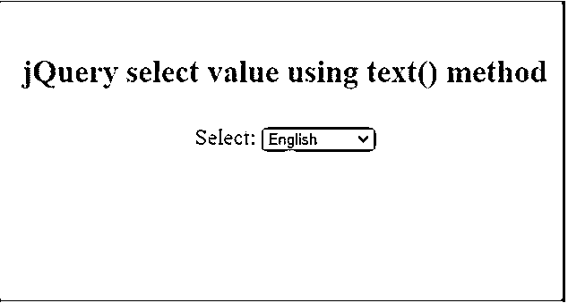


*   现在，我们将选中的选项更改为“化学”。我们使用 jQuery :selected with text()方法在下拉列表中查找选中的值。

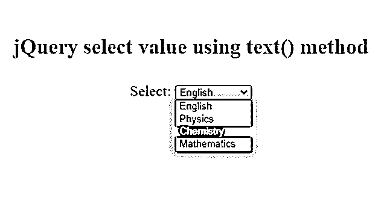


*   执行此操作时，OnChange 事件处理程序执行，提取所选选项的值并显示在下面所示的警告框中。

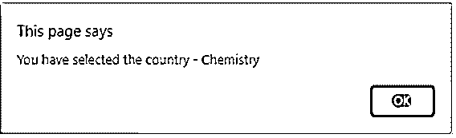


*   现在，选择的选项是“化学”。

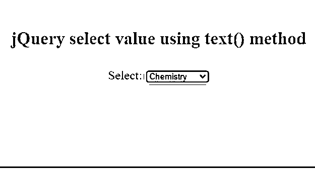


#### 实施例 3

这个例子演示了如何使用 jQuery 从多个选择框中检索选择的值。

**代码:**

```
<!DOCTYPE html>
<head>
<title>jQuery select values from Multiple Select Box</title>
<script src="https://code.jquery.com/jquery-1.12.4.js"></script>
<script>
$(document).ready(function () {
$("button").click(function () {
var multipleValues = $( "#subj" ).val() || [];
$( "p" ).html(" <b>You selected:</b> " + multipleValues.join( ", " ) );
});
});
</script>
<style>
#divstyle {
width: 500px;
height: 350px;
padding-top: 20px;
padding-left: 5px;
font-size: 24px;
text-align: center;
color: maroon;
background-color: cadetblue;
}
</style>
</head>
<body>
<div id="divstyle">
<h3>jQuery select values from Multiple Select Box</h3>
<select id="subj" multiple="multiple" size="7">
<option>English</option>
<option>Maths</option>
<option>Physics</option>
<option>Chemistry</option>
<option>History</option>
<option>Geography</option>
</select>
<br />
<button type="button">Click</button>
<p></p>
</div>
</body>
</html>
```

**输出:**

*   当上面的代码被执行时，下面的屏幕显示。
*   我们可以看到一个多选框，允许用户进行多项选择。

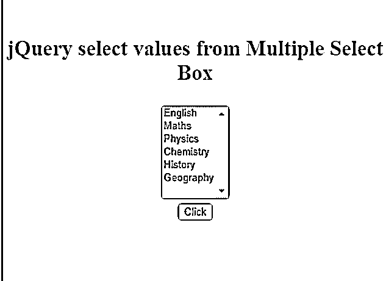


*   现在，按住 Windows 上的 ctrl 键和 Mac 上的 command 键，可以进行多重选择，如下所示。

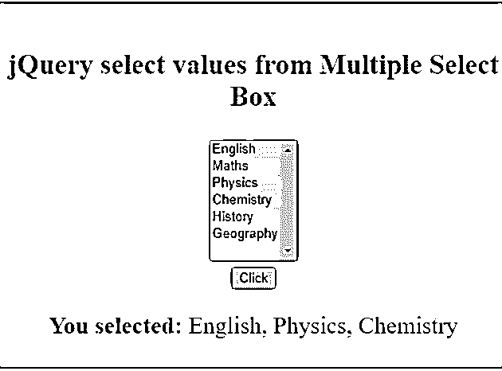


*   通过在<select>中添加“多重”属性，可以在选择框中进行多重选择</select>

#### 实施例 4

下面是另一个类似的例子，演示了如何使用 jQuery 从多个选择框中检索选定的值。

**代码:**

```
<!DOCTYPE html>
<head>
<title>jQuery select values from Multiple Select Box</title>
<script src="https://code.jquery.com/jquery-1.12.4.js"></script>
<script>
$(document).ready(function () {
$("button").click(function () {
var selectedValues = [];
$.each($("#subj option:selected"), function () {
selectedValues.push($(this).val());
});
alert("Your favorite website is - " + selectedValues.join(", "));
});
});
</script>
<style>
#divstyle {
width: 500px;
height: 350px;
padding-top: 20px;
padding-left: 5px;
font-size: 24px;
text-align: center;
color: maroon;
background-color: cadetblue;
}
</style>
</head>
<body>
<div id="divstyle">
<h3>jQuery select values from Multiple Select Box</h3>
<select id="subj" multiple="multiple" size="7">
<option>English</option>
<option>Maths</option>
<option>Physics</option>
<option>Chemistry</option>
<option>History</option>
<option>Geography</option>
</select>
<br />
<button type="button">Click</button>
<p></p>
</div>
</body>
</html>
```

**输出:**

*   当上面的代码被执行时，下面的屏幕显示。

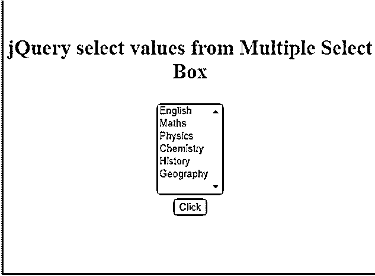


*   在这里，val()方法返回一个数组，其中包含每个选中选项的值。
*   如果没有选择任何选项，该方法将返回一个空数组。

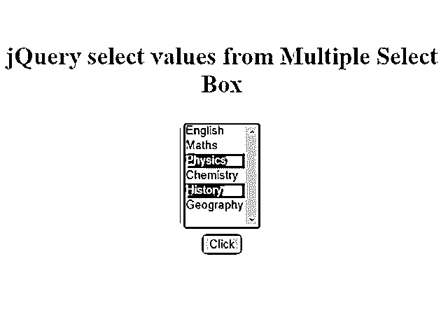


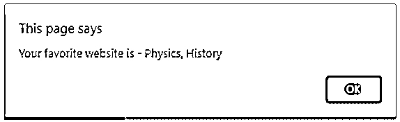


### 结论

*   在本文中，我们讨论了如何使用 jQuery 获取选择框中选择的值。
*   jQuery 为此提供了两种方法，val()和 text()。
*   val()方法返回所选选项的值。
*   text()方法返回所选选项的文本值

### 推荐文章

这是一个 jQuery 选择值的指南。在这里，我们还将讨论 jquery select value 的简介和工作原理。以及不同的示例及其代码实现。您也可以看看以下文章，了解更多信息–

1.  [jQuery 小部件](https://www.educba.com/jquery-widgets/)
2.  [JQuery 模态](https://www.educba.com/jquery-modal/)
3.  [jQuery 重置表单](https://www.educba.com/jquery-reset-form/)
4.  [jQuery 滑块](https://www.educba.com/jquery-slider/)


