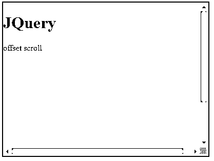
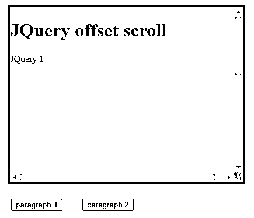
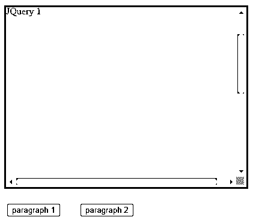

# jQuery 偏移量滚动

> 原文：<https://www.educba.com/jquery-offset-scroll/>


## jQuery 偏移滚动的定义

jQuery offset scroll 方法允许我们检索元素在文档中的当前位置。另一方面，position 返回相对于偏移父级的当前位置；offset()更有利于将新元素放在现有元素之上进行全局操作。Offset()返回一个具有 top 和 left 属性的对象。在某些情况下，由与维度相关的 API(如 offset())返回的数字可能是小数。代码不应该假定该值是一个整数。此外，当用户放大网站时。

### 什么是 jQuery 偏移量滚动？

*   jQuery 偏移量滚动维度可能不准确；浏览器不公开 API 来识别这种情况。
*   此过程返回第一个匹配元素的偏移坐标。它返回一个基于像素的对象，该对象具有两个属性，即 top 和 left。
*   使用这种方法设置所有匹配元素的偏移坐标。下面是 jQuery 偏移滚动方法的语法。

**返回偏移量坐标的语法**

<small>网页开发、编程语言、软件测试&其他</small>

```
$(selector).Offset()
```

**设置偏置坐标的语法**

```
$(selector).Offset({top:val, left:val})
```

**使用功能**设置偏置坐标的语法

```
$(selector).Offset(function(index, current_offset))
```

下面是 jQuery 偏移滚动方法的参数描述语法。

1) **上限值{ Top:val }**–设置偏置时需要该值。它将以像素为单位指定顶部坐标。最大值的示例是{top: 100}。

2) **左侧值{ Left:val }**–设置偏置时需要该值。它将以像素为单位指定左侧坐标。上限值的示例是{left: 100}。

3) **函数**–这是一个可选的 jQuery 偏移滚动语法参数。它将指定包含左侧和顶部坐标的选项。

4) **索引**–索引是函数坐标中使用的参数。它将从集合中返回元素的位置。

5) **当前偏移量**–Index 是函数坐标中使用的参数。它将返回所选元素的当前坐标。

### 如何使用 jQuery 偏移滚动？

*   当我们点击网站上的按钮或标题列表时，我们通常希望它自动滚动到页面的特定部分。
*   因此，我们需要使用 jQuery 来自动滚动到适当的元素。我们可以用 jQuery 以非常简单的方式做到这一点。
*   scrollTop()方法将滚动条的垂直位置设置为值“val”
*   它用于使用 offset()方法获取一组所有匹配元素中第一个元素的坐标。一旦在页面上包含了 jQuery，我们就可以使用 jQuery animation()来实现平滑滚动。
*   jQuery 中的 scrollTop()方法设置 scrolltop 的位置。scrollTop()方法返回第一个匹配元素的顶部滚动偏移量。这种方法可以应用于可见和隐藏的项目。
*   有趣的是，这个方法让我们指定一个偏移量，以便滚动在目标之前的某个距离处停止。
*   我们可以分别使用 scrollTop 元素和 scrollLeft 元素获得垂直和水平偏移量。
*   如果我们关心整个页面，我们可以使用文档正文。如果我们需要百分比，我们可以将它们与 element offsetHeight 和 element offsetWidth 进行比较。

### jQuery 偏移滚动函数

*   这个方法使用一个函数来设置偏移量。该方法采用一个可选参数。此方法返回匹配元素的坐标。
*   scrollTop 属性获取或设置元素内容的垂直滚动，以像素为单位。
*   元素的 scrollTop 值是元素顶部和最上面的可见内容之间的距离的度量。
*   当元素的内容不提供垂直滚动条时，scrollTop 值为 0。
*   当 scrollTop 用于根元素时，返回窗口的滚动。这是 scrollTop 规则的一个例外。负数不会导致 scrollTop 响应；相反，它将自己重置为 0。

### 例子

下面提到了不同的例子:

下面的例子展示了如何使用 jQuery 滚动特定的元素。

**代码:**

```
<!DOCTYPE html>
<html lang="en">
<head>
<meta charset="UTF-8">
<meta name="viewport" content=
"width=device-width, initial-scale=2.0">
<script src=
Integrity = "sha256-9/aliU8dGd2tb6OSsuzixeV4y/faTqgFtohetphbbj0="
Crossorigin ="anonymous">
</script>
<title> JQuery offset scroll
</title>
<style>
div {
color: #0f9d58;
border: 2px solid #0f9d58;
width: 400px;
height: 300px;
overflow: auto;
} p {
width: 400px;
height: 300px; }
</style>
</head>
<body>
<div class="demo">
<h1>JQuery</h1>
<p>offset scroll</p>
</div>
<script>
var container = $('div');
var scrollTo = $('p');
var position = scrollTo.offset().top
- container.offset().top
+ container.scrollTop ();
</script>
</body>
</html>
```




以下示例显示了如何使用 jQuery offset scroll 滚动到页面的不同部分。

**代码:**

```
<!DOCTYPE html>
<html lang="en">
<head>
<meta charset="UTF-8">
<meta name="viewport" content=
"width=device-width, initial-scale=1.0">
<script src=
"https://code.jQuery.com/jQuery-3.5.1.min.js"
integrity=
"sha256-9/aliU8dGd2tb6OSsuzixeV4y/faTqgFtohetphbbj0="
crossorigin="anonymous">
</script>
<title>
JQuery offset scroll
</title>
<style>
div {
color: #0f9d58;
border: 3px solid #0f9d58;
margin: 10px;
width: 400px;
height: 300px;
overflow: auto;
}
p {
width: 400px;
height: 300px;
}
button {
margin: 15px;
}
</style>
</head>
<body>
<div class="demo">
<h1>JQuery offset scroll</h1>
<p id="p1">JQuery 1</p>
<p id="p2">JQuery 2</p>
</div>
<button onclick="jQuery1()">
paragraph 1
</button>
<button onclick="JQuery2()">
paragraph 2
</button>
<script>
var container = $('div');
function jQuery1() {
var scrollTo = $("#p1");
var position = scrollTo.offset().top
- container.offset().top
+ container.scrollTop();
container.animate({
scrollTop: position
});
}
function JQuery2() {
var scrollTo = $("#p2");
var position = scrollTo.offset().top
- container.offset().top
+ container.scrollTop();
container.animate ({
scrollTop: position
});
}
</script>
</body>
</html>
```







### 结论

此过程返回第一个匹配元素的偏移坐标。它返回一个基于像素的对象，该对象具有两个属性，即 top 和 left。jQuery 中的 scrollTop()方法设置 scrolltop 的位置。scrollTop()方法返回第一个匹配元素的顶部滚动偏移量。

### 推荐文章

这是一个 jQuery 偏移量滚动的指南。这里我们讨论定义，什么是 jQuery offset scroll？如何使用 jQuery 偏移滚动？例子，代码。您也可以看看以下文章，了解更多信息–

1.  [jQuery 插入](https://www.educba.com/jquery-insert/)
2.  [jquery ajax url](https://www.educba.com/jquery-ajax-url/)
3.  [jquery 获取被点击元素的 id](https://www.educba.com/jquery-get-id-of-clicked-element/)
4.  [jQuery 获取父节点](https://www.educba.com/jquery-get-parent/)


