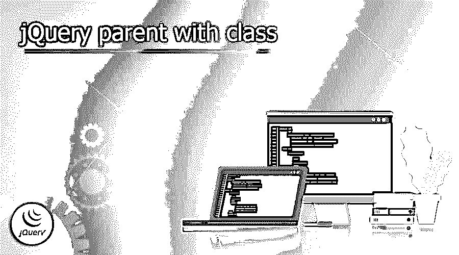
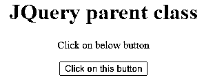
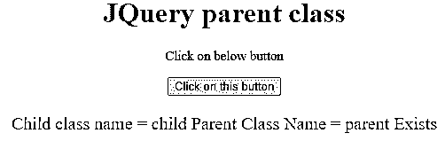
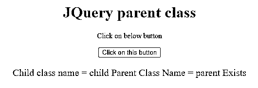
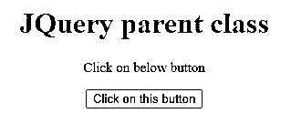

# 具有类的 jQuery 父级

> 原文：<https://www.educba.com/jquery-parent-with-class/>




## 具有类的 jQuery 父级上的定义

jQuery parent with class 方法允许我们搜索表示 DOM 树中一组 DOM 元素的 jQuery 对象的父对象，并根据匹配的元素创建新的 jQuery 对象。parent()和 parents()方法几乎相同，只是后者只在 DOM 树中向上移动了一级。或者，该方法接受与$()函数类型相同的选择表达式。如果提供了选择器，将根据元素是否匹配来过滤元素。

### 具有类概述的 jQuery 父级

*   jQuery 类选择器选择具有特定类的所有组件。HTML 元素的 class 属性被称为 class 属性。
*   jQuery 父类用于指定所选元素的类。
*   开头不应该有数字。几个 HTML 组件使用它来设计样式。为了挑选 HTML 页面的部分或元素，jQuery 使用 CSS 样式的选择器。
*   然后，我们可以使用 jQuery 方法或函数来处理 jQuery 组件。
*   键入一个美元符号，后跟括号，以使用其中一个选择器$()。jQuery()函数缩写为 jQuery。
*   将我们想要选择的元素放在括号内。单引号或双引号都可以接受。然后，在括号后面，在我们要使用的技术后面加一个点。
*   jQuery 中的类和 ID 选择器类似于 CSS 选择器。CSS 中的 ID 选择器用于将样式应用于特定的 HTML 元素。
*   HTML 元素的 ID 属性必须与 CSS ID 选择器匹配。与可以应用于站点中多个组件的类不同，唯一 ID 只能应用于一个元素。
*   CSS ID 属性将优先于 CSS 类属性。编写一个哈希(#)字符，后跟元素的 id 来选择它。

### 如何用类找到 jQuery 父类？

有两种方法可以找到带有类的 jQuery，如下所示。首先，借助类名，我们可以确定 HTML 中元素的父类。

<small>网页开发、编程语言、软件测试&其他</small>

#### 方法 1

*   最接近的()方法基本上用于返回第一个祖先的项目。如果祖先类存在，则返回类名；否则，它将返回不存在。
*   on()方法用于为一组组件选择事件处理程序。然后，当用户按下按钮时，该函数被调用。

#### 方法 2

*   使用 on()方法选择所选组件的事件处理程序。然后，当用户按下按钮时，该函数被调用。
*   parent()方法用于获取所有指定项目的祖先。如果祖先类存在，则返回该类的名称；否则，它返回不存在。
*   方法 1 和 2 用于查找 jQuery 父类。

#### 使用 jQuery 的父元素

*   jQuery 是一个免费的 Javascript 框架，方便了 HTML 和 CSS 文档之间的交互。
*   父母技巧中的选择情商有助于简化事情。我们只需要知道自己的水平就可以使用了。如果我们不需要知道父节点的类。
*   Parents()返回一个从真正的父节点到 HTML 节点的子数组，parents()返回一个子数组。要获得第 n 个父级，请使用参数 eq (n-1)"(索引为 0)调用 parents 方法。
*   closest()方法在 DOM 树中扫描这些项目及其祖先，并从匹配元素本身测试的元素创建一个新的 jQuery 对象。
*   它向上遍历 DOM 的元素前辈，返回第一个匹配我们作为输入给出的选择器的元素。
*   parent()方法遍历 DOM 树，找到每个元素的直接父元素，并根据匹配的元素构造一个新的 jQuery 对象，给出一个表示一组 DOM 元素的 jQuery 对象。
*   这种技术类似于 parents()，只是 parent()在 DOM 树中只上升一级。
*   或者，该方法采用与$()函数相同类型的选择表达式。如果给定了一个选择器，则通过查看它们是否匹配来过滤元素。
*   parent()方法用于查找直接的父元素。这个函数定位指定元素的父元素。
*   此 parent()方法在遍历一个或多个更高级别后返回指定的元素。

### JQuery 父类名示例

以下示例显示了 jQuery 父名称类的一个示例。

#### 1)使用最接近方法的 jQuery 父名称类–

以下示例显示了 jQuery 父名称类，其最接近的方法如下。最接近的方法用于获取第一个祖先元素。

**代码:**

```
<!DOCTYPE html>
<html>
<head>
<title> JQuery parent class</title>
<script src="https://ajax.googleapis.com/ajax/libs/jquery/3.5.1/jquery.min.js">
</script>
</head>
<body style="text-align:center;">
<h1 style="color:Red;">
JQuery parent class
</h1>
<p id="GFG_UP" style=
"font-size: 15px; font-weight: Medium;">
</p>
<div class="parent">
<div class="child"></div>
</div>
<button>
Click on this button
</button>
<p id="GFG_DOWN" style=
"color: Red; font-size: 20px; font-weight: Medium;">
</p>
<script>
$('#GFG_UP').text('Click on below button');
$('button').on('click', function() {
var object = $('.child').closest('.parent');
if (object.length) {
$('#GFG_DOWN').text("Child class name = child"
+ " Parent Class Name = parent" + " Exists");
}
else {
$('#GFG_DOWN').text("Class not exist");
}
});
</script>
</body>
</html>
```







#### 2)用该类查询父类以获取所有匹配的祖先元素——

以下示例显示了 jQuery 父类，该类获取所有匹配的祖先元素。

**代码:**

```
<!DOCTYPE html>
<html>
<head>
<title> JQuery parent class </title>
<script src="https://ajax.googleapis.com/ajax/libs/jquery/3.5.1/jquery.min.js">
</script>
</head>
<body style="text-align:center;">
<h1 style="color:Red;">
JQuery parent class
</h1>
<p id="GFG_UP" style=
"font-size: 15px; font-weight: Medium;">
</p>
<div class="parent">
<div class="child"></div>
</div>
<button>
Click on this button
</button>
<p id="GFG_DOWN" style=
"color: Red; font-size: 20px; font-weight: medium;">
</p>
<script>
$('#GFG_UP').text('Click on below button');
$('button').on('click', function() {
var object = $('.child').closest('.parent');
if (object.length) {
$('#GFG_DOWN').text("Child class name = child"
+ " Parent Class Name = parent" + " Exists");
}
else {
$('#GFG_DOWN').text("Class not exist");
}
});
</script>
</body>
</html>
```







### 结论

父类用于将特定的样式应用于一组 HTML 元素。例如，jQuery parent with class 方法允许我们搜索表示 DOM 树中一组 DOM 元素的 jQuery 对象的父对象，并根据匹配的元素创建新的 jQuery 对象。

### 推荐文章

这是一个 jQuery 父类的指南。这里我们讨论定义，概述，如何找到 jQuery 父类？例子，代码。您也可以看看以下文章，了解更多信息–

1.  [jQuery 插入元素](https://www.educba.com/jquery-insert-element/)
2.  [jQuery Ajax 同步](https://www.educba.com/jquery-ajax-synchronous/)
3.  [jQuery 滚动平滑](https://www.educba.com/jquery-scroll-smooth/)
4.  [jQuery 滚动](https://www.educba.com/jquery-scroll/)


