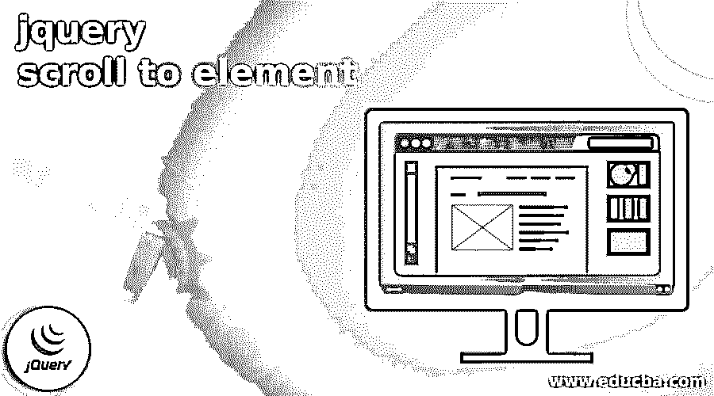
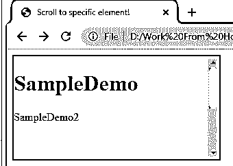
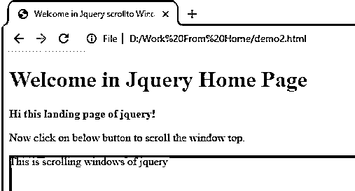
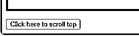

# jquery 滚动到元素

> 原文：<https://www.educba.com/jquery-scroll-to-element/>




## jquery 滚动到元素简介

jQuery 向用户提供不同类型的功能，其中按元素滚动是 jQuery 提供的功能之一。基本上，当我们需要滚动到一个特定的元素时，就会用到 scroll to element，或者换句话说，当我们滚动到一个特定的 web 元素时，就会发生 scroll to element。这适用于所有浏览器窗口以及所有可滚动元素。我们可以出于不同的目的使用 jQuery scroll()方法，例如，如果我们需要滚动事件并在滚动后执行附加的函数。换句话说，我们可以说它是用来触发事件的。

### 什么是 jQuery 滚动到元素？

首先，让我们看看什么是滚动如下。

<small>网页开发、编程语言、软件测试&其他</small>

当客户看到零件中的优势点时，scroll()策略会离开零件。我们可以在窗口抗议上应用，就像可滚动边缘的宽度实际上不是其内容的高度或宽度一样。scroll()技术发生在客户检查预定义部分的时候。scroll()策略适用于每个可滚动部分和窗口对象(程序窗口)。scroll()技术触发 scroll()策略，或者在 scroll()技术发生时加入运行能力。

使用 jQuery，您可以用惊人的方法来扩展与客户的联系。一种方法是让 jQuery 滚动到突出显示的元素。这样，你可以在你的站点页面上建立内部连接，当一个人点击任何这样的连接时，他就会被特定的组件看到。

当网站页面非常大时，这是非常方便的，通过这些内部连接，客户可以直接进入页面上的特定主题。

要设置或获取组件的滚动位置，可以利用组件的属性 scrollTop 和 scrollLeft。我们可以根据用户需求使用向左滚动和向右滚动，我们需要在滚动方法中提到它们。

### 如何使用 jQuery 滚动到元素？

现在让我们看看如何在 jQuery 中使用滚动到一个元素，如下所示。

通常，在许多网站中，当我们点击一个按钮或导航栏或摘要中的标题时，我们需要滚动到网站页面的一部分。因此，要完成这个程序并查看必要的组件，我们需要借助 jQuery。利用 jQuery，我们可以用一种非常基本的方式来完成这个任务。然而，首先，我们需要理解两种技术，特别是 jQuery 中的 scrollTop()和 offSet()。

**scrollTop()策略:**辅助获取每个单个协同组件排列中主组件滚动条的当前垂直位置。

**scrollTop()策略:**用于将羊皮纸条的向上情况设置为指定值，或者我们可以说是依赖于用户需求的指定 web 元素。

**Offset()策略:**用于获取每个单个协同分量排列中主分量的方向。

元素接口的 scroll()技术查看组件，查看给定参数内元素的特定排列；通过使用滚动方法，我们可以很容易地确定我们滚动到了哪里。

**语法**

```
$(specified selector).scroll()
```

**解释**

在上面的语法中，我们使用了选择器和滚动函数来根据用户需求滚动到指定 we 元素处的网页。在这种语法中，我们还可以根据需要添加滚动网页的功能。

### jquery 滚动到元素的示例

现在让我们来看看滚动到元素的例子，以便更好地理解。

```
<!DOCTYPE html>
<html lang="en">
<head>
<meta charset="UTF-8">
<meta token="viewpoint" html_content=
"width=device-width, initial-scale=1.0">
<script src=
"https://code.jQuery.com/jQuery-3.5.1.min.js"
integrity=
"sha256-9/aliU8dGd2tb6OSsuzixeV4y/faTqgFtohetphbbj0="
crossorigin="anonymous">
</script>
<title>
Scroll to specific element!
</title>
<style>
div {
color: #48574f;
border: 2px solid #05110b;
width: 300px;
height: 150px;
overflow: auto;
}
p {
width: 200px;
height: 200px;
}
</style>
</head>
<body>
<div class="demo1">
<h1>SampleDemo</h1>
<p>SampleDemo2</p>
</div>
<script>
var container = $('div');
var scrollTo = $('p');
var position = scrollTo.offset().top
- container.offset().top
+ container.scrollTop();
container.scrollTop(position);
</script>
</body>
</html>
```

**解释**

通过使用上面的例子，我们尝试实现 scroll to 元素；这里，我们使用 div 标签来滚动特定的元素，如上例所示。上面程序的最终输出我们用下面的截图来说明。




#### jQuery 滚动到顶部

现在让我们看看滚动到顶部的方法，示例如下。

scrollTo 方法()用于垂直滚动到页面顶部；通过对 window 属性应用此策略，可以利用此行为来查看页面的最高点。

**例子**

```
<!DOCTYPE html>
<html>
<head>
<title>
Welcome in JQuery scrollto Windows () method. using JQuery!
</title>
<style>
.scroll {
height: 800px;
background-color: rgb(180, 92, 10);
}
</style>
</head>
<body>
<h1 style="color: rgb(109, 114, 109)">
Welcome in JQuery Home Page
</h1>
<b>
Hi this landing page of jQuery!
</b>
<p>
Now click on below button to scroll the window top.
</p>
<p class="scroll">
This is scrolling windows of jQuery
</p>
<button onclick="scrollToTop()">
Click here to scroll top
</button>
<script src=
"https://code.jQuery.com/jQuery-3.3.1.min.js">
</script>
<script>
function scrollToTop() {
$(window).scrollTop(0);
}
</script>
</body>
</html>
```

**解释**

在上面的例子中，我们试图实现 scrollTo 方法。上面程序的最终输出我们用下面的截图来说明。




在上面的例子中，我们可以做一些 HTML 内容，在这个页面的最后，我们在顶部有一个滚动窗口的按钮，如下图截图所示。




### 结论

我们希望通过这篇文章，您可以了解更多关于 JQuery 滚动到元素的知识。从上面的文章中，我们了解了 jQuery scroll to element 的基本思想，我们还看到了 jQuery scroll to an element 的表示和示例。从本文中，我们了解了如何以及何时使用 jQuery 滚动到一个元素。

### 推荐文章

这是一个 jquery 滚动到元素的指南。这里我们讨论了 jQuery scroll to 元素的基本思想，我们还看到了 jQuery scroll 的表示和示例。您也可以看看以下文章，了解更多信息–

1.  [jQuery ajax 失败](https://www.educba.com/jquery-ajax-fail/)
2.  [jQuery keycode](https://www.educba.com/jquery-keycode/)
3.  [jQuery 背景颜色动画](https://www.educba.com/jquery-background-color-animate/)
4.  [jQuery offsetHeight](https://www.educba.com/jquery-offsetheight/)


