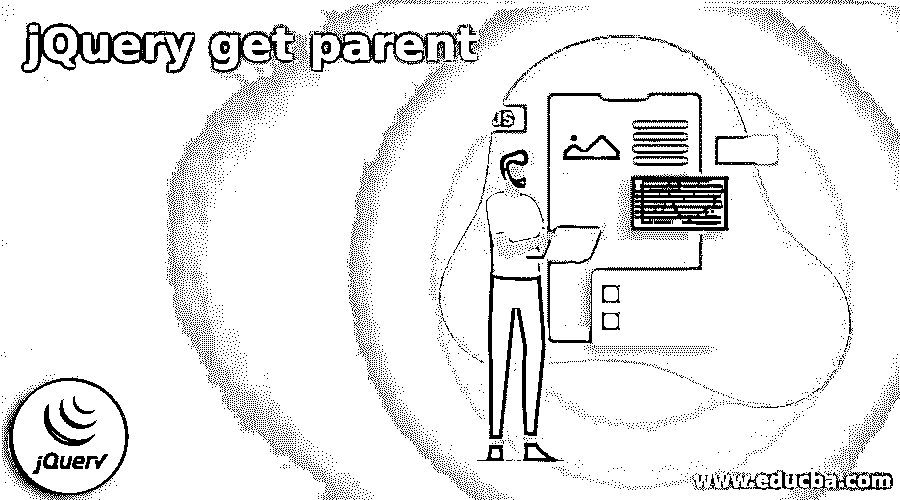
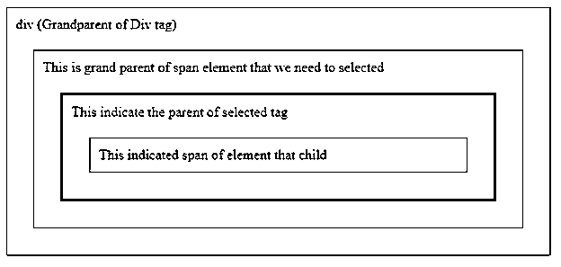
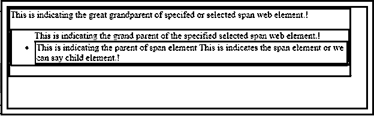

# jQuery 获取父级

> 原文：<https://www.educba.com/jquery-get-parent/>




## jQuery get parent 简介

jQuery 为用户提供了不同类型的功能和方法，其中 jQuery get parent 是 JQuery 提供的方法之一。基本上，jQuery parent 方法用于获取指定元素的父元素，或者我们可以说是用户定义的元素。JQuery get parent 属于 JQuery 的选择器类别。基本上，jQuery 是一个选择器，它使用 HTML 标签的属性来找出特定的元素，这个元素在指定的 HTML 页面中必须是唯一的，或者我们可以说是网页。所以根据用户需求，我们可以使用 jQuery 选择器。

### jQuery 获取父概视图

parent()策略返回所选组件的直接父组件。

<small>网页开发、编程语言、软件测试&其他</small>

DOM 树:这些技术只是跨越了 DOM 树的一个孤立层次。要尽可能地向上穿越到报告的根组件(还原祖辈或不同的前身)，请使用 guardians()或 parents until()策略。

jQuery 中的 guardians()策略用于获取给定选择器的所有前身组件。这是 jQuery 的内置功能。这种技术从父组件向上导航，在 DOM 树中向上导航所有级别，并返回所选组件的所有祖先。

guardians()策略类似于 parent()技术，两者都向上遍历 DOM 树并返回父组件。然而，重要的是 guardians()策略跨越了 DOM 树中的许多步骤，并返回所有的前辈，包括给定选择器的祖父级、非常祖父级等等，而 parent()技术向上导航一个单独的级别，并只返回给定选择器的直接父级。

通常，jQuery 提供了与 DOM 相关的不同类型的功能。parent()是从 DOM 树中访问父元素的更快的方法，它还为另一个元素生成另一个对象。这个策略就像。监护人()，除了。parent()只是在 DOM 树中冒险向上一层。另外，$(“html”)。parent()策略返回一个包含报表的集合，而$(“html”)。guardians()返回一个空集合。

该技术或者承认我们可以传递给$()工作的那种选择器连接。如果提供了选择器，将通过测试它们是否匹配来筛选组件。

### 我如何让 jquery 得到选择的选项值？

现在，让我们看看如何为该值选择选项。基本上，我们需要访问两种类型的值，首先，我们需要将值发送到服务器，如下所述。

```
$("#value for select").val();
```

在第二种形式中，我们需要发送文本值，如下面的代码所示。

```
<select id="specified name for select">
<option value="1">value1</option>
<option value="2"> value2</option>
<option value="3"> value3</option>
<option value="4"> value4</option>
<option value="5"> value5</option>
</select>
```

**说明:**

在上面的代码中，我们使用 select 方法根据用户需求从主页获取指定的元素列表。在代码中，我们提到了我们想要访问的每个 web 元素的选项值。所以我们可以通过使用 text()函数来访问任何值。

### jquery 获取父提示

现在，让我们看看我们需要遵循哪些不同的提示，以从 web 元素或 HTML 页面获取父元素，如下所示。

要沿着 DOM 树向下导航一个单独的级别，或者直接向下导航到最后一个亲戚(返回年轻人或不同的亲戚)，可以使用 child()或 find()技术。

在 jQuery 中，crossing 指的是通过 DOM 树到达特定的 HTML 组件。

通过利用 jQuery，您可以向上遍历 DOM 树。

有三种基本策略用于恢复守护者或不同的前驱。

### 例子

现在让我们来看看 parent()方法的不同类型的例子，以便更好地理解。

```
<html>
<head>
<style>
.main_div1 * {
display: block;
border: 1px solid rgb(108, 122, 108);
color: rgb(3, 36, 3);
padding: 10px;
margin: 20px;
}
</style>
<script
src="https://ajax.googleapis.com/ajax/libs/jquery/3.3.1/jquery.min.js">
</script>
<script>
$(document).ready(function() {
$("span").parent().css({
"color": "red",
"border": "3px solid green"
});
});
</script>
</head>
<body>
<div class="main_div1">
<div style="width:600px;">div (Grandparent of Div tag)
<ul> This is grand parent of span element that we need to selected
<li>This indicate the parent of selected tag
This indicated span of element that child
</li>
</ul>
</div>
</div>
</body>
</html>
```

**解释**

parent()是 jQuery 中的一个内置策略，用于发现由所选组件标识的父组件。jQuery 中的 parent()策略跨越了所选组件的单独一层，并返回该组件。在上面的例子中，我们尝试在 jQuery 中实现 get parent。上面代码的最终输出用下面的截图来说明。




现在让我们看看 parent()方法的另一个例子，如下所示。

```
<html>
<head>
<style>
main {
display: block;
border: 4px solid rgb(128, 15, 0);
color: rgb(5, 14, 5);
padding: 10px;
margin: 20px;
}
</style>
<script
src="https://ajax.googleapis.com/ajax/libs/jquery/3.3.1/jquery.min.js">
</script>
<script>
$(document).ready(function() {
$("span").parents().css({
"color": "blue",
"border": "3px solid green"
});
});
</script>
</head>
<body class="main">
<div style="width:600px;">This is indicating the great grandparent of specifed or selected span web element.!
<ul>This is indicating the grand parent of the specified selected span web element.!
<li>This is indicating the parent of span element
This is indicates the span element or we can say child element.!
</li>
</ul>
</div>
</body>
</html>
```

**解释**

在这个例子中，我们试图显示父元素，因此我们将对 parent()方法有一个更好的了解。上面代码的最终输出我们用下面的截图来说明。




### 结论

我们希望通过这篇文章，您可以了解更多关于 jQuery get the parent 的知识。从上面的文章中，我们已经理解了 get parent 的基本思想，我们还看到了 jQuery get parent 的表示和示例。从本文中，我们了解了如何以及何时使用 jQuery 来获取父节点。

### 推荐文章

这是一个 jQuery get parent 的指南。这里我们讨论了 get parent 的基本思想，我们也看到了表示和例子。您也可以看看以下文章，了解更多信息–

1.  [jQuery ajax 失败](https://www.educba.com/jquery-ajax-fail/)
2.  [jQuery keycode](https://www.educba.com/jquery-keycode/)
3.  [jQuery offsetHeight](https://www.educba.com/jquery-offsetheight/)
4.  [jQuery offsetWidth](https://www.educba.com/jquery-offsetwidth/)


