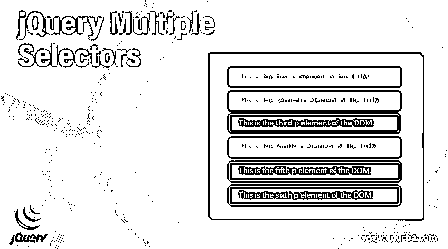
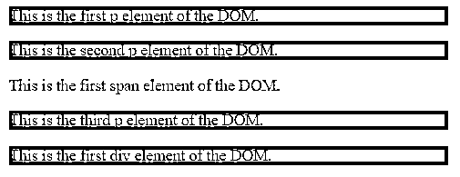
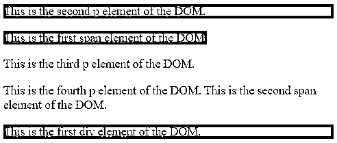
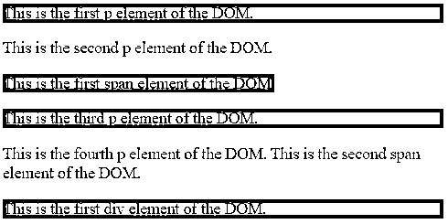
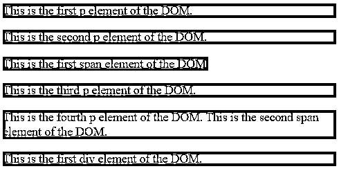

# jQuery 多重选择器

> 原文：<https://www.educba.com/jquery-multiple-selectors/>




## jQuery 多重选择器简介

jQuery UI multiple selectors 用于选择所有指定选择器的组合结果。jQuery multiple selectors 是一种允许在单个 jQuery 中选择多个元素的好方法，其中逗号分隔每个选择器或元素。这是组合多个表达式并获得不同元素的组合结果的有效方法。多个选择器对象的返回结果中 DOM 元素的顺序可能不同，因为它们将按照文档顺序排列。多个选择器选择多个 html 元素，这些元素可以基于它们的名称、id、类等。，然后我们可以对它们应用共同的行为。要选择一个元素，则将 css 选择器指定为$()，例如$("p ")选择文档中的所有 p 元素，要选择与一个或多个选择器匹配的多个元素，则指定为$("selector1，selector2，... ")，例如$("p，div，span ")选择文档中的所有 p、div 和 span 元素。此方法的替代方法是 jQuery add()方法。

**语法**

<small>网页开发、编程语言、软件测试&其他</small>

jQuery UI 多重选择器的语法

下面是使用多个选择器的简单语法

```
$( "selector1, selector2, … selectorN ")
```

它用于选择文档中的多个 html 元素。

*   **参数**

选择器–此参数指定要选择的元素。

该方法的返回值与任何其他 jQuery 选择器相同；它返回用找到的元素填充的数组。

### jQuery UI 多重选择器示例

接下来，我们编写 html 代码，通过下面的示例更清楚地理解 jQuery 多重选择器，其中多重选择器用于根据名称选择元素，如下所示

#### 示例#1

**代码:**

```
<!doctype html>
<html lang ="en">
<head>
<meta charset="utf-8">
<title>This is an example for jQuery UI multiple selectors  </title>
<script src="https://ajax.googleapis.com/ajax/libs/jquery/3.5.1/jquery.min.js"></script>
<script>
$(document).ready(function(){
$("p, div").css("background-color", "red");
});
</script>
</head>
<body>
<p class = "p1">This is the first p element of the DOM.</p>
<p class = "p2">This is the second p element of the DOM.</p>
This is the first span element of the DOM.<p class = "p1">This is the third p element of the DOM.
</p> 
<div class = "div1">This is the first div element of the DOM.</div>
</body>
</html> 
```

**输出:**




在上面的程序中，多个元素(p 和 div)通过代码$(“p，div”)中的名称来选择。css("背景色"，"红色")；并对它们应用一些样式。

接下来，我们重写上面的 html 代码，通过下面的例子更清楚地理解 jQuery 多重选择器，其中多重选择器将根据它们的类来选择元素，如下所示

#### 实施例 2

**代码:**

```
<!doctype html>
<html lang ="en">
<head>
<meta charset = "utf-8">
<title>This is an example for jQuery UI multiple selectors  </title>
<script src="https://ajax.googleapis.com/ajax/libs/jquery/3.5.1/jquery.min.js"></script>
<script>
$(document).ready(function(){
$(".p2, .div1, .span1").css( "background-color", "red" );
});
</script>
</head>
<body>
<p class = "p1">This is the first p element of the DOM.</p>
<p class = "p2">This is the second p element of the DOM.</p>
This is the first span element of the DOM. <p class = "p1">This is the third p element of the DOM. </p> 
<p class = "p1">This is the fourth p element of the DOM. This is the second span element of the DOM.  </p>
<div class = "div1">This is the first div element of the DOM. </div>
</body>
</html>
```

**输出:**




与上面的程序一样，多个元素(p、div 和 span)通过代码行“$(. p2、. div1、. span1”)由它们的类选择。css("背景色"，"红色")；"并对它们应用一些样式。

接下来，我们重写上面的 html 代码，通过下面的例子更清楚地理解 jQuery 多重选择器，其中多重选择器将用于根据它们的 id 选择元素，如下所示

#### 实施例 3

**代码:**

```
<!doctype html>
<html lang ="en">
<head>
<meta charset = "utf-8">
<title>This is an example for jQuery UI multiple selectors  </title>
<script src="https://ajax.googleapis.com/ajax/libs/jquery/3.5.1/jquery.min.js"></script>
<script>
$(document).ready(function(){
$("#pid1, #divid1, #spanid1").css( "background-color", "red" );
});
</script>
</head>
<body>
<p class = "p1" id = "pid1">This is the first p element of the DOM.</p>
<p class = "p2" id = "pid2">This is the second p element of the DOM.</p>
This is the first span element of the DOM. <p class = "p1" id = "pid1">This is the third p element of the DOM. </p> 
<p class = "p2" id = "pid2">This is the fourth p element of the DOM. This is the second span element of the DOM.  </p>
<div class = "div1" id = "divid1">This is the first div element of the DOM. </div>
</body>
</html>
```

**输出:**




在上面的程序中，多个元素(p、div 和 span)是通过代码$("#pid1、# divide 1、# spanid1 ")的 id 来选择的。css("背景色"，"红色")；并对它们应用一些风格。

接下来，我们用下面的例子重写上面的 html 代码，以便更清楚地理解 jQuery 多重选择器，其中多重选择器将用于根据它们的名称、类和 id 来选择元素，如下所示。

#### 实施例 4

**代码:**

```
<!doctype html>
<html lang ="en">
<head>
<meta charset = "utf-8">
<title>This is an example for jQuery UI multiple selectors  </title>
<script src="https://ajax.googleapis.com/ajax/libs/jquery/3.5.1/jquery.min.js"></script>
<script>
$(document).ready(function(){
$("p, .div1, #spanid1").css( "background-color", "red" );
});
</script>
</head>
<body>
<p class = "p1" id = "pid1">This is the first p element of the DOM.</p>
<p class = "p2" id = "pid2">This is the second p element of the DOM.</p>
This is the first span element of the DOM. <p class = "p1" id = "pid1">This is the third p element of the DOM. </p> 
<p class = "p2" id = "pid2">This is the fourth p element of the DOM. This is the second span element of the DOM.  </p>
<div class = "div1" id = "divid1">This is the first div element of the DOM. </div>
</body>
</html>
```

**输出:**




### 结论

多个选择器在单个 jQuery 中选择多个 html 元素。逗号分隔每个选择器或元素，选择器可以根据它们的名称、id、类等进行选择。，然后我们可以将通用行为应用于所有选择器。

### 推荐文章

这是一个 jQuery 多重选择器的指南。这里我们讨论 jQuery UI、多个选择器以及代码和输出的例子。您也可以看看以下文章，了解更多信息–

1.  [jQuery 重定向](https://www.educba.com/jquery-redirect/)
2.  [jQuery 定时器](https://www.educba.com/jquery-timer/)
3.  [jQuery Datepicker](https://www.educba.com/jquery-datepicker/)
4.  [jQuery 可排序](https://www.educba.com/jquery-sortable/)


