# jQuery Ajax 同步

> 原文：<https://www.educba.com/jquery-ajax-synchronous/>

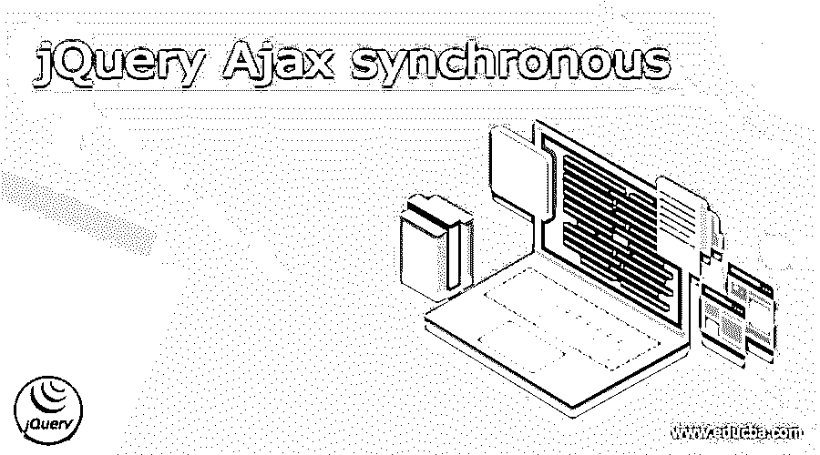


## jQuery Ajax 同步的定义

JQuery Ajax synchronous 是一个操作过程，用于停止进程并等待服务器发送继续进程的回复。这个过程使用 API 同步调用。过程或调用同步向服务器发送操作请求。

它是系统的 JQuery Ajax 技术的一个属性或特性。该函数将 Ajax 设置为同步格式的服务器请求，以处理多个请求操作。它使用 Ajax 函数中的“async”属性和“false”默认值进行设置。该函数需要 URL 或服务器来使用 jQuery 技术发送请求。

<small>网页开发、编程语言、软件测试&其他</small>

### 什么是 jQuery Ajax 同步？

*   它是 web 应用程序页面的一种模式，使用 jQuery 和 Ajax 技术处理服务器或 HTTP 请求。
*   默认情况下，JQuery Ajax 异步设置服务器请求，以便一次处理多个操作。
*   这是一个使用 Ajax 属性及其脚本标签中的默认值的设置。
*   JQuery Ajax 提供了一个函数或标志，用于同步设置系统操作的 HTTP 请求。
*   在服务器发送执行完成请求之前，它是一个停止请求。
*   它在完成前一个请求后发送 HTTP 或 URL 请求，并逐个操作。

### 如何让 JQuery AJAX 请求同步？

*   jQuery ajax 异步语法如下所示。

```
async : false,
```

*   ajax 函数中使用的“async”属性。
*   同步功能的“假”值设置。

*   在 html 文件的 head 标签中使用 jQuery 链接或在线文件。

```
<script src = "https://ajax.googleapis.com/ajax/libs/jQuery/3.5.1/jQuery.min.js">
</script>
```

*   创建脚本标记。

```
<script> write code here… </script>
```

*   将 jQuery 函数和方法用于 Ajax 同步。

```
$(document).ready(function(){ write code here… }
```

*   对 url 使用 Ajax 函数来获取链接请求。

```
$.ajax({url: "sync_test.txt"
});
```

*   使用同步方法进行系统操作。

```
$.ajax({url: "sync_test.txt", method: 'get', async: false,
});
```

*   显示输出的写成功功能

```
$(document).ready(function(){
$("button").click(function(){
$.ajax({url: "sync_test.txt", async: false,
success: function(result){ $("#divisions").html(result);
}});
});
});
```

*   如果你想创建用户界面标签，那么使用按钮和表单。

```
<div id = "divisions">
```

在此写入或显示服务器数据…

```
</div>
<button> click here... </button>
```

创建 jQuery Ajax 同步

*   在文件头部分的脚本标记中使用 jQuery 源代码链接。

```
<script src = "https://ajax.googleapis.com/ajax/libs/jQuery/3.5.1/jQuery.min.js">
</script>
```

*   创建脚本标签和其他方法。

```
<head>
<script src="https://ajax.googleapis.com/ajax/libs/jQuery/3.5.1/jQuery.min.js">
</script>
<script>
$(document).ready(function(){
$("button").click(function(){
$.ajax({url: "demo_test.txt", method: 'get',
async: false,
success: function(result){ $("#divisions").html(result);
}});
});
});
</script>
</head>
```

**描述**

*   使用 div 标签显示数据并为 click 函数创建按钮。

```
<body>
<div id = "divisions">
<h3>
```

让 jQuery AJAX 同步改变

```
</h3>
</div>
<button> click here... </button>
</body>
```

**描述**

### 例子

#### 示例#1

基本示例及其输出

```
<!DOCTYPE>
<html>
<head>
<script src = "https://ajax.googleapis.com/ajax/libs/jQuery/3.5.1/jQuery.min.js">
</script>
<script>
$(document).ready(function(){
$("button").click(function(){
$.ajax({ url: "demo_test.txt", method: 'get',
async: false,
success: function(result){ $("#divisions").html(result);
}});
});
});
</script>
</head>
<body>
<div id = "divisions">
<h3>
jQuery AJAX synchronous example
</h3>
</div>
<button> click here... </button>
</body>
</html>
```

点击前的**输出**

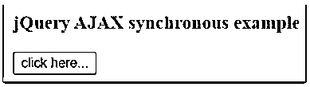


**点击**按钮后输出

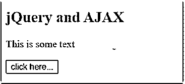


#### 实施例 2

警报方法示例和输出如下所示

```
<!DOCTYPE>
<html>
<head>
<script src = "https://ajax.googleapis.com/ajax/libs/jQuery/3.5.1/jQuery.min.js">
</script>
<script>
$(document).ready(function(){
$("button").click(function(){
$.ajax({ url: "sync_test.txt", method: 'get',
async: false,
success: function(result){ alert("jQuery AJAX synchronous done successfully!");
}});
});
});
</script>
</head>
<body>
<div id = "divisions">
<h3>
jQuery AJAX synchronous
</h3>
</div>
<button> click here... </button>
</body>
</html>
```

**点击**按钮前的输出

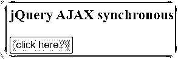


**点击**按钮后输出

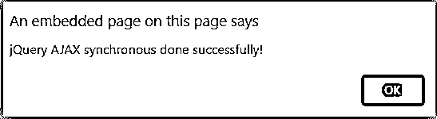


#### 实施例 3

警报方法示例和输出如下所示。

```
<!DOCTYPE>
<html>
<head>
<script src = "https://ajax.googleapis.com/ajax/libs/jQuery/3.5.1/jQuery.min.js">
</script>
<script>
$(document).ready(function(){
$("button").click(function(){
$.ajax({ url: "sync_test.txt", method: 'get',
async: false,
success: function(result){ document.write("jQuery AJAX synchronous done successfully!");
}});
});
});
</script>
</head>
<body>
<div id = "divisions">
<h3>
jQuery AJAX synchronous
</h3>
</div>
<button> click here... </button>
</body>
</html>
```

**点击**按钮前的输出

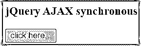


**点击**按钮后输出

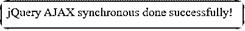


#### 实施例 4

错误的 URL 请求示例和输出如下所示

```
<!DOCTYPE>
<html>
<head>
<script src = "https://ajax.googleapis.com/ajax/libs/jQuery/3.5.1/jQuery.min.js">
</script>
<script>
$(document).ready(function(){
$("button").click(function(){
$.ajax({
url: "/app-url/relative-url", type: "GET",
async: false,
dataType: 'json',
})
.done (function(data, textStatus, jqXHR) { alert("jQuery AJAX synchronous done successfully!" );
})
.fail (function(jqXHR, textStatus, errorThrown) { alert("jQuery AJAX synchronous shows error!");
})
.always (function(jqXHROrData, textStatus, jqXHROrErrorThrown) {
alert("jQuery AJAX synchronous complete");
});
});
});
</script>
</head>
<body>
<div id = "divisions">
<h3>
jQuery AJAX synchronous
</h3>
</div>
<button> click here... </button>
</body>
</html>
```

**点击**按钮前的输出

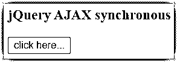


**点击**按钮后输出

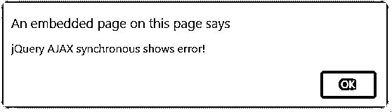


**点击确定按钮**后输出

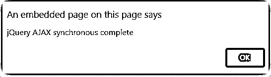


#### 实施例 5

右 URL 请求示例和输出如下所示

```
<!DOCTYPE>
<html>
<head>
<script src = "https://ajax.googleapis.com/ajax/libs/jQuery/3.5.1/jQuery.min.js">
</script>
<script>
$(document).ready(function(){
$("button").click(function(){
$.ajax({
url: "sync_test.txt",
async: false,
})
.done (function(data, textStatus, jqXHR) { alert("jQuery AJAX synchronous done successfully!" );
})
.fail (function(jqXHR, textStatus, errorThrown) { alert("jQuery AJAX synchronous shows error!");
})
.always (function(jqXHROrData, textStatus, jqXHROrErrorThrown) {
alert("jQuery AJAX synchronous complete");
});
});
});
</script>
</head>
<body>
<div id = "divisions">
<h3>
jQuery AJAX synchronous
</h3>
</div>
<button> click here... </button>
</body>
</html>
```

**点击**按钮前的输出

**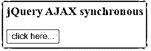

** 

**点击**按钮后输出

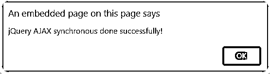


**点击确定按钮**后输出

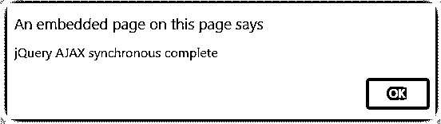


### 结论

这个函数用于获得系统的、优雅的服务器请求及其响应。这种方法使用复杂的数据服务器创建简单、快捷的 web 应用程序。它创建用户友好的、用户交互的、有吸引力的 web 应用程序页面。这个操作用最少的代码发送服务器请求，并使用简单的函数。

### 推荐文章

这是 jQuery Ajax synchronous 的指南。这里我们讨论一下定义，什么是 JQuery AJAX 同步，如何让 jQuery Ajax 请求同步？您也可以看看以下文章，了解更多信息–

1.  [jQuery Ajax 异步](https://www.educba.com/jquery-ajax-async/)
2.  [jQuery ajax 失败](https://www.educba.com/jquery-ajax-fail/)
3.  [jquery Ajax uccess()](https://www.educba.com/jquery-ajaxsuccess/)
4.  [jQuery ajax 完成](https://www.educba.com/jquery-ajax-complete/)


