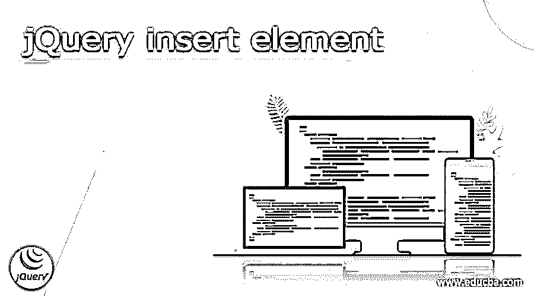
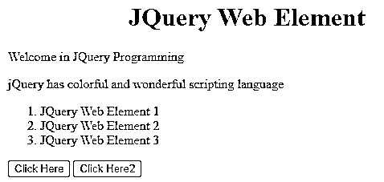
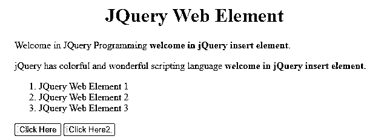
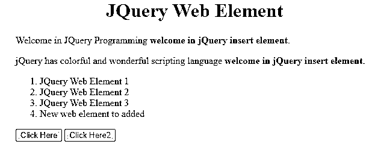

# jQuery 插入元素

> 原文：<https://www.educba.com/jquery-insert-element/>




## jQuery 插入元素的定义

jQuery 向用户提供不同类型的功能，其中插入元素就是 JQuery 提供的功能之一。通常，它提供了不同的方法，这意味着我们可以在指定的元素之前插入 HTML 内容，也可以根据用户的要求在指定的元素之后插入 HTML 内容。jQuery 由不同的方法组成，在这个方法的帮助下，我们可以根据用户需求执行不同的操作。所以在这里我们可以使用不同的方法来插入元素，比如 append()、HTML()、text()、before()、after()、wrap()和 prepend()。我们可以使用任何方法，执行任何操作。

### jQuery 插入元素概述

现在让我们看看 jQuery insert 元素的不同方法，如下所示。

<small>网页开发、编程语言、软件测试&其他</small>

**1。insertAfter():**

这是在 jQuery 中插入元素的第一种方法，通过使用这种方法，我们可以在我们想要的指定元素之后插入 web 元素。HTML 内容将在预定部分的每个事件之后被介绍。

**语法**

```
$(specified required html content).insertAfter(specified target element)
```

**解释**

在上面的例子中，我们使用不同的两种类型的参数如下。

*   **指定的所需 HTML 内容**是指我们需要附加在指定目标内容之后的实际内容，或者我们可以说是 web 元素。
*   **指定的目标元素**表示 HTML 页面的指定端点。

**2。插入前置():**

prepend()策略是 jQuery 中的一种内置技术，用于在所选组件的开头嵌入预定的内容。

**在指定的目标元素()前插入 web 元素:**

jQuery before()方法用于在他们挑选零件之前植入内容。previously()和 insertBefore()两种策略用于完成类似的任务。它们之间的本质区别在于语义设计以及实质和目标的情况。

**插入 web 元素 wrap():**

wrap()过程是 jQuery 的一个内置方法，用于将预定义的部分覆盖在拾取的部分上。

**插入任意纯文本():**

该方法用于设置或返回零件的文本内容。在设置实体时，它会覆盖大量组成部分的实体。文本技术()的返回内容用于返回每个组织部分的文本内容。

**插入 html 网页内容():**

jQuery html web content()策略用于更改所选取部分的整个内容:它用另一个内容替换所选取部分的内容。

注意:因为它的 API 文档，这是一个非常重要的限制。jQuery HTML 工作的 API 文档包含三个策略标记。

原则策略签名没有争议，所以基本上是返回那部分里面的 HTML。额外的两个印记需要一个冲突:例如，一个字符串或一个有利于字符串的限制。

### 如何使用 jQuery 插入元素？

现在让我们看看如何使用 jQuery insert 元素，如下所示。

首先，让我们看看 insert append()方法，它根据用户需求插入我们想要的 web 元素，如下所示。

基本上，append()技术被用来嵌入一个确定的物质，就像 jQuery 分类中所选组件的最后一个 kid(接近末尾)。

**语法**

```
$(selector).append(specified web content, required function())
```

**解释**

在上面的语法中，我们使用 append 方法在指定位置插入 web 元素，如上面的语法所示。以类似的方式，我们可以使用我们想要的功能在指定的位置插入 web 元素。换句话说，我们可以说，我们可以在函数中使用我们想要的 HTML web 内容，如上面的语法所示。

### jQuery 插入元素示例

**例子**

现在，为了更好地理解，让我们来看看 insert 元素的不同示例，如下所示。

```
<!DOCTYPE html>
<html>
<head>
<title>
Welcome in jQuery insert element
</title>
<script src="
https://ajax.googleapis.com/ajax/libs/jquery/3.3.1/jquery.min.js">
</script>
<!-- Script to append content -->
<script>
$(document).ready(function(){
$("#bttn1").click(function(){
$("p").append(" <b>welcome in jQuery insert element</b>.");
});
$("#bttn2").click(function(){
$("ol").append("<li>New web element to added</li>");
});
});
</script>
</head>
<body>
<h1 style="margin-left: 150px;">JQuery Web Element</h1>
<p>Welcome in JQuery Programming</p>
<p>jQuery has colorful and wonderful scripting language</p>
<ol>
<li>JQuery Web Element 1</li>
<li>JQuery Web Element 2</li>
<li>JQuery Web Element 3</li>
</ol>
<button id="bttn1">Click Here</button>
<button id="bttn2">Click Here2</button>
</body>
</html>
```

**解释**

在上面的例子中，我们尝试在 jQuery 中执行插入元素策略，这里我们基本上为 HTML 内容编写了 HTML 代码，另外我们还添加了显示的 jQuery 脚本。从那时起，我们制作了两个按钮，在上面代码中显示的预定义内容之后附加任何我们想要的内容。在这个模型中，我们将物质添加到部分的结尾。上面程序的最终输出用下面的截图来说明。




现在，单击第一个按钮“追加到此处”。点击按钮后，结果如下图所示。




现在点击第二个按钮，点击第二个按钮后，最终结果如下图所示。




这样，我们可以根据需要添加更多的内容。

现在让我们看看 append 方法()的一个例子，如下所示。

```
<!doctype html>
<html lang="en">
<head>
<meta charset="utf-8">
<title>Welcome in JQuery Insert Element</title>
<style>
#dm {
background: rgb(131, 131, 11);
}
</style>
<script src="https://code.jquery.com/jquery-3.5.0.js"></script>
</head>
<body>
This is first line of web element 
<div id="dm">Hi this is second line of web element </div>
<script>
$( "span" ).appendTo( "#dm" );
</script>
</body>
</html>
```

**解释**

在上面的例子中，我们试图通过使用 id 来追加内容，如下所示；在这里，我们添加了 Hi Read 行内容。上面程序的最终输出用下面的截图来说明。


这样，我们可以通过使用 insert append()方法根据需求执行不同的操作。

### 结论

我们希望通过这篇文章，您能够了解更多关于 jQuery insert 元素的知识。从上面的文章中，我们已经理解了 jQuery insert 元素的基本思想，我们还看到了 jQuery insert 元素的表示和示例。从本文中，我们了解了如何以及何时使用 jQuery insert 元素。

### 推荐文章

这是一个 jQuery 插入元素的指南。在这里，我们讨论定义，概述，如何使用 jQuery 插入元素，代码实现的例子。您也可以看看以下文章，了解更多信息–

1.  [jQuery 连接](https://www.educba.com/jquery-join/)
2.  [jQuery 队列](https://www.educba.com/jquery-queue/)
3.  [jQuery 日历调度器](https://www.educba.com/jquery-calendar-scheduler/)
4.  [jQuery ajax 失败](https://www.educba.com/jquery-ajax-fail/)


