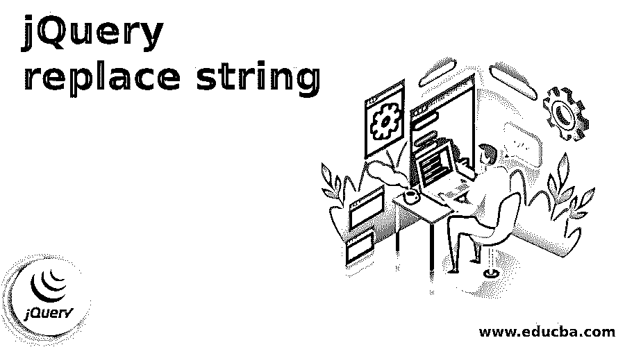
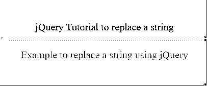
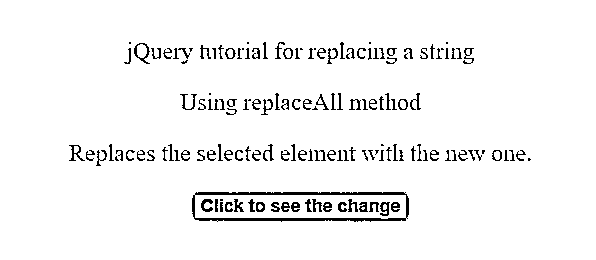
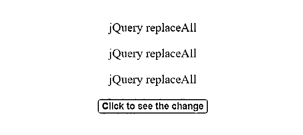
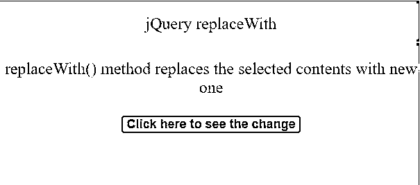
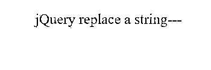

# jQuery 替换字符串

> 原文：<https://www.educba.com/jquery-replace-string/>




## jQuery 替换字符串简介

本文讨论 jQuery 替换功能，该功能在用一组匹配的元素替换每个目标元素后返回一个新的字符串。这种方法可以用来替换一个句子或一组字符串中出现的任何字符串。使用 replace()方法，只能替换第一个实例，要删除所有出现的实例，需要使用全局修饰符(g)。

jQuery 提供了几个功能来帮助操作 DOM，其中之一就是 DOM 替换。使用 jQuery 的 replace()方法，我们可以查找并替换一个字符串或一组字符串中某个特定子串的所有出现。jQuery 还提供了另外两种具有替换特性的 DOM 操作方法，replaceAll()和 replaceWith()。replaceAll()方法用于用一组匹配的元素替换每个目标元素。replaceWith()方法用于用提供的新内容替换每个元素，并返回被删除元素的集合。

<small>网页开发、编程语言、软件测试&其他</small>

### 句法

1.使用 jQuery replace 方法全局替换文本:

```
string.replace (/[old string]/+/g, 'new string')
```

2.使用 replaceAll()方法替换目标元素:

```
$(content).replaceAll(selector)
```

3.使用 replaceWith()方法用新内容替换所选内容:

```
$(selector).replaceWith(content, function(index))
```

**说明:**其中，content 是一个强制参数，指定要插入的内容，可能的值为，HTML 元素，jQuery 对象，HTML 元素。function(index)是可选参数，指定返回要替换的内容的函数。

### 实现 jQuery 替换字符串的示例

让我们看一些例子来理解使用 jQuery 发生的替换:

#### 示例#1

下面是一个非常简单的例子，它使用 jQuery replace()方法将一个字符串替换为另一个字符串:

**代码:**

```
<!DOCTYPE html>
<html lang="en">
<head>
<meta charset="utf-8" />
<title>jQuery example to replace a string</title>
<head>
<script src="https://code.jquery.com/jquery-1.12.4.js"></script>
<script type="text/javascript">
$(document).ready(function () {
$(".element span").text(function (index, text) {
return text.replace("Example", "jQuery Tutorial");
});
});
</script>
<style>
#divstyle {
width: 400px;
height: 150px;
padding-top: 20px;
padding-left: 5px;
font-size: 20px;
text-align: center;
color: black;
background-color: cadetblue;
}
</style>
</head>
<body>
<div id="divstyle">
<div class="element">
<br />
Example to replace a string
<hr />
<p style="color: brown;">
Example to replace a string using jQuery
</p>
</div>
</div>
</body>
</html>
</head>
</html>
```

**输出:**

下面是执行上述代码后显示的屏幕:




**说明:** jQuery replace()方法搜索指定的字符串值，返回指定的替换值。在给定的示例中，字符串 example 被替换为字符串 jQuery Tutorial，如图所示。

#### 实施例 2

以下示例说明了 jQuery 的 removeAll()的用法:

**代码:**

```
<!DOCTYPE html>
<html>
<head>
<script src="https://code.jquery.com/jquery-1.12.4.js"></script>
<script>
$(document).ready(function () {
$("button").click(function () {
$("<p>jQuery replaceAll</p>").replaceAll("p");
});
});
</script>
<style>
#divstyle {
width: 600px;
height: 250px;
padding-top: 20px;
padding-left: 5px;
font-size: 24px;
text-align: center;
color: maroon;
background-color: cadetblue;
}
#button {
color: navy;
font-weight: bold;
font-size: large;
border: oldlace;
background-color: palegoldenrod;
}
</style>
</head>
<body>
<div id="divstyle">
<p>jQuery tutorial for replacing a string</p>
<p>Using replaceAll method</p>
<p>Replaces the selected element with the new one.</p>
<button id="button">Click to see the change</button><br />
</div>
</body>
</html>
```

**输出:**

当执行上述代码时，将显示以下屏幕:







**说明:**replace all()方法用匹配元素的集合替换每个目标元素。在给出的例子中，我们首先创建一个元素<p>jQuery replace all</p>，然后用它替换另一个元素“p”。

#### 实施例 3

以下示例说明了 jQuery 的 replaceWith()的用法:

**代码:**

```
<!DOCTYPE html>
<html>
<head>
<script src="https://code.jquery.com/jquery-1.12.4.js"></script>
<script>
$(document).ready(function () {
$("button").click(function () {
$("#pid").replaceWith("jQuery replaceWith");
});
});
</script>
<style>
#divstyle {
width: 600px;
height: 250px;
padding-top: 20px;
padding-left: 5px;
font-size: 24px;
text-align: center;
color: maroon;
background-color: cadetblue;
}
#button {
color: navy;
font-weight: bold;
font-size: large;
border: oldlace;
background-color: palegoldenrod;
}
</style>
</head>
<body>
<div id="divstyle">
<p id="pid">jQuery tutorial</p>
<hr />
<p>replaceWith() method replaces the selected contents with new one</p>
<button id="button">Click here to see the change</button>
</div>
</body>
</html>
```

**输出:**

当执行上述代码时，屏幕显示如下:





**说明:**jQuery 提供的 replaceWith()方法用新的内容替换匹配元素集合中的每个元素。在给定的示例中，单击按钮时,“pid”元素的内容被替换为字符串“jQuery replaceWith ”,如下所示。

#### 实施例 4

让我们看看另一个以不同方式使用 jQuery 替换字符串的例子:

**代码:**

```
<!DOCTYPE html>
<html>
<head>
<title>JQuery Example to Replace a string</title>
<script src="https://code.jquery.com/jquery-1.12.4.js"></script>
<script>
$(document).ready(function() {
var NewString = $('body').html().replace(/\./g,'---');
$('body').html(NewString);
});
</script>
<style>
#button{
color:navy;
font-weight: bold;
font-size: large;
border: oldlace;
background-color: palegoldenrod;
}
#divstyle {
width: 350px;
height: 100px;
padding-top: 20px;
padding-left: 5px;
font-size: 24px;
text-align: center;
color: maroon;
background-color: cadetblue;
}
</style>
</head>
<body>
<div id ="divstyle">
<div class="String">
jQuery replace a string.<br><br>
</div>
</div>
</div>
</html>
```

**输出:**

当执行上述代码时，屏幕显示如下:




**解释:**在给定的例子中，我们将<主体>标签中的所有 HTML 放入一个字符串变量中，然后在 replace()的帮助下，使用一个新的字符串替换所有出现的字符串(使用了“/g”)

### 结论

在本文中，我们讨论了使用 jQuery 替换功能来操作 DOM 的 jQuery 方法之一。jQuery DOM 替换方法主要用于从 DOM 中删除内容，并用提供的新内容替换它。这里，我们讨论了 jQuery 的 replace()、replaceAll()和 replaceWith()方法，这些方法有助于 DOM/ HTML 替换。

### 推荐文章

这是一个 jQuery 替换字符串的指南。这里我们讨论一个 jQuery 替换字符串的介绍，语法和编程例子。您也可以浏览我们的其他相关文章，了解更多信息——

1.  [jQuery Tooltip](https://www.educba.com/jquery-tooltip/)
2.  [jQuery Ajax 方法](https://www.educba.com/jquery-ajax-methods/)
3.  [jQuery 方法](https://www.educba.com/jquery-methods/)
4.  [Java 字符串操作符](https://www.educba.com/java-string-operators/)


