# jQuery 元素

> 原文：<https://www.educba.com/jquery-elements/>

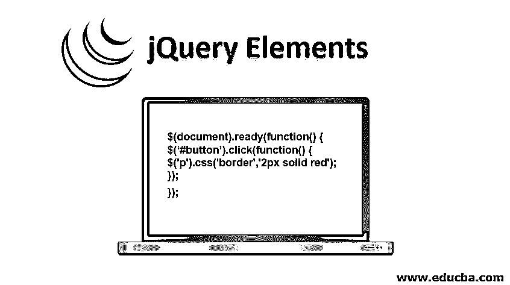


## jQuery 元素简介

jQuery 使用 html 元素。这意味着我们选择 HTML 页面的一些元素并对其执行一些操作。jQuery 中有很多选择器。我们将详细了解每个选择器。

**语法:**

<small>网页开发、编程语言、软件测试&其他</small>

```
$(selector).action()
```

其中$符号用于表示 jQuery，

选择器用于选择 HTML 元素，动作用于对所选元素执行 jquery 动作。因此，使用上述语法的 jQuery 选择器将类似于下面的例子。

**举例:**

```
$('div').css('background-color', 'green');
$('p').css('border','2px solid red');
$('span').css('color','red');
```

一个演示程序，说明了上述语法和 jQuery 的工作原理。

**代码:**

```
<html lang="en">
<head>
<meta charset="utf-8">
<title>element demo</title>
<script src="https://code.jquery.com/jquery-1.10.2.js"></script>
</head>
<body>
<style>
div p span{
width: 120px;
height: 60px;
padding: 10px;
}
</style>
<script>
$('document').ready(function() {
$('div').css('background-color', 'green');
$('p').css('border','2px solid red');
$('span').css('color','red');
});
</script>
<div>The div element</div>
<p>the p element</p>
the SPAN element
</body>
</html>
```

**输出:**

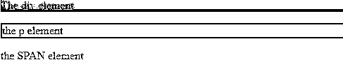


jQuery 使用 CSS 语法来选择元素。jQuery 选择器首先查找/选择 HTML 元素，然后对 HTML 元素执行操作。

### 前 8 名 jQuery 选择器

这里的每个元素都是根据其元素名称、id、类、类型等来选择的。此外，我们可以构建自己的用户定义的选择器。我们将在本教程中学习的选择器。

*   元素选择器
*   id 选择器
*   类选择器
*   :eq()选择器
*   第一个选择器，最后一个选择器，偶数选择器，奇数选择器
*   :first 和:first_child 的差异
*   :last 和:last_child 的差异
*   jQuery 方法链接

#### 1.元素选择器

从上面的程序中可以看出，像

```
$('p').css('border','2px solid red');
```

选择器总是以$(美元符号)开头，后跟括号()。该选择器选择给定页面上的所有段落

元素。CSS 是要在 p 元素上执行的操作，它进一步在每个 p 元素上创建一个 2 px 的边框，边框类型为 solid，边框颜色为红色。

**举例:**

*   **事件:**当文档完全加载时，用户点击一个按钮(使用文档事件函数)。
*   **此事件的动作:**设置段落元素的边框。

**代码:**

```
$(document).ready(function() {
$('#button').click(function() {
$('p').css('border','2px solid red');
});
});
```

#### 2.id 选择器

该选择器以#开头，后跟 html 元素的 id，它引用 html 元素的 id 属性。

**语法:**

```
$('#idname').someaction();
```

**代码:**

```
<!DOCTYPE html>
<html>
<head>
<script src="https://ajax.googleapis.com/ajax/libs/jquery/3.4.1/jquery.min.js"></script>
<script>
$(document).ready(function(){
$("#new").css("background-color", "green");
});
</script>
</head>
<body>
<h1>Welcome to My Page!</h1>
<p id="new">This the first element</p>
<p>This is the second Element</p>
</body>
</html>
```

**输出:**

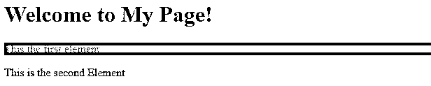


#### 3.类选择器

HTML 元素的类属性。将使用此选择器选择类名。class 属性用于为几个 HTML 元素添加样式。

**语法:**

```
$('.classname').someaction();
```

#### 4.:eq()选择器

This :eq()选择器选择一个具有给定索引的 HTML 元素。该索引从 0 开始。

**语法:**

```
$(":eq(index)")
```

**代码:**

```
<!DOCTYPE html>
<html>
<head>
<script src="https://ajax.googleapis.com/ajax/libs/jquery/3.4.1/jquery.min.js"></script>
<script>
$(document).ready(function(){
$("p:eq(1)").css("background-color","green");
});
</script>
</head>
<body>
<h1>Welcome to My Page</h1>
<p class="new">First Element</p>
<p>Second Element</p>
<p>Third Element</p>
<p>Foruth Elemnet</p>
<ul id="drinks">
<li>coffee</li>
<li>tea</li>
</ul>
</body>
</html>
```

**输出:**

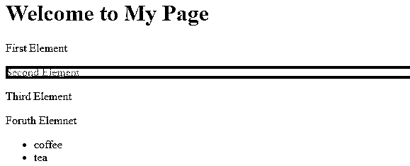


#### 5.第一个选择器，最后一个选择器，偶数选择器，奇数选择器

让我们来看看这个选择器。

##### 组

*   **第一个选择器–**查找一个组中的第一个元素。

**代码:**

```
<!DOCTYPE html>
<html>
<head>
<script src="https://ajax.googleapis.com/ajax/libs/jquery/3.4.1/jquery.min.js"></script>
<script>
$(document).ready(function(){
$("p:first").css("background-color","green");
});
</script>
</head>
<body>
<h1>Welcome to My Page</h1>
<p>First Element</p>
<p>Second Element</p>
<p>Third Element</p>
<p>Foruth Elemnet</p>
</body>
</html>
```

**输出:**

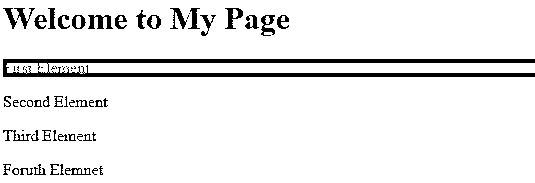


*   **最后一个选择器–**查找一个组中的最后一个元素。

**代码:**

```
<!DOCTYPE html>
<html>
<head>
<script src="https://ajax.googleapis.com/ajax/libs/jquery/3.4.1/jquery.min.js"></script>
<script>
$(document).ready(function(){
$("p:last").css("background-color","green");
});
</script>
</head>
<body>
<h1>Welcome to My Page</h1>
<p>First Element</p>
<p>Second Element</p>
<p>Third Element</p>
<p>Foruth Elemnet</p>
</body>
</html>
```

**输出:**

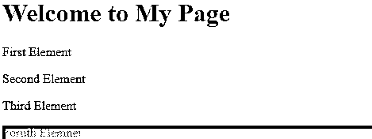


##### 桌子

*   **偶数选择器–**查找表格中的所有偶数行。
*   **奇数选择器–**查找表格中的所有奇数行。

在下面的程序中，绿色突出显示偶数行，黄色突出显示奇数行。

**代码:**

```
<!DOCTYPE html>
<html>
<head>
<script src="https://ajax.googleapis.com/ajax/libs/jquery/3.4.1/jquery.min.js"></script>
<script>
$(document).ready(function(){
$("tr:even").css("background-color","green");
$("tr:odd").css("background-color","yellow");
});
</script>
</head>
<body>
<h1>Welcome to My Page</h1>
<table>
<thead>
<tr>
<th>S.No</th>
<th>Email</th>
<th>Phone</th>
</tr>
</thead>
<tbody>
<tr>
<td>1</td>
<td>john@example.com</td>
<td>91-799-2909878</td>
</tr>
<tr>
<td>1</td>
<td>riya@example.com</td>
<td>91-777-4909878</td>
</tr>
<tr>
<td>1</td>
<td>williams@example.com</td>
<td>91-789-5909878</td>
</tr>
</tbody>
<tr></tr>
</table>
</body>
</html>
```

**输出:**

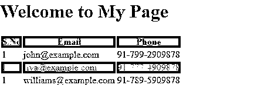


既然我们已经了解了第一个和最后一个，偶数和奇数，让我们也了解一下第一个和第一个孩子的区别。

#### 6.:first 和:first_child 的差异

*   **:first—**我们知道:first 选择第一个元素。
*   **:first-child-**选择作为其各自父元素的第一个子元素的元素。

下面的演示解释了这种差异。

```
<!DOCTYPE html>
<html>
<head>
<script src="https://ajax.googleapis.com/ajax/libs/jquery/3.4.1/jquery.min.js"></script>
<script>
$(document).ready(function(){
$("#buttonfirst").click(function(){
$("p:first").css("background-color", "green");
});
$("#buttonfirstchild").click(function(){
$("p:first-child").css("background-color", "green");
});
});
</script>
</head>
<body>
<button id="buttonfirst">show first </button>
<button id="buttonfirstchild"> show first-child</button><br><br>
<div style="border:2px solid #eee; background-color: #eee">
<p>First Element</p>
<p>Second Element</p>
</div><br>
<div style="border:2px solid #eee; background-color: #eee">
<p>First Element</p>
<p>Last Element</p>
</div>
</body>
</html>
```

当单击第一个按钮 show first 时，会显示此输出。

**输出:**

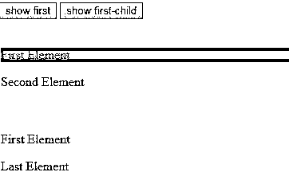


当第二个按钮显示单击了第一个子按钮时，会显示此输出。

**输出:**

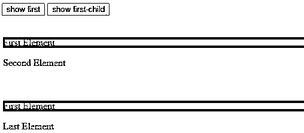


#### 7.:last 和:last_child 的差异

类似的，last 和 last-child 的区别和上面一样，我们只需要改变选择器的类型。

**代码:**

```
<script>
$(document).ready(function(){
$("#buttonfirst").click(function(){
$("p:last").css("background-color", "green");
});
$("#buttonfirstchild").click(function(){
$("p:last-child").css("background-color", "green");
});
});
</script>
```

#### 8.jQuery 方法链接

到目前为止，我们已经看到一个选择器和一个动作，但是 [jQuery 允许](https://www.educba.com/what-is-jquery/)我们在同一个元素上编写一个选择器和多个动作。

**代码:**

```
<!DOCTYPE html>
<html>
<head>
<script src="https://ajax.googleapis.com/ajax/libs/jquery/3.4.1/jquery.min.js"></script>
<script>
$(document).ready(function(){
$("button").click(function(){
$("div").css("background-color","red").css("color", "white");
});
});
</script>
</head>
<body>
<h1>Welcome to My Page</h1>
<div style="border:2px solid red;width:100px;height:100px;">Hello World</div>
<button>Click me</button>
</body>
</html>
```

在点击我按钮之前

**输出:**

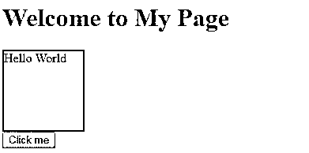


点击我按钮后

**输出:**

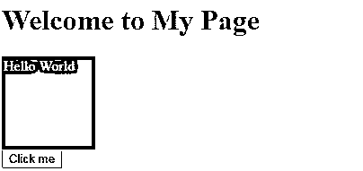


### 推荐文章

这是 jQuery 元素的指南。在这里，我们讨论简介和前 8 个 jQuery 选择器及其代码实现。您也可以阅读以下文章，了解更多信息——

1.  [JQuery 进度条](https://www.educba.com/jquery-progress-bar/)
2.  [jQuery val()](https://www.educba.com/jquery-val/)
3.  [jQuery keydown()](https://www.educba.com/jquery-keydown/)
4.  [Java 密钥库](https://www.educba.com/java-keystore/)


