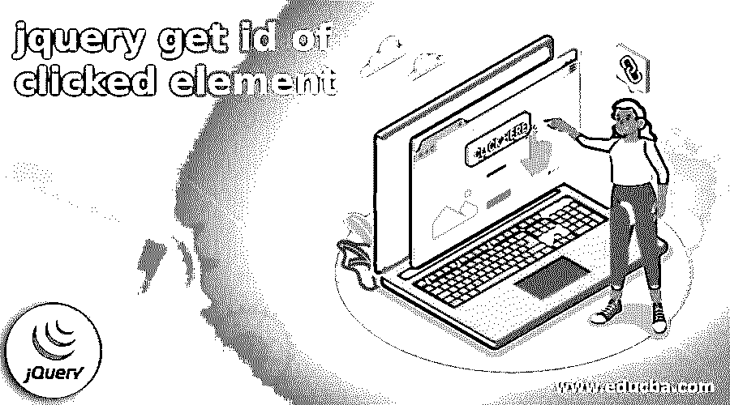
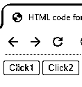
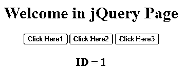
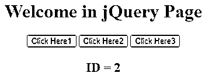
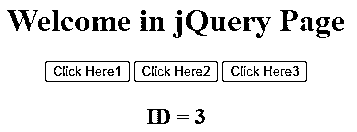

# jquery 获取被单击元素的 id

> 原文：<https://www.educba.com/jquery-get-id-of-clicked-element/>




## jquery 简介获取被点击元素的 id

基本上，jQuery 为用户提供了不同种类的功能，其中获取被点击元素的 id 是 jQuery 提供的功能之一。基本上，jQuery 是一个选择器，它使用 HTML 标签的属性来找出特定的元素，这个元素在指定的 HTML 页面中必须是唯一的，或者我们可以说是网页。当我们需要找到一个唯一的元素时，我们可以使用 jQuery get by element id。JQuery 使用 attr()方法找出元素的 id。DOM 元素用于根据用户需求触发事件。

### jQuery 获取被点击元素的 id

jQuery select by ID 允许您根据特性“ID”的价值来跟踪特定的 HTML 组件。您可以通过使组件的 id 新颖来选择和执行组件上的计划活动。

<small>网页开发、编程语言、软件测试&其他</small>

**语法**

```
$('#element of id')
```

**解释**

id 可以是 HTML 组件的 ID 属性中给定的任何值。您应该在选择器中使用#后跟它的 ID。

例如，如果存档中有一个 HTML 组件，如

some text，$("#text ")将选择 id 相当于" message "的 div，并在其上执行预期的活动。

这个 jQuery 选择器的主要意义在于，我们将根据每个组件独一无二的 id 来处理它，并且控件将只影响那个组件。

现在让我们看看 getElementbyId( "myId ")和$("#myId ")之间的区别

document.getElementbyId( "myId ")更快，因为它对 JavaScript motor(无论如何)的直接调用组装了一个 jQuery 对象。首先，它需要解析选择器，因为 jQuery 可以通过类、质量、前驱等发现事物，而 document.getElementById 只能通过 Id 发现组件。jQuery 对象绝不是一个本地项，所以制作起来更慢，而且它同样有更大的潜力。

document.getElementbyId( "myId ")将返回一个 DOM 对象，而$("#myId ")将返回一个 jQuery 对象。通过利用这个 jQuery 对象，您实际上想要利用 jQuery 技术。获得 DOM 的纯 Javascript 可以更快，因为可以减少 jQuery 在这方面的开销。无论如何，它通常不需要更快，因为你可以想到一些重大失误，使事情再次缓慢下来。

总的来说，您应该遵循这样的格言:使用最不复杂的代码，以适当的效率处理业务。这几乎肯定是$("#myId ")，除非您真诚地尝试增强纯粹的执行，在这种情况下，您将利用 document.getElementById("myId ")。

### 如何用 jQuery 获得被点击元素的 ID？

现在让我们看看如何使用 jQuery 获得被点击元素的 ID，如下所示。

您可以利用 jQuery attr()策略来获取或设置组件的 ID 属性估计值。附带的模型将在单击按钮时在一个警告框中显示 DIV 组件的 ID。

**jQuery 获取被点击元素的 id-HTML 代码**

现在让我们看看获取被点击元素 ID 的 HTML 代码，如下所示。

```
<!DOCTYPE html>
<html>
<head>
<title>HTML code for get ID of clicked element </title>
<script src="https://code.jQuery.com/jQuery-3.5.1.min.js"></script>
</head>
<body>
<button btn_id='1'>Click1</button>
<button btn_id='2'>Click2</button>
</body>
</html>
```

**解释**

通过使用上面的代码，我们可以设计带有两个不同按钮的网页。这里我们展示了两个按钮，如上面的代码所示。上面代码的最终输出我们用下面的截图来说明。




**jQuery 获取被点击元素的 id-jQuery 代码**

现在让我们看一下 jQuery 代码，它获取被单击元素的 id，如下所示。

```
<script>
$(document).ready(function(){
$('btn_id').click(function(event){
alert(event.target.btn_id);
});
});
</script>
```

**解释**

下面给出了 JQuery 代码，在这个代码中使用了 JQuery event.target 属性，它将返回被单击的按钮组件。

无论在什么时候单击按钮，它都将执行 capacity，even.target 属性将返回被单击按钮的 id。

然后利用就绪策略显示被点击按钮的 Id。

**jQuery 获取被点击元素实例的 id**

现在让我们来看看获取被点击元素的 id 的例子，以便更好地理解。

```
<!DOCTYPE HTML>
<html>
<head>
<title>
jQuery get id for click element
</title>
<script src =
"https://ajax.googleapis.com/ajax/libs/jQuery/3.4.0/jQuery.min.js">
</script>
</head>
<body style = "text-align:center;">
<h1 style = "color:rgb(201, 5, 5);" >
Welcome in jQuery Page
</h1>
<p id = "abc" style =
"font-size: 17px; font-weight: bold;">
</p>
<button btn_id="1"> Click Here1</button>
<button btn_id="2"> Click Here2</button>
<button btn_id="3"> Click Here3</button>
<p id = "abcd" style =
"color:rgb(193, 196, 193); font-size: 22px; font-weight: bold;">
</p>
<script>
$('#abcd').text("Click on above button to get the ID of click element");
$("button").click(function() {
var t = $(this).attr('btn_id');
$('#abcd').text("ID = " + t);
});
</script>
</body>
</html>
```

**解释**

在上面的代码中，我们使用了 HTML 代码和 jQuery 的组合，如图所示。在这个例子中，我们创建了三个不同的按钮，当我们单击指定的按钮时，我们需要获取每个按钮的 id。

**jQuery click()方法:**该技术触发 snap 事件，或者在 tick 事件发生时添加运行容量。单击组件时会发生捕捉事件。

**参数:**该技术承认可自由选择的单边界工作。它决定了快照事件发生时的运行容量。

上面代码的最终输出用下面的截图来说明。


现在单击第一个按钮，单击此处 1，单击此按钮后，我们将获得以下输出，即该按钮的 ID，如下面的屏幕截图所示。




类似地，我们得到剩余的两个 id，如下图所示。下面的屏幕截图显示了 ClickHere2 的输出，如下所示。




下面的截图显示了 Click Here3 的输出，如下所示。




### 结论

我们希望通过这篇文章，您可以了解更多关于被点击元素的 jQuery ge ID。从上面的文章中，我们了解了获取被点击元素的 ID 的基本思想，我们还看到了 jQuery 获取被点击元素的 ID 的表示和示例。从本文中，我们了解了如何以及何时使用 jQuery 来获取被点击元素的 ID。

### 推荐文章

这是 jquery 获取被点击元素 id 的指南。这里我们讨论了获取被点击元素 ID 的基本思想，我们也看到了它的表示。您也可以看看以下文章，了解更多信息–

1.  [jQuery 帖子](https://www.educba.com/jquery-post/)
2.  [jQuery ajax 请求](https://www.educba.com/jquery-ajax-request/)
3.  [jQuery 滚动条](https://www.educba.com/jquery-scrollbar/)
4.  [jquery Ajax uccess()](https://www.educba.com/jquery-ajaxsuccess/)


