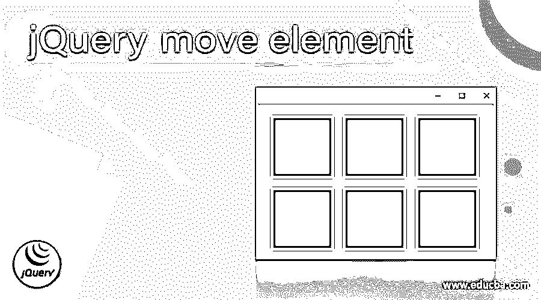
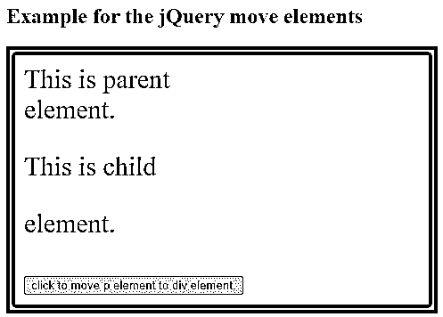
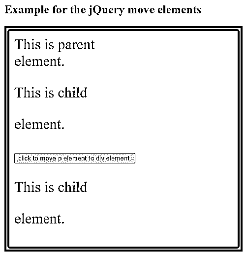
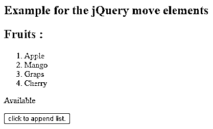
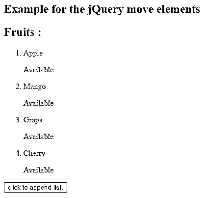
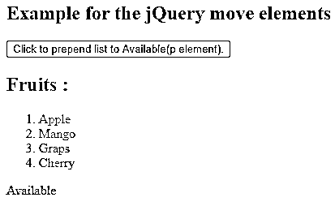
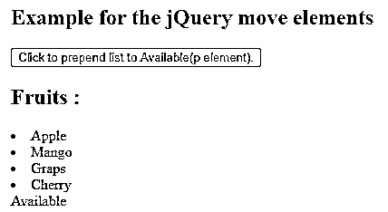

# jQuery 移动元素

> 原文：<https://www.educba.com/jquery-move-element/>




## jQuery 移动元素的定义

jQuery move 元素在文档的 DOM 树中移动元素。jQuery move 元素不是一个方法，但是为了执行它，jQuery 提供了添加方法，这些方法是 append()方法 appendTo()方法和 prepend()方法，这些方法是 jQuery 中的内置方法。有时我们可能需要将一个元素移动到另一个元素中，就像我们必须将一个段落移动到一个 div 元素中一样，所以我们可以根据执行的需求使用 append()、appendTo()或 prepend()方法。

**jQuery append()方法的语法:**

<small>网页开发、编程语言、软件测试&其他</small>

jQuery append()方法用于在所选元素处追加内容。

```
$(selector).append(content, function(index, html));
```

**参数:**

*   **选择器–**这不是可选的，它指定了要将指定内容添加到其元素之后的元素。
*   **content–**这不是一个可选参数，它指定要放在所选选择器末尾的内容。该参数的可能值是 DOM 元素、HTML 元素和 jQuery 对象。
*   **function–**这是一个可选参数，指定要运行以获取要追加的内容的函数的名称。
*   **index–**这是一个可选参数，指定元素的索引位置。
*   **HTML–**这是一个可选参数，指定所选元素的当前 HTML。

**jQuery appendTo()方法的语法:**

jQuery appendTo()方法用于在所选元素的末尾插入内容。它的执行与 append()方法相同，只是语法不同，选择器和内容位置与 append()方法相反。

```
$(content).append( selector );
```

**参数:**

*   **content–**这不是可选的，它指定要放在所选选择器末尾的内容。
*   **选择器–**这不是一个可选参数，它指定将在其后添加内容的元素。

**jQuery prepend()方法的语法:**

jQuery append()方法用于在选定元素的开头插入内容。

```
$( selector ).prepend( content, function );
```

**参数:**

*   **选择器–**这不是可选的，它指定要添加指定内容的元素的开始。
*   **content–**这不是一个可选参数，它指定要放在所选选择器开头的内容。该参数的可能值是 DOM 元素、HTML 元素和 jQuery 对象。
*   **function–**这是一个可选参数，指定要运行的函数的名称。

### jQuery 移动元素方法的工作原理

append()、appendTo()或 prepend()方法适用于选择器，因此当我们调用这些方法将选定的元素添加到另一个元素中时，jQuery 本身知道要添加的元素已经存在于文档中，然后将一个元素移动到父元素。

### 例子

接下来，我们编写 html 代码，通过下面的示例更清楚地理解 jQuery append()方法，其中 append()方法用于将 p 元素追加到 div 元素，如下所示

#### 示例#1

```
<!doctype html>
<html lang = "en">
<head>
<meta charset="utf-8">
<title> This is an example for jQuery move element </title>
<script src = "https://ajax.googleapis.com/ajax/libs/jquery/3.3.1/jquery.min.js">
</script>
</head>
<script>
function move()
{
$("div").append($("p"));
}
</script>
</head>
<body>
<h2> Example for the jQuery move elements </h2>
<div style = "color:green; border:10px solid red; padding:10px; font-size:30px" > This is parent <div> element. </div>
<p style="color:green;"> This is child <p> element. </p>
<button onclick="move()">click to move p element to div element.</button>
</body>
</html>
```

**输出:**




一旦我们单击“单击将 p 元素移动到 div 元素”按钮，输出为–




和上面的程序一样，div 和 p 元素包含一些内容，还有一个按钮，当我们单击它时，它调用 move()函数。因此，当我们单击按钮时，它运行 move()函数，其中 append()函数用于将 p 元素附加到 div 元素，这是 p 内容在框内移动的方式，如第二个输出所示。

用于追加元素的 jQuery appendTo()方法示例

接下来，我们编写 HTML 代码来理解 jQuery appendTo()，其中 appendTo()方法用于将 p 元素追加到 li 元素，如下所示

#### 实施例 2

```
<!doctype html>
<html lang = "en">
<head>
<meta charset="utf-8">
<title> This is an example for jQuery move element </title>
<script src = "https://ajax.googleapis.com/ajax/libs/jquery/3.3.1/jquery.min.js">
</script>
</head>
<script>
function move()
{
$("#id1").appendTo($("li"));
}
</script>
</head>
<body>
<h2> Example for the jQuery move elements </h2>
<h2 style = "color:red;" > Fruits : </h2>
<ol style = "color:red;" >
<li id = "id2"> Apple </li>
<li id = "id3"> Mango </li>
<li> Graps </li>
<li id = "id4"> Cherry </li>
</ol>
<p id="id1" style="color:green;"> Available </p>
<button onclick="move()">click to append list.</button>
</body>
</html>
```

**输出:**




一旦我们点击“点击附加列表”按钮，输出是–




和上面的程序一样，li 和 p 元素包含一些内容，还有一个按钮调用 move()函数。因此，当我们单击按钮时，它运行 move()函数并运行 appendTo()函数，该函数将 p 元素附加到所有 li 元素，这就是为什么 p 内容被移动到所有元素列表的旁边，如第二个输出所示。

用于前置元素的 jQuery prepend()方法示例–

接下来，我们编写 HTML 代码来理解 jQuery prepend()，其中 prepend()方法用于为 li 元素 top 元素添加前缀，如下所示

#### 实施例 3

```
<!doctype html>
<html lang = "en">
<head>
<meta charset="utf-8">
<title> This is an example for jQuery move element </title>
<script src = "https://ajax.googleapis.com/ajax/libs/jquery/3.3.1/jquery.min.js">
</script>
</head>
<script>
function move()
{
$("#id1").prepend($("li"));
}
</script>
</head>
<body>
<h2> Example for the jQuery move elements </h2>
<button onclick="move()">Click to prepend list to Available(p element).</button>
<h2 style = "color:red;" > Fruits : </h2>
<ol style = "color:red;" >
<li id = "id2"> Apple </li>
<li id = "id3"> Mango </li>
<li> Graps </li>
<li id = "id4"> Cherry </li>
</ol>
<p id="id1" style="color:green;"> Available </p>
</body>
</html>
```

**输出:**




一旦我们点击了“点击以将列表前置到可用(p 元素)”按钮，输出是–




与上面的程序一样，当我们单击运行 move()函数和 prepend()函数的按钮时，所有的 li 元素都被添加到“可用”的 p 元素内容的前面，如第二个输出所示。

### 结论

要执行 jQuery 移动元素，我们可以使用 append()、appendTo()或 prepend()方法，它们是 jQuery 中的内置方法。

### 推荐文章

这是一个 jQuery 移动元素的指南。这里我们讨论 jQuery 移动元素方法的描述、语法、工作方式，以及代码实现的例子。您也可以看看以下文章，了解更多信息–

1.  [jQuery 当](https://www.educba.com/jquery-when/)
2.  [jQuery 引用](https://www.educba.com/jquery-reference/)
3.  [jQuery 扩展](https://www.educba.com/jquery-extend/)
4.  [jQuery 修剪](https://www.educba.com/jquery-trim/)


