# JQuery 属性()

> 原文：<https://www.educba.com/jquery-attr/>

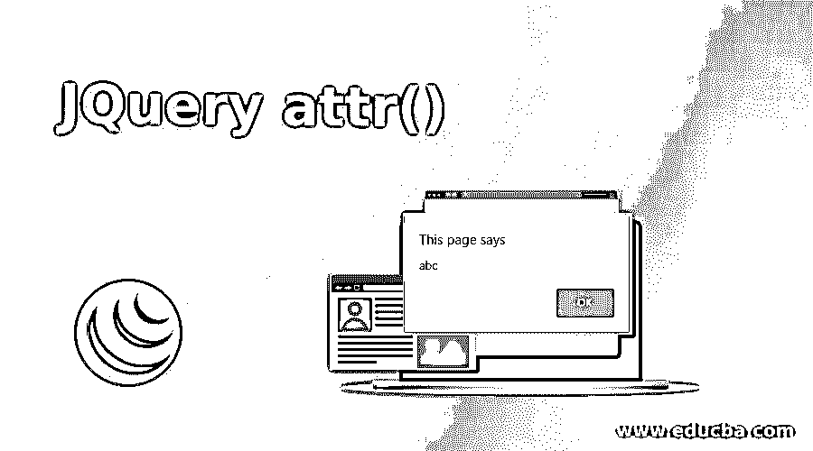


## Jquery attr()简介

这个 Jquery attr()方法专门用于设置所选元素的属性和值。我们还可以根据属性名返回属性值。

如果我们希望设置属性值，Jquery attr()允许我们为一组匹配的元素设置一个或多个属性值，以及何时使用它返回属性值；它返回第一个匹配元素的值。

<small>网页开发、编程语言、软件测试&其他</small>

**语法**

让我们来看看 Jquery attr()的语法:

**a .设置属性和值:**

```
$(selector).attr(attributeName, attributeValue)
```

**解释:**我们必须传递属性的名称和我们希望分配的相应值。

**b .使用函数设置属性和值:**

```
$(selector).attr(attributeName,function(indexPosition, currentAttributeValue))
```

**解释:**我们必须传递属性的名称，并定义我们需要对函数中的特定属性执行的任务。

**c .设置多个属性和值:**

```
$(selector).attr({ attributeName: attributeValue, attributeName: attributeValue, attributeName: attributeValue,............ })
```

**说明:**基于选择器，绕过多个属性及其值以键-值对的形式我们可以设置多个属性及其值。

**d .返回一个属性的值:**

```
$(selector).attr(attributeName)
```

**解释:**要返回属性的值，我们只需传递属性的名称。

### JQuery attr 是如何工作的？

如上面的语法所示；attr()方法可以用来设置属性和值，它也允许我们设置多个值和属性。我们可以返回一个属性的值。

要使用 jquery，我们可以从 jquery.com 下载 jquery。

attr()方法还带有一个回调函数。然后，回调函数执行该函数中定义的操作。让我们通过下面的例子来看看我们是如何执行所有这些操作的。

在下面的例子中，我们使用“id”作为选择器。基于“id ”,我们将设置并返回属性及其值。

### Jquery 属性的示例

下面举几个例子

#### 示例#1

设置属性和值的示例

**描述:**在下面的代码中，我们将在按钮点击动作上将名称的属性值从“abc”设置为“pqr”。

**代码片段:**

```
<!DOCTYPE html>
<html>
<head>
<script src="https://ajax.googleapis.com/ajax/libs/jquery/3.4.1/jquery.min.js"></script>
<script>
$(document).ready(function(){ alert($("#x").attr("name"))
$("button").click(function(){
$("#x").attr("name", "pqr");
alert($("#x").attr("name"))
});
});
</script>
</head>
<body>
<p><a name="abc" id="x"></a></p>
<button>Change name value</button>
<p>Click on the button to change the value from "abc" to "pqr"</p>
</body>
</html>
```

**输出:**

当我们运行程序时，显示“abc”值。

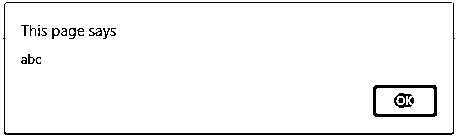


**用户界面:**

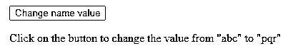


当我们点击按钮时；该值从“abc”变为“pqr ”,如下所示:

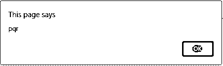


#### 实施例 2

使用回调函数设置属性和值的示例。在下面的代码片段中；卷号的初始值是 11，你一运行程序就能看到。使用一个函数，我们将属性 rollNo 的值设置为 10。

**代码片段:**

```
<!DOCTYPE html>
<html>
<head>
<script src="https://ajax.googleapis.com/ajax/libs/jquery/3.4.1/jquery.min.js"></script>
<script>
$(document).ready(function(){ alert($("#n").attr("rollNo"))
$("button").click(function(){
$("#n").attr("rollNo", function(index,currentvalueofrollno){ return currentvalueofrollno - 1 ;
});
alert($("#n").attr("rollNo"))
});
});
</script>
</head>
<body>
<p><a rollNo= 11 id="n"></a></p>
<button>Change roll no value</button>
<p>Click on the button to change the roll no value from 11 to 10</p>
</body>
</html>
```

**输出:**

当我们运行程序时，显示值 11。

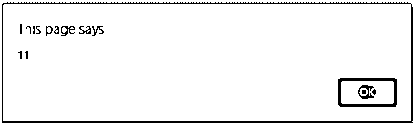


**用户界面:**

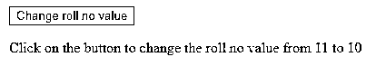


当我们点击按钮时；卷号的值从 11 变为 10，如下所示:

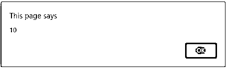


#### 实施例 3

设置多个属性和值的示例

**描述:**

在本例中，rollNo 的初始值为 16，名称为“xyz ”,该名称将更改为 17 和“abc”。我们将同时设置多个属性。请参考以下代码片段:

**代码片段:**

```
<!DOCTYPE html>
<html>
<head>
<script src="https://ajax.googleapis.com/ajax/libs/jquery/3.4.1/jquery.min.js"></script>
<script>
$(document).ready(function(){ alert($("#n").attr("rollNo"))
alert($("#n").attr("name"))
$("button").click(function(){
$("#n").attr({"rollNo":"17" , "name" : "abc" }); alert($("#n").attr("rollNo"))
alert($("#n").attr("name"))
});
});
</script>
</head>
<body>
<p><a id="n" rollNo="16" name="xyz"></a></p>
<button>Change roll no and name value</button>
<p>Click on the button to change the and name and roll no value</p>
</body>
</html>
```

**输出:**

当我们运行程序时，输出如下所示。

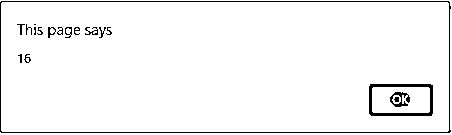


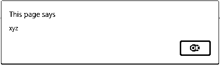


**用户界面:**

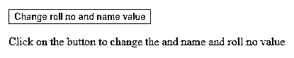


一旦我们点击了按钮；更改后的值将如下所示:


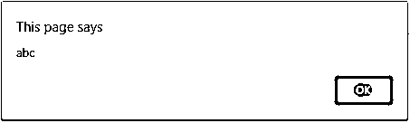


#### 实施例 4

返回属性值的示例。在下面返回属性值的场景中；名字的价值是“abc”。我们将返回同样的按钮点击动作。

**代码片段:**

```
<!DOCTYPE html>
<html>
<head>
<script src="https://ajax.googleapis.com/ajax/libs/jquery/3.4.1/jquery.min.js"></script>
<script>
$(document).ready(function(){
$("button").click(function(){
alert($("#x").attr("name"))
});
});
</script>
</head>
<body>
<p><a name="abc" id="x"></a></p>
<button>View name value</button>
<p>Click on the button to view the name value</p>
</body>
</html>
```

**输出:**

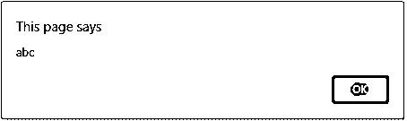


**用户界面:**

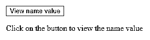


如下所示，我们可以看到分配给 name 属性的值。

### 结论

因此，我们可以了解 jquery attr()方法不仅可以用来设置属性和值，还可以设置多个属性和值。我们还可以看到如何返回属性值以及在 jquery attr()方法中使用回调函数。

### 推荐文章

这是 JQuery attr()的指南。为了更好地理解，这里我们将讨论 JQuery attr 是如何工作的，并给出一些编程示例。您也可以浏览我们推荐的其他文章，了解更多信息——

1.  [jQuery 验证](https://www.educba.com/jquery-validate/)
2.  [jQuery 数据表](https://www.educba.com/jquery-data-table/)
3.  [jQuery hide()](https://www.educba.com/jquery-hide/)
4.  [jQuery submit()](https://www.educba.com/jquery-submit/)


