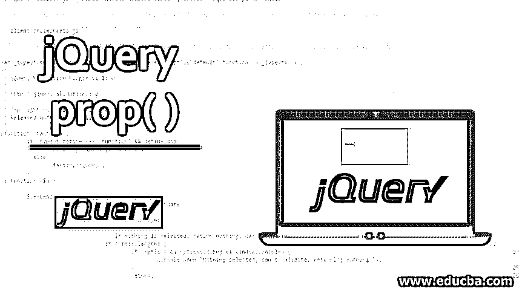
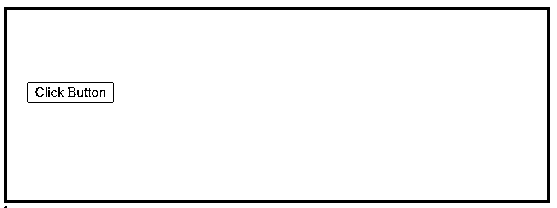
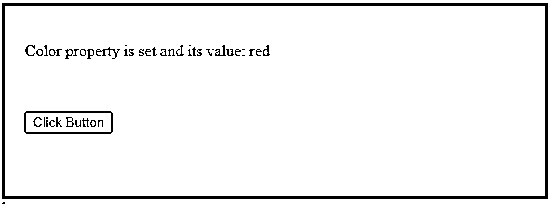
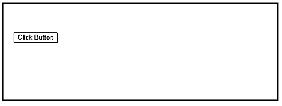
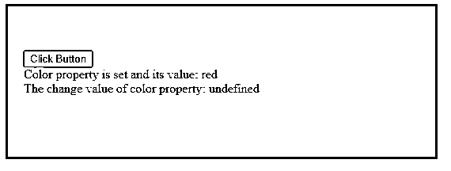
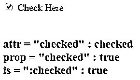
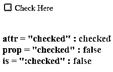

# jQuery 属性( )

> 原文：<https://www.educba.com/jquery-prop/>




## jQuery prop()简介

JQuery prop()是一个内置函数，用于获取 web 页面中任何元素的属性和各自的值。您可以使用此函数来设置元素的属性值或获取现有元素属性的属性值。如果执行该函数是为了获取，它将获取给定元素的属性的第一个找到的值。另一个类似 prop()函数的函数是 attr()函数。prop()方法的语法因不同的函数而异，例如获取属性值、设置属性及其值、设置多个属性及其相应的值，以及使用另一个函数获取属性及其相应的值。

### jQuery prop()的语法和参数

这里我们讨论下面的语法:

<small>网页开发、编程语言、软件测试&其他</small>

#### 句法

1.返回属性值的语法:

```
$(selector).prop( property )
```

2.设置属性和值的语法:

```
$(selector).prop( property, value)
```

3.设置多个属性和值的语法:

```
$(selector).prop({ property1 : value1, property2 : value2,...})
```

4.使用函数设置属性和值的语法:

```
$(selector).prop( property, function( index, current value ))
```

#### 因素

下面给出了一些参数:

*   **属性:**属性用于指定属性名。
*   **Value:** Value 用于指定属性的值。
*   **Index:** Index 用于指定元素在集合中的索引位置。
*   **当前值:**当前值用于指定所选元素的当前属性值。

### **jQuery prop()** 的例子

jQuery prop()的示例如下:

#### 示例#1:设置属性的方法

接下来，我们通过下面的示例编写 HTML 代码，以便更清楚地理解 jQuery prop()方法:

**代码:**

```
<!DOCTYPE html>
<html>
<head>
<script
src="https://ajax.googleapis.com/ajax/libs/jquery/3.3.1/jquery.min.js" >
</script>
<title> This is an example for jQuery prop( ) method </title>
<!-- code to show working of jQuery prop( ) method -->
<script>
$(document).ready(function(){
$("button").click(function(){
var $x = $("p");
$x.prop("color", "red");
$x.append(" Color property is set and its value: " + $x.prop
("color"));
});
});
</script>
<style>
div{
width: 500px;
padding: 20px;
height: 150px;
border: 3px solid red;
}
</style>
</head>
<body>
<div>
<p></p>
<br><br>
<!-- click button to execute method -->
<button> Click Button </button>
</div>
</body>
</html>
```

**输出:**




一旦点击按钮点击，输出是:




在上面的代码中，prop()方法将属性 color 的值设置为红色，因此会出现一个红框，单击按钮后，红框会显示文本

在上面的代码中，append()方法也使用了。append()方法的用途是将指定的内容插入到 jQuery 集合的末尾，或者作为所选元素的最后一个子元素。

#### 示例 2:使用 removeProp()方法的方法

下一个示例代码中，此方法将 color 属性值设置为 red，并在 removeProp()旁边移除 color 属性:

**代码:**

```
<!DOCTYPE html>
<html>
<head>
<script
src="https://ajax.googleapis.com/ajax/libs/jquery/3.3.1/jquery.min.js" >
</script>
<title> This is an example for jQuery prop( ) method </title>
<!-- code to show working of jQuery prop( ) method -->
<script>
$(document).ready(function(){
$("button").click(function(){
var $x = $("div");
$x.prop("color", "red");
$x.append("<br> Color property is set and its value: " + $x.prop
("color"));
$x.removeProp("color");
$x.append("<br> The change value of color property: " + $x.prop
("color"));
});
});
</script>
<style>
div{
width: 500px;
padding: 20px;
height: 150px;
border: 3px solid red;
}
</style>
</head>
<body>
<div>
<br><br>
<!-- click button to execute method -->
<button> Click Button </button>
</div>
</body>
</html>
```

**输出:**




一旦“单击此处”按钮被单击，输出是:




#### 示例 3:带有 attr()方法的方法

下一个示例代码中，jQuery prop()和 jQuery attr()方法用于区分它们的功能

**代码:**

```
<!DOCTYPE html>
<head>
<meta charset="utf-8">
<title> The example for jQuery prop() method </title>
<style>
h3 {
margin: 40px 0 0;
}
b {
color: blue;
}
</style>
<script src="https://code.jquery.com/jquery-1.10.2.js"></script>
</head>
<body>
<input id="c1" type="checkbox" checked="selected">
<label for="c1"> Check Here </label>
<h3></h3>
<script>
$( "input" ).change(function() {
var $input = $( this );
$( "h3" ).html(
"attr = \"checked\" : <b>" + $input.attr( "checked" ) + "</b><br>" +
"prop = \"checked\" : <b>" + $input.prop( "checked" ) + "</b><br>" +
"is = \":checked\" : <b>" + $input.is( ":checked" ) ) + "</b>";
}).change();
</script>
</body>
</html>
```

**输出:**




取消选择“单击此处”按钮后，输出为:




如上面的输出所示，它清楚地显示了这个方法是为了检索属性值和 HTML 属性值。

### 推荐文章

这是 jQuery prop()的指南。这里我们讨论 jQuery prop()的参数和示例以及语法。您也可以浏览我们推荐的其他文章，了解更多信息——

1.  [jQuery 方法](https://www.educba.com/jquery-methods/)
2.  [jQuery val()](https://www.educba.com/jquery-val/)
3.  [jQuery keydown()](https://www.educba.com/jquery-keydown/)
4.  [jQuery show( )](https://www.educba.com/jquery-show/)


