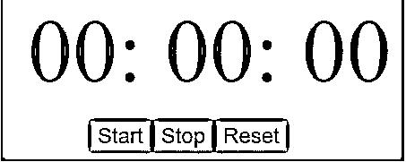
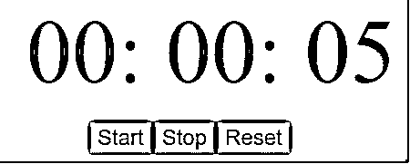
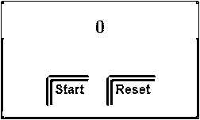
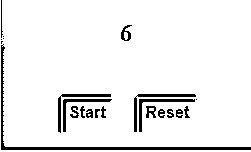
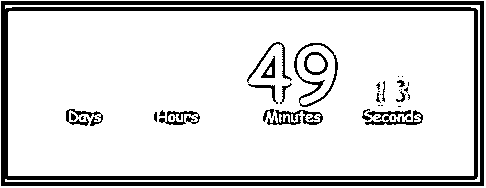

# jQuery 计时器

> 原文：<https://www.educba.com/jquery-timer/>


## jQuery 定时器简介

jQuery Timer 是 jQuery 提供的一个非常有用的特性，可以为您创建的动画添加一些额外的效果，使您的网页更具交互性和吸引力。这是通过两个函数来实现的，setTimeout()和 setInterval()将函数的执行延迟到某个时间段。我们可以用这个定时器功能创建许多效果，如倒计时定时器，秒表，图像滑块等。还有几个 jQuery 插件可以帮助创建这些定时器效果。

### 句法

For setInterval()方法

<small>网页开发、编程语言、软件测试&其他</small>

```
setInterval(function, milliseconds, param1, param2….)
```

For setTimeout()方法

```
setTimeout(function[, delay, param1, param2….]);
```

### 实现 jQuery 定时器的示例

下面是提到的一些例子:

#### 示例#1

以下示例说明了如何使用此功能创建带有开始、停止和重置控件的秒表:

**代码:**

```
<!DOCTYPE html>
<html lang="en">
<head>
<meta charset="utf-8" />
<title>jQuery timer example</title>
<script src="https://code.jquery.com/jquery-1.12.4.min.js"></script>
<script>
$(document).ready(function () {
var hours = 0;
var mins = 0;
var seconds = 0;
$("#startbtn").click(function () {
startTimer();
});
$("#stopbtn").click(function () {
clearTimeout(timex);
});
$("#resetbtn").click(function () {
hours = 0;
mins = 0;
seconds = 0;
$("#hours", "#mins").html("00:");
$("#seconds").html("00");
});
function startTimer() {
timex = setTimeout(function () {
seconds++;
if (seconds > 59) {
seconds = 0;
mins++;
if (mins > 59) {
mins = 0;
hours++;
if (hours < 10) {
$("#hours").text("0" + hours + ":");
} else $("#hours").text(hours + ":");
}
if (mins < 10) {
$("#mins").text("0" + mins + ":");
} else $("#mins").text(mins + ":");
}
if (seconds < 10) {
$("#seconds").text("0" + seconds);
} else {
$("#seconds").text(seconds);
}
startTimer();
}, 1000);
}
});
</script>
<style>
#divstyle {
margin-left: 300px;
margin-top: 100px;
background-color: lightslategrey;
width: 450px;
height: 180px;
}
#timer {
font-size: 100px;
padding-left: 30px;
width: 1000px;
}
#buttons {
padding-top: 20px;
padding-left: 100px;
width: 600px;
}
#buttons button {
font-size: 24px;
color: brown;
}
</style>
</head>
<body>
<div id="divstyle">
<div id="timer">
00:
00:
00
</div>
<div id="buttons">
<button id="startbtn">Start</button>
<button id="stopbtn">Stop</button>
<button id="resetbtn">Reset</button>
</div>
</div>
</body>
</html>
```

**输出:**

下面是代码执行后显示的屏幕:




点击“开始”按钮，秒表开始计时，如下图所示:




**说明:**点击“停止”按钮，定时器停止。单击重置按钮可重置计时器。

#### 实施例 2

下例与上图相似，显示了带有启动和复位控件的计时器:

**代码:**

```
<!DOCTYPE html>
<html lang="en">
<head>
<meta charset="utf-8" />
<title>jQuery timer example</title>
<script src="https://code.jquery.com/jquery-1.12.4.min.js"></script>
<script>
$(document).ready(function() {
var i = 1;
$("#startBtn").click(function (e) {
setInterval(function () {
$("#stopTimer").html(i);
i++;
}, 1000);         });
$("#resetBtn").click(function (e) {
i = 0;
});
});
</script>
<style>
#divstyle {
margin-left: 500px;
margin-top: 100px;
background-color: lightslategrey;
width: 250px;
height: 150px;
}
#stopTimer{
text-align: center;
font-weight: bold;
font-size: x-large;
padding-top: 20px;
background-color: cadetblue;
}
#startBtn {
padding-top: 5px;
padding-bottom: 10px;
margin-left: 60px;
margin-top: 50px;
text-align: center;
font-weight: bold;
font-size: medium;
background-color: cadetblue;
}
#resetBtn {
padding-top: 5px;
padding-bottom: 10px;
margin-left: 20px;
margin-top: 50px;
text-align: center;
font-weight: bold;
font-size: medium;
background-color: cadetblue;
}
</style>
</head>
</head>
<body>
<div id ="divstyle">
<div id="stopTimer">0</div>
<button id="startBtn">Start</button>
<button id="resetBtn">Reset</button>
</div>
</div>
</body>
</html>
```

**输出:**

下面是执行上述代码后显示的屏幕:




点击“开始”按钮时，计时器开始计时，点击“重置”按钮时，计时器重置:




#### 实施例 3

让我们再考虑一个例子，我们创建一个显示日、小时、分钟和秒的倒数计时器:

**代码:**

```
<!DOCTYPE html>
<html lang="en">
<head>
<meta charset="utf-8" />
<title>jQuery timer example</title>
<script src="https://cdnjs.cloudflare.com/ajax/libs/jquery/2.1.3/jquery.min.js"></script>
<script>
function createTimer() {
var endTime = new Date("2020/05/10 00:00:00");
endTime = (Date.parse(endTime) / 1000);
var startTime = new Date();
startTime = (Date.parse(startTime) / 1000);
var remainingTime = endTime - startTime;
var days = Math.floor(remainingTime / 86400);
var hours = Math.floor((remainingTime - (days * 86400)) / 3600);
var minutes = Math.floor((remainingTime - (days * 86400) - (hours * 3600 )) / 60);
var seconds = Math.floor((remainingTime - (days * 86400) - (hours * 3600) - (minutes * 60)));
if (hours < "10") { hours = "0" + hours; }
if (minutes < "10") { minutes = "0" + minutes; }
if (seconds < "10") { seconds = "0" + seconds; }
$("#days").html(days + "Days");
$("#hours").html(hours + "Hours");
$("#minutes").html(minutes + "Minutes");
$("#seconds").html(seconds + "Seconds");
}
setInterval(function() { createTimer(); }, 1000);
</script>
<style>
body {
font-family: 'Titillium Web', cursive;
width: 800px;
margin: 0 auto;
text-align: center;
color: white;
background: #222;
font-weight: 100;
}
div {
display: inline-block;
line-height: 1;
padding: 10px;
font-size: 40px;
}
span {
display: block;
font-size: 20px;
color: white;
}
#divstyle{
margin-top: 100px;
background-color: lightslategrey;
width: 600px;
height: 200px;
}
#days {
font-size: 100px;
color: #db4844;
}
#hours {
font-size: 100px;
color: #f07c22;
}
#minutes {
font-size: 100px;
color: #f6da74;
}
#seconds {
font-size: 50px;
color: #abcd58;
}
</style>
</head>
</head>
<body>
<div id ="divstyle">
<div id="timer">
<div id="days"></div>
<div id="hours"></div>
<div id="minutes"></div>
<div id="seconds"></div>
</div>
</div>
</body>
</html>
```

**输出:**

下面是执行上述代码时显示的屏幕截图。give jQuery 倒计时器显示日、小时、分钟和秒:




### 结论

在本文中，我们讨论了 jQuery 定时器特性，该特性使您能够为自己创建的动画设置定时器，从而使您的 web 页面更具吸引力。有两种方法，setInterval 和 setTimeout，它们基本上将函数的执行延迟一段时间。

### 推荐文章

这是一个 jQuery 定时器的指南。在这里，我们讨论 jQuery Timer 的介绍，以及适当的语法和相应的示例，以便更好地理解。您也可以浏览我们的其他相关文章，了解更多信息——

1.  [jQuery delay()](https://www.educba.com/jquery-delay/)
2.  [jQuery 过滤器](https://www.educba.com/jquery-filter/)
3.  [jQuery 包含](https://www.educba.com/jquery-contains/)
4.  [JQuery Blur()](https://www.educba.com/jquery-blur/)


