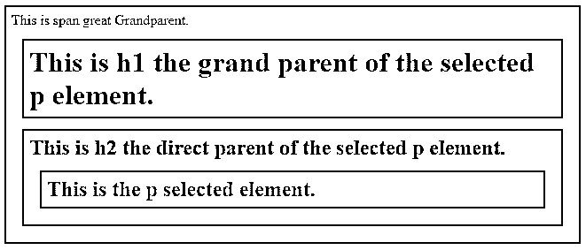

# jQuery 父级

> 原文：<https://www.educba.com/jquery-parent/>


## jQuery 父级简介

jQuery UI parent()方法用于获取元素的直接父元素，并沿 DOM 树向上遍历一级。jQuery UI parent()方法是一个内置方法。有时我们需要检索程序中元素的父元素和祖先元素的信息，因此 jQuery 提供了 parent()方法，该方法遍历 DOM 树的上一级，并给出所传递元素的直接父元素。

**语法:**

<small>网页开发、编程语言、软件测试&其他</small>

JQuery parent()方法的语法:

```
$(selector).parent(filter);
```

**参数:**

*   **filter:** 可选参数，指定用它来过滤父项。
*   **返回值:**这个方法的返回值是一个元素的父元素。

### jQuery UI parent()方法的示例

下面是一些例子:

#### 示例# 1–不接受任何参数的方法

 **接下来，我们编写 html 代码，通过下面的示例更清楚地理解 jQuery UI parent()方法，其中 parent()方法用于获取所选元素的父元素

**代码:**

```
<!doctype html>
<html lang = "en">
<head>
<meta charset="utf-8">
<title> This is an example for jQuery parent() method </title>
<script src = "https://ajax.googleapis.com/ajax/libs/jquery/3.3.1/jquery.min.js">
</script>
<style>
.s1 * {
display : block;
border : 2px solid green;
color : red;
padding : 6px;
margin : 12px;
}
</style>
<script>
$(document).ready(function() {
$("p").parent().css({
"color" : "green",
"border" : "2px solid green",
"background" : "yellow"
});
});
</script>
</head>
<body>
<div class = "s1">
 This is span great Grandparent.
<h1> This is h1 the grand parent of the selected p element.
<h2> This is h2 the direct parent of the selected p element.
<p> This is the p selected element. </p>
</h2>
</h1>

</div>
</body>
</html>
```

**输出:**


**代码解释:**如上面程序中的代码$(“p”)。父级()。css({ "color" : "green "，" border" : "2px solid green "，" background ":" yellow " })；是获取 p 选定元素的父元素，并以某种样式显示为绿色文本颜色、边框 2px 纯绿色和黄色背景。在代码的更远处，span 标签是 topes 标签或曾祖父，然后 h1 是曾祖父，然后 h2 是 p 元素的父。由于 h2 标签是 p 所选元素的父标签，这就是 h2 标签的内容以该样式显示的原因。

#### 示例 2–接受参数的方法

下一个示例中，我们重写了上面的代码，在 jQuery UI parent()方法中传递父过滤器标记元素，如下面的代码所示

**代码:**

```
<!doctype html>
<html lang="en">
<head>
<meta charset="utf-8">
<title>This is an example for jQuery parent() method</title>
<script
src="https://ajax.googleapis.com/ajax/libs/jquery/3.3.1/jquery.min.js">
</script>
<style>
.s1 * {
display : block;
border : 2px solid green;
color : red;
padding : 6px;
margin : 12px;
}
</style>
<script>
$(document).ready(function() {
$("p").parent("h2").css({
"color" : "green",
"border" : "2px solid green",
"background" : "yellow"
});
});
</script>
</head>
<body>
<div class = "s1">
 This is span great Grandparent.
<h1> This is h1 the grand parent of the selected p element.
<h2> This is h2 the direct parent of the selected p element.
<p> This is the p selected element. </p>
</h2>
</h1>

</div>
</body>
</html>
```

**输出:**




**代码解释:**如上面程序中的代码$(“p”)。父级(“h2”)。css({ "color" : "green "，" border" : "2px solid green "，" background ":" yellow " })；是用“h2”标记元素获取 p 个选定元素过滤器的父元素，这意味着如果 p 个元素的父元素是“h2 ”,则只选择父标记元素，否则跳过。在代码中,“h2”标签是 p 选择的元素的父标签，这就是为什么 h2 标签的内容以那种样式显示。

#### 示例 3–接受参数的方法

下一个示例中，我们重写了上面的代码，其中 jQuery UI parent()方法应用于一个数组，该数组包含缺失的元素或元素之间的空洞，如下面的代码所示

**代码:**

```
<!doctype html>
<html lang="en">
<head>
<meta charset="utf-8">
<title>This is an example for jQuery parent() method</title>
<script
src="https://ajax.googleapis.com/ajax/libs/jquery/3.3.1/jquery.min.js">
</script>
<style>
.s1 * {
display : block;
border : 2px solid green;
color : red;
padding : 6px;
margin : 12px;
}
</style>
<script>
$(document).ready(function() {
$("p").parent("h1").css({
"color" : "green",
"border" : "2px solid green",
"background" : "yellow"
});
});
</script>
</head>
<body>
<div class = "s1">
 This is span great Grandparent.
<h1> This is h1 the grand parent of the selected p element.
<h2> This is h2 the direct parent of the selected p element.
<p> This is the p selected element. </p>
</h2>
</h1>

</div>
</body>
</html>
```

**输出:**


**代码解释:**如上面程序中的代码$(“p”)。父级(“h1”)。css({ "color" : "green "，" border" : "2px solid green "，" background ":" yellow " })；就是用“h1”标签元素获取 p 个选中元素过滤器的父元素。由于“h1”标签不是 p 选择的元素的父标签，这就是为什么 h1 标签的内容没有以那种样式显示，它只是以红色显示。

### 推荐文章

这是 jQuery Parent 的指南。这里我们还讨论了 jquery parent 的语法和参数，以及不同的例子和代码实现。您也可以看看以下文章，了解更多信息–

1.  [jQuery Tooltip](https://www.educba.com/jquery-tooltip/)
2.  [jQuery mouseleave()](https://www.educba.com/jquery-mouseleave/)
3.  [jQuery 过滤器](https://www.educba.com/jquery-filter/)
4.  [jQuery Datepicker](https://www.educba.com/jquery-datepicker/)


**