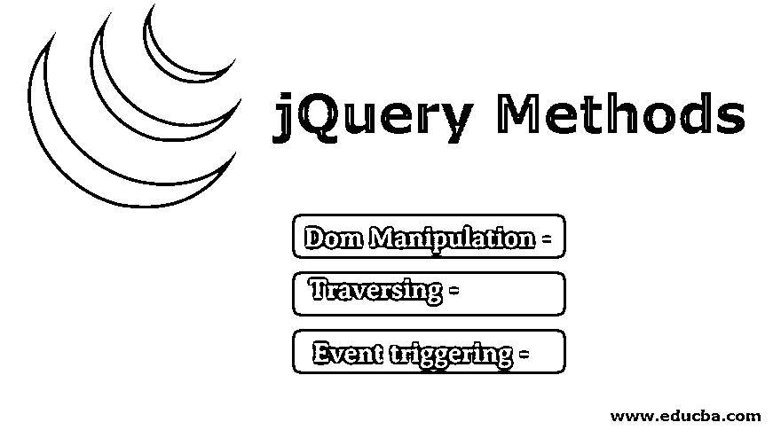

# jQuery 方法

> 原文：<https://www.educba.com/jquery-methods/>

## jQuery 方法简介

如果你对 jQuery 这个词感到惊讶，让我先给你解释一下什么是 jQuery。jQuery 是构建网站或 web 应用程序最流行的 javascript 库之一。它是专门为解决 html dom 树操作和事件处理以及 html dom 树遍历、 [css 转换](https://www.educba.com/css-transition-effects/)和 [css 动画](https://www.educba.com/css-animation-transition/)而设计的，支持处理 ajax。它也是开源的，在 gnu 许可下是免费的。在这个主题中，我们将学习 jQuery 方法。

jQuery 非常容易学习，因为它简化了 javascript 编程。JQuery 与 css3 兼容，具有跨浏览器兼容性，并且轻量级占用空间非常小。简而言之，我们可以说 jQuery 改变了过去用 javascript 编写冗长代码的开发人员的道路。jQuery 为 dom 操作、横向 m、事件处理或事件触发、属性操作、维度操作、css 操作和动画提供了不同的方法。

<small>网页开发、编程语言、软件测试&其他</small>

### jQuery 方法的类型

在这里，我们将学习下面给出的不同类型的 jQuery 方法

#### 1) Dom 操作

不管我们使用这些方法做什么，最终都是为了改变 dom 事件。换句话说，我们可以说使用这些方法我们在操纵 dom。一些 dom 操作 jQuery 方法有:

*   **addClass():** 在匹配的元素集合中，将指定的一个或多个类添加到每个元素中。
*   **after():** 在匹配的元素集合中，在每个元素标签后插入参数指定的数据或内容。
*   **append():** 简而言之，我们可以说使用这种方法我们将数据或内容插入到特定的元素中。
*   **attr():** 这个方法给出了特定元素的属性值。
*   **before():** 使用这种方法，我们可以在每个指定的元素之前插入任何数据或内容。
*   **clone():** 使用这种方法，我们深度复制源元素。
*   使用这个方法我们改变了指定元素的 css。
*   使用这种方法，我们只需从 dom 树中删除指定的元素。
*   **hasClass():** 使用这种方法，我们可以找到附加到特定元素的指定类。
*   **empty():** 这个方法删除附加到特定元素 dom 树的所有子节点。
*   **height():** 该方法给出指定元素的高度值。
*   **offset():** 该方法设置指定元素相对于文档的坐标。
*   **position():** 该方法获取指定元素相对于其父元素的当前位置。
*   **prop():** 这个方法给出当前选中元素属性的值。
*   **replaceAll():** 这个方法用指定的元素替换所有的目标元素。
*   **text():** 该方法设置或获取指定元素的文本字符串值。
*   **Val():** 这个方法给出第一个指定元素的当前值。
*   **width():** 该方法给出指定元素的计算宽度值。
*   **wrap():** 该方法将特定的 html 结构包装在指定元素集中的每个元素周围。
*   **wrapInner():** 这个方法将 html 结构包装在每个指定元素的内容周围。

#### 2)穿越

这个方法帮助我们按照父子层次结构从一个 dom 元素导航到其他 dom 元素。一些遍历方法有:

*   **add():** 该方法创建一个新的 [jQuery](https://www.educba.com/what-is-jquery/) 对象，并将其添加到指定的元素中。
*   **addBack():** 该方法将一个 jQuery 前一组元素添加到当前堆栈元素中。
*   **children():** 这些方法查找每个指定元素的子元素。
*   **closest():** 该方法查找首先与选择器匹配的元素。
*   **contents():** 该方法查找指定元素的内容，包括注释节点和文本。
*   **each():** 这个方法迭代通过一个循环，这意味着这个方法将被应用到所有与它相关的指定元素。
*   **end():** 该方法结束最近的过滤任务，将其匹配的元素返回到之前的状态。
*   **eq():** 这个方法将指定元素的集合减少到指定索引处的一个。
*   **filter():** 这个方法根据我们给出的过滤器给出指定的元素。
*   **first():** 这个方法根据您给定的选择器给出指定的元素。
*   **has():** 该方法给出指定元素或选择器的集合。
*   **map():** 该方法基于传递给每个元素的函数返回 jQuery 对象的新值。
*   **next():** 该方法立即给出特定选定元素的下一个兄弟元素。
*   **parent():** 这个方法给出了指定元素的父元素选择。
*   **prev():** 这个方法给出当前指定元素的上一个兄弟元素。

#### 3)事件触发

使用这种方法，我们注册了 dom 操作中的更改，这些更改将在与浏览器交互时生效。一些事件处理 jQuery 方法有:

*   **bind():** 这个方法将一个事件处理附加到指定的元素上。
*   **blur():** 这个方法将一个 blur javascript 事件绑定到指定的元素。
*   **change():** 该事件将指定的元素与 change javascript 元素绑定。
*   **click():** 该方法将 click javascript 事件绑定到指定的元素。
*   **delegate():** 这个方法将一个或多个事件附加到元素的指定集合中。
*   **die():** 这个方法移除附加到指定元素集合的任何类型的 javascript 事件处理。
*   **error():** 这个方法将一个错误事件处理附加到元素的指定集合中。
*   **focus():** 这些方法将焦点事件处理绑定到元素的指定集合。
*   **hover():** 这个方法将一个悬停事件处理绑定到元素的指定集合。

嗯，我试图在日常开发过程中尽可能多地使用 jQuery 方法。除了这些，还有很多方法需要研究。jQuery 方法每天都有一些发展。所以每次 jQuery 发布它的版本时，都会包含几个新的 jQuery 方法。

### 推荐文章

这是 jQuery 方法指南。这里我们详细讨论了不同类型的 jQuery 方法，比如 Dom 操作、遍历和事件触发方法。您也可以阅读以下文章，了解更多信息——

1.  [jQuery querySelector](https://www.educba.com/jquery-queryselector/)
2.  [jQuery delegate( )](https://www.educba.com/jquery-delegate/)
3.  [jQuery wrap()](https://www.educba.com/jquery-wrap/)
4.  [jQuery keydown()](https://www.educba.com/jquery-keydown/)

