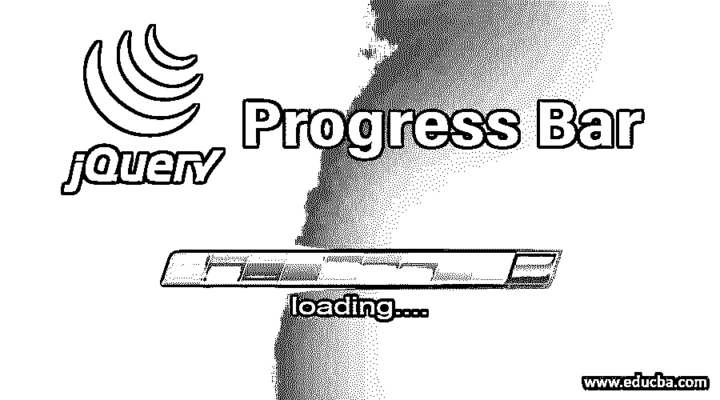
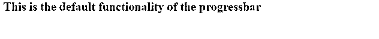
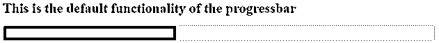
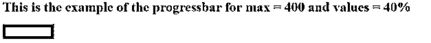
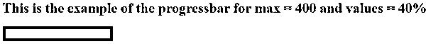
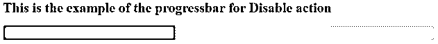
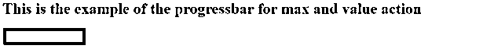
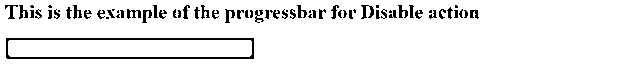
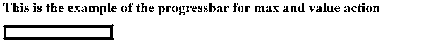
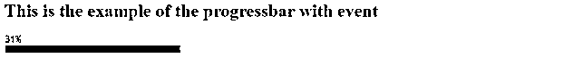

# JQuery 进度条

> 原文：<https://www.educba.com/jquery-progress-bar/>




## JQuery 进度条简介

jQuery 进度条是一个专门针对 JQuery 的用户界面特性，用于指示流程的状态或完成程度。jQuery 进度条有两种形式，即“确定的进度条”和“不确定的进度条”，可以通过使用三个不同的参数选项(如 disabled、max 和值)来实现。jQuery 进度条中执行的一些操作是启用、禁用、销毁、选项、选项(option)、选项(options)、值、选项(option，value) & widget，对应的事件是创建(event，ui)、完成(event，ui)和更改(event，ui)。

我们可以把进度条展示成两种形式，比如“确定进度条”和“不确定进度条”。

<small>网页开发、编程语言、软件测试&其他</small>

1.  **确定进度条-** 确定进度条我们在一个场景中使用，在这个场景中我们可以显示任务的确切进度或状态。例如，文件数量、发送数据副本的百分比、文件下载的百分比等。因为确定的进度条可以以表格数字百分比显示进度，比如 54%，或者从左到右填充表格的线条。
2.  **不确定进度条-** 不确定进度条我们用在任务的确切进度或状态未知或无法确定的场景中。例如，当连接服务器的请求进行时，我们不能确定进度。

### progressbar()方法的语法

progressbar()方法可以两种形式使用

*   $(元素，续)。progressbar(选项)方法
*   $(元素，续)。progressbar("action "，params)方法

我们可以应用$ (element，cont)我们需要管理进度的元素，我们可以应用$(element，cont)。progressbar(opt)方法在 html 元素上以进度条的形式进行管理。而 option 是一个参数，用于传递不同的值来指定进度条的行为和显示方式。例如$( "#elementid ")。progressbar({ value : 30 })，其中 value 是一个选项，30 是为 value 选项提供的值。

类似地，我们不仅可以传递一个选项，还可以传递多个选项，每个选项用逗号分隔，如下所示

```
$( selector, context).progressbar({option1: value1, option2: value2..... });
```

我们可以传递给进度条的不同选项如下所示

*   **disabled—**disabled 选项，如果设置为 true，则禁用进度条，false 是 disabled 的默认值。
*   **max–**max 选项设置进度条的最大值。最大值的默认值是 100。
*   **value—**用于设置进度条初始值的 value 选项。value 的默认值为 0。

### JQuery 进度条示例

progressbar()方法的默认功能是

接下来，让我们从进度条上的一些例子开始理解它的功能。首先，我们编写一些示例来查看进度条的默认功能，而不向 progress bar()方法传递任何参数。由于进度条是 ui jQuery 的一个元素，所以第一步是通过指定< script >元素的 src 属性来包含 jQuery 外部文件。

#### 示例#1

```
<!doctype html>
<head>
<meta charset = "utf-8">
<title> My first jQuery UI Progress Bar example program </title>
<script src = "https://code.jquery.com/jquery-1.10.2.js"></script>
<script src = "https://code.jquery.com/ui/1.10.4/jquery-ui.js"></script>
<link href = " https://code.jquery.com/ui/1.10.4/themes/ui-lightness/jquery-ui.css"
rel = "stylesheet">
<style>
.ui {
background: blue;
border: 2px solid #DDDDDD;
color: #333333;
font-weight: bold;
}
</style>
<script>
$(function() {
$( "#pbid" ).progressbar({
});
});
</script>
</head>
<body>
<h1> This is the default functionality of the progressbar </h1>
<div id = "pbid"> </div>
</body>
</html>
```

**输出—**




接下来，我们使用 value 选项并传递它 40，这表示进度栏中的进度为 40%,如下面的代码所示

#### 实施例 2

```
<!doctype html>
<head>
<meta charset = "utf-8">
<title> My first jQuery UI Progress Bar example program </title>
<script src = "https://code.jquery.com/jquery-1.10.2.js"></script>
<script src = "https://code.jquery.com/ui/1.10.4/jquery-ui.js"></script>
<link href = " https://code.jquery.com/ui/1.10.4/themes/ui-lightness/jquery-ui.css"
rel = "stylesheet">
<style>
.ui {
background: blue;
border: 2px solid #DDDDDD;
color: #333333;
font-weight: bold;
}
</style>
<script>
$(function() {
$( "#pbid" ).progressbar({ value : 40
});
});
</script>
</head>
<body>
<h1> This is the default functionality of the progressbar </h1>
<div id = "pbid"> </div>
</body>
</html>
```

**输出—**




接下来，我们在 JqueryUI 的 progressbar 方法中将 max 和 value 选项分别设置为 400 和 40%值。

#### 实施例 3

```
<!doctype html>
<head>
<title> My first jQuery UI Progress Bar example program </title>
<script src = "https://code.jquery.com/jquery-1.10.2.js"></script>
<link href = " https://code.jquery.com/ui/1.10.4/themes/ui-lightness/jquery-ui.css"
rel = "stylesheet">
<script src = "https://code.jquery.com/ui/1.10.4/jquery-ui.js"></script>
</style>
<script>
$(function() {
$( "#pbid" ).progressbar({
value: 40,
max:400
});
var pb = $( "#pbid" );
function progress() {
var v = pb.progressbar( "value" ) || 0;
pb.progressbar( "value", v + 1 );
if ( v < 99 ) {
setTimeout( progress, 100 );
}
}
setTimeout( progress, 4000 );
});
</script>
<style>
.ui{
background: blue;
color: #333333;
border: 2px solid #DDDDDD;
font-weight: bold;
}
</style>
</head>
<body>
<h1> This is the example of the progressbar for max = 400 and values = 40% </h1>
<div id = "pbid"></div>
</body>
</html>
```

**输出—**




进度条从左到右开始填充，到达 400 时停止。如果没有为最大值选项提供值，则填充仅在右端停止。




我们可以应用$ (element，cont)我们需要管理进度的元素，我们可以应用$(element，cont)。html 元素上的 progressbar("action "，params)方法来管理和执行进度条上的操作。以进度条的形式。该操作是一个参数，在第一个参数中指定为字符串。例如$( "#elementid ")。progressbar('disable ')，这里的 disable 选项禁用进度条。

可以传递的一些动作，以$(element，cont)为单位。progressbar("action "，params)方法如下所示

*   **destroy–**用于完全移除元素的进度条功能并返回元素的预初始化状态的销毁操作。这是一个零参数方法。
*   **disable–**disable 动作禁用元素的进度条功能。这是一个零参数方法。
*   **enable—**enable 动作启用元素的进度条功能。这是一个零参数方法。
*   **选项(option)–**用于从指定元素获取值的选项(option)操作。它接受一个参数选项，这是一个字符串。
*   **option–**options 操作用于获取进度条选项，该选项采用键:值对的形式。这是一个零参数方法。
*   **option( option，value)–**option(option，value)动作用于设置与指定选项相关的进度条选项值。
*   **选项(options)–**选项(options)动作用于设置进度条的一个或多个选项。它接受一个参数选项，这是选项-值对的映射。
*   **value—**用于获取期权价值的价值动作。该值指示进度条中的填充百分比。
*   **值(value)–**值(value)动作用于为进度条中要填充的百分比设置新值。它接受一个数字参数值。
*   **widget—**用于获取应用了进度条的元素的 widget 动作。这是一个零参数方法。

接下来，我们看到一些上面提到的动作进度条的例子。让我们看看下面的 progressbar()方法与 disable()和 option( optionName，value)动作的程序。

#### 实施例 4

```
<!doctype html>
<html lang = "en">
<head>
<meta charset = "utf-8">
<title> My first jQuery UI Progress Bar example program </title>
<link href = "https://code.jquery.com/ui/1.10.4/themes/ui-lightness/jquery-ui.css"
rel = "stylesheet">
<script src = "https://code.jquery.com/jquery-1.10.2.js"></script>
<script src = "https://code.jquery.com/ui/1.10.4/jquery-ui.js"></script>
<script>
$(function() {
$( "#pbid1" ).progressbar({
value: 40
});
$( "#pbid1" ).progressbar('disable');
$( "#pbid2" ).progressbar({
value: 40
});
var pb = $( "#pbid2" );
$( "#pbid2" ).progressbar( "option", "max", 400 );
function progress() {
var v = pb.progressbar( "value" ) || 0;
pb.progressbar( "value", v + 1 );
if ( v < 99 ) {
setTimeout( progress, 100 );
}
}
setTimeout( progress, 400 );
});
</script>
<style>
.ui {
background: blue;
border: 1px solid #DDDDDD;
font-weight: bold;
color: #333333;
}
</style>
</head>
<body>
<h1> This is the example of the progressbar for Disable action </h1>
<div id = "pbid1"></div><br>
<h1> This is the example of the progressbar for max and value action </h1>
<div id = "pbid2"></div>
</body>
</html>
```

**输出—**







上面的进度条被禁用；这就是为什么它不显示进度，下面的进度条设置了一些值的最大值和值选项，所以进度以填充的形式从左到右显示。







**进度条元素管理事件—**

除此之外，进度条也可以由事件来管理。jQuery UI 提供了一个事件方法；特定事件会触发该事件。下面列出了一些可用于管理进度条的事件

*   **change(event，ui)–**每当进度条值改变或进度改变时，该事件被触发。
*   **complete(event，ui)–**当进度到达终点或达到最大值时，生成该事件。
*   **create(event，ui)–**每当创建一个进度条时，这个事件就会被触发。

接下来，写一些上面事件动作的例子。下面的示例演示进度栏功能期间事件方法的用法。这个例子演示了使用事件来改变和完成。

#### 实施例 5

```
<!doctype html>
<html lang = "en">
<head>
<meta charset = "utf-8">
<title> My first jQuery UI Progress Bar example program </title>
<link href = "https://code.jquery.com/ui/1.10.4/themes/ui-lightness/jquery-ui.css"
rel = "stylesheet">
<script src = "https://code.jquery.com/jquery-1.10.2.js"></script>
<script src = "https://code.jquery.com/ui/1.10.4/jquery-ui.js"></script>
<script>
$(function() {
pl = $( ".pbc" );
var pb = $( "#pbid" );
$( "#pbid" ).progressbar({
value: false,
change: function() {
pl.text(
pb.progressbar( "value" ) + "%" );
},
complete: function() {
pl.text( "Loading Completed!" );
}
});
function progress() {
var v = pb.progressbar( "value" ) || 0;
pb.progressbar( "value", v + 1 );
if ( v < 99 ) {
setTimeout( progress, 100 );
}
}
setTimeout( progress, 3000 );
});
</script>
<style>
.ui-widget-header {
background: blue;
border: 2px solid #DDDDDD;
color: #333333;
font-weight: bold;
}
.progress-label {
position: absolute;
top: 13px;
left: 50%;
font-weight: bold;
text-shadow: 1px 1px 0 #fff;
}
</style>
</head>
<body>
<h1> This is the example of the progressbar with event </h1>
<div id = "pbid">
<div class = "pbc">
Loading...
</div>
</div>
</body>
</html>
```

上述程序的输出按照如下所示的执行顺序





进度条从左到右开始填充，并在到达终点时停止。


### 结论

1.进度条是一个 jQueryUI 元素。

2.进度条用于以百分比显示任务或流程的完成状态。

3.progressbar()方法可以两种形式使用

*   $(元素，续)。progressbar(选项)方法
*   $(元素，续)。progressbar( "action "，params)方法

4.我们可以传递给 progressbar()方法的不同选项有

有缺陷的

*   最大
*   价值

5.可以传递的一些动作，以$( element，cont)为单位。progressbar( "action "，params)方法是-

*   破坏
*   使残废
*   使能够
*   选择权
*   选项(选项，值)
*   选项(选项)
*   价值
*   价值(值)
*   小部件

6.可用于管理进度条的事件如下所示

*   完成(事件，用户界面)
*   创建(事件，用户界面)
*   更改(事件，用户界面)

### 推荐文章

这是一个 JQuery 进度条的指南。在这里，我们讨论 JQuery 进度条方法和例子的语法和输出。您也可以看看以下文章，了解更多信息–

1.  [jQuery 属性](https://www.educba.com/jquery-attributes/)
2.  [jQuery Ajax 方法](https://www.educba.com/jquery-ajax-methods/)
3.  [jQuery 效果](https://www.educba.com/jquery-effects/)
4.  [jQuery 备选方案](https://www.educba.com/jquery-alternatives/)


