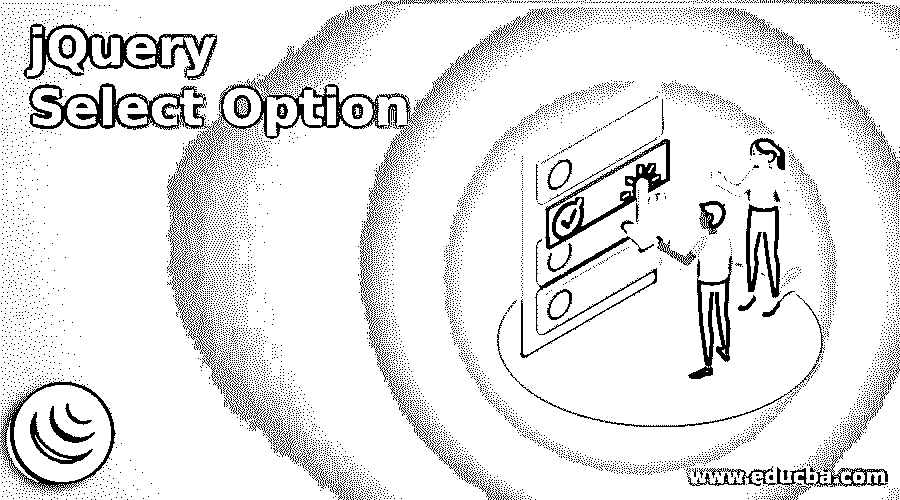
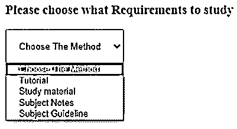
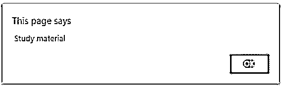
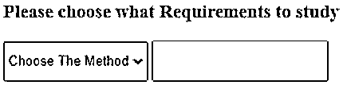
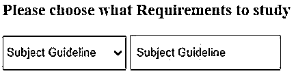

# jQuery 选择选项

> 原文：<https://www.educba.com/jquery-select-option/>




## jQuery 选择选项简介

jQuery Select 选项用于控制用户输入信息的多个属性和内容。这是一个特殊的属性，通常在下拉列表中使用。它有助于用户参考输入的信息或内容。它根据用户要求控制和修改多项选择信息。多用于网站或 web 应用的表单标签。

### jQuery 选择选项的语法

基本的 select 标记和 option 标记语法如下:

<small>网页开发、编程语言、软件测试&其他</small>

```
<select id = "IdName">
<option value = "values"> content </option>
<option value = "values"> content </option>
</select>
```

*   html 页面正文内部使用的 select 标记和 option 标记。
*   option 标记总是放在 select 标记的内部。

脚本标记中的 jQuery select 选项语法如下:

```
$("selector  option: selected");
```

jQuery select 选项用于显示选项标记中的选定内容。

带有 jQuery select 选项

文本语法如下:

```
var variableValue =  $("selector  option: selected").text();
```

*   “option: selected”属性用于选择选项标记中的特定内容。
*   选择器是 select 标记的 id 名称(#IdName)。

网页中使用的基本语法如下。

```
<head>
<script >
$(document).ready(function() {
$("#optionselect").change(function(){
Var value =  $(“# optionselect option: selected”);
alert(value.text());
});
});
</script>
</head>
<body>
<select id = "optionselect">
<option value = "1"> content </option>
<option value = "2"> content </option>
</select>
</body>
```

**说明:**

*   用变量放置在脚本标签中。
*   选择器 id 选择特定选项，并将其显示在警报窗口上。

### jQuery Select 选项是如何工作的？

下面给出了工作原理:

#### 第一步

*   在网页中添加 jQuery 有两种方法。
*   第一种方法是从 jQuery.com 的相应网站下载 jQuery 文件。
*   该文件放在 html 文件的 head 部分中。

```
<script src = "path/jquery-3.5.1.min.js">
</script>
```

*   第二种方法是将 jQuery CDN 文件包含在 html 文件的头部分。

```
<head>
<script src = "https://ajax.googleapis.com/ajax/libs/jquery/3.5.1/jquery.min.js">
</script>
</head>
```

#### 第二步

*   select 标记和 option 标记放在网页的 body 部分。
*   select 标签用于在网页上创建多个选项列表。
*   option 标记用于在网页上创建多个列表元素及其值。
*   value 属性放在 option 标记中，用于维护列表中的唯一元素。

```
<select id = "optionselect">
<option value = "" selected disable> choose the value </option>
<option value = "1"> Tutorial </option>
<option value = "2"> Study material </option>
<option value = "3"> Subject Notes </option>
<option value = "4"> Subject Guidline </option>
</select>
```

#### 第三步

*   它的语法用在网页上。
*   选项:用脚本标签中的选择器放置选定的属性。
*   text()方法与语法一起使用来显示选择值。

```
$(document) .ready(function() {
$("#optionselect").change(function(){
var values=$("#optionselect option:selected");
alert(values.text());
});
});
```

*   以下示例是所有步骤的组合:

```
<!DOCTYPE html>
<html>
<head>
<script src = “https://ajax.googleapis.com/ajax/libs/jquery/3.5.1/jquery.min.js”>
</script>
</head>
<body>
<select id = "optionselect">
<option value = "" selected disable> choose the value </option>
<option value = "1"> Tutorial </option>
<option value = "2"> Study material </option>
<option value = "3"> Subject Notes </option>
<option value = "4"> Subject Guidline </option>
</select>
<script>
$(document) .ready(function() {
$("#optionselect").change(function(){
var values=$("#optionselect option:selected");
alert(values.text());
});
});
</script>
</body>
</html>
```

### 例子

下面是提到的例子:

#### 示例#1

下面是警报消息示例和输出。

**代码:**

```
<!DOCTYPE html>
<html>
<head>
<script src= "https://ajax.googleapis.com/ajax/libs/jquery/3.5.1/jquery.min.js"> </script>
<script>
$(document).ready(function(){
$("#optionselect").change(function(){
var values = $("#optionselect option:selected");
alert(values.text());
});
});
</script>
<style>
#optionselect{
height: 50px;
padding: 15px;
}
</style>
</head>
<body>
<h3> Please choose what Requirements to study </h3>
<select id = "optionselect">
<option value = " " selected disable> Choose The Method </option>
<option value = "1"> Tutorial </option>
<option value = "2"> Study material </option>
<option value = "3"> Subject Notes </option>
<option value = "4"> Subject Guideline </option>
</select>
</body>
</html>
```

**输出:**

**之前:**




**之后:**




**说明:**

*   选择选项后，将弹出包含所选选项内容的警报窗口。

#### 实施例 2

下面是使用文本方法的例子和输出。

**代码:**

```
<!DOCTYPE html>
<html>
<head>
<script src = "https://ajax.googleapis.com/ajax/libs/jquery/3.5.1/jquery.min.js">
</script>
<script>
$(document).ready(function(){
$("#optionselect").change(function(){
var values=$("#optionselect option:selected").text();
$("#selectedcontent").val(values);
});
});
</script>
<style>
#optionselect{
height: 40px;
}
#selectedcontent{
height: 35px;
}
</style>
</head>
<body>
<h3> Please choose what Requirements to study </h3>
<select id = "optionselect">
<option value = "" selected disable> Choose The Method  </option>
<option value = "1"> Tutorial </option>
<option value = "2"> Study material </option>
<option value = "3"> Subject Notes </option>
<option value = "4"> Subject Guideline </option>
</select>
<input type="text" readonly = "readonly" id = "selectedcontent" />
</body>
</html>
```

**输出:**

**之前:**




**之后:**




**说明:**

*   脚本标记中使用了 With text 方法语法。
*   选择该选项后，所选内容将显示在另一个文本框中。

### 结论

它用于用户输入信息，以减少内容大小和空间。它有助于一次选择和控制多个内容选项。它是用户友好的，易于理解 web 应用程序中的事件。

### 推荐文章

这是一个 jQuery 选择选项的指南。在这里，我们讨论 jQuery Select 选项的介绍，它是如何工作的，以及相应的例子。您也可以看看以下文章，了解更多信息–

1.  [jQuery switchClass()](https://www.educba.com/jquery-switchclass/)
2.  [jQuery 滑块](https://www.educba.com/jquery-slider/)
3.  [jQuery UI 按钮](https://www.educba.com/jquery-ui-button/)
4.  [jQuery draggable()](https://www.educba.com/jquery-draggable/)


