# jquery queryselector 查询选取器

> 原文：<https://www.educba.com/jquery-queryselector/>


## 什么是 jQuery querySelector？

jQuery querySelector 用于从 HTML 文档中选择特定的文档对象模型(DOM)元素，使用 HTML 元素，如名称、id、属性、类型、属性值、类等。这个选择活动是在 querySelector()方法的帮助下执行的，该方法用于获取返回值，作为 CSS 选择器文档中标识的第一个值。这个函数用于执行多种操作，在程序员中广为人知，因为它处理时间更快，javascript 代码更小更简单，也更容易编写。

### querySelector 简介

querySelector()方法只返回与文档中指定的 CSS 选择器匹配的第一个元素。如果文档中的 ID 被多次使用，那么它将返回第一个匹配的元素。

<small>网页开发、编程语言、软件测试&其他</small>

### 查询选择器的语法

下面是 querySelector 的语法:

```
querySelector(CSS selectors)
```

*   它返回与指定选择器匹配的第一个元素。
*   为了返回所有匹配的元素，我们使用 querySelectorAll()方法。
*   我们传递的 CSS 选择器应该是字符串类型的。
*   必须通过 CSS 选择器。
*   我们传递的字符串必须是有效的 CSS 选择器。
*   如果传递的字符串无效，则抛出 SYNTAX_ERRexception。
*   如果没有找到匹配，它将返回 null。
*   第一个元素的匹配是使用文档的深度优先的前序遍历来完成的。
*   指定一个或多个 CSS 选择器来匹配元素。
*   对于多个选择器，用逗号分隔。
*   不属于标准 CSS 语法的字符必须使用反斜杠字符进行转义。

### querySelector()方法的示例

以下是 querySelector()方法的示例:

在 jQuery 中，您可以使用元素的各种属性来选择页面中的元素，这些属性包括类型、类、ID、属性、属性值等。下面是使用类型的 Jquery 示例。

#### 示例# 1–按类型选择

1.下面的查询选择器包含两个 **<** 一个 **>**

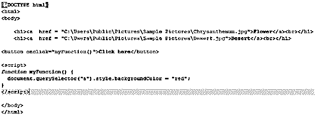


**对上面代码的解释:**在这个例子中，我们可以看到我们使用了两个锚标记，并且在锚标记内部传递了两个图像的超链接。通过使用 query selector(" a ")style . background color = " red "；我们已经将锚标记(“a”)传递给了 querySelector。在 querySelector()方法中，如果我们传递多个选择器，它将返回与指定选择器匹配的第一个元素。虽然它包含两个锚标记，但找到的第一个锚标记应用了它的 style.backgroundColor = " red 仅适用于第一个锚点标记。

**输出 1:** 点击按钮前(“点击我”)。

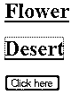


**输出 2:** 点击按钮(“点击我”)后，花的背景颜色变为“红色”。

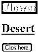


**输出 3:** 点击超链接，将打开相应的图像。

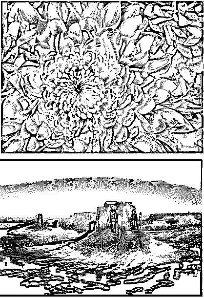


2.这个 querySelector 也包含两个

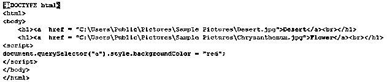


**上面代码的解释:**在这个例子中，我们还可以看到我们使用了两个锚标记，并且在锚标记中传递了两个图像的超链接。通过使用 query selector(" a ")style . background color = " red "；我们已经将锚标记(“a”)传递给了查询选择器。这一次，在 querySelector()中，它将首先找到“Desert”超链接，因为我们更改了序列。虽然它包含两个锚标记，但找到的第一个锚标记应用了它的 style.backgroundColor = " red 仅适用于第一个锚点标记。

**输出 1:** 在输出中，我们可以观察到第一幅图像是沙漠。所以因为 querySelector()方法，沙漠背景色变成了红色。


**输出 2:** 点击超链接，沙漠图像将被打开。

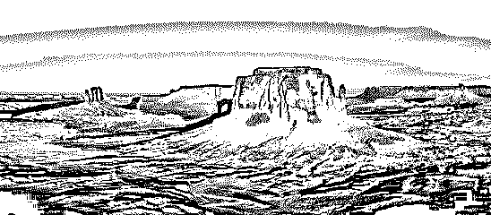


**输出 3:** 点击花朵的超链接，花朵图像将被打开。

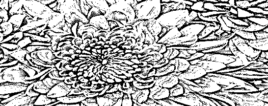


#### 示例 2–按类别选择

在下面的例子中，我们使用类名进行选择。

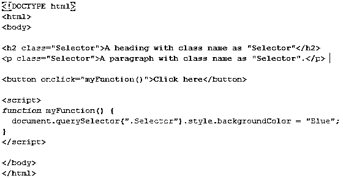


**上面代码的解释:**在上面的例子中，我们使用的是类名，这里的类名是 Selector。h2(标题标签)和段落标签使用相同的类名。对于 querySelector()方法，我们传递类名，它将检查程序中的特定类名。现在，它已经找到了那些与上面提到的类名相同的标签。通过使用文档的深度优先的前序遍历，完成第一个元素的匹配。示例中包含类名作为选择器的第一个元素是 h2(标题标签)。querySelector()方法获取 h2 标记，并通过 style.backgroundColor 将特定的背景颜色应用于 h2 标记。

**输出 1:** 在点击按钮(“点击我”)之前，h2 标签内容不会将背景颜色更改为蓝色。

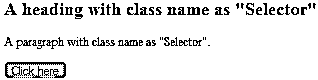


**输出 2:** 点击按钮(“click me”)后，h2 标签内容的背景色变为蓝色。

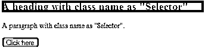


#### 示例# 3–按 ID 选择

在下面的例子中，我们使用 id 进行选择。

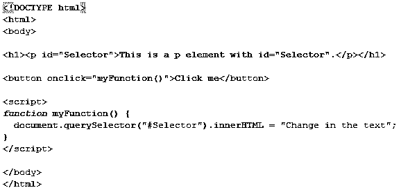


**上面代码的解释:**在例子中，我们使用 id 进行选择，这里的 id 是 Selector。对于 querySelector()方法，我们传递 id，它将检查程序中的特定 id 名称。现在它已经找到了与上面提到的 id 名称相同的标签。通过使用文档的深度优先的前序遍历，完成第一个元素的匹配。示例中包含 id 名称作为选择器的元素是段落标记。querySelector()方法获取段落标记，并根据上面提到的代码将特定的更改应用于内容。

**输出 1:** 在点击按钮“click me”之前，段落标签内容会是“这是一个 id =“selector”的 p 元素”。

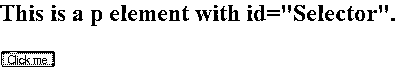


**输出 2:** 点击“点击我”按钮后，段落标签内容将变为“在文本中更改”。

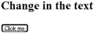


### jQuery 查询选择器的使用

以下两点解释了 querySelector 的用法:

*   jQuery 的[代码比标准的 JavaScript 代码更精确、更短、更简单。它可以执行多种功能。](https://www.educba.com/jquery-elements/)
*   对 querySelector()的调用在选择第一个元素时返回第一个元素，因此编写起来更快也更短。

### 推荐文章

这是 jQuery querySelector 的指南。这里我们讨论什么是 jQuery querySelector，querySelector 的介绍，语法以及使用 type 的 jQuery 的例子。您也可以浏览我们的其他相关文章，了解更多信息——

1.  [jQuery 事件](https://www.educba.com/jquery-events/)
2.  [JQuery 的用途](https://www.educba.com/uses-of-jquery/)
3.  [jQuery 方法](https://www.educba.com/jquery-methods/)
4.  [安装 Jquery](https://www.educba.com/install-jquery/)


