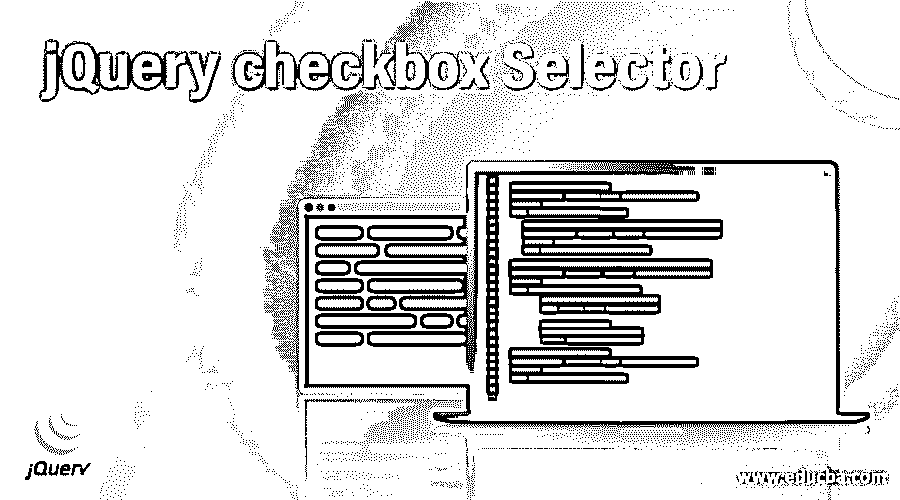
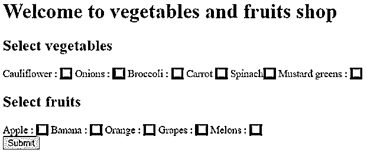
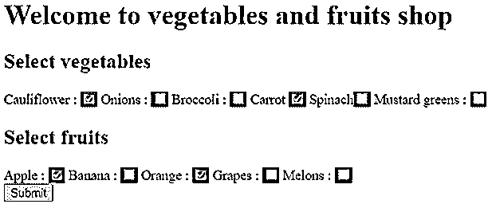
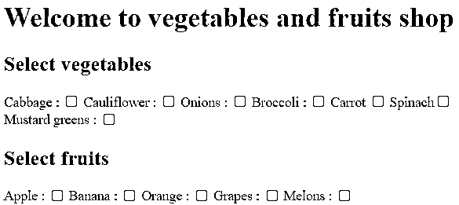
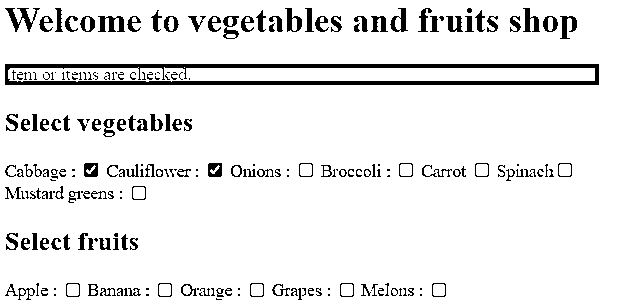
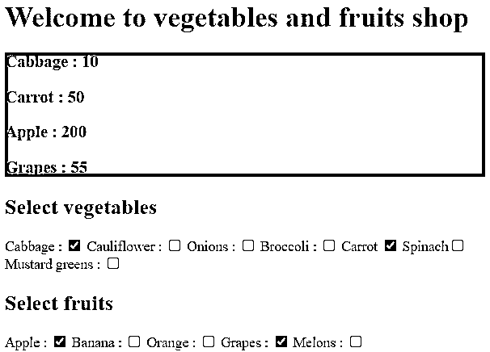

# jQuery 复选框选择器

> 原文：<https://www.educba.com/jquery-checkbox-selector/>




## jQuery 复选框选择器简介

jQuery UI 复选框选择器用于选择复选框类型的元素。jQuery UI 复选框选择器是一种内置类型的选项，用于 jQuery UI 库中的输入。jQuery UI 复选框类型选择器允许选择文档中复选框类型的所有复选框元素。用于允许用户选择一个或多个选项的复选框类型。ctrl 按钮也可用于选择多个元素。

请注意，checkbox 不能像原生 DOM querySelectorAll()方法那样提供良好的性能，因为 checkbox 是 jQuery 的扩展，不是 CSS 规范的一部分。

<small>网页开发、编程语言、软件测试&其他</small>

**语法:**

```
$(":checkbox") – it is uses to selects input elements of type checkbox.
```

### jQuery UI 复选框选择器示例

接下来，我们编写 html 代码，以便更清楚地理解下面的示例，其中复选框选择器类型用于将 html 输入元素视为复选框选择器元素，我们用一些样式包装复选框选择器，如下所示

#### 示例#1

**代码:**

```
<!doctype html>
<html lang ="en">
<head>
<meta charset="utf-8">
<title>This is an example for jQuery UI checkbox selector </title>
<script src="https://code.jquery.com/jquery-3.5.0.js"></script>
<script>
$(document).ready(function(){
$(":checkbox").wrap("");
});
</script>
</head>
<body>
<h1> Welcome to vegetables and fruits shop </h1>
<form action="">
<h2> Select vegetables </h2
Cabbage : <input type ="checkbox" name ="vegetables" value ="v1">
Cauliflower : <input type ="checkbox" name ="vegetables" value ="v2">
Onions : <input type ="checkbox" name ="vegetables" value ="v3">
Broccoli : <input type ="checkbox" name ="vegetables" value ="v4">
Carrot <input type ="checkbox" name ="vegetables" value ="v5">
Spinach<input type ="checkbox" name ="vegetables" value ="v6">
Mustard greens : <input type ="checkbox" name ="vegetables" value ="v7">
<h2> Select fruits </h2>
Apple : <input type ="checkbox" name ="fruits" value ="f1">
Banana : <input type ="checkbox" name ="fruits" value ="f2">
Orange : <input type ="checkbox" name ="fruits" value ="f3">
Grapes :<input type ="checkbox" name ="fruits" value ="f4">
Melons : <input type ="checkbox" name ="fruits" value ="f5"><br>
<input type ="submit" value ="Submit"><br>
</form>
</body>
</html>
```

**输出:**




一旦我们选择了复选框的项目，输出是:




在上面的程序中，通过使用 input 元素并通过将 checkbox 的 type 属性定义为“type ="checkbox " "，为蔬菜和水果项目创建了复选框，因此现在用户可以通过选择复选框来选择任何蔬菜和水果。

接下来，我们重写上面的 html 代码以理解 jQuerycheckbox 选择器类型，其中复选框选择器用于输入元素，这里我们使用 jQuery prop()方法来跟踪和检查当前的复选框状态，如下所示

#### 实施例 2

**代码:**

```
<!doctype html>
<html lang ="en">
<head>
<meta charset="utf-8">
<title>This is an example for jQuery UI checkbox selector </title>
<script src="https://code.jquery.com/jquery-3.5.0.js"></script>
<script>
$(document).ready(function(){
$('input[type="checkbox"]').click(function(){
if($(this).prop("checked") == true){
$("#sel").html("Item or items are checked.");
}
else if($(this).prop("checked") == false){
$("#sel").html("Item or items are unchecked.");
}
});
});
</script>
</head>
<body>
<h1> Welcome to vegetables and fruits shop </h1>
<div id="sel" style="background: red;"></div>
<h2> Select vegetables </h2>
Cabbage : <input type ="checkbox" name ="vegetables" value ="v1">
Cauliflower : <input type ="checkbox" name ="vegetables" value ="v2">
Onions : <input type ="checkbox" name ="vegetables" value ="v3">
Broccoli : <input type ="checkbox" name ="vegetables" value ="v4">
Carrot <input type ="checkbox" name ="vegetables" value ="v5">
Spinach<input type ="checkbox" name ="vegetables" value ="v6">
Mustard greens : <input type ="checkbox" name ="vegetables" value ="v7">
<h2> Select fruits </h2>
Apple : <input type ="checkbox" name ="fruits" value ="f1">
Banana : <input type ="checkbox" name ="fruits" value ="f2">
Orange : <input type ="checkbox" name ="fruits" value ="f3">
Grapes :<input type ="checkbox" name ="fruits" value ="f4">
Melons : <input type ="checkbox" name ="fruits" value ="f5"><br><br>
</body>
</html>
```

**输出:**




一旦我们选择或取消选择复选框的项目，消息将显示为-




与上面的程序一样，复选框是为蔬菜和水果项创建的，并且使用了 prop()方法，这使得跟踪当前复选框状态变得非常容易。因此，如果我们选择任何复选框，它将显示一条消息“项目或项目被选中。”如果取消选择任何复选框，它将显示“一个或多个项目未选中。”消息。

接下来，我们编写 html 代码来理解 jQuery 复选框选择器，其中复选框类型在 input 元素中使用，我们通过显示消息来确认操作是否被选中，如下所示

#### 实施例 3

**代码:**

```
<!doctype html>
<html lang ="en">
<head>
<meta charset="utf-8">
<title>This is an example for jQuery UI checkbox selector </title>
<script src="https://code.jquery.com/jquery-3.5.0.js"></script>
<script>
$(document).ready(function(){
$('input[type=checkbox]:checked').each(function () {
var status = (this.checked ? $(this).val() : "");
var name = $(this).attr("name");
$('#sel').append("<h3>" + name + " : " + status + "</h3>");
});
});
</script>
</head>
<body>
<h1> Welcome to vegetables and fruits shop </h1>
<div id="sel" style="background: red;"></div>
<h2> Select vegetables </h2>
Cabbage : <input type ="checkbox" name ="Cabbage" value ="10" checked="checked">
Cauliflower : <input type ="checkbox" name ="Cauliflower" value ="20">
Onions : <input type ="checkbox" name ="Onions" value ="25">
Broccoli : <input type ="checkbox" name ="Broccoli" value ="30">
Carrot <input type ="checkbox" name ="Carrot" value ="50" checked="checked">
Spinach<input type ="checkbox" name ="Spinach" value ="10">
Mustard greens : <input type ="checkbox" name ="Mustard greens" value ="40">
<h2> Select fruits </h2>
Apple : <input type ="checkbox" name ="Apple" value ="200" checked="checked">
Banana : <input type ="checkbox" name ="Banana" value ="30">
Orange : <input type ="checkbox" name ="Orange" value ="50">
Grapes :<input type ="checkbox" name ="Grapes" value ="55" checked="checked">
Melons : <input type ="checkbox" name ="Melon" value ="25"><br><br>
</body>
</html>
```

**输出:**




同样，在上面的程序中，为蔬菜和水果项目创建了复选框，这里选择了 checkbox 类型的所有输入元素，然后只添加那些被选中为“checked =“checked”的输入元素。

### 结论

jQuery UI 复选框选择器是 jQuery UI 库的 input 元素的内置选项。它用于选择复选框类型的元素。因此，使用复选框选择器，我们可以跟踪输入的复选框类型的状态。

### 推荐文章

这是一个 jQuery 复选框选择器的指南。在这里，我们还将讨论 jquery 复选框选择器的介绍，以及不同的示例和代码实现。您也可以看看以下文章，了解更多信息–

1.  [jQuery 可见](https://www.educba.com/jquery-is-visible/)
2.  [jQuery switchClass()](https://www.educba.com/jquery-switchclass/)
3.  [jQuery 可排序](https://www.educba.com/jquery-sortable/)
4.  [jQuery hasClass()](https://www.educba.com/jquery-hasclass/)


