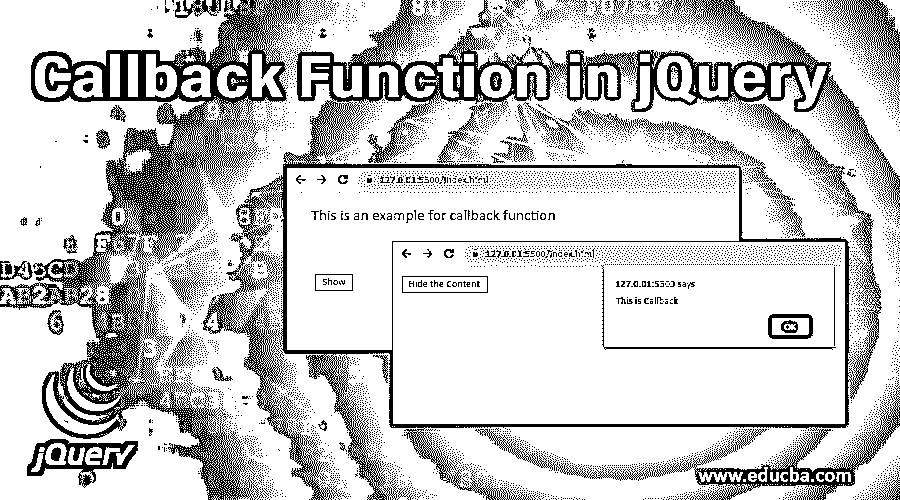
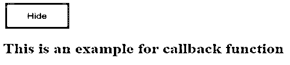
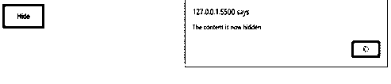
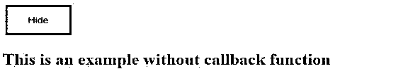
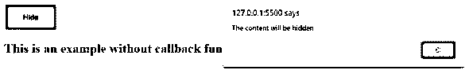
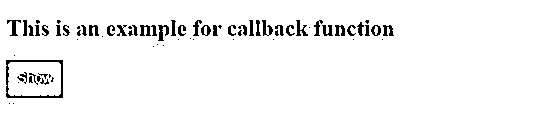
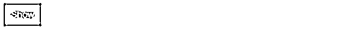

# jQuery 中的回调函数

> 原文：<https://www.educba.com/callback-function-in-jquery/>




## jQuery 中的回调函数是什么？

本文简要介绍了 jQuery 中回调函数的概念和用法。到本文结束时，我们将对回调函数以及为什么实际需要它们有一个清晰的了解。

*   回调是一个只有在当前效果完成后才会执行的函数。
*   由于 jQuery 是一个 [JavaScript 库](https://www.educba.com/what-is-javascript/)并且 JavaScript 语句是顺序执行的，有了动画，甚至在效果完成之前，下面几行代码就可能被执行。由于效果重叠，这会产生误差。
*   因此，为了防止这种情况，jQuery 需要回调函数。
*   回调在某种程度上确保了在给定的效果没有完成之前，某些代码不会执行。
*   它总是被用作函数的最后一个参数。

**语法:**

<small>网页开发、编程语言、软件测试&其他</small>

```
$(selector).hide(speed,callback);
```

**参数:**

*   **速度:**一个可选参数，使用值:“慢”、“快”或“毫秒”指定显示和隐藏的速度。
*   **callback:** 又是一个可选参数，指定 hide()或 show()方法完成后要执行的函数。

### jQuery 中回调函数的实现

jQuery 回调函数只有在正在执行的某个效果完成后才会执行。为了更好地说明 jquery 回调函数的概念，让我们考虑下面的例子:

#### 示例# 1–使用回调函数作为参数

*   在下面的示例中，回调函数作为参数传递给 hide 函数，并且仅在 hide 效果完成后执行。
*   这里的回调函数定义了在内容隐藏后显示的警告消息。

**代码:**

```
<!DOCTYPE html>
<html lang="en">
<head>
<meta charset="UTF-8" />
<meta name="viewport" content="width=device-width, initial-scale=1.0" />
<meta http-equiv="X-UA-Compatible" content="ie=edge" />
<meta charset="utf-8" />
<title>JQuery Callback Function </title>
<script src="https://code.jquery.com/jquery-1.12.4.min.js"></script>
<style>  .button {
background-color: #33B0FF;
border: none;
padding: 15px 32px;
text-align: center;
text-decoration: none;
display: inline-block;
font-size: 14px;
margin: 2px 3px;
cursor: pointer;
}
</style>
<script>
$(document).ready(function(){
$("#hide").click(function(){
$("h2").hide("fast", function(){
// alert define inside the callback
alert("The content is now hidden");
});
});
});
</script>
</head>
<body>
<button class ="button" id="hide">Hide</button>
<h2>This is an example for callback function</h2>
</body>
</html>
```

在上面的代码行中，有一个按钮，单击它将对给定的内容执行 hide()方法，并显示一条警告消息“该内容现已隐藏”。只有在内容隐藏后，警报才会显示。

**输出:**




上面是给定代码行运行时浏览器上显示的屏幕。直到这个时候，没有按钮被点击。




单击“隐藏”按钮后，浏览器上会出现上述屏幕，显示一条警告消息。人们可以注意到，只有在隐藏效果完成后，屏幕上才会弹出警告消息。这就是回调函数的工作方式。

#### 例子# 2——没有回调函数作为参数

下面的例子显示了没有回调函数作为参数时的效果。甚至在隐藏完成之前，警告框就会显示。

**代码:**

```
<!DOCTYPE html>
<html lang="en">
<head>
<meta charset="UTF-8" />
<meta name="viewport" content="width=device-width, initial-scale=1.0" />
<meta http-equiv="X-UA-Compatible" content="ie=edge" />
<meta charset="utf-8" />
<title>JQuery Callback Function </title>
<script src="https://code.jquery.com/jquery-1.12.4.min.js"></script>
<style>  .button {
background-color: #33B0FF;
border: none;
padding: 15px 32px;
text-align: center;
text-decoration: none;
display: inline-block;
font-size: 14px;
margin: 2px 3px;
cursor: pointer;
}
</style>
</style>
<script>
$(document).ready(function(){
$("#hide").click(function(){     $("h2").hide(1000);
alert("The content will be hidden");     });
});
</script>
</head>
<body>
<button class ="button" id="hide">Hide</button>
<h2>This is an example without callback function</h2>
</body>
</html>
```

**输出:**




当给定的代码行被执行时，上面的屏幕显示出来。到目前为止没有点击任何按钮。




单击“隐藏”按钮后，将显示上述屏幕。由于 function 中没有指定回调参数，所以在隐藏效果完成之前，就会显示警告消息。

**Note: **When a callback function is passed as an argument to another function, only the function definition is passed. This means we are not actually executing the function in the parameter. The callback function is not executed immediately, instead, it is called back at some specific point inside the body of containing function.

下面是另一个例子，我们使用回调函数作为参数，带有 [slideToggle()效果](https://www.educba.com/jquery-slidetoggle/)。

**代码:**

```
<!DOCTYPE html>
<html lang="en">
<head>
<meta charset="UTF-8" />
<meta name="viewport" content="width=device-width, initial-scale=1.0" />
<meta http-equiv="X-UA-Compatible" content="ie=edge" />
<meta charset="utf-8" />
<title>JQuery Callback Function</title>
<script src="https://code.jquery.com/jquery-1.12.4.min.js"></script>
<style>       button {
background: #33b0ff;
border: 1px black dashed;
font-size: 15px;
padding: 10px;
text-align: center;
color: white;
cursor: pointer;
}
</style>
<script type="text/javascript">
$(document).ready(function() {
$("button").click(function() {
$("h2").slideToggle("slow", function callback() {
$("#hide").text("Show");
// alert is defined inside the callback
alert("This is Callback");
});
});
});
</script>
</head>
<body>
<h2>This is an example for callback function</h2>
<button id="hide" type="button">Hide the Content</button>
</body>
</html>
```

**输出:**

在单击按钮之前。




点击按钮后。


一旦动画完成，回调(警报)就会被执行。




**概要:**

*   在 JavaScript 中，由于语句是逐行执行的，所以有时可能会产生错误，因为甚至在某个效果还没有完成执行之前，另一个效果就已经开始执行了。
*   为了防止这种由于效果重叠而导致的错误和意外情况，jQuery 中的回调函数应运而生。
*   它防止另一个效果被执行，直到前一个效果没有完成。
*   简单地说，回调函数创建了一个效果队列，使它们能够一个接一个地运行，而不会重叠。

### 结论

*   本文展示了回调函数在 jQuery 中的使用、它的实现以及使用它的好处。
*   这里，我们已经讨论了回调的一个小领域，还有更多。
*   JQuery 回调函数在现代 [web 应用开发](https://www.educba.com/what-is-web-application/)中广泛用于各种任务，比如异步任务的执行、事件监听/处理等。
*   这是一个可以使用的强大工具，它为 web 应用程序提供了巨大的好处。
*   应该在需要时使用。

### 推荐文章

这是 jQuery 中回调函数的指南。这里我们讨论什么是 jquery 中的回调函数，并分别给出例子和代码实现。您也可以阅读以下文章，了解更多信息——

1.  [jQuery 事件](https://www.educba.com/jquery-events/)
2.  [jQuery 效果](https://www.educba.com/jquery-effects/)
3.  [jQuery prop( )](https://www.educba.com/jquery-prop/)
4.  [jQuery prepend()](https://www.educba.com/jquery-prepend/)


