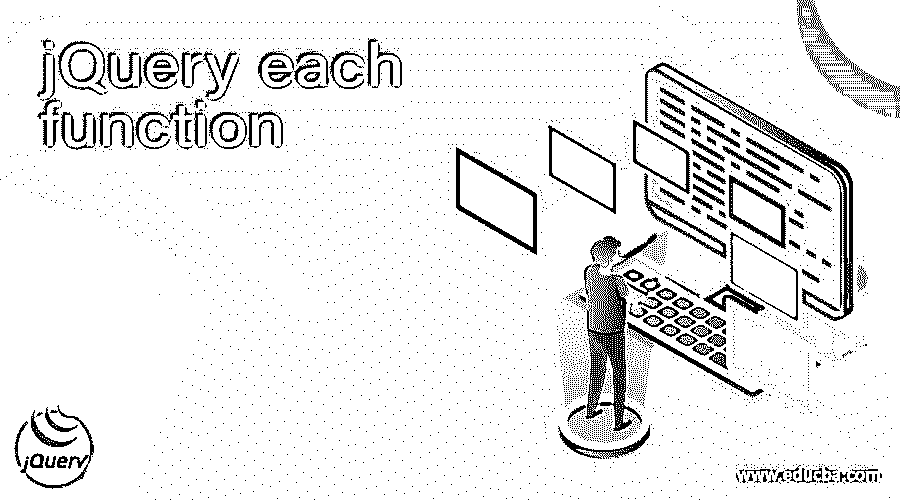
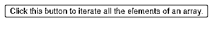
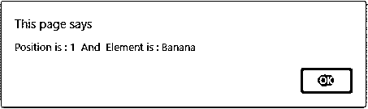
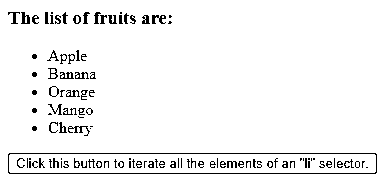
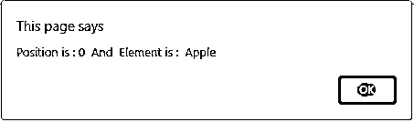
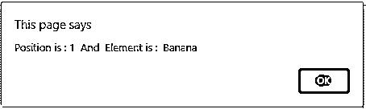
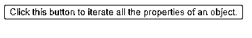
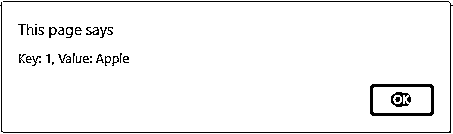
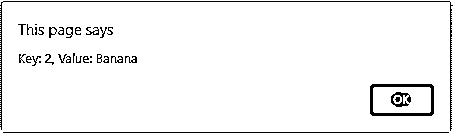

# jQuery 每个函数

> 原文：<https://www.educba.com/jquery-each-function/>




## jQuery 各函数简介

jQuery each 函数用于为每个匹配的元素运行指定的函数，迭代一个 jQuery 对象。each()函数是 jQuery 中的内置函数。每个()函数在一个数组、选择器和对象上执行，我们不需要知道有多少个元素可用。它有规律地工作，连续处理所有元素，直到它得到一个元素，使它不同于其他迭代函数。有时我们需要为数组的每个元素运行相同的函数，因此为此它提供了 each()函数。

each()函数的语法–

<small>网页开发、编程语言、软件测试&其他</small>

```
$(selector).each(function(index, element));
```

**参数—**

*   selector–这不是一个可选参数，它指定要迭代运行指定函数的元素的对象。
*   function–这不是一个可选参数，它指定为每个匹配元素运行的函数的名称。
*   index–这是一个可选参数，指定元素的索引位置。
*   element–这是一个可选参数，指定当前元素。

### jQuery each()函数的工作原理

jQuery each()函数在数组、选择器或对象上使用，为每个元素迭代运行指定的函数。选择器也可以是元素、id 或类。each()函数接受两个类似参数数组的对象和函数，其索引位置和元素位于该索引或值处。例如，我们将一个数组和函数传递给 each()函数，each()函数从索引 0 开始迭代数组的每个元素，这与任何其他语言中的 For 循环相同，并检索索引位置和当前元素以及 run 函数。

### jQuery each()函数的示例

用于迭代数组元素的 jQuery each()函数示例

接下来，我们编写 html 代码，通过下面的示例更清楚地理解 each()函数，其中 each()函数用于迭代数组元素，如下所示

#### 示例#1

**代码:**

```
<!doctype html>
<html lang = "en">
<head>
<meta charset="utf-8">
<title> This is an example for jQuery each function </title>
<script src = "https://ajax.googleapis.com/ajax/libs/jquery/3.3.1/jquery.min.js">
</script>
</head>
<script type="text/javascript">
$(document).ready(function () {
$("button").click(function() {
var fruits = [ "Apple", "Banana", "Orange", "Mango", "Cherry" ];
$( fruits ).each( function (index, element) {
alert( "Position is : "+ index + "  And  Element is : " + element);
});
});
});
</script>
</head>
<body>
<button>Click this button to iterate all the elements of an array.</button>
</body>
</html>
```

**输出:**




一旦我们点击“点击这个按钮来迭代一个数组的所有元素。”按钮输出为–


一旦我们单击“确定”按钮，输出就是




并且它将继续，直到所有五个元素都没有被打印。

在上面的程序中，创建了一个包含五个元素的数组，然后使用函数及其参数 index 和 element 对该数组调用 each()函数，each()函数开始迭代所有数组元素，alert()方法将所有元素逐个打印为输出，正如我们在输出中看到的。

迭代选择器元素的 each()函数示例

接下来，我们编写 html 代码来理解 each()函数，其中 each()函数用于迭代所有“li”选择器元素，如下所示

#### 实施例 2

**代码:**

```
<!doctype html>
<html lang = "en">
<head>
<meta charset="utf-8">
<title> This is an example for jQuery each function </title>
<script src = "https://ajax.googleapis.com/ajax/libs/jquery/3.3.1/jquery.min.js">
</script>
</head>
<script type="text/javascript">
$(document).ready(function () {
$("button").click(function() {
$( "li" ).each( function (index, element) {
alert( "Position is : "+ index + "  And  Element is : " + $(this).text());
});
});
});
</script>
</head>
<body>
<h3>The list of fruits are:</h3>
<ul>
<li> Apple </li>
<li> Banana </li>
<li> Orange </li>
<li> Mango </li>
<li> Cherry </li>
</ul>
<button>Click this button to iterate all the elements of an "li" selector.</button>
</body>
</html>
```

**输出:**




一旦我们单击“单击此按钮迭代“li”选择器的所有元素”按钮，输出是–




一旦我们单击“确定”按钮，输出就是




并且它将继续，直到所有五个元素都没有被打印。

在上面的程序中，创建了五个元素的“li”元素，然后在“li”选择器元素上调用 each()函数，函数及其参数索引和元素为“$(“Li”)。each( function (index，element)"，each()函数开始迭代所有元素，alert()方法将一个接一个地输出所有元素，正如我们在输出中看到的。

用于迭代对象属性的 jQuery each()函数示例

接下来，我们编写 html 代码来理解 jQuery each()函数，其中 each()函数用于迭代键值对中的对象属性，如下所示

#### 实施例 3

**代码:**

```
<!doctype html>
<html lang = "en">
<head>
<meta charset="utf-8">
<title> This is an example for jQuery each function </title>
<script src = "https://ajax.googleapis.com/ajax/libs/jquery/3.3.1/jquery.min.js">
</script>
</head>
<script type="text/javascript">
$(document).ready(function () {
$("button").click(function() {
$.each({ 1:'Apple', 2:'Banana', 3:'Orange', 4:'Mango', 5:'Cherry' }, function( k, v ) {
alert( "Key: " + k + ", Value: " + v );
});
});
});
</script>
</head>
<body>
<button>Click this button to iterate all the properties of an object.</button>
</body>
</html>
```

**输出:**




单击此按钮可迭代对象的所有属性。




一旦我们单击“确定”按钮，输出就是




并且它将继续，直到所有五个元素都没有被打印。

在上面的程序中，创建了一个包含五个元素的对象，然后用 function 和它的参数键和值$对该对象调用 each()函数。each({ 1:'Apple '，2:'Banana '，3:'Orange '，4:'Mango '，5:'Cherry' }，function( k，v)"，each()函数开始迭代所有元素，alert()方法一个接一个地将所有键值对打印为输出，我们可以在输出中看到。

### 结论

jQuery each 函数是 jQuery 中的内置函数，用于在 jQuery 对象上为每个匹配的元素迭代执行指定的函数。

### 推荐文章

这是一个 jQuery 每个函数的指南。在这里，我们讨论 jQuery each()函数的工作原理、示例以及代码和输出。您也可以看看以下文章，了解更多信息–

1.  [jQuery 查找子节点](https://www.educba.com/jquery-find-child/)
2.  [JQuery 模态](https://www.educba.com/jquery-modal/)
3.  [jQuery 小部件](https://www.educba.com/jquery-widgets/)
4.  [jQuery 可见](https://www.educba.com/jquery-is-visible/)


