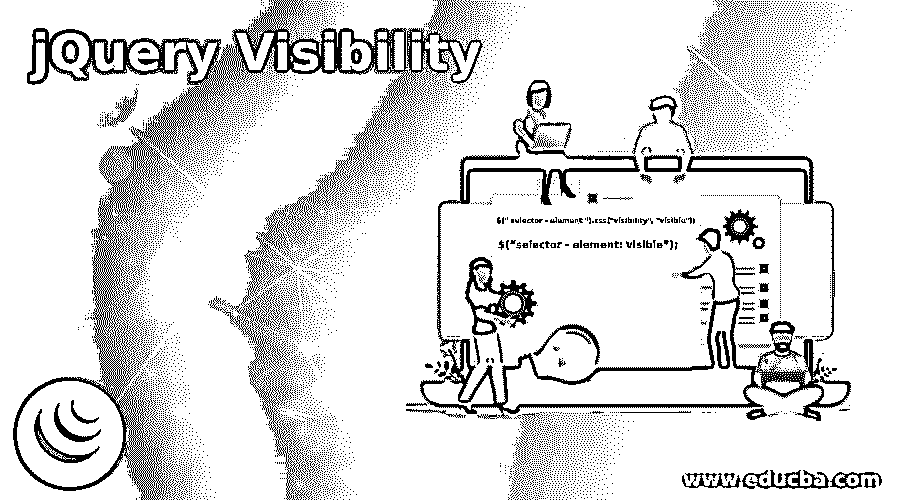

# jQuery 可见性

> 原文：<https://www.educba.com/jquery-visibility/>




## jQuery 可见性的定义

jquery 可见性是根据用户需求显示和隐藏元素的效果。Jquery 可视性允许我们制作动画 web 应用程序内容。jquery visibility 显示隐藏的元素，并且主要使用 web 应用程序中的按钮隐藏显示内容。

jquery visibility makesillustrator 效果在 web 页面上工作，并设置延迟等时间。jquery 可见性管理了大量 web 内容的 web 页面的大小和空间。Jquery 可见性是一种设计效果，有助于设计所需的可见内容。

<small>网页开发、编程语言、软件测试&其他</small>

**语法:**

*   与脚本标记放在一起的 jquery 可见性语法。
*   带有 CSS 语法的 jquery 可见性如下。该语法适用于 jquery 1.11.1 版本。

```
$(" selector - element ").css("visibility", "visible");
```

*   元素的可见性决定了元素是显示还是隐藏。
*   visibility 元素带有 visible、hidden 等方法。
*   jquery 可见性语法如下。此语法适用于设计或突出显示可见内容。

```
$("selector - element: visible");
```

*   选择器元素是 Html 标签和属性。选择器元素可以与标签的 class 或 id 放在一起。
*   根据用户要求显示元素的可视作品。

### jQuery 可见性是如何工作的？

*   隐藏内容允许我们在网页上可见，并设计可见内容。

**第一步:**在网页上添加 Jquery 有两种方法。

*   第一种方法是从 jQuery.com 的相应网站下载 jquery 文件。
*   该文件被放置在 Html 文件的头部分内。

```
<script src = "path/jquery-1.11.1.min.js">
</script>
```

*   第二种方法是将下面的 jquery CDN 文件包含在 html 文件的 head 部分。

```
<head>
<script src=
"https://ajax.googleapis.com/ajax/libs/jquery/1.11.1/jquery.min.js">
</script>
</head>
```

**第二步:**将 jquery 元素和内容放在 web 页面的 body 部分。

*   首先在网页标签上显示隐藏的样式。
*   放置在网页标记中用于选择可见性内容的类或 id。

```
<body>
<div id="visibleContent" style = "visibility:hidden">the jquery visibility is the effect to show and hide the elements as per user requirement.
</div>
<button id="submit"> Submit </button>
</body>
```

**第三步:**网页上使用的 jquery 可见性语法。

*   的(“可见性”、“可视”)；属性与脚本标记中的选择器一起放置。

```
<script>
$(function(){
$("#submit").click(function(){
$("#visibleContent").css("visibility", "visible");
});
});
</script>
```

**步骤 4:**jquery 可视性语法用于设计和突出显示可视内容。

*   ＄(" selector–element:visible ")；

属性与脚本标记中的选择器一起放置。

```
<script>
$(function(){
$("#submit").click(function(){
$("# visibleContent:visible").css("background-color", "orange");
});
});
</script>
```

*   jquery 可见性所有部分的组合如下。

```
<!DOCTYPE html>
<html>
<head>
<script src="https://ajax.googleapis.com/ajax/libs/jquery/1.11.1/jquery.min.js"></script>
</script>
<script>
$(function(){
$("#submit").click(function(){
$("#visibleContent").css("visibility", "visible");
$("#visibleContent:visible").css("background-color", "yellow");
});
});
</script>
<style>
#optionselect{
height:40px;
visibility:hidden;
}
</style>
</head>
<body>
<div id="visibleContent" style="visibility:hidden"> the jquery visibility is the effect to show and hide the elements as per user requirement.
</div><br>
<button id="submit"> Submit </button><br>
</body>
</html>
```

### jQuery 可见性的例子

下面是一些例子:

#### 示例#1

基本的 jquery 可见性示例和输出如下。

**代码:**

```
<!DOCTYPE html>
<html>
<head>
<script src="https://ajax.googleapis.com/ajax/libs/jquery/1.11.1/jquery.min.js">
</script>
<style>
.visibleContent{
height:40px;
visibility:hidden;
</style>
</head>
<body>
<h1> THE JQUERY VISIBILITY </h1>
<div class="visibleContent"> the jquery visibility is the effect to show and hide the elements as per user requirement.
Jquery visibility allows us to make animated web application content.
The jquery visibility is showing the hidden element and hides the display content mostly using a button in the web application.
The jquery visibility has managed the size and space of the web page of a large amount of web content.
Jquery visibility is a design effect that helps to design required visible contents.
</div><br>
<button id="submit" style="margin-top:8%;"> click here </button>
<script>
$(function(){
$("#submit").click(function(){
$(".visibleContent").css("visibility", "visible");
$(" h1:visible").css("background-color", "orange");
});
});
</script>
</body>
</html>
```

**输出**

**在**之前

**T2】**


 **之后

 ****T2】**


 ****说明:**visible content 类，用于显示带有可视元素的隐藏内容。当点击提交按钮时，隐藏的内容显示和标题背景变成橙色。

#### 实施例 2

带有隐藏属性示例和输出的基本 jquery 可见性。

**代码:**

```
<!DOCTYPE html>
<html>
<head>
<script src="https://ajax.googleapis.com/ajax/libs/jquery/1.11.1/jquery.min.js">
</script>
<style>
.visibleContent{
height: 60px;
</style>
</head>
<body>
<h1> THE JQUERY VISIBILITY </h1>
<button id="submit" style="margin-top:1%;"> click here </button>
<div class="visibleContent"> the jquery visibility is the effect to show and hide the elements as per user requirement.Jquery visibility allows us to make animated web application content.
The jquery visibility is showing the hidden element and hides the display content mostly using a button in the web application.
The jquery visibility has managed the size and space of the web page of a large amount of web content.
Jquery visibility is a design effect that helps to design required visible contents.
</div><br>
<script>
$(function(){
$("#submit").click(function(){
$(".visibleContent").css("visibility", "hidden");
$(" h1:visible").css("background-color", "aqua");
});
});
</script>
</body>
</html>
```

**输出:**

**在**之前

**T2】**


 **之后

 ****T2】**


 ****说明:**点击提交按钮，可见内容被隐藏。当提交按钮点击，然后可见的内容是标题改变背景颜色。提交按钮同时完成内容的可见性和设计。

#### 实施例 3

下面是带有表单显示示例和输出的 jquery 可见性。

**代码:**

```
<!DOCTYPE html>
<html>
<head>
<script src="https://ajax.googleapis.com/ajax/libs/jquery/1.11.1/jquery.min.js">
</script>
<style>
form{
height:40px;
visibility:hidden;
}
</style>
</head>
<body>
<h1> THE JQUERY VISIBILITY </h1>
<input type="submit" value="click here to Register" id="click" style="margin-top: 1%">
<div class="visibleContent">
<form>
<h3>Register form here</h3>
UserId:<input type="text"><br><br>
Phone   :<input type="number"><br><br>
Address:<input type="text"><br><br>
<input type="submit" value="Register">
</form><br>
</div>
<script>
$(function(){
$("#click").click(function(){
$("form").css("visibility", "visible");
$(" h1:visible").css("background-color", "lightgreen");
});
});
</script>
</body>
</html>
```

**输出:**

**在**之前


之后

 ****T2】**


 ****说明:**当用户点击按钮时，注册表单显示设计。这个例子展示了使用 jquery 可见性在 jquery 中节省空间和修改元素大小的便利性。

### 结论

*   jquery 可视性正在一个动画 web 应用程序上工作。
*   Jquery 的可见性使得 web 应用程序具有吸引力、节省空间并且易于使用。
*   jquery 的可见性允许 web 应用程序内容按照用户的选择显示。

### 推荐文章

这是 jQuery 可见性的指南。在这里，我们还将讨论 jquery 可见性的定义和工作原理。以及不同的示例及其代码实现。您也可以看看以下文章，了解更多信息–

1.  [jQuery 宽度](https://www.educba.com/jquery-width/)
2.  [jQuery UI 可选](https://www.educba.com/jquery-ui-selectable/)
3.  [jQuery off](https://www.educba.com/jquery-off/)
4.  [jQuery UI 可删除](https://www.educba.com/jquery-ui-droppable/)


****************