# Jquery IF 语句

> 原文：<https://www.educba.com/jquery-if-statement/>

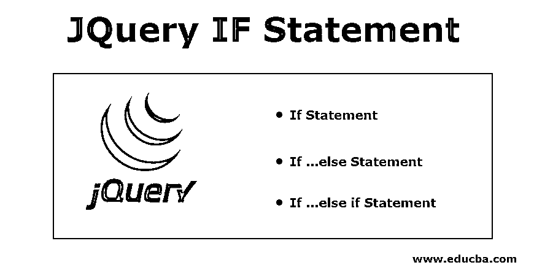


## Jquery IF 语句简介

JQuery 是一种 javascript 库特性，通常用于执行大量操作，作为 javascript 常规功能的补充。它没有自己的 if 或任何其他条件循环语句，因此它使用 javascript 语句。可以在 jQuery 脚本中使用的条件循环是“if”语句，“if..“else”语句，以及“if..“else if”语句。这些语句中的每一个都可以基于它们的传统原则进行操作，以及常用的关系操作符，如、=、<=, > =、！=，等等。以及逻辑运算符，如 AND (&&)、OR(||)和 NOT(！).

### Jquery IF 语句的语法

下面是一个语法:

<small>网页开发、编程语言、软件测试&其他</small>

#### 1.如果语句

if 语句允许你做出一些决定。它计算括号()内的条件。

**If 语句的语法为**

```
if (condition)
statement;
```

如果条件为真，则执行该语句，如果条件为假，则不执行该语句。我们可以在 If 语句中使用不同的关系运算符。

**关系运算符:** 

1.  < =小于或等于

3.  >大于
4.  > =大于或等于
5.  ==相等
6.  !=不相等

多个关系表达式可以用[逻辑运算符](https://www.educba.com/matlab-logical-operators/)组合在一起。

**逻辑运算符:** 

*   **逻辑 OR ( || ) :** (条件 1) ||(条件 2)如果条件 1 或条件 2 为真，则返回真
*   **逻辑与(& & ):** 【条件 1】&&【条件 2】如果条件 1 和条件 2 为真，则返回真
*   **逻辑不(！)**:！(条件)如果条件为真，则返回 false；如果条件为假，则返回 true。

if 后面的多个语句可以放在花括号({})中进行分组。

#### 2.If …else 语句

if 语句可能有一个可选的 else 块。

**if…else 语句的语法是**

```
if (condition)
statement;
else
statement;
```

如果条件为真，则执行第一条语句，如果条件为假，则执行第二条语句。

#### 3.If …else if 语句

只有当几个表达式中的条件为真时，它才计算内容。

**if…else if 语句的语法**

```
if(condition1){
//content to be evaluated if condition1 is true
}
else if(condition2){
//content to be evaluated if condition2 is true
}
else if(condition3){
//content to be evaluated if condition3 is true
}
else{
//content to be evaluated if no condition is true
}
```

在 if-else…if 块中可以有任意数量的 if-else…if 语句。在 if-else 中，if 语句只执行满足该块中条件的语句，而忽略其余的块。如果不满足任何条件，则执行 else 块中的语句。

### jQuery IF 语句的示例

下面是 Jquery IF 语句的例子

#### 1.如果语句

if 语句的示例:

*   在本例中，我们包含了一个输入分数的提示屏幕。

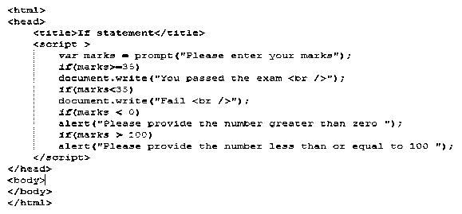


**输出:**

*   在提示屏幕中，我们可以输入标记。
*   输入标记后，它将检查在 if 条件下我们是否正在检查条件(标记> = 35)。

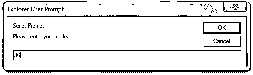


*   上述提示屏幕中提供的标记大于 35，第一个条件变为真。所以它显示输出为“你通过了考试”。

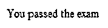


*   以下提示屏幕中提供的分数小于 35，第二个条件变为真。

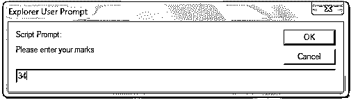


*   它会将输出显示为“失败”。

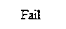


*   如果提示屏幕中提供的标记是负值，则第三个条件变为真。

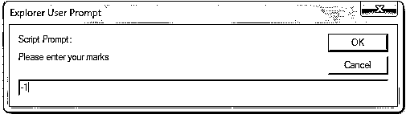


*   它将输出显示为“请提供大于零的数字”。

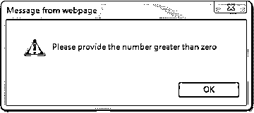


*   提示屏幕中提供的标记大于 100，则第四个条件变为真。

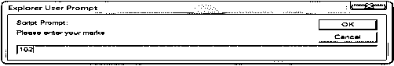


*   它将输出显示为“请提供小于或等于 100 的数字”。

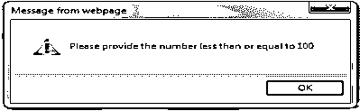


#### 2.If …else 语句

if…else 语句示例:

*   在本例中，我们包含了一个输入数字的提示屏幕。

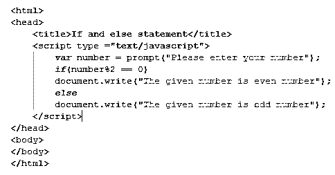


**输出:**

*   在提示屏幕中，我们必须提供一个数字。
*   输入数字后，它将检查 if 条件。在 if 条件中，我们检查条件(数字%2 == 0)。

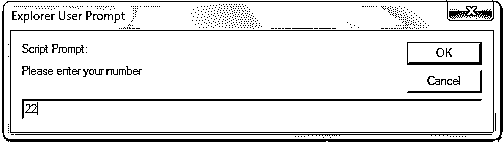


*   上述提示屏幕中提供的数字可被 2 整除，并且余数为零，如果条件为真。它会将输出显示为“给定的数是偶数”。

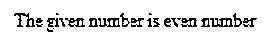


*   下面提示屏幕中提供的数字不能被 2 整除，并提供非零余数，然后它进入 else 块并执行 else 块中的语句。

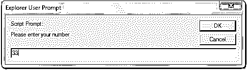


*   它会将输出显示为“给定的数是奇数”。

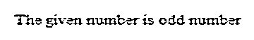


#### 3.If …else if 语句

if…else if 语句示例:

*   在本例中，我们可以看到我们包含了一条提示和警报消息。

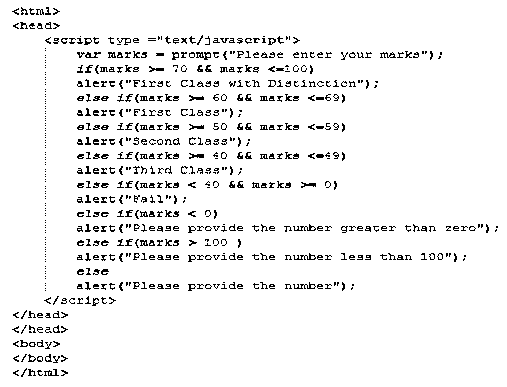


**输出:**

*   在提示屏幕中，我们可以输入标记。
*   输入标记后，它将检查 if 条件。在 if 条件中，它将检查条件(标记> =70 &&标记< =100)。
*   以下提示屏幕中提供的分数大于 70，条件为真。

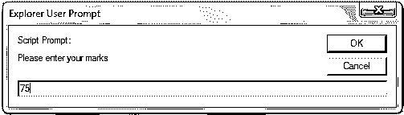


*   它将显示警告信息为“一等品”。

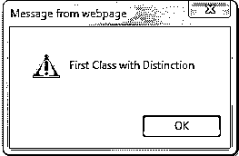


*   再次执行程序，输入标记，它将检查 if 条件。在 if 条件中，它将检查条件(标记> =70 &&标记< =100)。
*   在下面的提示屏幕中提供的标记是 65。如果条件变为假，它进入 else if 块，它将检查 else if 条件(标记> =60 &&标记< =69)。
*   当提示中提供的标记位于 60 和 69 之间时，条件变为真。

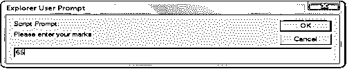


*   它将显示警告信息为“头等舱”。

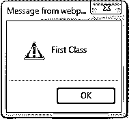


*   在下面的提示屏幕中提供的标记是 55，如果条件和第一个 else if 条件变为假，因此它进入下一个 else if 块，它将检查 else if 条件(标记> =50 &&标记< =59)。
*   当提示中提供的标记位于 50 和 59 之间时，条件变为真。

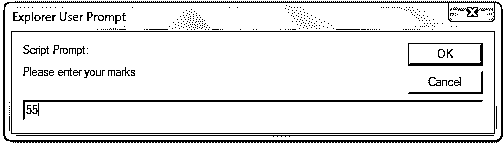


*   它将显示警告信息为“二等”。

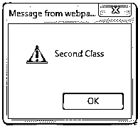


*   重复相同的过程，当条件变为真时，它显示特定的警报消息。
*   因为提示中提供的标记位于 40 和 49 之间，第三个否则条件为真。

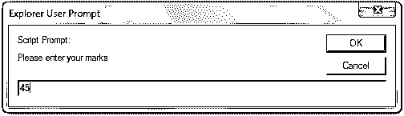


*   它将显示警告信息为“第三类”。

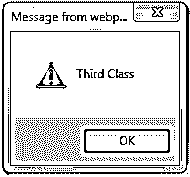


*   因为下面提示中提供的标记位于 0 和 40 之间，第四个否则条件为真。

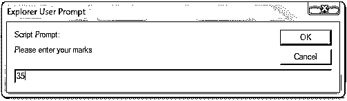


*   它将显示警告信息“失败”。

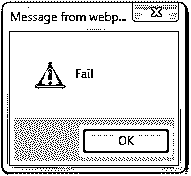


*   如果用户输入的分数小于零，那么如果条件为真，则输入第五。

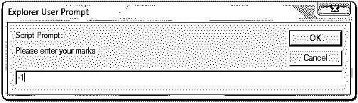


*   它将显示警告消息“请提供大于零的数字”。

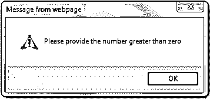


*   如果用户输入大于 100 的分数，那么如果条件为真，则为第六。

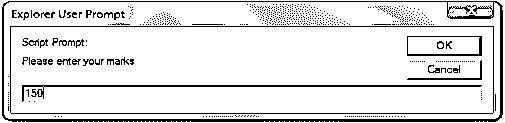


*   它将显示警告消息“请提供小于 100 的数字”。

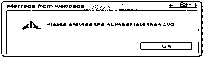


*   如果用户没有输入任何数字，那么将执行 else 块。

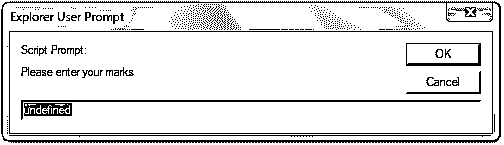


*   它将显示警告消息“请提供号码”。

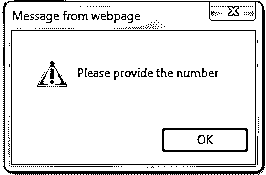


### 结论

这些是 JavaScript 中使用的条件语句，因为 JQuery 没有单独的条件语句。

### 推荐文章

这是一个 Jquery IF 语句的指南。这里我们讨论 Jquery IF 语句的语法和例子，以及输出和截图。您也可以看看以下文章，了解更多信息–

1.  [什么是 jQuery？](https://www.educba.com/what-is-jquery/)
2.  [Python 中的 If Else 语句](https://www.educba.com/if-else-statement-in-python/)
3.  [JQuery 中选择器的类型](https://www.educba.com/types-of-selector-in-jquery/)
4.  [jQuery querySelector](https://www.educba.com/jquery-queryselector/)


