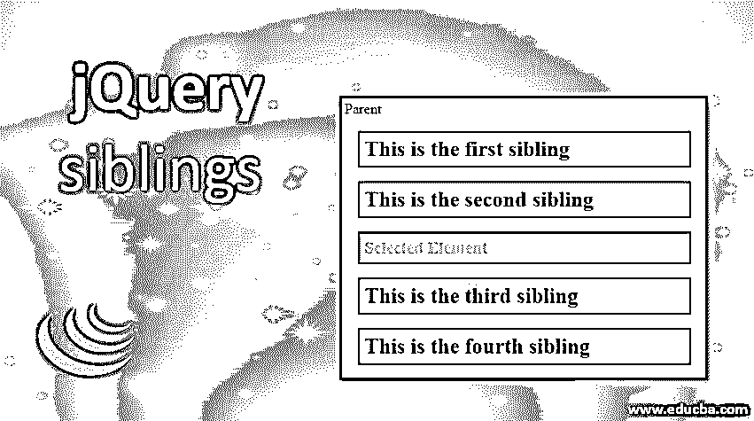
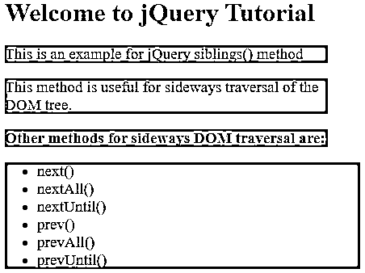
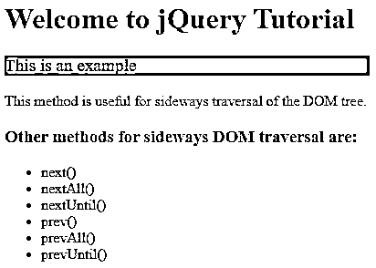
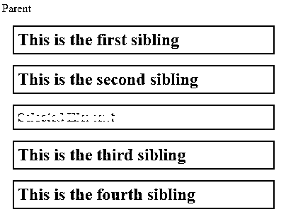

# jQuery 兄弟

> 原文：<https://www.educba.com/jquery-siblings/>




## jQuery 同级简介()

siblings()是一个内置的 jQuery 遍历方法，用于获取所选 HTML 元素的所有兄弟元素，兄弟元素是指具有相同父元素的元素。jQuery 为 DOM 遍历提供了多种方法，siblings 是在 DOM 树中提供这种横向遍历功能的 JQuery 方法之一。还有其他几种方法用于 DOM 树的横向遍历:

*   下一个()
*   nextAll()
*   nextUntil()
*   上一页()
*   prevAll()
*   prevUntil()

与 next()和 prev()不同，siblings()方法横向遍历，即沿着 DOM 树的兄弟向前和向后。在对一组元素执行类似的任务时，这种方法被证明是非常有用和方便的。

<small>网页开发、编程语言、软件测试&其他</small>

**语法:**

```
$(selector).siblings(filter[])
```

在哪里，

*   选择器引用选定的元素。
*   filter 是一个可选参数，它通过过滤掉所选元素的同级来缩小同级搜索的范围。

### 实现 **jQuery siblings()方法**的例子

让我们看几个例子来理解如何使用 siblings()方法来获取所选元素的兄弟元素。

#### 示例#1

示例演示了 jQuery siblings()方法的实现，其中没有向该方法传递过滤器参数。

**代码:**

```
<!DOCTYPE html>
<html lang="en">
<head>
<meta charset="utf-8" />
<title>Getting all the siblings of an element in jQuery without using a parameter</title>
</style>
<script src="https://code.jquery.com/jquery-1.12.4.min.js"></script>
<script>
$(document).ready(function() {
$("p")
.siblings()
.addClass("selected");
});
</script>
<style>
.selected {
background:lightseagreen;
font-size: larger;
width: 400px;
}
</style>
</head>
<body>
<h1>Welcome to jQuery Tutorial </h1>
<div>
<p >This is an example for jQuery siblings() method</p>
<p>This method is useful for sideways traversal of the DOM tree.</p>
<h3>Other methods for sideways DOM traversal are: </h3>
<ul>
<li>next()</li>
<li>nextAll()</li>
<li>nextUntil()</li>
<li>prev()</li>
<li>prevAll()</li>
<li>prevUntil()</li>
</ul>
</div>
</body>
</html>
```

**输出:**

*   在本例中，siblings()方法返回选定元素“p”的所有同级元素，然后将 CSS 样式类“selected”添加到返回的同级元素中。
*   由于所选元素“p”具有与其父元素类似的“div ”,因此它返回所有共享相同父元素“div”的元素，如下面的屏幕截图所示。




#### 实施例 2

该示例说明了将过滤器参数传递给 siblings()方法时 jQuery siblings()方法的实现。

**代码:**

```
<!DOCTYPE html>
<html lang="en">
<head>
<meta charset="utf-8" />
<title>Getting all the siblings of an element in jQuery using a parameter</title>
</style>
<script src="https://code.jquery.com/jquery-1.12.4.min.js"></script>
<script>
$(document).ready(function() {
$("p")
.siblings(".filtered")
.addClass("selected");
});
</script>
<style>
.selected {
background:lightseagreen;
font-size: larger;
width: 400px;
}
</style>
</head>
<body>
<div>
<h1>Welcome to jQuery Tutorial </h1>
<p class = "filtered">This is an example
<p>This method is useful for sideways traversal of the DOM tree.</p>
<h3>Other methods for sideways DOM traversal are: </h3>
<ul>
<li>next()</li>
<li>nextAll()</li>
<li>nextUntil()</li>
<li>prev()</li>
<li>prevAll()</li>
<li>prevUntil()</li>
</ul>
</div>
</body>
</html>
```

**输出:**

*   在本例中，我们传递了一个过滤器参数。过滤"到同级()
*   使用参数是完全可选的，但这有助于缩小对兄弟元素的搜索范围。
*   这个例子将只选择和返回那些有 CSS 样式类的“p”元素的兄弟。已过滤”应用于它们。
*   siblings()方法以 jQuery 对象的形式返回搜索结果，然后对其应用 addClass("selected ")方法，该方法更改返回的 jQuery 对象的格式，如下面的屏幕截图所示。




#### 实施例 3

让我们再考虑一个例子，其中没有过滤器参数被传递给 siblings()方法。

**代码:**

```
<!DOCTYPE html>
<html>
<head>
<title>Example for jQuery siblings() method</title>
<script src="https://code.jquery.com/jquery-1.12.4.min.js"></script>
<script>
$(document).ready(function() {
$("h3.selected")
.siblings()
.css({ color: "Green", border: "2px solid red" });
});
</script>
<style>
.sib * {
display: block;
border: 2px solid black;
color: lightblue;
padding: 5px;
margin: 15px;
}
</style>
</head>
<body>
<div style="width:400px;" class="sib">
Parent
<h2>This is the first sibling</h2>
<h2>This is the second sibling</li>
<h3 class="selected">Selected Element</h3>
<h2>This is the third sibling</h2>
<h2>This is the fourth sibling</h2>
</div>
</body>
</html>
```

**输出:**

*   在此示例中，siblings()方法应用于 jQuery 对象，包括 CSS 样式类名为“selected”的“h3”元素，并返回新的 jQuery 对象。
*   这里，因为我们没有向 siblings()方法传递任何参数，所以它返回 jQuery 对象中元素的所有兄弟元素，如下面的屏幕截图所示。




*   对于表示元素的 DOM 树的给定 jQuery 对象，siblings()方法允许您在 DOM 树中搜索这些元素的兄弟元素。
*   找到匹配的元素后，siblings()方法从所有匹配的兄弟元素中构造并返回一个新的 jQuery 对象。
*   在上面的例子中，我们试图找到类名为“selected”的元素“h3”的兄弟元素。
*   因为我们没有为 siblings()方法提供任何过滤参数，所以所有的兄弟元素都是新 jQuery 对象的一部分。
*   如果有筛选参数，那么只会返回匹配的元素。

**Note**: The original element for which we are finding the sibling elements are not included among the siblings.

### 结论

*   jQuery siblings()方法是 jQuery 提供的遍历方法之一，用于横向遍历 HTML 元素的 DOM 树。
*   此方法的基本目的是查找并返回选定元素的同级元素。
*   兄弟元素指的是那些共享相同父元素的元素。
*   您还可以通过向方法传递一个筛选器参数来缩小对同级的搜索范围

### 推荐文章

这是 jQuery 兄弟的指南。在这里，我们讨论 jQuery 兄弟的简要概述及其示例和代码实现。您也可以浏览我们推荐的其他文章，了解更多信息——

1.  [jQuery mouseenter()](https://www.educba.com/jquery-mouseenter/)
2.  [jQuery toggle()](https://www.educba.com/jquery-toggle/)
3.  [jQuery empty()](https://www.educba.com/jquery-empty/)
4.  [jQuery insertAfter()](https://www.educba.com/jquery-insertafter/)


