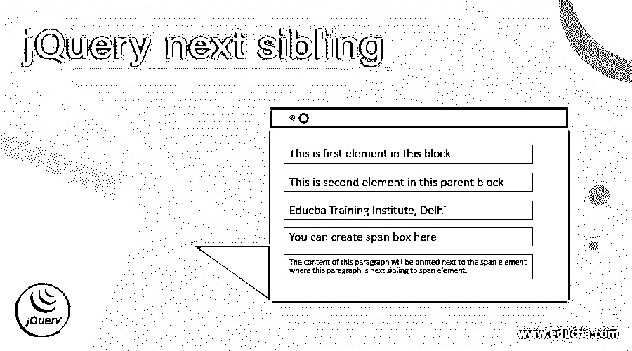
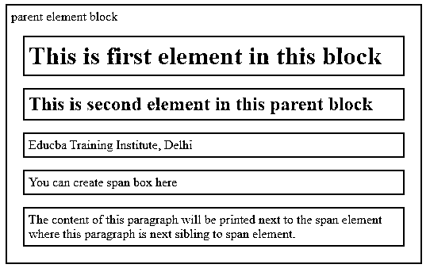

# jQuery 下一个兄弟

> 原文：<https://www.educba.com/jquery-next-sibling/>




## jQuery 下一个兄弟介绍

在 JQuery 中，next 是一个内置函数，用于获取当前所选元素的下一个元素或兄弟元素，其中下一个元素是从作为父元素的元素中提取的。一般来说，我们可以将 JQuery next() sibling 方法定义为内置的 JQuery 函数，以返回所选元素的下一个兄弟元素，这些元素在 Dom(文档对象模型)树中具有相同的父元素，因此该函数主要被视为用于访问给定 DOM 树中具有父元素和子元素的元素的方法。

**语法:**

<small>网页开发、编程语言、软件测试&其他</small>

```
$(selector_element).next();
```

在上面的语法中，next()兄弟方法不接受任何参数，这意味着它接受用于指定选择器表达式的可选参数，这可以进一步帮助简化对下一个元素的搜索。这个 next()兄弟函数返回所选元素的 DOM 树中同一父元素的下一个兄弟元素。

### JQuery 中 next()兄弟的使用示例

在 JQuery 中，兄弟元素是在 DOM 树中具有相同父元素的元素。因此，为了访问 Dom 树中的元素或通过在整个 DOM 树中移动来遍历树，以找到相同给定父元素的下一个兄弟元素并找到这样的元素，JQuery 中有几种方法。在本文中，我们将讨论 JQuery 中的 next()方法。next()兄弟方法的工作原理讨论如下

首先，next()方法是 JQuery 的一个内置方法，当选择了一个元素并且在这个元素上触发了 next()方法时，它就开始遍历 DOM 树并检查当前所选元素的下一个兄弟元素。现在，让我们考虑一下在 JQuery 中演示 next()方法的例子。在 JQuery 中，元素是指任何可以被定义为父元素中的元素的 Html 标签，大多数情况下，它使用

标签来定义 Html 中的父元素或块，其他元素如标题标签(h1、h2、h3、h4、h5、h6)、段落标签(

)、跨度标签、有序和无序列表标签(

*   ) etc. can be child elements.

**例子:**

在下面的示例中，演示 JQuery 中的 next()方法，用于返回所选元素的下一个同级元素。

```
<html>
<head>
<title> The next sibling demonstration in JQuery </title>
<style>
.next * {
display: block;
border: 2px solid red;
color: blue;
padding: 5px;
margin: 15px;
}
</style>
<script src="https://ajax.googleapis.com/ajax/libs/
jquery/3.3.1/jquery.min.js"></script>
<script>
$(document).ready(function() {
$("span").next().css({
"color": "black",
"border": "2px solid black"
});
});
</script>
</head>
<body class="next">
<div>
parent element block
<h1> This is first element in this block </h1>
<h2> This is second element in this parent block </h2>
<p>Educba Training Institute, Delhi </p>
You can create span box here 
<p> The content of this paragraph will be printed next to the span element where this paragraph is next sibling to span element. </p>
</div>
</body>
</html>
```

**输出:**




在上面的例子中，我们可以看到，我们首先在样式标签中声明了类 next，它具有显示给定 Html 代码中的元素的属性。在上面的代码中，我们可以看到在父元素中定义了 5 个元素，并且这个父元素是通过使用

标签声明的，在标签中它有子元素，比如 heading 标签、paragraph 标签、span 标签、paragraph 标签。我们试图在 span 标签后显示下一个兄弟元素。因此，在上面的代码中，标签后面是段落

标签，因此最后一个段落

标签被视为指定元素(如标签)的下一个兄弟元素，这是通过触发 span 标签上的 next()来完成的，其中上面的代码是作为“$(“span”)来完成的。next()”，这有助于找到给定元素的下一个兄弟元素。 

**举例:**

现在，在下面的例子中，让我们通过使用按钮和点击事件来突出显示下一个兄弟。

```
<!DOCTYPE html>
<html>
<head>
<title> JQuery next() sibling method demonstration </title>
<style>
.main_next_class * {
display: block;
font-size: 30px;
position: relative;
border: 2px solid Purple;
color: Red;
padding: 10px;
margin: 19px;
}
</style>
<script src = "https://ajax.googleapis.com/ajax/libs/jquery/3.5.1/jquery.min.js"> </script>
<script>
function next_func(){
$(document).ready(function(){
$("h2").next().css({ "font-size": "30px", "color": "green", "border": "8px dashed yellow"});
});
}
</script>
</head>
<body class = "main_next_class">
<div id = "div1"> Parent element block
<ul> First element </ul>
<h2> Second element </h2>
<h3> Third element </h3>
<h4> Fourth element </h4>
<p> Fifth element </p>
 Six element 
</div>
<button onclick = "next_func()"> click me to view the next sibling element of h3 </button>
</body>
</html>
```

**输出:**


点击按钮后，输出将是-


在上面的例子中，我们再次在上面代码中的

标签定义的父元素中定义并声明了几个元素。那么在给定的父元素中有 6 个子元素。在上面的代码中，我们为已定义的类“main_next_class”定义了不同的属性，如字体大小、边框、颜色、填充、边距等。然后，我们定义了函数“next_func()，在该函数中，我们在第二个元素“h2”上触发 next()方法，并且下一个同级元素显示有为同级标签定义的不同 CSS 属性，因此第二个元素“

## ”的下一个同级标签是第三个元素“

### 标签”元素。在上面的输出中，我们可以看到第一个屏幕截图中显示的六个元素，定义的六个元素依次是

## 、

### 、

#### 、

和标签，在第二个屏幕截图中，我们可以看到下一个兄弟元素以黄色虚线边框显示，字体颜色为黑色，以突出显示上面给出的代码中指定的

## 元素的下一个兄弟元素。

### 结论

在本文中，我们得出结论，JQuery 提供了用于遍历 DOM 树以查找给定父元素的下一个兄弟元素的内置函数。在 JQuery 中，有不同的方法来遍历和搜索元素，比如 next()、nextall()等，用于遍历由父元素和子元素组成的树。

### 推荐文章

这是 jQuery next sibling 的指南。在这里，我们通过例子和输出来讨论 JQuery 中 next()兄弟的工作方式。您也可以阅读以下文章，了解更多信息——

1.  [jQuery 窗口](https://www.educba.com/jquery-window/)
2.  [jQuery 延期](https://www.educba.com/jquery-deferred/)
3.  [jQuery next()](https://www.educba.com/jquery-next/)
4.  [jQuery grep](https://www.educba.com/jquery-grep/)


