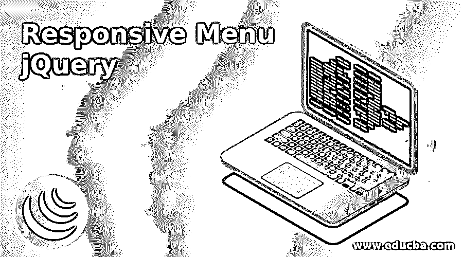
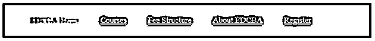
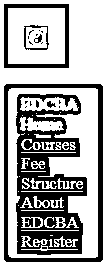
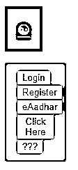
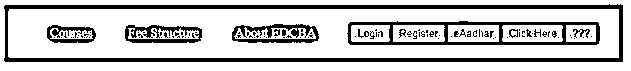
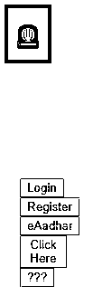

# 响应菜单 jQuery

> 原文：<https://www.educba.com/responsive-menu-jquery/>




## 响应菜单 jQuery 简介

响应式菜单会自动将常规的水平导航菜单变为响应式导航菜单。开发响应式菜单网站是当前用户需求的必然要求。人们可以从任何地方访问网站，也可以通过手机、电脑、笔记本等不同的设备访问。对于初学者来说，从头开始设计或开发响应式网站变得非常困难。因此，Web 开发人员提出了不同的技术 HTML5、CSS 3、bootstrap 和 jQuery 等。其中，jQuery 的响应速度更快，因为它能够用更少的代码处理应用程序，并且具有预定义的库。

### “响应式菜单网站”是什么意思？

首先想到的是“响应式设计”这个词到底是什么？响应式网页设计兼容所有不同类型的设备和不同的屏幕分辨率吗？答案是肯定的。为此，我们也可以使用 jQuery 技术。

<small>网页开发、编程语言、软件测试&其他</small>

如今，由于不同的设备和不同的屏幕尺寸，对响应式网站的需求更加稳定。很难针对多种屏幕尺寸多次开发同一个网页。在那里，我们遇到了“响应式网页设计”的概念。

**jQuery 的优势**

*   多种设备和多种屏幕类型能够访问内容。
*   通过添加预定义的库，可读性更好，用户界面更美观。

### 它在 jQuery 中是如何工作的？

*   在 jQuery 中，响应菜单基于预定义的 jQuery 库和引导类工作。

**语法:**

```
<!—HTML Code-->
<div id="menuId" class="sm sm-brown">
<!—jQuery Code-->
jQuery(document).ready(function() {
jQuery('.class').click(function(temp) { //make it work click function
jQuery(this).toggleClass('class');/*toggle the menu*/
jQuery('.class').toggleClass('class');
});
});
```

**jQuery 所需的库**

以下是 jQuery 所需的库文件:

1.

```
<script src="js/jquery-1.10.1.min.js" type="text/javascript"></script>
```

2.

```
<script src="js/ace-responsive-menu.js" type="text/javascript"></script>
```

### 响应菜单 jQuery 的示例

下面给出了响应菜单 jquery 的示例:

#### 示例#1

带链接的响应菜单。

**代码:**

```
<!DOCTYPE html>
<html>
<head>
<meta charset="ISO-8859-1">
<title>Responsive Menu</title>
<link rel="stylesheet" href=" ResponsiveMenu.css">
<script
src="https://ajax.googleapis.com/ajax/libs/jquery/2.1.3/jquery.min.js"></script>
<script type="text/javascript" language="javascript">
jQuery(document).ready(function() {
jQuery('.toggle-nav').click(function(temp) { //make it work click function
jQuery(this).toggleClass('active');/*toggle the menu*/
jQuery('.menu ul').toggleClass('active');
temp.preventDefault();
});
});
</script>
<style>
.toggle-nav {
display: none;
}
@media screen and (min-width: 870px) {
.menu {
padding: 10px 18px;
width: 100%;
border-radius: 2px;
background: brown;
}
}
.menu ul {
display: inline-block;
}
.menu li {
margin: 0px 45px 0px 0px;
float: left;
list-style: none;
font-size: 17px;
}
.menu li:last-child {
margin-right: 0px;
}
.menu a {
text-shadow: 0px 0px 0px rgba(0, 0, 0, 0.6);
color: white;
transition: color linear 0.2s;
}
.menu a:hover, .menu .current-item a {
text-decoration: none;
color: blue;
}
@media screen and (max-width: 1200px) {
.wrap {
width: 91%;
}
}
@media screen and (max-width: 860px) {
.menu {
position: relative;
display: inline-block;
}
.menu ul.active {
display: none;
}
.menu ul {
top: 100%;
left: 0px;
width: 100%;
padding: 11px 17px;
position: absolute;
box-shadow: 0px 0px 0px rgba(0, 0, 0, 0.4);
border-radius: 4px;
background: black;
}
.toggle-nav {
float: left;
display: inline-block;
padding: 18px;
font-size: 21px;
background: green;
color: blue;
transition: color linear 0.15s;
}
}
</style>
</head>
<body>
<nav class="menu">
<ul class="active">
<li class="current-item"><a href="#">EDCBA Home</a></li>
<li><a href="#">Courses</a></li>
<li><a href="#">Fee Structure</a></li>
<li><a href="#">About EDCBA</a></li>
<li><a href="#">Register</a></li>
</ul>
<a class="toggle-nav" href="#">☯</a><!-- &#9775 based on value get a different logo -->
</nav>
</body>
</html>
```

**输出:**







#### 实施例 2

带按钮的响应菜单。

**代码:**

```
<!DOCTYPE html>
<html>
<head>
<meta charset="ISO-8859-1">
<title>Responsive mainClass</title>
<link rel="stylesheet" href="ResponsiveMenuButtons.css">
<script
src="https://ajax.googleapis.com/ajax/libs/jquery/2.1.3/jquery.min.js"></script>
<script type="text/javascript" language="javascript">
jQuery(document).ready(function() {
jQuery('.toggle-nav').click(function(temp) { //make it work click function
jQuery(this).toggleClass('innerClass');/*toggle the menu*/
jQuery('.mainClass ul').toggleClass('innerClass');
temp.preventDefault();
});
});
</script>
<style>
.toggle-nav {
display: none;
}
@media screen and (min-width: 870px) {
.mainClass {
padding: 10px 18px;
width: 100%;
border-radius: 2px;
background: blue;
}
}
.a
{
color:brown;
}
.mainClass ul {
display: inline-block;
}
.mainClass a {
text-shadow: 0px 0px 0px rgba(0, 0, 0, 0.6);
color: white;
transition: color linear 0.2s;
}
.mainClass a:hover, .mainClass .current-item a {
text-decoration: none;
color: blue;
}
@media screen and (max-width: 1200px) {
.wrap {
width: 91%;
}
}
@media screen and (max-width: 860px) {
.mainClass {
position: relative;
display: inline-block;
}
.mainClass ul.innerClass {
display: none;
}
.mainClass ul {
top: 100%;
left: 0px;
width: 100%;
padding: 11px 17px;
position: absolute;
box-shadow: 0px 0px 0px rgba(0, 0, 0, 0.4);
border-radius: 4px;
background: orange;
}
.toggle-nav {
float: left;
display: inline-block;
padding: 18px;
font-size: 21px;
background: brown;
color: blue;
transition: color linear 0.15s;
}
}
</style>
</head>
<body>
<nav class="mainClass">
<ul class="innerClass">
<button class="a">Login</button>
<button class="a"> Register</button>
<button class="a">eAadhar</button>
<button class="a">Click Here</button>
<button class="a">???</button>
</ul>
<a class="toggle-nav" href="#">☯</a><!-- &#9775 based on value get a different logo -->
</nav>
</body>
</html>
```

**输出:**

**

** 




#### 实施例 3

带有链接和按钮的响应菜单。

**代码:**

```
<!DOCTYPE html>
<html>
<head>
<meta charset="ISO-8859-1">
<title>Responsive mainClass</title>
<link rel="stylesheet" href="ResponsiveMenuLinksButtons.css">
<script
src="https://ajax.googleapis.com/ajax/libs/jquery/2.1.3/jquery.min.js"></script>
<script type="text/javascript" language="javascript">
jQuery(document).ready(function() {
jQuery('.toggle-nav').click(function(temp) { //make it work click function
jQuery(this).toggleClass('innerClass');/*toggle the menu*/
jQuery('.mainClass ul').toggleClass('innerClass');
temp.preventDefault();
});
});
</script>
<style>
.toggle-nav {
display: none;
}
@media screen and (min-width: 870px) {
.mainClass {
padding: 10px 18px;
width: 100%;
border-radius: 2px;
background: red;
}
}
.a
{
color:blue;
}
.mainClass ul {
display: inline-block;
}
.mainClass li {
margin: 0px 45px 0px 0px;
float: left;
list-style: none;
font-size: 17px;
}
.mainClass li:last-child {
margin-right: 0px;
}
.mainClass a {
text-shadow: 0px 0px 0px rgba(0, 0, 0, 0.6);
color: white;
transition: color linear 0.2s;
}
.mainClass a:hover, .mainClass .current-item a {
text-decoration: none;
color: red;
}
@media screen and (max-width: 1200px) {
.wrap {
width: 91%;
}
}
@media screen and (max-width: 860px) {
.mainClass {
position: relative;
display: inline-block;
}
.mainClass ul.innerClass {
display: none;
}
.mainClass ul {
top: 100%;
left: 0px;
width: 100%;
padding: 11px 17px;
position: absolute;
box-shadow: 0px 0px 0px rgba(0, 0, 0, 0.4);
border-radius: 4px;
background: pink;
}
.toggle-nav {
float: left;
display: inline-block;
padding: 18px;
font-size: 21px;
background: blue;
color: red;
transition: color linear 0.15s;
}
}
</style>
</head>
<body>
<nav class="mainClass">
<ul class="innerClass">
<li><a href="#">Courses</a></li>
<li><a href="#">Fee Structure</a></li>
<li><a href="#">About EDCBA</a></li>
<button class="a">Login</button>
<button class="a"> Register</button>
<button class="a">eAadhar</button>
<button class="a">Click Here</button>
<button class="a">???</button>
</ul>
<a class="toggle-nav" href="#">☫</a><!-- &#9775 based on value get a different logo -->
</nav>
</body>
</html>
```

**输出:**







### 结论

jQuery 中的响应式菜单根据设备屏幕大小改变屏幕大小。我们可以添加按钮，链接，搜索图标等。在菜单项中。

### 推荐文章

这是一个响应式菜单 jQuery 的指南。在这里我们讨论介绍，例子和它是如何在 jQuery 中工作的？您也可以看看以下文章，了解更多信息–

1.  [jQuery 鼠标按下](https://www.educba.com/jquery-mousedown/)
2.  [jquery intrawidth()](https://www.educba.com/jquery-innerwidth/)
3.  [jQuery mouseenter()](https://www.educba.com/jquery-mouseenter/)
4.  [jQuery empty()](https://www.educba.com/jquery-empty/)


