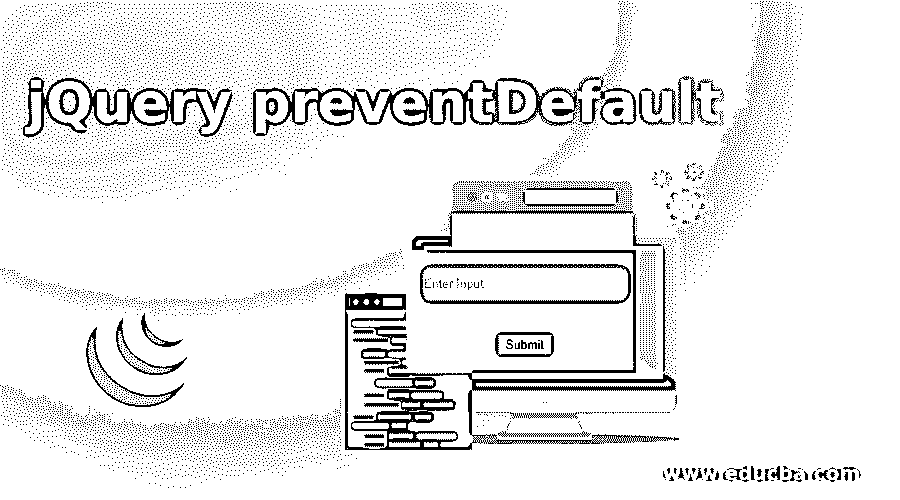
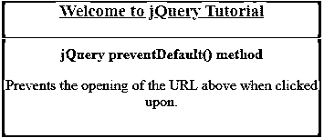
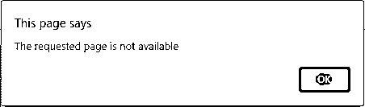
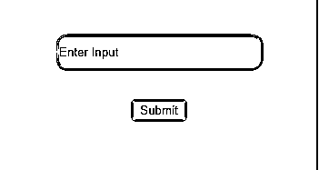
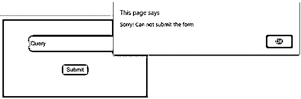
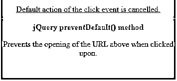
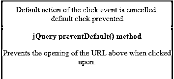
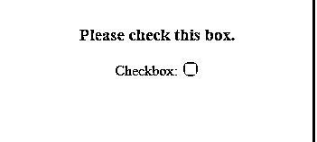

# jQuery 预防默认

> 原文：<https://www.educba.com/jquery-preventdefault/>




## jQuery preventDefault()简介

jQuery 中的 preventDefault()方法基本上是用来停止或者取消一个元素的默认动作发生。这个方法以取消可取消事件的方式工作，这意味着任何属于该事件的默认动作都不会发生。此方法不接受任何参数。还可以通过使用方法 isDefaultPrevented()来检查 preventDefault()方法是否曾经在所选元素上调用过。preventDefault()方法不会阻止事件在 DOM 中进一步传播，除非它的一个事件侦听器调用 stopPropagation()或 stopImmediatePropgation()。所有事件都不可取消。可以使用 cancelable 属性来检查事件是否可取消。

以下是可以应用 preventDefault()方法的示例。

<small>网页开发、编程语言、软件测试&其他</small>

1.  阻止提交按钮提交表单
2.  阻止链接打开 URL，从而阻止浏览器转到另一个页面。

**语法**

```
event.preventDefault()
```

**注意**:这个方法不接受任何参数。

### jQuery preventDefault 的示例

下面是提到的例子:

#### 示例#1

下面的示例说明了如何使用 preventDefault()方法通过取消 click 事件来阻止链接的打开。

**代码:**

```
<!DOCTYPE html>
<html>
<head>
<title>
jQuery event.preventDefault() Method
</title>
<script src="https://code.jquery.com/jquery-3.4.1.js"></script>
<style>
#divstyle {
text-align: center;
background-color: cadetblue;
width: 350px;
height: 150px;
margin-left: 100px;
}
</style>
<script>
$(document).ready(function() {
$("a").click(function(event) {
event.preventDefault();
alert("The requested page is not available");
});
});
</script>
</head>
<body>
<div id="divstyle">
<a href="https://www.google.com">
<h3>Welcome to jQuery Tutorial</h3>
</a>
<hr />
<b>jQuery preventDefault() method</b>
<p>Prevents the opening of the URL above when clicked upon.</p>
</div>
</body>
</html>
```

**输出**

*   下面的屏幕截图显示了执行上述代码后显示的页面。




*   单击该链接时，URL 不会打开并显示警告消息。这是因为单击的默认动作被取消了。




#### 实施例 2

以下示例说明了如何使用 preventDefault()方法来阻止提交表单。

**代码:**

```
<!DOCTYPE html>
<html>
<head>
<script src="https://code.jquery.com/jquery-3.4.1.js"></script>
<style>
#divstyle {
text-align: center;
background-color: cadetblue;
padding-top: 40px;
width: 350px;
height: 150px;
margin-left: 100px;
}
input {
width: 220px;
height: 30px;
border-radius: 10px;
}
</style>
<script>
$(document).ready(function() {
$("button").click(function(event) {
event.preventDefault();
alert("Sorry! Can not submit the form");
});
});
</script>
</head>
<body>
<div id="divstyle">
<input type="text" placeholder="Enter Input" />
<br /><br /><br />
<button>Submit</button>
</div>
</body>
</html>
```

**输出**

*   下面的截图是上面的代码执行时拍摄的。




*   单击“提交”按钮时，表单未被提交，并显示一条警告消息。这是因为 preventDefault()方法取消了提交事件的默认操作。




#### 实施例 3

下面是另一个类似的例子，说明 preventDefault()方法如何阻止默认的单击操作。

**代码:**

```
<!DOCTYPE html>
<html>
<head>
<title>
jQuery event.preventDefault() Method
</title>
<script src="https://code.jquery.com/jquery-3.4.1.js"></script>
<style>
#divstyle {
text-align: center;
background-color: cadetblue;
padding-top: 10px;
width: 350px;
height: 150px;
margin-left: 100px;
}
</style>
<script>
$(document).ready(function() {
$("a").click(function(event) {
event.preventDefault();
$("<div>")
.append("default " + event.type + " prevented")
.appendTo("#link");
});
});
</script>
</head>
<body>
<div id="divstyle">
<a href="https://www.google.com">Default action of the click event is cancelled.</a>
<div id="link"></div>
<hr />
<b>jQuery preventDefault() method</b>
<p>Prevents the opening of the URL above when clicked upon.</p>
</div>
</body>
</html>
```

**输出**

*   下面的截图是上面的代码被执行时拍摄的。




*   单击链接时，由于 preventDefault()，click 事件的默认操作被取消
*   这里单击的锚标记不会将浏览器重定向到新的 URL，相反，它会完成剩下的工作并将数据追加到 div 标记。




*   为了阻止事件传播 DOM **，**可以使用 event.stopPropagation()方法。

#### 实施例 4

下面是另一个类似的例子，说明 preventDefault()方法如何阻止默认的单击操作。

**代码:**

```
<!DOCTYPE html>
<html>
<style>
#divstyle {
text-align: center;
background-color: cadetblue;
padding-top: 10px;
width: 350px;
height: 150px;
margin-left: 100px;
}
</style>
<body>
<div id="divstyle">
<h3>Please check this box.</h3>
<form>
<label for="checkbox_id">Checkbox:</label>
<input type="checkbox" id="checkbox_id" />
</form>
<br />
<div id="outputbox_id"></div>
<script>
document.querySelector("#checkbox_id").addEventListener(
"click",
function(event) {
document.getElementById("outputbox_id").innerHTML +=
"Sorry! You can not check this box.<br>";
event.preventDefault();
},
false
);
</script>
</div>
</body>
</html>
```

**输出**

*   下面的截图是上面的代码执行时拍摄的。




*   在尝试单击复选框时，我们看到复选框未被选中，同时显示一条消息，如下所示。


*   单击复选框的默认操作是切换它，这由于 preventDefault()方法而被阻止

### 结论

*   在本文中，我们学习了一个 jQuery 事件方法 preventDefault()，它用于通过取消事件来防止或停止元素的任何默认操作。
*   preventDefault()方法基本上是告诉浏览器，如果特定对象上的特定事件有默认行为，则跳过该默认行为。
*   方法返回应用了更改的选定元素。
*   preventDefault()方法可以在事件流的任何阶段取消事件，从而阻止任何默认操作的发生。
*   cancelable 可用于确定事件是否可取消，因为事实上并非所有事件都是可取消的。

### 推荐文章

这是一个 jQuery preventDefault 的指南。这里我们讨论 jQuery preventDefault()的介绍以及相应的例子。您也可以看看以下文章，了解更多信息–

1.  [jQuery 是数值型的](https://www.educba.com/jquery-isnumeric/)
2.  [jQuery 数据表](https://www.educba.com/jquery-data-table/)
3.  [jQuery 表单验证](https://www.educba.com/jquery-form-validation/)
4.  [JQuery InputMask](https://www.educba.com/jquery-inputmask/)


