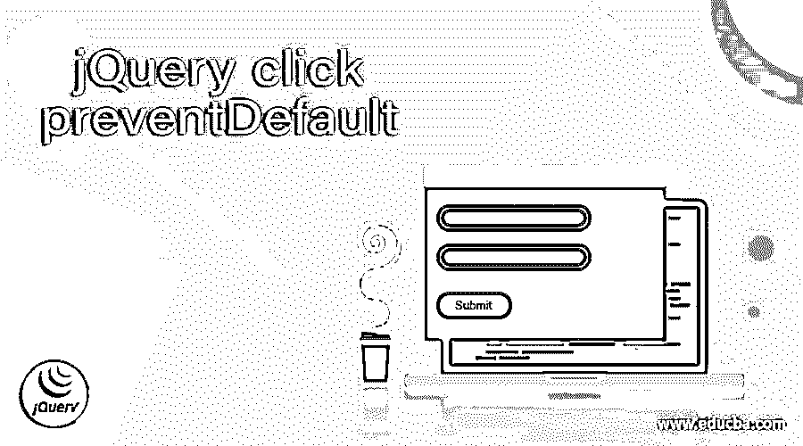
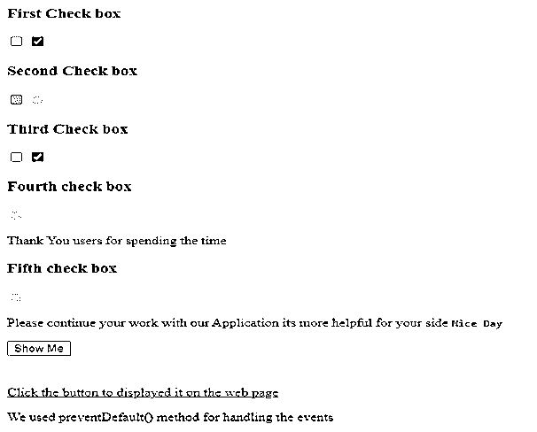
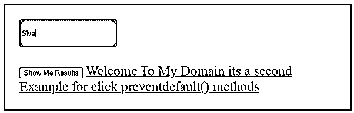
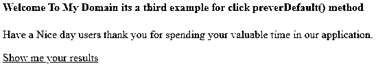

# jQuery 单击预防默认

> 原文：<https://www.educba.com/jquery-click-preventdefault/>




## jQuery click preventDefault 简介

jQuery click preventDefault 是处理事件(如取消功能或触发新事件)的默认方法之一，因为默认的用户操作不属于任何事件，它不通过使用 cancellable 属性取消所有事件，而是通过使用 preventDefault()方法找出事件。借助 stopPropagation()方法，它不会阻止事件通过 DOM 元素的进一步传播。此过程将被停止，单击事件用于触发事件，它必须是用户事件功能的确切序列。

**语法:**

<small>网页开发、编程语言、软件测试&其他</small>

click 是事件，preventDefault()是处理事件的内置方法，可以阻止事件的进一步传播。就像通过其他默认方法调用和组合方法来触发与应用程序的用户功能相关的事件一样。

```
<html>
<head>
<script src=" https://code.jquery.com/jquery-3.5.0.js">
$(document).ready(function(){
$('variable name').click(function(var)){
var.preventDefault();
----some jQuery and javascript codes it depends upon the user requirement----
});
})
</script>
<body>
---some html tag elements which may require on the jQuery tag libraries and the application UI requirement-----
</body>
</html>
```

以上代码是使用 click()和 preventDefault()方法来处理事件的基本语法。我们使用 on()方法传递脚本中的“click”事件和“handler”参数。

### jQuery 中如何使用 click preventDefault？

当我们在脚本上使用 click 事件时，它调用和触发新的事件或已有的操作符是由用户端来执行的。如果任何默认方法被调用并用于任何默认操作，则不会触发该事件，preventDefault()方法也不接受来自编码器端的任何参数。借助 event.isDefaultPrevented()方法确定该方法已被用户事件所触发的事件处理程序调用。单击事件是在单击元素时发生和执行的，click()方法用于触发 click 事件或附加函数来运行和执行 click 事件。HTML DOM 元素被阻止并与 javascript 库一起使用，如 jQuery 被处理并在每次客户端调用该函数时触发新事件。click()方法允许传递 eventData 和 handler 对象，它包含可以传递给特定事件处理程序的数据，允许 eventData 和 handler 函数用于执行每次从 event 对象触发的事件。当我们使用任何方法时，它可能是默认的或定制的，签名可能接受两个参数，也可能不支持它。

#### 示例#1

**代码:**

```
<!DOCTYPE html>
<html>
<head>
</script>
<meta charset=utf-8 />
<title>Welcome To My Domain it’s a demo Example For click preventdefault() method</title>
<script src =
"https://ajax.googleapis.com/ajax/libs/jquery/3.4.0/jquery.min.js"
>
(function ($) {
"use strict";
$(document.body).delegate('[type="checkbox"][readonly="readonly"]', 'click', function(e) {
e.preventDefault();
});
$('#demo').submit(function(e) {
$('.third').demo().html($(this).serialize());
return true;
});
}(window.jQuery));
</script>
</head>
<body>
<form action="about:blank" id="demo">
<h3>First Check box</h3>
<input type="checkbox" value="ex1" name="ex1" />
<input type="checkbox" checked="checked" value="ex2" name="ex2" />
<h3>Second Check box </h3>
<input type="checkbox" value="ex3" name="ex3" disabled="disabled" />
<input type="checkbox" checked="checked" value="ex4" name="ex4" disabled="disabled"/>
<h3>Third Check box</h3>
<input type="checkbox" readonly="readonly" value="ex5" name="ex5" />
<input type="checkbox" checked="checked" readonly="readonly" value="ex6" name="ex6" />
<h3>Fourth check box</h3>
<p>
<label>
<input type="checkbox" checked="checked" readonly="readonly" value="eg7" name="eg7" disabled="disabled"/>
<p>Thank You users for spending the time</p>
</label></p>
<h3>Fifth check box</h3>
<div>
<input type="checkbox" checked="checked" readonly="readonly"
id="demo1" value="eg8" name="eg8" disabled="disabled" />
<p>
<label for="demo1">Please continue your work with our Application its more helpful for your side <code>Nice Day</code>
</label>
</p>
</div>
<input type="submit" name="Show Me" value="Show Me" />
</form>
<pre class="demo2">
</pre>
<a id="news" href="http://www.google.com/">Click the button to displayed it on the web page</a>
<pWe used preventDefault() method for handling the events</p>
<script>
document.getElementById("demo2").addEventListener("click", function(event){
event.preventDefault()
});
</script>
</body>
</html>
```

**样本输出:**




在上面的例子中，我们使用了 HTML checkbox 元素来执行，并在 HTML 元素上使用了只读和禁用属性。这里我们使用 addEventListener()函数来“点击”事件，使用 preventDefault()函数来触发事件。

#### 实施例 2

**代码:**

```
<!DOCTYPE html>
<html>
<head>
<script src=
"https://ajax.googleapis.com/ajax/libs/jquery/3.3.1/jquery.min.js">
</script>
<style>
body {
width: 44%;
height: 44%;
padding: 27px;
border: 3px solid blue;
font-size: 26px;
}
input {
width: 177px;
height: 47px;
border-radius: 14px;
}
</style>
<script>
$(document).ready(function() {
$("button").click(function(event) {
event.preventDefault();
alert("Thank you for submitting your datas on our application your request is taken from our end hence we have authenticated and revert us");
});
});
$(document).ready(function() {
$("a").click(function(event) {
event.preventDefault();
alert("Your request is not approve now please try again later");
});
});
</script>
</head>
<body>
<input type="text" placeholder="Please enter your input strings" />
<br><br>
<button>Show Me Results </button>
<a href="http://www.google.com">
Welcome To My Domain its a second Example for click preventdefault() methods
</a>
</body>
</html&gt;
```

**样本输出:**




在第二个例子中，我们使用了文本框 Html UI 元素，我们已经插入了值，它将被存储在后端。我们使用

#### 实施例 3

**代码:**

```
<!DOCTYPE html>
<html>
<head>
<script src = "https://ajax.googleapis.com/ajax/libs/jquery/3.5.1/jquery.min.js"></script>
<script>
$(document).ready(function(){
$("a").click(function(e){
e.preventDefault();
alert("Your request is not approve now please try again later");
});
});
</script>
</head>
<body>
<h4> Welcome To My Domain its a third example for click preverDefault() method </h4>
<p> Have a Nice day users thank you for spending your valuable time in our application. </p>
<a href = "https://www.google.com/"> Show me your results </a>
</body>
</html>
```

**样本输出:**




最后一个例子我们使用了 same click()函数来执行和执行用户事件。preventDefault()是执行和导航网页的方法。通过使用 alert()函数，我们收到了通知。

### 结论

在 jQuery 中，click preventDefault()方法用于处理用户事件和导航网页，如果网页受到防火墙等安全措施的保护，则不允许访问特定的网页。它支持升级版本的所有类型的浏览器，也支持 pc 机和其他设备，如平板电脑和手机应用程序。

### 推荐文章

这是一个 jQuery click preventDefault 的指南。这里我们讨论一下入门，如何在 jQuery 中使用 click preventDefault？示例分别用代码实现。您也可以看看以下文章，了解更多信息–

1.  [jQuery 选择值](https://www.educba.com/jquery-select-value/)
2.  [jQuery removeClass()](https://www.educba.com/jquery-removeclass/)
3.  [jQuery 延期](https://www.educba.com/jquery-deferred/)
4.  [jQuery 窗口](https://www.educba.com/jquery-window/)


