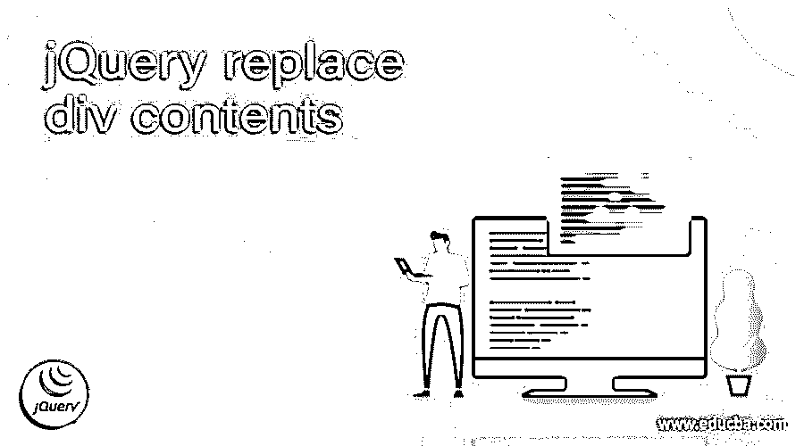
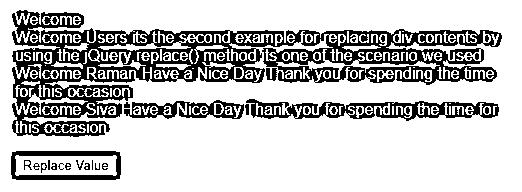
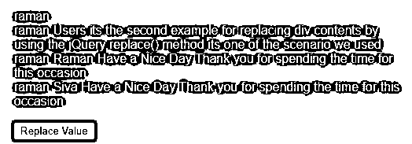
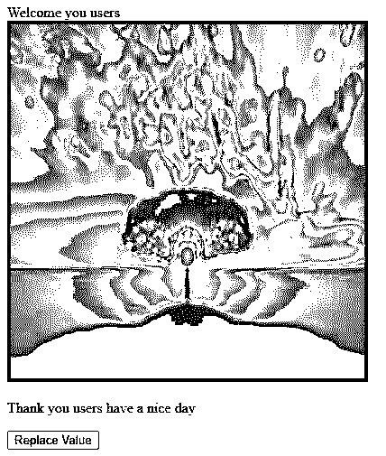
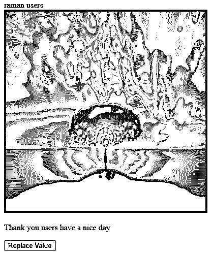

# jQuery 替换 div 内容

> 原文：<https://www.educba.com/jquery-replace-div-contents/>




## jQuery 替换 div 内容简介

jQuery replace div contents 是可以在

标签上使用的数据内容，我们可以使用 replaceWith()等 jQuery 方法或任何其他 replace 方法在任何需要的地方替换内容，我们希望使用 div 元素或任何其他 HTML 元素替换 innerHTML 上可以覆盖的数据。数据内容被声明并作为 innerHTML 标签(如标签)传递，它将在 jQuery 选择器上调用，而可替换内容将使用 jQuery replace child()等子方法在 DOM 级别上插入。内容被拆分并用新数据替换。

**语法**

<small>网页开发、编程语言、软件测试&其他</small>

jQuery 库有许多默认的方法和类，用于创建基于 web 的应用程序。HTML 将与 jQuery 结合，在脚本和 UI 代码中添加数据内容。通过使用 id 或 div 元素作为 jQuery 选择器并调用 replaceWith()等方法，

元素通常会有 id 等参数和一些其他子标签。

```
<html>
<head>
<script src=https://ajax.googleapis.com/ajax/libs/jquery/3.5.1/jquery.min.js>
</script>
</head>
<body>
<div id="demo">
<div class="name">
---Datas with html tags if needed ---
</div>
</div>
<script>
$("name").click(function(e){
e.preventDefault();
var eg=;
$('#demo').replaceWith('<div class="name">' + eg + '</div>');
});
</script>
</body>
</html>
```

以上代码是在 html 页面上使用

标签和 replaceWith()方法的基本语法。

### 如何替换 jQuery 中的 div 内容？

我们在 html 页面的

标签上讨论过的语法部分中的上述段落。我们根据 UI 需求使用了 n 个标签，我们在 html 页面的“彼此”部分调用了 div 标签元素。但是标签元素的 id 将在 jQuery 选择器上传递，一旦我们传递了被拉至 jQuery 库的数据。我们可以将替换的值声明为单独的变量，并在 replaceWith()方法上调用该变量。该方法将包含标记元素和替换的文本或变量作为参数变量。html 中的元素将被替换为 DOM 级别，因此在替换操作之后，一个 DOM 元素将被另一个 DOM 元素替换。当我们声明任何返回类型时，它返回父节点属性，即作为节点对象的特定定义节点的父节点，如果没有父节点，它将返回空值。也可以替换脚本中没有父节点的子节点。替换所选 html div 元素的内部内容的函数，但是我们可以在 html()方法的帮助下使用 inside 添加 html 标记来替换所选 html 元素。

### jQuery 替换 div 内容的示例

下面举几个例子

#### 示例#1

**代码:**

```
<!DOCTYPE html>
<html>
<head>
<title> Welcome to My Domain it’s a first Example for div tag using jQuery Replace concept</title>
<style>
body {
display: block;
margin-top: 17%;
}
h1 {
color:blue;
text-align:center;
}
div { border:3px green;
color:violet;
margin:7px;
cursor:pointer;
}
p { border:3px green;
color:blue;
margin:3px;
cursor:pointer;
}
</style>
<script src="http://code.jquery.com/jquery-latest.js"></script>
</head>
<body bgcolor="red">
<p>Have a Nice Day Users</p>
<p>Thank you spending you time in our application kindly stay on this</p>
<p>Please find the below our Updates on this application</p>
<p>The div tag data contents are used and shown on the screen by using the html web pages</p>
<p>With the help of jQuery replaceWith() method the datas are replaced with the new html dom elements</p>
<div>Your replaced contents will be shown on the web screen</div>
<script>
$("p").click(function () {
$(this).replaceWith($("div"));
});
</script>
</body>
</html>
```

**输出:**


在上面的例子中，我们使用 div 内容和 replaceWith()方法将一个 dom 元素替换为另一个元素。

#### 实施例 2

**代码:**

```
<html  >
<head>
<title>Welcome To My Domain its a Second Example for replacing the elements by using the div tag elements</title>
<script type="text/javascript"
src="http://ajax.googleapis.com/ajax/libs/jquery/1.4.2/jquery.min.js">
</script>
<style>
body {
font-family: Arial, TimesNewRoman,Helvetica, sans-serif;
background-color: blue;
color: green;
text-decoration: none;
padding: 23px 33px;
position: center;
display: inline-block;
border-radius: 5px;
}
.demo {
position: center;
top: -23px;
right: -23px;
padding: 7px 13px;
border-radius: 47%;
background-color: pink;
color: yellow;
}
</style>
<script type="text/javascript" language="javascript">
$(function () {
$("#first").click(function () {
$("#demo").html($("#demo").html().replace("Welcome", "raman"));
});
});
</script>
</head>
<body>
<div id="demo">Welcome
<div class=”name”>
Welcome Users its the second example for replacing div contents by using the jQuery replace() method its one of the scenario we used
</div>
<div class="name">
Welcome Raman Have a Nice Day Thank you for spending the time for this occasion
</div>
<div class="name">
Welcome Siva Have a Nice Day Thank you for spending the time for this occasion
</div>
</div><br />
<input id="first" type="button" value="Replace Value" />
</body>
</html>
```

**输出:**







在第二个例子中，我们在页面上使用了 html 内容，另外在脚本中使用了按钮元素来替换网页上的特定内容。

#### 实施例 3

**代码:**

```
<!DOCTYPE html>
<html>
<head>
<title>Welcome to My Domain it’s a Third Example for regarding the div contents on the replace method</title>
<style>
img {
width: 540px;
height: 530px;
}
</style>
<script type="text/javascript"
src="http://ajax.googleapis.com/ajax/libs/jquery/1.4.2/jquery.min.js">
</script>
<script src="https://code.jquery.com/jquery-3.5.0.min.js">
</script>
<script  type="text/javascript" language="javascript">
$(function () {
$("#first").click(function () {
$("#demo").html($("#demo").html().replace("Welcome you", "raman"));
});
});
</script>
</head>
<body>
<div id="demo">Welcome you users
<div class="name">

<marquee>Thank you users have a nice day</marquee>
</div>
</div>
<input id="first" type="button" value="Replace Value" />
<script>
$(document).ready(function() {
$('img').on({
'click': function() {
let vars = ($(this).attr('src') === 'one.jpg') ?
'website.jpg' :
'one.jpg';
$(this).attr('src', vars);
}
});
});
</script>
</body>
</html>
```

**输出:**







在最后一个示例中，我们在脚本中使用了额外的图像，用于在我们单击页面上的图像时更改图像。此外，我们单击按钮来替换内容。

### 结论

jQuery library 中有默认的方法和关键字，用于创建用户友好的 web 应用程序。此外，html 元素(如

标记和其他标记元素)被组合在一起，并被称为 jQuery 选择器的数据内容，用于执行诸如将内容从一个 DOM 元素替换()到另一个 DOM 元素的操作。

### 推荐文章

这是一个 jQuery 替换 div 内容的指南。这里我们将讨论如何替换 jQuery 中的 div 内容，并给出示例和输出。您也可以看看以下文章，了解更多信息–

1.  [jQuery 可见性](https://www.educba.com/jquery-visibility/)
2.  [jQuery 移动元素](https://www.educba.com/jquery-move-element/)
3.  [jQuery eq()](https://www.educba.com/jquery-eq/)
4.  [jQuery 向下滚动](https://www.educba.com/jquery-scroll-down/)


