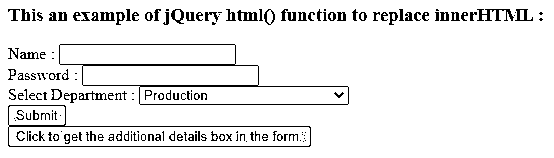
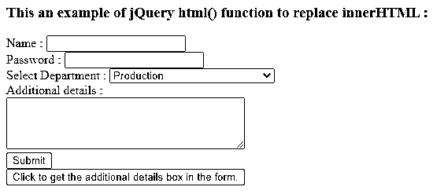
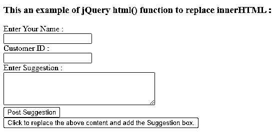
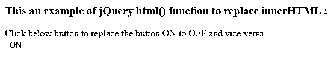
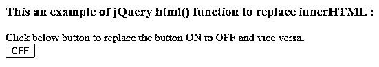
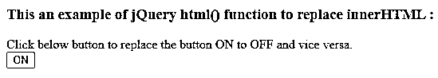

# jQuery 替换 innerhtml

> 原文：<https://www.educba.com/jquery-replace-innerhtml/>


## jQuery 替换 innerhtml 简介

执行 jQuery replace innerHTML 来替换所选元素的 innerHTML。innerHTML 属性用于在 HTML 文档中写入动态 HTML 内容，如评论表单、注册表单、链接等。当我们需要替换 innerHTML 动态内容时，我们可以使用 innerHTML 属性或 HTML()函数来提供新的内容。

**用于替换 innerHTML 的 jQuery 语法—**

<small>网页开发、编程语言、软件测试&其他</small>

```
document.getElementById( "id" ).innerHTML= content;
```

**jQuery html()函数设置内容的语法—**

```
$( "selector" ).html( content );
```

**jQuery html()函数通过调用函数设置内容的语法—**

```
$( "selector" ).html( function( index, currcontent ) );
```

**参数—**

**内容—**这不是可选参数。它指定新内容来替换 innerHTML 的旧内容。内容摄像头也有 HTML 标签。

**function( index，curr content)–**这是一个可选参数，指定返回新内容以替换 innerHTML 旧内容的函数。index 参数表示元素在匹配的元素集中的索引位置，currcontent 参数表示所选元素的当前 HTML 内容。

**jQuery html()函数取代 innerHTML 的工作原理—**

jQuery html()函数用来替换 innerHTML，该函数接受要替换的新内容。假设我们在 HTML 页面中有一个包含一些文本内容的 div 元素，现在我们需要用一些其他内容替换它。所以我们可以使用 innerHTML 属性作为“$(“# divid”)。html("新内容")；".所以它用新内容替换了 div 的旧内容，我们可以在下面的例子中看到。

### jQuery html()函数替换 innerHTML 的示例

下面举几个例子

#### 示例#1

jQuery 替换 innerHTML 以添加注释框的示例–

**代码:**

```
<!doctype html>
<html lang="en">
<head>
<meta charset = "utf-8">
<script src = "https://code.jquery.com/jquery-3.5.0.js"></script>
<title> This is an example for jQuery html() function to replace innerHTML  </title>
<script>
function disp()
{
var data="Additional details : <br><textarea rows = '4' cols = '40'> </textarea><br>";
document.getElementById( "additional" ).innerHTML=data;
}
</script>
</head>
<body>
<h3> This an example of jQuery html() function to replace innerHTML  : </h3>
<form action = "#myform">
<div>
Name :     <input type = "text"> <br/>
Password :     <input type = "text"> <br/>
Select Department : <select>
<option> Production </option>
<option> Marketing </option>
<option> Research and Development </option >
<option> Human Resource Management  </option>
</select>
<div id = "additional"> </div>
<input type = "submit" id = "sub">
</div>
<button onclick = "disp()"> Click to get the additional details box in the form.  </button>
</body>
</html>
```

上述代码的输出是–




一旦我们点击 p 文本内容，输出是




在上面的代码中，表单元素的内容是 Name、password、department 和 submit。接下来，单击最后一个按钮，它显示或添加附加细节框，将 div 内容替换为“document.getElementById(“附加”)。innerHTML = data"，其中数据是附加详细信息框的区域框。因此它显示了新的内容，正如我们在上面的输出中看到的。

#### 实施例 2

用建议框替换 div 的示例–

**代码:**

```
<!doctype html>
<html lang="en">
<head>
<meta charset = "utf-8">
<script src = "https://code.jquery.com/jquery-3.5.0.js"></script>
<title> This is an example for jQuery html() function to replace innerHTML  </title>
<script>
var flag=true;
function disp()
{
var Sugg = "<form action = 'suggestion'> Enter Your Name : <br><input type = 'text' name = 'name'/><br/> Customer ID : <br><input type = 'cid' name = 'cid'/><br> Enter Suggestion : <br/> <textarea rows = '4' cols = '40'></textarea><br><input type = 'submit' value = 'Post Suggestion'/> </form>";
if(flag){
document.getElementById( "Suggestion" ).innerHTML = Sugg;
flag = false;
}
else
{
document.getElementById( "Suggestion" ).innerHTML = "";
flag = true;
}
}
</script>
</head>
<body>
<h3> This an example of jQuery html() function to replace innerHTML  : </h3>
<div id = "Suggestion"> Here will add the Suggestion box. </div>
<button onclick = "disp()"> Click to replace the above content and add the Suggestion box.  </button>
</body>
</html>
```

上述代码的输出是–


一旦我们点击按钮，输出是




在上面的代码中，dive 元素有内容。接下来单击最后一个按钮，它显示建议表单，将 div 内容替换为“document.getElementById(“建议”)。innerHTML = suggest；"，其中 Sugg 是包含建议表单元素组的表单。因此它显示了新的内容，正如我们在上面的输出中看到的。

#### 实施例 3

jQuery replace innerHTML 替换按钮内容的示例–

**代码:**

```
<!doctype html>
<html lang="en">
<head>
<meta charset = "utf-8">
<script src = "https://code.jquery.com/jquery-3.5.0.js"></script>
<title> This is an example for jQuery html() function to replace innerHTML  </title>
<script>
var flag = true;
function disp()
{
if(flag){
$( "#btn" ).html( "OFF" );
flag = false;
}
else
{
$( "#btn" ).html( "ON" );
flag = true;
}
}
</script>
</head>
<body>
<h3> This an example of jQuery html() function to replace innerHTML  : </h3>
<div > Click below button to replace the button ON to OFF and vice versa.</div>
<button onclick = "disp()" id = "btn"> ON  </button>
</body>
</html>
```

上述代码的输出是–




一旦我们点击按钮，输出是




当我们再次单击该按钮时，输出是–




在上面的代码中，button 元素有“on”内容。下一次点击按钮时，它通过将“开”内容替换为“$(“# BTN”)来显示“关”。html(" OFF ")；"，通过使用 html()函数。因此它显示“开”和“关”的内容，正如我们在上面的输出中看到的。

### 结论

jQuery innerHTML 属性和 HTML()函数是内置的，可以用来替换 innerHTML 内容。

### 推荐文章

这是一个 jQuery 替换 innerhtml 的指南。这里我们讨论 jQuery html()函数替换 innerHTML 和输出的例子。您也可以看看以下文章，了解更多信息–

1.  [jQuery 可见性](https://www.educba.com/jquery-visibility/)
2.  [jQuery 窗口](https://www.educba.com/jquery-window/)
3.  [jQuery grep](https://www.educba.com/jquery-grep/)
4.  [jQuery 全局变量](https://www.educba.com/jquery-global-variable/)


