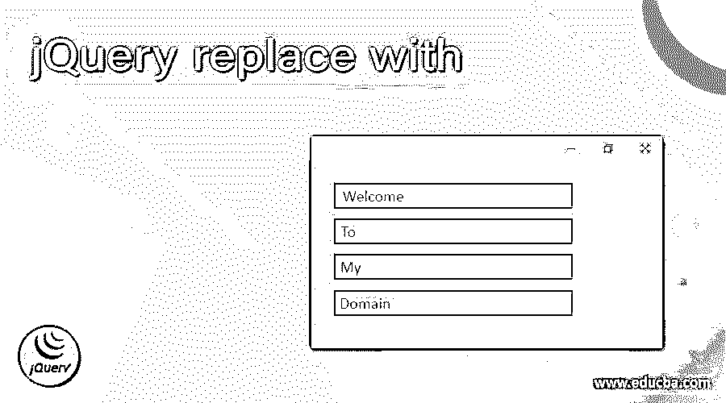
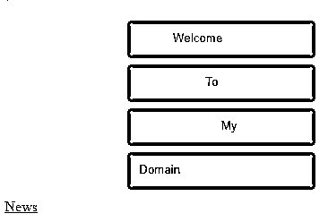
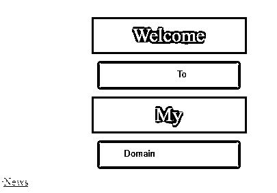
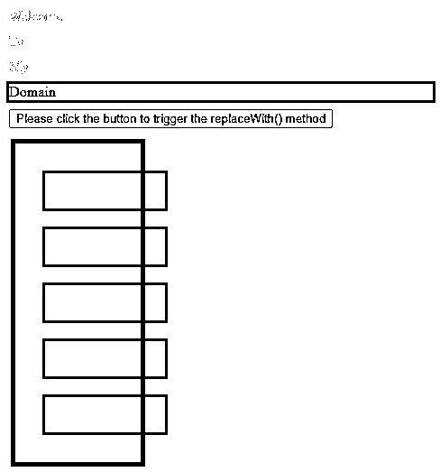
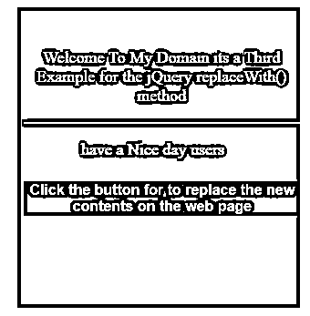

# jQuery 替换为

> 原文：<https://www.educba.com/jquery-replace-with/>




## jQuery 简介替换为

在 jQuery 中，replaceWith()是默认方法之一，它用于从 DOM html 元素中删除数据内容，并插入目标或目的地元素，其中包含所选的一组匹配元素值。它可替换为要插入和提供的每个元素的新内容，返回被删除的元素的集合不被用户端接受。有两个参数变量将被提及并与 html 元素一起指定。内容和功能是传递给 replaceWith()方法的变量。在这个主题中，我们将学习 jQuery 替换为。

**语法**

<small>网页开发、编程语言、软件测试&其他</small>

jQuery 库中有许多默认方法，其中 replaceWith()是内置方法之一，用于将值替换为另一个值。主要是字符串值将通过该方法，因为两个字符串变量将被追加或合并，并用另一个新变量替换以完成需求。

```
<html>
<head>
<script src="https://code.jquery.com/jquery-1.12.4.js">
$(document).ready(function(){
$(selector).replaceWith(content, functions);
});
-----some jQuery script codes depend upon the requirement----
</head>
<body>
---- html tag elements depends upon the jQuery scripts needs and the user needs---
</body></html>
```

以上代码是在 jQuery 库上使用 replaceWith()方法的基本语法。根据用户界面和用户需求，我们也可以在应用程序上调用 JavaScript 函数。

### replaceWith()函数在 jQuery 中是如何工作的？

replaceWith()方法用于访问一个以上的输入变量值，它对所提到的目标变量执行可替换值。可以检查和验证从 DOM 元素中删除的内容，并在指定的单元格属性中插入新的 html 内容。它还移除与已删除节点关联和组合的数据和事件处理程序。

节点是间歇性的，如果节点与初始节点相似，它会添加或更改当前或新 jQuery 集合中的节点，它没有连接到文档，在这些情况下，会返回 jQuery 集合中提到的新变量值，而不是存储在变量中的原始值集合，如以前的值。

replaceWith()方法还支持整数和其他数据类型，总是用新值替换现有值，因此从前端和后端代码中删除现有值。后端代码，如 java 或其他一些技术，即使 sql 或其他数据库查询也发生了变化，当我们执行 replaceWith()方法时，内存地址及其引用也会在现有的内存地址上创建一个新的内存地址。

### jQuery 替换为的示例

下面举几个例子

#### 示例#1

**代码:**

```
<!DOCTYPE html>
<html>
<head>
<title>Welcome To My Domain it’s a first example for replaceWith() method</title>
<script src=
"https://ajax.googleapis.com/ajax/libs/jquery/3.3.1/jquery.min.js">
</script>
<style>
p {
color: violet;
border: 3px solid blue;
width: 205px;
margin: 7px;
padding: 8px;
font-size: 28px;
text-align: center;
}
button {
display: block;
margin: 13px;
color: blue;
width: 204px;
padding: 7px;
}
</style>
</head>
<body bgcolor="red"> `
<center>
<button><marquee>Welcome</marquee></button>
<button><marquee>To</marquee></button>
<button><marquee>My</marquee></button>
<button><marquee>Domain</marquee></button>
</center>
<div>
<a href="This is the Heading which belongs to the jQuery replaceWith() method topic that can be covered here with first example and some html tags are used on this script">News</a>
</div>
<script>
$("button").click(function() {
$(this).replaceWith("<p>" + $(this).text() + "</p>");
});
$("div").click(function() {
$(this).replaceWith("<a>"+ $(this).text()+"</a>");
});
</script>
</body>
</html>
```

**输出:**







在上面的例子中，我们在基本格式上使用了 replaceWith()方法。我们使用了额外的 html 元素，如 

#### 实施例 2

**代码:**

```
<!doctype html>
<html lang="en">
<head>
<meta charset="utf-8">
<title>Welcome To My Domain it’s a Second Example regarding jQuery replaceWith() method</title>
<style>
.first {
background-color: pink;
border: 5px solid blue;
width: 113px;
margin: 9px;
padding: 13px;
font-size: 20px;
text-align: center;
}
.second {
color: violet;
display: block;
margin: 17px;
width: 117px;
padding: 8px
}
div {
border: 3px solid green;
color: green;
margin: 4px;
}
p {
border: 3px solid yellow;
color: yellow;
margin: 4px;
cursor: pointer;
}
</style>
<script src="https://code.jquery.com/jquery-3.5.0.js"></script>
</head>
<body>
<p>Welcome</p>
<p>To</p>
<p>My</p>
<div>Domain</div>
<p>
<button>Please click the button to trigger the replaceWith() method</button>
</p>
<div class="first">
<div class="second">Have</div>
<div class="second">A</div>
<div class="second">Nice</div>
<div class="second">Day</div>
<div class="second">Users</div>
</div>
<script>
$( "button" ).on( "click", function() {
var $first = $( "div.first" ).replaceWith(function() {
return $( this ).contents();
});
$( "p" ).append( $first.attr( "class" ) );
});
$( "p" ).click(function() {
$( this ).replaceWith( $( "div" ) );
});
</script>
</body></html>
```

**输出:**




在第二个例子中，我们在 html 按钮元素中使用了 replaceWith()方法。一旦我们点击了按钮，第一个 UI 元素将自动隐藏在网页上。

#### 实施例 3

**代码:**

```
<!DOCTYPE html>
<html>
<head>
<script src="https://code.jquery.com/jquery-1.12.4.js"></script>
<script>
$(document).ready(function () {
$("button").click(function () {
$("#first").replaceWith("");
});
});
</script>
<style>
#second {
width: 303px;
height: 303px;
padding-top: 27px;
padding-left: 7px;
font-size: 18px;
text-align: center;
color: pink;
background-color: red;
}
#button {
color: red;
font-weight: bold;
font-size: medium;
border: oldlace;
background-color: blue;
}
</style>
</head>
<body>
<center>
<div id="second">
<p id="first">Welcome To My Domain its a Third Example for the jQuery replaceWith() method</p>
<hr />
<p><marquee>have a Nice day users</marquee></p>
<button id="button">Click the button for to replace the new contents on the web page</button>
</div>
</center>
</body>
</html>
```

**输出:**




最后一个例子中，我们对 html 属性使用了 replaceWith()方法。一旦我们点击按钮，html 内容将自动替换为图像。每当我们使用额外的 html 标签元素或一些其他的 jQuery 选择器时，如果应用程序需要的话，就会在脚本中使用和调用。

### 结论

jQuery 库以多种方式执行 UI 操作，此外，它还结合了与 UI 部分相关的其他技术。此外，UI 元素和 js 类是实现应用程序所必需的。replaceWith()是一个内置方法，用于在屏幕上执行可替换的内容。

### 推荐文章

这是一个 jQuery 替换为。这里我们讨论 replaceWith()函数如何在 jQuery 中工作，并给出示例和输出。您也可以看看以下文章，了解更多信息–

1.  [jQuery removeClass()](https://www.educba.com/jquery-removeclass/)
2.  [jQuery 选择值](https://www.educba.com/jquery-select-value/)
3.  [jQuery grep](https://www.educba.com/jquery-grep/)
4.  [jQuery 选择选项](https://www.educba.com/jquery-select-option/)


