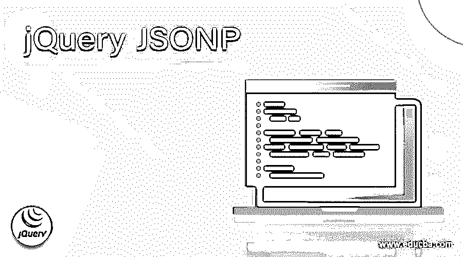
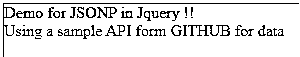
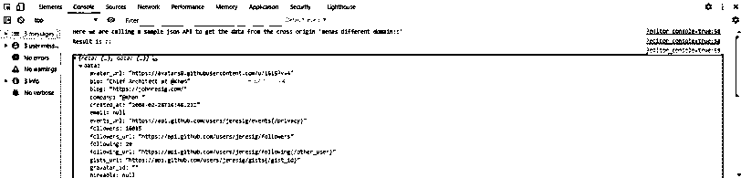

# jQuery JSONP

> 原文：<https://www.educba.com/jquery-jsonp/>




## jQuery JSONP 的定义

当我们希望通过网络发送数据时，当我们构建任何 web 应用程序时，总会有这样的需求，因此总会有通过网络发送 jsonp 对象的需求，因此 jsonP 为我们提供了一种通过网络或在不同的域中发送 JSON 数据的方法，而不会面临任何交叉访问源问题。Jsonp 使用脚本标记'

**语法和参数:**

<small>网页开发、编程语言、软件测试&其他</small>

Jquery jsonp 使用 ajax 调用来避免跨源问题。让我们来看看它的语法和参数如何进行这个调用并避免这个问题，见下文；

```
var variable_name = $("<script />", {
url: our url goes here ",
datatype: "application/json"
}
);
```

在处理不同域上的数据时，它将两个参数作为输入。为了更好的理解，下面将对其进行描述。

**1) url:** 这个参数用来给出我们 JSON 文件的 url。这个文件将包含 JSON，我们将把它注入页面。

**2)数据类型:**该参数用于设置类型。这里，我们将“应用程序/JSON”设置为文件的类型。这也称为文件的内容。

### JSONP 在 jQuery 中是如何工作的？

到目前为止，我们知道 jsonp 用于处理网络上的 JSON。此外，当我们构建任何 web 应用程序时，我们需要来自后端的数据或来自不同领域的不同服务。因此，每当我们试图从前端到后端进行调用时，我们都会在控制台中收到跨源问题。我们可以在后端解决这个问题，但为此，我们需要为我们从前端接收的每种类型的请求启用跨源，无论它是 get、post、put 还是 delete，如果没有这一点，我们可以从后端服务接收我们的数据。所以在 jQuery 中，我们有 jsonp，它只负责在前端处理这个问题。JsonP 使用一个脚本标记来执行这个任务，而不是 XMLHttpRequest。此外，它代表 JSON with padding，而使用它时，我们需要使用“script”标签传递源代码和类型。让我们更详细地理解 jsonp 的概念，见下文；

1)假设我们正在开发一个 web 应用程序，其中我们对远程网站上的数据有一些依赖性，但是这些端点或 API 有一些标准，这些标准定义了某种类型的请求并将响应返回给我们。但是这些远程服务调用和我们的应用程序有不同的域不一样，因为 ajax 调用有一些安全约束，因此我们不能向不同的域发出请求，如果我们尝试这样做，我们会收到一个异常或错误，说明这一点；

无法加载 http://external-domain/service。请求的资源上没有“Access-Control-Allow-Origin”标头。因此，不允许访问源“http://my-domain”。

上面你可以看到 jquery 文档中的错误，我们可以通过两种方法来避免这个问题，一种是在后端进行配置，另一种是在前端进行处理。我们将看到如何通过在 jquery 中使用 jsonp 在前端处理这个问题。此外，如果两个 URL 相同，我们可以看到它们的相同来源，为了检查这一点，我们有 URL 的三个组成部分，即:端口、主机名和协议。如果 URL 的这个组成部分匹配，那么它被认为是同源的，否则它们是不同的源，需要被处理。

你可能会想，当我们有不同的起源时，我们仍然能够访问起源，但是怎么访问呢？这是因为在后端服务中，我们已经将所有类型的请求配置为' * '，所以这就是为什么即使我们没有使用 jsonp，我们也不会出现任何错误，比如说在 angular 中，即使我们没有使用 jsonp，我们也在进行调用，因为我们处理它的方式不同。所以我们总是建议在另一个服务中处理这个问题，只是因为 jsonp 有一些安全问题。

让我们看一个初学者的例子，看看它是如何工作的，见下文；

例如:

```
$.ajax({
url: "our_url",
jsonp: "callback",
dataType: "jsonp",
success: function( data ) {
console.log( data );
}
});
```

在上面的代码片段中，我们使用了一个 ajax 调用，在这个调用中，我们提到了成功完成的每个细节。首先，我们必须给出 JSON 数据的路径，它也可以是一个回调 URL。其次，我们提到了我们期待的“jsonp”参数。在这之后，我们从回调函数接收到一个作为数据的响应，我们只是将它打印到控制台。这是一个在 jquery 中实现 jsonp 的简单过程。

### 例子

1)在本例中，我们使用 JSONP 在 JQuery 中请求跨源域来获取数据。例如，我们使用来自 git hub 的回调 URL 来实现这个例子。这是一个示例，便于初学者理解 JQuery 中的 jsonp 概念。

**代码:**

```
<!DOCTYPE html>
<html>
<head>
<script src="http://code.jquery.com/jquery-latest.js"></script>
</head>
<body>
<h2 style="color:#069">Demo for JSONP in JQuery !!</h2>
<div style="color:red">Using a sample API form GITHUB for data </div>
<br/><br/>
<script>
$.getJSON("https://api.github.com/users/jeresig?callback=?",
//Here we have a sample link form git hub which can be sued to get the json data for now to make this example working
function(data){
console.log("Here we are calling a sample json API to get the data from the cross origin 'means different domain::'")
console.log("Result is ::")
console.log(data);
});
</script>
</body>
</html>
```

**输出:**

HTML 输出:




控制台输出:




### 结论

通过使用 jsonp，我们可以非常轻松地在前端处理跨源问题。我们也可以在后端处理这个问题，由于安全限制，我们总是推荐使用后端。但是这是一种简单的方法，通过在回调函数中指定一些参数来实现，这种方法很容易使用和理解。

### 推荐文章

这是 jQuery JSONP 的指南。这里我们讨论定义、语法、JSONP 如何在 jQuery 中工作，以及代码实现的例子。您也可以看看以下文章，了解更多信息–

1.  [jQuery 承诺](https://www.educba.com/jquery-promise/)
2.  [jQuery zindex](https://www.educba.com/jquery-zindex/)
3.  [jQuery off](https://www.educba.com/jquery-off/)
4.  [jQuery 修剪](https://www.educba.com/jquery-trim/)


