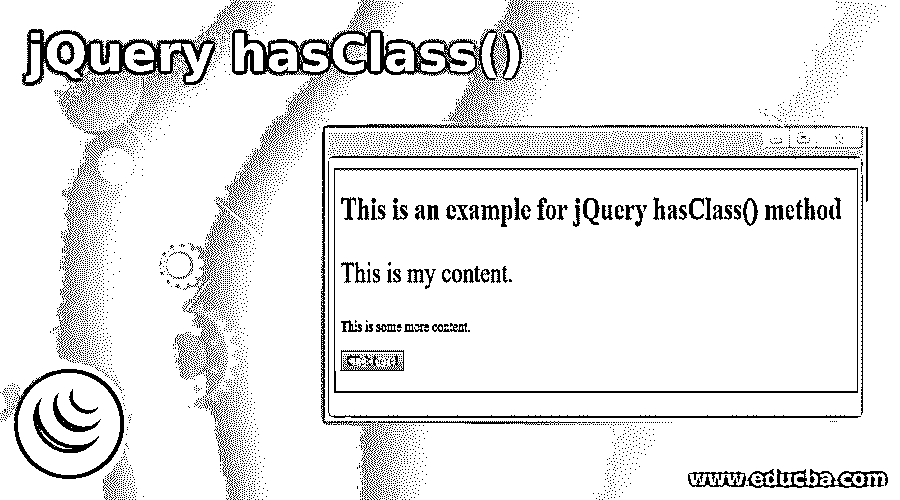
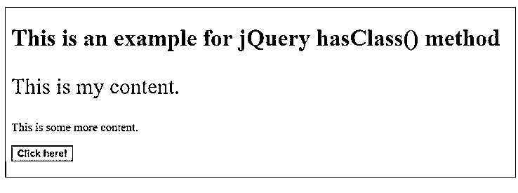
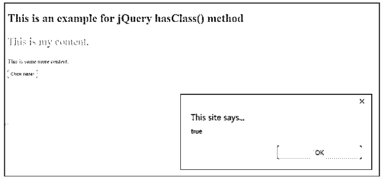
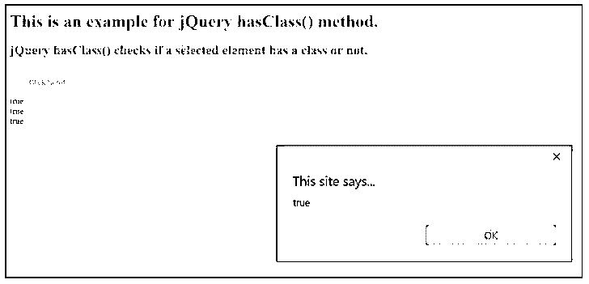
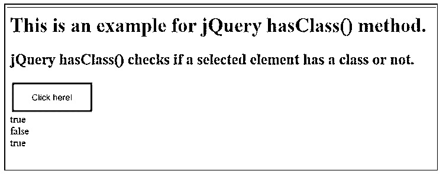
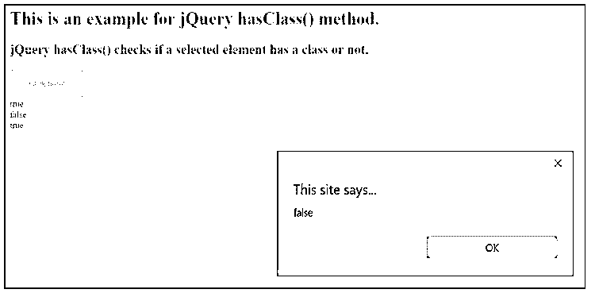
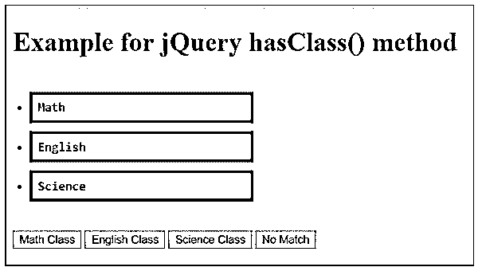
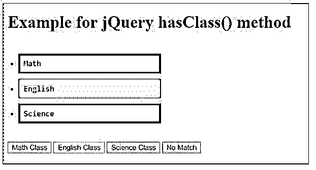
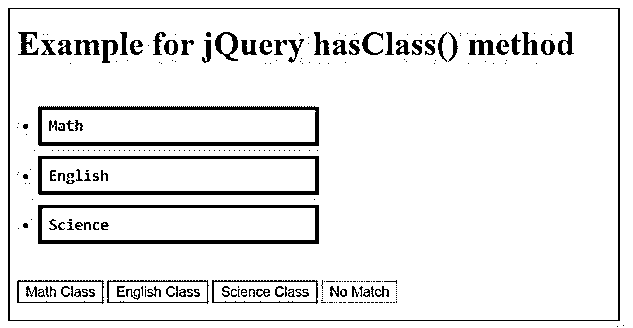

# jQuery hasClass()

> 原文：<https://www.educba.com/jquery-hasclass/>




## jQuery hasClass()简介

jQuery 中的 hasClass()方法主要检查所选元素是否分配了特定的类。

该方法返回一个布尔值。

<small>网页开发、编程语言、软件测试&其他</small>

*   如果将特定的类分配给选定的元素，则为 True。
*   如果没有为所选元素分配类，则为 False。

一个元素可以分配多个类，可以用空格分隔类名来表示。

**语法:**

jQuery 使用下面的语法来检查一个元素是否被分配了一个类。

```
$(selector).hasClass(className);
```

*   选择器是指要检查的选定元素。
*   className 是一个强制参数，它指定要搜索的类的名称。

### jQuery hasClass()的示例

下面是一些例子:

#### 示例#1

**代码:**

```
<!DOCTYPE  html>
<html>
<head>
<script  src="https://code.jquery.com/jquery-1.12.4.min.js"></script>
<script>
$(document).ready(function()  {
$("button").click(function()  {
alert($("p").hasClass("classId"));
});
});
</script>
<style>
.classId  {
font-size:  30px;
color:  rgb(110,  143,  110);
}
</style>
</head>
<body>
<h1>This  is  an  example  for  jQuery  hasClass()  method</h1>
<p class="classId">This is my content.</p>
<p>This  is  some  more  content.</p>
<b><button  style="color:rgb(88,  128,  23)"><b>Click  here!</b></button>
</body>
</html
```

**输出:**

*   首次在浏览器中加载页面时，屏幕下方会显示。
*   到目前为止，还没有开展任何活动。




*   点击按钮后，会弹出一个提示框，提示“真”。
*   这里，hasClass()方法检查分配给元素“p”的类。
*   因为元素“p”被赋予了 hasClass()方法一直在寻找的类名“classId ”,所以它返回 true。




#### 实施例 2

让我们考虑另一个演示 jQuery hasClass()方法的效果和实现的例子。

**代码:**

```
<html>
<head>
<title>The  jQuery  hasClass()  example</title>
<script  src="https://code.jquery.com/jquery-1.12.4.min.js"></script>
<script>
$(document).ready(function()  {
//setting  the  textcontent  for  div  elements  based  on  the  value  returned  by hasClass().
$("#div1").text($("#Id1").hasClass("red"));
$("#div2").text($("#Id2").hasClass("green"));
$("#div3").text($("#btn").hasClass("button"));
$("button").click(function()  {
alert($("button").hasClass("button"));
});
});
</script>
<style>
.red {
color: red;
}
.yellow { color: yellow;
}
.green  { color: green;
}
.button {
background-color:  #33c5ff;
border:  none;
padding:  15px  32px;
text-align:  center;
text-decoration:  none;
display:  inline-block;
font-size:  14px;
margin:  2px  3px;
cursor:  pointer;
}
</style>
</head>
<body>
<h1 class="red" id="Id1">
This  is  an  example  for  jQuery  hasClass()  method.
</h1>
<h2 class="green" id="Id2">
jQuery  hasClass()  checks  if  a  selected  element  has  a  class  or  not.
</h2>
<button  class="button"  id="btn">Click  here!</button>
<div  id="div1"></div>
<div  id="div2"></div>
<div  id="div3"></div>
</body>
</html>
```

**输出:**

*   首次在浏览器中加载页面时，屏幕下方会显示。
*   到目前为止没有执行任何活动。
*   该页面显示 hasClass()方法为三个不同的 div 返回的布尔值。
*   这三个值都为真，因为分配给这些 div 的类分别与 hasClass()方法中为其中三个指定的类相匹配。


*   单击该按钮后，会弹出一个显示消息“true”的警告框。
*   这是因为分配给元素“button”的类与 hasClass()方法中指定的类相同。




#### 实施例 3

下面是另一个例子，展示了 jQuery hasClass()方法的实现和效果。

**代码:**

```
<html>
<head>
<title>The  jQuery  hasClass()  example</title>
<script  src="https://code.jquery.com/jquery-1.12.4.min.js"></script>
<script>
$(document).ready(function()  {
//setting  the  textcontent  for  div  elements  based  on  the  value  returned  by hasClass().
$("#div1").text($("#Id1").hasClass("red"));
$("#div2").text($("#Id2").hasClass("yellow"));
$("#div3").text($("#btn").hasClass("button"));
$("button").click(function()  {
alert($("button").hasClass("green"));
});
});
</script>
<style>
.red {
color: red;
}
.yellow { color: yellow;
}
.green  { color: green;
}
.button {
background-color:  #33c5ff;
border:  none;
padding:  15px  32px;
text-align:  center;
text-decoration:  none;
display:  inline-block;
font-size:  14px;
margin:  2px  3px;
cursor:  pointer;
}
</style>
</head>
<body>
<h1 class="red" id="Id1">
This  is  an  example  for  jQuery  hasClass()  method.
</h1>
<h2 class="green" id="Id2">
jQuery  hasClass()  checks  if  a  selected  element  has  a  class  or  not.
</h2>
<button  class="button"  id="btn">Click  here!</button>
<div  id="div1"></div>
<div  id="div2"></div>
<div  id="div3"></div>
</body>
</html>
```

**输出:**

*   首次在浏览器中加载页面时，会显示以下屏幕。
*   这将返回 true，因为元素“div1”具有分配给“red”的类，该类与传递给 hasClass()参数的类名相匹配。

```
$("#div1").text($("#Id1").hasClass("red"));
```

*   这将返回 false，因为元素“div2”具有分配给“green”的类，而没有将类名传递给 hasClass()参数。

```
$("#div2").text($("#Id2").hasClass("yellow"));
```

*   这将返回 true，因为元素“button”具有分配给“button”的类，该类与传递给 hasClass()参数的类名相匹配。

```
$("#div3").text($("#Id3").hasClass("button"))
```




*   单击该按钮后，会弹出一个警告框，提示消息“false”。这是因为“button”元素已被分配了类“button ”,但它正在检查类“green”。




#### 实施例 4

在这个例子中，我们使用了一些 li 元素，它们被分配了类名，比如红色、黄色和绿色。每当点击一个按钮时，一个匹配的类名 li 元素就会淡出。

**代码:**

```
<!DOCTYPE  html>
<html>
<head>
<script  src="https://code.jquery.com/jquery-1.12.4.min.js"></script>
<script>
$(document).ready(function()  {
$(".button").click(function()  {
var  className  =  $(this).attr("id");
$("ul  li").each(function()  {
if  ($(this).hasClass(className))  {
$(this)
.fadeTo("slow",  0.1)
.fadeTo("slow",  1.0);
}
});
});
});
</script>
<style> ul {
font-family:  monospace; font-size:  15px;
font-family:  monospace; font-style:  normal; font-size-adjust:  none; width: 200px;
padding:  10px;
}
ul li {
background-color:  #528b7d; width: 80px;
margin:  10px; padding:  10px; width: 250px;
}
</style>
</head>
<body>
<h1>Example  for  jQuery  hasClass()  method</h1>
<ul>
<li  class="red">Math</li>
<li  class="yellow">English</li>
<li  class="green  ">Science</li>
</ul>
<input  type="button"  class="button"  value="Math  Class"  id="red"  />
<input  type="button"  class="button"  value="English  Class"  id="yellow"  />
<input  type="button"  class="button"  value="Science  Class"  id="green"  />
<input  type="button"  class="button"  value="No  Match"  id="nomatch"  />
</body>
</html>
```

**输出:**

*   首次在浏览器中加载页面时，会显示以下屏幕。
*   到目前为止没有执行任何活动。




*   点击“英语课”按钮，英语元素淡出。
*   类似地，点击数学类按钮时数学元素淡出，点击科学类按钮时科学元素淡出。




*   对于无匹配按钮，找不到匹配的类，因此，单击此按钮时看不到任何效果。




### 结论

本文演示了 jQuery hasClass()方法的效果及其实现。如果你需要检查一个元素是否被分配了一个特定的 CSS 类，使用 hasClass()方法。jQuery 的这个内置方法检查一个元素是否有特定的类名。jQuery 还提供了另一种方法，is()的目的与 hasClass()相同。区别在于它们的性能，hasClass()方法比 is()方法快得多。

### 推荐文章

这是 jQuery hasClass()的指南。这里我们讨论 jQuery hasClass()的介绍以及相应的例子。您也可以看看以下文章，了解更多信息–

1.  [jQuery 方法](https://www.educba.com/jquery-methods/)
2.  [jQuery innerHeight()](https://www.educba.com/jquery-innerheight/)
3.  [jQuery 变更()](https://www.educba.com/jquery-change/)
4.  [jQuery 包含](https://www.educba.com/jquery-contains/)


