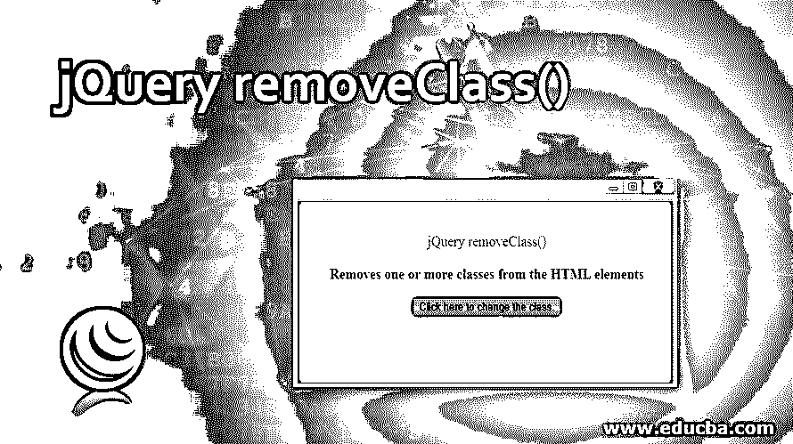
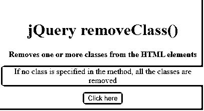
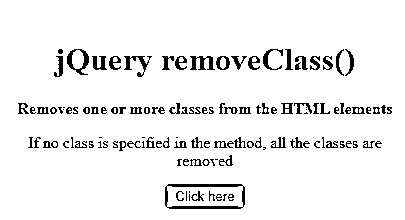
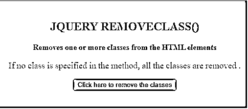
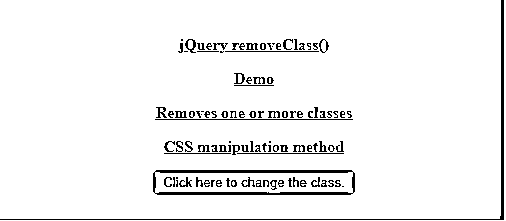
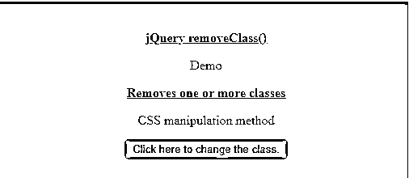
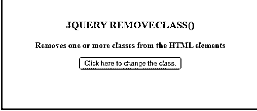

# jQuery removeClass()

> 原文:# t0]https://www . educba . com/jquery-remove class/




## jQuery removeClass()简介

jQuery removeClass()是一个内置的 jQuery 方法，用于从匹配元素集中的每个 HTML 元素中删除一个或多个指定的类。通过用空格分隔，可以从匹配元素集中一次删除多个类。如果一个类名作为参数传递给方法，这意味着只有那个特定的类将被删除。如果没有类名作为参数传递给 removeClass()方法，它将删除所有的类。jQuery removeClass()也可以用在 XML 文档中。

**语法**

<small>网页开发、编程语言、软件测试&其他</small>

```
$(selector).removeClass(classname,function(index,currentclass))
```

*   其中，classname 是一个可选参数，用于指定要删除的类。对于多个类，类名之间应该使用空格。
*   function(index，currentclass)也是一个可选参数，它指定返回一个或多个要删除的空格分隔的类名的函数。
*   index 是指当前元素在匹配集中的索引。
*   currentclass 是指所选元素的类名

### jQuery removeClass()的示例

以下是 jQuery removeClass()的示例:

#### 示例#1

以下示例说明了如何使用 jQuery removeClass()方法，通过将单个类作为参数传递来从选定的 HTML 元素中移除类。

**代码:**

```
<!DOCTYPE html>
<head>
<title>Example for jQuery removeClass() method</title>
<script src="https://code.jquery.com/jquery-1.12.4.min.js"></script>
<script>
$(document).ready(function () {
$("button").click(function () {
$("h1").removeClass("div2");
$("p").removeClass("highlight");
});
});
</script>
<style>
.div1 {
width: 400px;
height: 200px;
padding-top: 20px;
padding-left: 5px;
text-align: center;
background-color: cadetblue;
}
.div2 {
font-weight: bold;
color:blue;
}
.highlight {
background:yellow
}
</style>
</head>
<body>
<div class="div1">
<h1 class="div2">jQuery removeClass()</h1>
<p><strong>Removes one or more classes from the HTML elements</strong></p>
<p class="highlight">If no class is specified in the method, all the classes are removed </p>
<button type="button">Click here</button>
</div>
</body>
</html>
```

**输出**

*   下面的屏幕截图显示了执行上述代码后显示的页面。




*   单击“Click here”按钮时，removeClass()方法将从

    # 元素中删除类“div2 ”,从

    元素中删除类“highlight ”,如下面的屏幕截图所示。




#### 实施例 2

下面的示例说明了当多个类作为参数传递给 removeClass()方法时，该方法的用法。

**代码:**

```
<!DOCTYPE html>
<head>
<title>Example for jQuery removeClass() method</title>
<script src="https://code.jquery.com/jquery-1.12.4.min.js"></script>
<script>
$(document).ready(function () {
$("button").click(function () {
$("h2, p").removeClass("class1 class2 class3");
});
});
</script>
<style>
.divstyle {
width: 500px;
height: 200px;
padding-top: 20px;
padding-left: 5px;
text-align: center;
background-color: cadetblue;
}
.class1 {
color:maroon;
text-transform: uppercase;
}
.class2 {
font-size: 16px;
color: blueviolet;
}
.class3 {
font-size: 18px;
color:blue;
}
</style>
</head>
<body>
<div class="divstyle">
<h2 class="class1">jQuery removeClass()</h2>
<p class="class2"><strong> Removes one or more classes from the HTML elements</strong></p>
<p class="class3">If no class is specified in the method, all the classes are removed .</p>
<button>
Click here to remove the classes
</button>
</div>
</body>
</html>
```

**输出**

*   下面的屏幕截图显示了执行上述代码后显示的页面。




*   单击按钮时，removeClass()方法将从

    ## 元素中删除类“class1 ”,从

    元素中删除“class2”和“class3 ”,如下面的屏幕截图所示。


**Note:**  Multiple classes passed to the method are separated by space.

#### 实施例 3

下面是另一个简单的例子，展示了如何使用 removeClass()方法删除多个类。

**代码:**

```
<!DOCTYPE html>
<head>
<title>Example for jQuery removeClass() method</title>
<script src="https://code.jquery.com/jquery-1.12.4.min.js"></script>
<script>
$(document).ready(function () {
$("button").click(function () {
$( "p:odd" ).removeClass( "class1 class2" );
});
});
</script>
<style>
.divstyle {
width: 500px;
height: 200px;
padding-top: 20px;
padding-left: 5px;
text-align: center;
background-color: cadetblue;
}
.class1 {
font-weight: bold;
}
.class2 {
text-decoration: underline;
}
.class3{
color:maroon;
}
</style>
</head>
<body>
<div class="divstyle">
<p class="class1 class2 class3">jQuery removeClass()</p>
<p class="class1 class2 class3 ">Demo</p>
<p class="class1 class2 class3">Removes one or more classes</p>
<p class="class1 class2 class3 ">CSS manipulation method</p>
<button>
Click here to change the class.
</button>
</div>
</body>
</html>
```

**输出**

*   下面的屏幕截图显示了执行上述代码后显示的页面。




*   单击该按钮时，removeClass()方法将从匹配的一组

    元素(索引为奇数的所有

    元素)中删除类“class1”和“class2”，如下面的屏幕截图所示。




#### 实施例 4

以下示例说明了 jQuery 的 addClass()和 removeClass()方法之间的区别。

**代码:**

```
<!DOCTYPE html>
<head>
<title>Example for jQuery removeClass() method</title>
<script src="https://code.jquery.com/jquery-1.12.4.min.js"></script>
<script>
$(document).ready(function () {
$("button").click(function () {
$("p").removeClass("class_rem").addClass("class_add");
});
});
</script>
<style>
.divstyle {
width: 500px;
height: 200px;
padding-top: 20px;
padding-left: 5px;
text-align: center;
background-color: cadetblue;
}
.class_rem {
color:maroon;
font-size: 20px;
font-weight: bold;
text-transform: uppercase;
}
.class_add {
font-size: 18px;
color:blue;
}
</style>
</head>
<body>
<div class="divstyle">
<p class="class_rem">jQuery removeClass()</p>
<p><strong> Removes one or more classes from the HTML elements</strong></p>
<button>
Click here to change the class.
</button>
</div>
</body>
</html>
```

**输出**

*   下面的屏幕截图显示了执行上述代码后显示的页面。




*   单击按钮时，removeClass()方法将从所选的

    元素中删除类“class_rem ”,然后 addClass()将类“class_add”添加到所选的

    元素中，如下面的屏幕截图所示。

**T2】**


 **### 结论

在本文中，我们学习了 jQuery CSS 操作方法 removeClass()，该方法用于从一组选定的 HTML 元素中删除一个或多个类。removeClass()方法从匹配所选元素集的每个元素中删除指定的类。如果该方法没有指定参数，则所有的类都将从选定的元素中移除。

### 推荐文章

这是 jQuery removeClass()的指南。这里我们讨论 jQuery removeClass()的介绍以及相应的语法和示例。您也可以看看以下文章，了解更多信息–

1.  [jQuery 变更()](https://www.educba.com/jquery-change/)
2.  [JQuery InputMask](https://www.educba.com/jquery-inputmask/)
3.  [jQuery HTML()](https://www.educba.com/jquery-html/)
4.  [jQuery 链接](https://www.educba.com/jquery-chaining/)


**