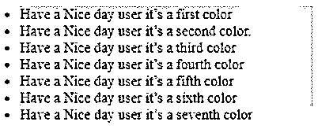
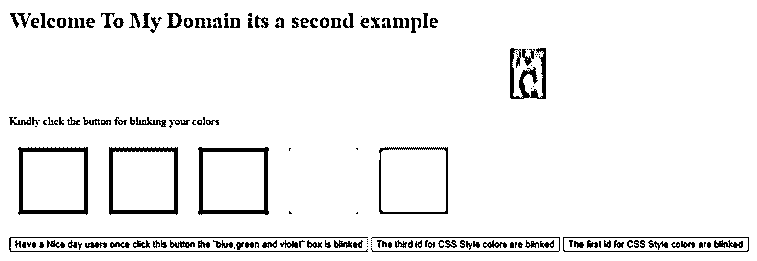
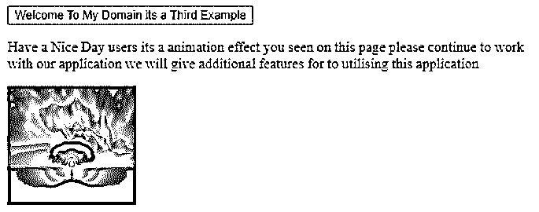
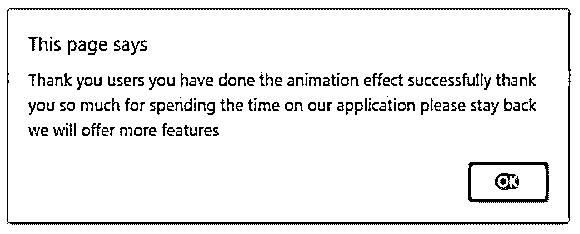
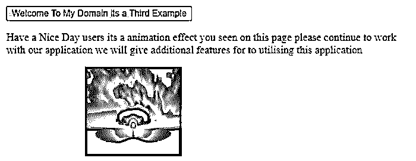

# jQuery 不是类

> 原文：<https://www.educba.com/jquery-not-class/>


## jQuery not 类简介

jQuery not()类被定义为选择器，它选择所有将被接受的 html 元素，除了某些元素。它主要用于与另一个选择器元素组合在一起，该选择器元素将选择除了要用组指定的一些元素之外的所有类似元素。“选择器”是主要的和必需的参数，用于指定 html 元素不被选择，并且该参数被任何种类的选择器接受，包括在脚本上使用的其他 html 元素。

**语法:**

<small>网页开发、编程语言、软件测试&其他</small>

在 jQuery library 中 not()是选择所有元素的选择器，它只接受除指定元素之外的一些元素。not()也是方法之一，它可以有“选择器和函数”参数，用于在脚本中传递元素。它还与其他元素一起用于选择应用程序上的 jQuery 库类。

```
<html>
<head>
<script src=https://ajax.googleapis.com/ajax/libs/jquery/3.5.1/jquery.min.js>
</script>
<script>
$(document).ready(function(){
$("htmlelement:not(selector or function)").css("","");
----some jQuery script logic codes-----------
});
</script>
</head>
<body>
----some logics depends on the user requirement---
</body>
</html>
```

上述代码是在应用程序的 jQuery 脚本中使用 not()方法的基本语法。

### jQuery 中的 not 类是如何工作的？

*   jQuery 库拥有用于在 web 应用程序中实现 UI 的默认类和方法。
*   更重要的是，它主要在前端层，像 not()方法被用来选择或定义与 html 元素相关的类、函数。
*   除了一些指定的元素之外，在 html 元素上已经选择的其他元素中也经常使用。
*   大多数情况下，它将与另一个选择器一起使用，以选择和使用除方法组上指定元素之外的其他元素中的属性。
*   我们使用了所有的选择器，比如 css 选择器，我们可以在 not()方法中将值作为字符串传递，它包括文本和其他注释节点，用于删除应用程序中不需要的节点。
*   通过使用 jQuery 对象，我们可以创建过滤过程，我们还指定了特定选择器上提到的已经应用于脚本的节点。
*   在过滤功能的帮助下，可能是数组或字符串值，这取决于要求，返回值将是布尔类型。排除的过滤集值将返回 true，而所有其他元素都包括在内并返回到表上。

### jQuery not 类的示例

下面给出了 jQuery not class 的例子:

#### 示例#1

**代码:**

```
<html>
<head>
<title>Welcome to My Domain it’s the First Example</title>
<script type = "text/javascript"
src="https://ajax.googleapis.com/ajax/libs/jquery/2.1.3/jquery.min.js">
</script>
<script type = "text/javascript" language = "javascript">
$(document).ready(function() {
$("li:not(.first)").css("background-color", "blue");
$("li:not(.second)").css("background-color", "solid-blue");
$("li:not(.third)").css("background-color", "green");
$("li:not(.four)").css("background-color", "red");
$("li:not(.five)").css("background-color", "violet");
$("li:not(.six)").css("background-color", "yellow");
$("li:not(.seven)").css("background-color", "pink");
});
</script>
</head>
<body>
<ul>
<li class="first">Have a Nice day user it’s a first color</li>
<li class="second">Have a Nice day user it’s a second color.</li>
<li class="third">Have a Nice day user it’s a third color</li>
<li class="four">Have a Nice day user it’s a fourth color</li>
<li class="five">Have a Nice day user it’s a fifth color</li>
<li class="six">Have a Nice day user it’s a sixth color</li>
<li class="seven">Have a Nice day user it’s a seventh color</li>
</ul>
</body>
</html>
```

**输出:**




在上面的例子中，我们使用了。带有参数的 not()方法具有。用于对特定 html 元素执行操作的选择器。通过使用 css 样式，id 被传递给的参数元素，以突出显示应用程序页面。

#### 实施例 2

**代码:**

```
<!DOCTYPE html>
<html>
<head>
<script src="http://ajax.googleapis.com/ajax/libs/jquery/1.11.1/jquery.min.js"></script>
<script>
$(document).ready(function(){
$("#first").click(function () {
$( "div" ).not( ".first").fadeTo('slow', 1.3).fadeTo('slow', 1.2)
});
$("#second").click(function () {
$( "div" ).not( ".second").fadeTo('slow', 0.75).fadeTo('slow', 1.3)
});
$("#third").click(function () {
$( "div" ).not( ".third").fadeTo('slow', 0.25).fadeTo('slow', 2.0)
});
$("#four").click(function () {
$( "div" ).not( ".four").fadeTo('slow', 1.2).fadeTo('slow', 1.6)
});
$("#five").click(function () {
$( "div" ).not( ".five").fadeTo('slow', 0.75).fadeTo('slow', 1.8)
});
});
</script>
</head>
<style>
.eg{
height:63px;
width:67px;
padding:17px;
margin:13px;
display:inline-block;
}
.third{
background-color:green;
}
.second{
background-color:red;
}
.first{
background-color:blue;
}
.four{
background-color:pink;
}
.five{
background-color:violet;
}
</style>
<body>
<h1> Welcome To My Domain its a second example</h1>
<marquee> </marquee>
<p> Kindly click the button for blinking your colors</p>
<div class="eg first"></div>
<div class="eg second"></div>
<div class="eg third"></div>
<div class="eg four"></div>
<div class="eg five"></div>
<p><button id="second">Have a Nice day users once click this button the "blue,green and violet" box is blinked</button> <button id="third"> The third id for CSS Style colors are blinked</button> <button id="first">The first id for CSS Style colors are blinked</button></p>
</body>
</html>
```

**输出:**




在第二个例子中，我们使用。not()方法使用不同的颜色框集。在我们选择了我们配置给特定颜色框的按钮后，它将会闪烁。此外，我们在《吸引力》中使用了用户视角的图像。

#### 实施例 3

**代码:**

```
<!DOCTYPE html>
<html>
<head>
<script src="https://ajax.googleapis.com/ajax/libs/jquery/3.5.1/jquery.min.js"></script>
<script>
$(document).ready(function(){
$("button").click(function(){
$("div").animate({left: '125px'});
});
});
$(document).ready(function(){
$("#eg").click(function () {
$( "div" ).not( ".eg").fadeTo('slow', 2.5).fadeTo('slow', 1.9);
});
});
</script>
<style>
eg{
height:63px;
width:67px;
padding:17px;
margin:13px;
display:inline-block;
background-color:violet;
}
</style>
</head>
<body>
<button onclick="demo()">Welcome To My Domain its a Third Example</button>
<p>Have a Nice Day users it’s an animation effect you seen on this page please continue to work with our application we will give additional features for to utilising this application</p>
<div style="background:pink;height:134px;width:145px;position:absolute;">

</div>
<script>
function demo()
{
alert("Thank you users you have done the animation effect successfully thank you so much for spending the time on our application please stay back we will offer more features");
}
</script>
</body>
</html>
```

**输出:**




**点击按钮后，输出为:**




**点击确定按钮后，输出为:**




在最后一个例子中，我们在 jQuery 库上使用了一些动画效果，我们还使用了 javascript 函数来显示特定图像的动画效果后的警告消息。在这里我们使用。not()方法，用于在脚本上使用 css 样式选择器。单击警告消息框后，图像移动到我们在脚本上配置的中心位置。

### 结论

通常，jQuery 库用于创建 UI 小部件，并吸引应用程序的前端层。像 not()方法是用于选择和利用脚本中 html 元素的内置方法之一。它支持所有类型的浏览器和运行应用程序的环境。

### 推荐文章

这是 jQuery 而不是 class 的指南。这里我们讨论一下入门，not class 在 jQuery 中是如何工作的？和示例。您也可以看看以下文章，了解更多信息–

1.  [jQuery 选择选项](https://www.educba.com/jquery-select-option/)
2.  [jQuery zindex](https://www.educba.com/jquery-zindex/)
3.  [jQuery 宽度](https://www.educba.com/jquery-width/)
4.  [jQuery id 选择器](https://www.educba.com/jquery-id-selector/)


