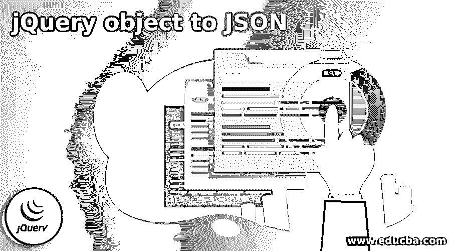
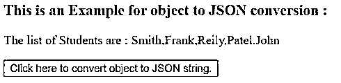
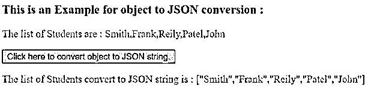
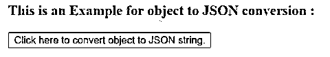
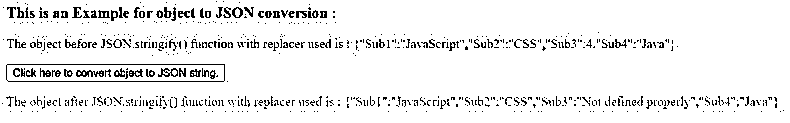
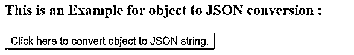
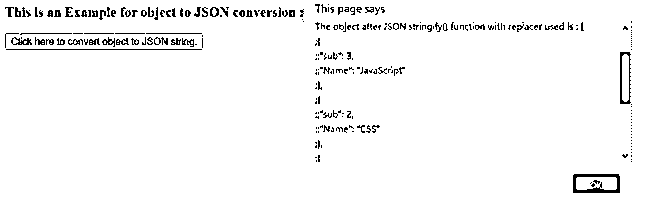

# JSON 的 jQuery 对象

> 原文：<https://www.educba.com/jquery-object-to-json/>




## JSON 的 jQuery 对象介绍

用 JSON.stringify()函数完成的 jQuery 对象到 JSON 的转换。jQuery JSON.stringify()用于将 JavaScript 值转换成 JSON 字符串。jQuery JSON.stringify()函数是 jQuery 中的内置函数。JSON 通常用于向 web 服务器或通过互联网发送数据或从 web 服务器接收数据，所以如果我们需要向 web 服务器发送 JavaScript 对象或值，那么首先它需要转换成 JSON 字符串，然后发送。如果提供了要替换的函数，jQuery JSON.stringify()函数将替换值；如果提供了 replacer 数组，则只添加指定的属性。

### jQuery JSON.stringify()函数的语法

下面给出了提到的语法:

<small>网页开发、编程语言、软件测试&其他</small>

```
JSON.stringify( value [, replacer [, space]] );
```

**参数:**

*   **值:**这不是可选参数。它指定要转换为 JSON 字符串的值。
*   **replacer:** 可选参数。它指定了改变字符串化过程行为的函数。
*   **space:** 这是一个可选参数。它指定在输出 JSON 字符串中插入空格，以提高可读性。它可以是数字或字符串值。

**返回值:**

这个函数的返回值是代表指定对象转换的 JON 字符串。

### jQuery 对象到 JSON 的转换

*   jQuery 对象到 JSON 的转换在 JSON.stringify()函数的帮助下执行，该函数接受三个参数。
*   假设我们有一个数字数组“no ['一'，'二'，'三'，'四']；”，接下来我们需要将数组对象转换成 JSON 字符串。
*   所以我们可以使用 JSON.stringify()函数作为“JSON . stringify(no)；”，它将返回一个 JSON 字符串["One "，" Two "，" Three "，" Four"]作为输出。

### JSON 的 jQuery 对象示例

下面给出了 JSON 的 jQuery 对象的例子:

#### 示例#1

用 JSON.stringify()函数将数组对象转换为 JSON 字符串的 jQuery 对象到 JSON 转换示例。

**代码:**

```
<!doctype html>
<html lang = "en">
<head>
<meta charset = "utf-8">
<script src = "https://code.jquery.com/jquery-3.5.0.js"></script>
<title  > This is an example for jQuery object to JSON conversion </title>
<style>
#p1 {
color : blue;
}
#p2 {
color : red;
}
</style>
</head>
<body>
<h3> This is an Example for object to JSON conversion : </h3>
<p id = "p1"> </p>
<button onclick = "checkRes()" > Click here to convert object to JSON string. </button>
<p id = "p2"> </p>
<script>
var Student = [ "Smith", "Frank", "Reily", "Patel", "John" ];
$( "#p1" ).text( "The list of Students are : " + Student );
function checkRes()
{
var res = JSON.stringify( Student );
$( "#p2" ).text("The list of Students convert to JSON string is : " + res);
}
</script>
</body>
</html>
```

**输出:**




**一旦我们点击元素列表，相应的输出是:**




在上面的代码中，创建了包含学生姓名的数组。接下来，使用 JSON.stringify()函数将学生数组转换为 JSON 字符串格式，即“JSON . stringify(Student)；”，函数返回 JSON 字符串格式，我们可以在上面的输出中看到。

#### 实施例 2

jQuery 对象到 JSON 转换的例子用 JSON.stringify()函数和 replacer 函数把对象转换成 JSON 字符串。

**代码:**

```
<!doctype html>
<html lang = "en">
<head>
<meta charset = "utf-8">
<script src = "https://code.jquery.com/jquery-3.5.0.js"></script>
<title> This is an example for jQuery object to JSON conversion </title>
<style>
#p1 {
color : blue;
}
#p2 {
color : red;
background-color : yellow;
}
</style>
</head>
<body>
<h3> This is an Example for object to JSON conversion : </h3>
<p id = "p1"> </p>
<button onclick = "checkRes()" > Click here to convert object to JSON string. </button>
<p id = "p2"> </p>
<script>
var obj = { Sub1: "JavaScript", Sub2: "CSS", Sub3: 4, Sub4: "Java" };
// replace value if it is number
function replacer(key, value) {
// Filtering out properties
if (typeof value === 'number') {
return "Not defined properly";
}
return value;
}
function checkRes()
{
$( "#p1" ).text("The object before JSON.stringify() function with replacer used is : " + JSON.stringify(obj));
$( "#p2" ).text( "The object after JSON.stringify() function with replacer used is : " + JSON.stringify( obj, replacer ));
}
</script>
</body>
</html>
```

**输出:**




**一旦我们点击按钮，输出是:**




在上面的代码中，创建了包含主题名称的对象。接下来，JSON.stringify()函数与 replacer 函数一起使用。该函数将 obj 对象转换为 JSON 字符串格式，如果 subject 值为“JSON.stringify( obj，replacer)；”则替换为“未正确定义”，其中 replacer 是函数的名称，以及我们在上面的输出中可以看到的函数的返回输出。

#### 实施例 3

jQuery 对象到 JSON 的转换示例，使用带 space 参数的 JSON.stringify()函数将对象转换为 JSON 字符串。

**代码:**

```
<!doctype html>
<html lang = "en">
<head>
<meta charset = "utf-8">
<script src = "https://code.jquery.com/jquery-3.5.0.js"></script>
<title> This is an example for jQuery object to JSON conversion </title>
<style>
#p1 {
color : blue;
}
#p2 {
color : red;
background-color : yellow;
}
</style>
</head>
<body>
<h3> This is an Example for object to JSON conversion : </h3>
<p id = "p1"> </p>
<button onclick = "checkRes()" > Click here to convert object to JSON string. </button>
<p id = "p2"> </p>
<script>
var obj = [{ sub: 3, Name: "JavaScript" },
{ sub: 2, Name: "CSS" },
{ sub: 4, Name: 4 },
{ sub: 1, Name: "Java" } ];
function checkRes()
{
alert("The object before JSON.stringify() function with replacer used is : " + JSON.stringify(obj) + "\nThe object after JSON.stringify() function with replacer used is : " + JSON.stringify( obj, null, ';' ));
}
</script>
</body>
</html>
```

**输出:**







在上面的代码中，创建了包含键值对的对象。接下来，JSON.stringify()函数与 space 参数一起使用。该函数将 obj 对象转换为 JSON 字符串格式，并通过“；”插入空格字符(分隔符)表示为“JSON.stringify( obj，null，'；”);”，其中 replacer 函数为 null，函数的返回输出我们可以在上面的输出中看到。

### 结论

jQuery JSON.stringify()函数是一个内置函数，用于将 JavaScript 值转换为 JSON 字符串。

### 推荐文章

这是一个 jQuery 对象到 JSON 的指南。这里我们讨论 jQuery 对象到 JSON 转换的介绍、工作原理和例子。您也可以看看以下文章，了解更多信息–

1.  [jQuery 选择选项](https://www.educba.com/jquery-select-option/)
2.  [jQuery zindex](https://www.educba.com/jquery-zindex/)
3.  [jQuery 宽度](https://www.educba.com/jquery-width/)
4.  [jQuery id 选择器](https://www.educba.com/jquery-id-selector/)


