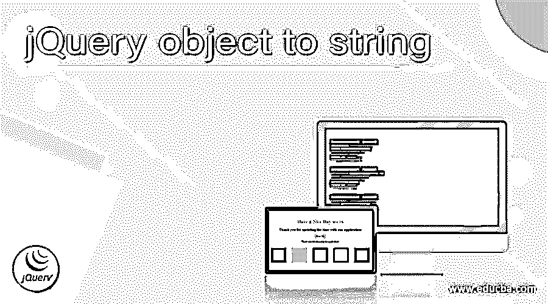
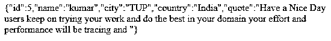
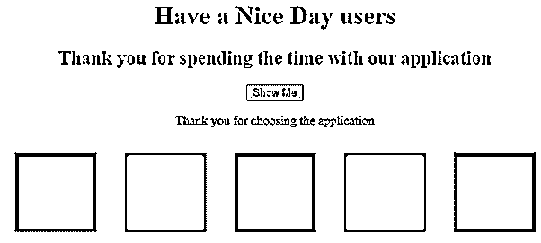
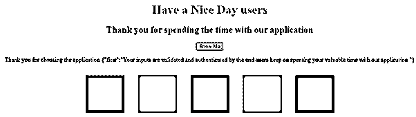
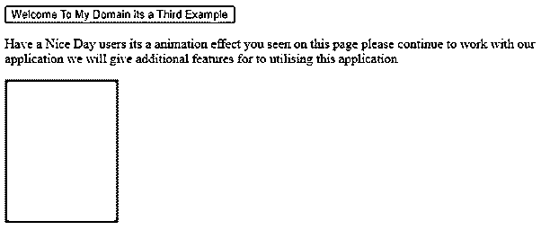
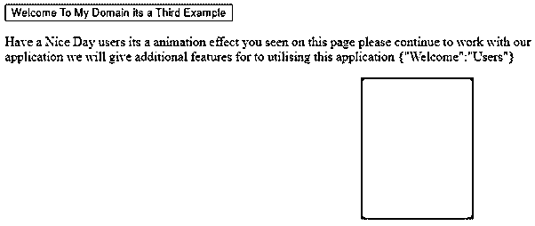

# jQuery 对象到字符串

> 原文：<https://www.educba.com/jquery-object-to-string/>




## jQuery 对象到字符串的介绍

jQuery object to string 是使用名为 JSON.stringify()的默认方法将对象转换为字符串格式的特性之一 要将对象转换为字符串并显示字符串内容，还会使用已创建的指定 html 元素对对象进行序列化。已操作的对象和序列化的对象显示为查询字符串，这些值使用键和值对进行追加。该方法不会在自定义对象中被覆盖。它返回对象类型，表示使用 html 元素指定的对象类型。

**语法:**

<small>网页开发、编程语言、软件测试&其他</small>

jQuery library 中有一组类和方法，它们可以形成一个基于 JavaScript 功能的独立框架。基本上，字符串是不可变的对象，它不包含任何值，也适用于由一个或多个字符组成和存储的独立变量。

```
<html>
<head>
<script src="https://ajax.googleapis.com/ajax/libs/jquery/3.4.0/jquery.min.js">
</script>
</head>
<body>
<script>
$("#elementid").text('');
var variablename =parameter : value ;
$("#elementid").text(JSON.stringify(variablename));
----some jquery and javascript functions and logics depends upon the user requirement---
</script>
</body>
</html>
```

上述代码是将 html 数据转换为字符串类型的基本语法。借助默认方法，如 JSON.stringify()方法。

### 如何在 jQuery 中将对象转换成字符串？

通常，JavaScript 有将对象转换为字符串或其他类型的默认方法。每当我们用值声明变量时，它指定了在变量上使用的类型。使用 jQuery 选择器和。文本方法我们可以调用 JSON.stringify()方法，并在 stringify()方法中传递变量名。通过使用选择器，我们可以选择已经在 html 元素 id 上声明的值，因为 html 元素是所有其他 html 元素的祖先，其他元素是标记元素的后代。jQuery 对象是使用 DOM 元素创建的，这个元素在 html 页面的一些其他方式中已经存在。我们可以使用标准编码符号转换或序列化对象，它将作为选择单个表单控件的对象符号。选择可以是任何类型的 html 元素，它也包括 jQuery 对象，它可以是单个或多个对象，它包含全局名称空间,$符号和变量越常用，它是调用脚本元素的一种更短、更简单的类型。

#### 示例#1

**代码:**

```
<!doctype html>
<html lang="en">
<head>
<meta charset="utf-8">
<title>Welcome To My Domain it’s a first Example</title>
<script src="https://code.jquery.com/jquery-3.5.0.js"></script>
</head>
<body>
<div id="first"></div>
<script>
var vars1 = {
id: 1,
name: "siva",
3
city: "TUP",
country:"India"
};
var vars2 = {
id: 2,
name: "raman",
city: "TUP",
country:"India"
};
var vars3 = {
id: 3,
name: "arun",
city: "TUP",
country:"India"
};
var vars4 = {
id: 4,
name: "kumar",
city: "TUP",
country:"India"
};
var vars5 = {
id: 5,
quote:"Have a Nice Day users keep on trying your work and do the best in your domain your effort and performance will be tracing and ",
city: "TUP",
country:"India"
};
$.extend( vars1, vars2, vars3, vars4, vars5);
$( "#first" ).append( JSON.stringify( vars1 ) );
</script>
</body>
```

**输出:**




以上示例是利用 stringify()方法将值转换为字符串格式的基本示例。这里，我们使用了带有属性值的基本变量声明，它会将值追加并转换为字符串格式。另外，extend()方法用于验证变量值中的条件。

#### 实施例 2

**代码:**

```
<!DOCTYPE html>
<html>
<head>
<title>
Welcome To My Domain its a second example
</title>
<script src=
"https://ajax.googleapis.com/ajax/libs/jquery/3.3.1/jquery.min.js">
</script>
<style>
.eg{
height:62px;
width:65px;
padding:19px;
margin:16px;
display:inline-block;
}
.third{
background-color:blue;
}
.second{
background-color:violet;
}
.first{
background-color:red;
}
.four{
background-color:orange;
}
.five{
background-color:green;
}
</style>
</head>
<body style="text-align:center;">
<h1 style = "color:blue;" >
Have a Nice Day users
</h1>
<h2>Thank you for spending the time with our application</h2>
<button>Show Me</button>
<div></div>
<p id="demo">
Thank you for choosing the application
</p>
<div class="eg first"></div>
<div class="eg second"></div>
<div class="eg third"></div>
<div class="eg four"></div>
<div class="eg five"></div>
<script>
$(document).ready(function() {
vars = new Object();
vars.first = "Your inputs are validated and authenticated by the end-users keep on spenting your valuable time with our application ";
$("button").click(function(){
$( "#demo" ).append( JSON.stringify( vars ) );
});
});
</script>
</body>
</html>
```

**输出:**







在第二个例子中，我们使用 javascript 函数通过 jQuery 库执行颜色操作。我们使用 append()之类的默认方法，在 html 元素的帮助下将字符串值连接到单个变量中，id 传递给 append()和 JSON.stringify()方法之类的特定方法。

#### 实施例 3

**代码:**

```
<!DOCTYPE html>
<html>
<head>
<script src="https://ajax.googleapis.com/ajax/libs/jquery/3.5.1/jquery.min.js"></script>
<style>
Welcome{
height:63px;
width:67px;
padding:17px;
margin:13px;
display:inline-block;
background-color:violet;
}
</style>
</head>
<body>
<button onclick="demo()">Welcome To My Domain its a Third Example</button>
<p id="new">
Have a Nice Day users its a animation effect you seen on this page please continue to work with our application we will give additional features for to utilising this application
</p>
<div style="background:violet;height:173px;width:137px;position:absolute;">
</div>
<script>
vars=new Object();
vars.Welcome="Users";
$(document).ready(function(){
$("button").click(function(){
$("div").animate({right: '135px'});
$( "#new" ).append( JSON.stringify( vars ) );
});
});
$(document).ready(function(){
$("#Welcome").click(function () {
$( "div" ).not( ".eg").fadeTo('slow', 3.3).fadeTo('slow', 3.3);
});
});
</script>
</body>
</html>
```

**输出:**







在最后一个例子中，我们在网页上使用了一些动画效果。单击按钮后，图像被拖动并移动到右侧，这产生了一些效果。使用 JSON.stringify()方法，我们还可以将值转换为字符串格式。

### 结论

jQuery 对象是创建变量值并将其存储到内存位置的主要部分。这里我们使用 stringify()方法将值转换为字符串格式，特别是我们可以将对象转换为字符串。对象可以是任何类型，如 JSON、array 等，以将其转换为字符串格式。

### 推荐文章

这是一个 jQuery 对象到字符串的指南。这里我们讨论如何在 jQuery 中将对象转换成字符串，并给出例子和输出。您也可以看看以下文章，了解更多信息–

1.  [jQuery 延期](https://www.educba.com/jquery-deferred/)
2.  [jQuery 窗口](https://www.educba.com/jquery-window/)
3.  [jQuery next()](https://www.educba.com/jquery-next/)
4.  [jQuery 全局变量](https://www.educba.com/jquery-global-variable/)


