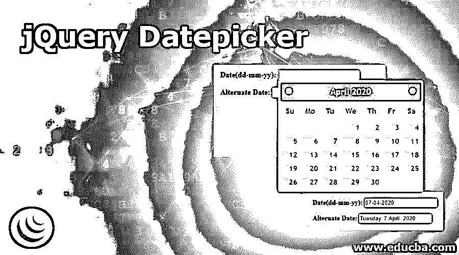
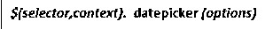
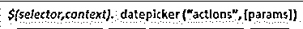
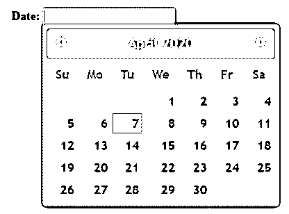
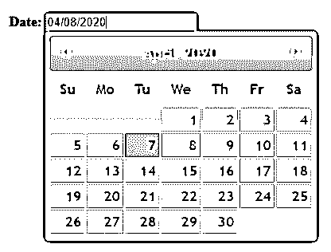
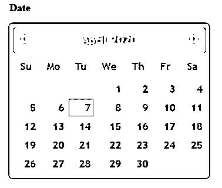
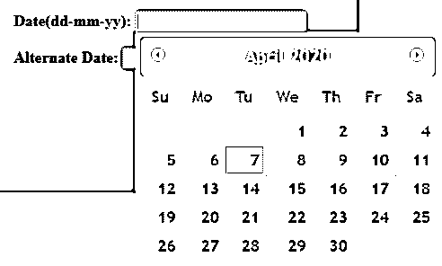
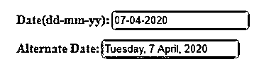
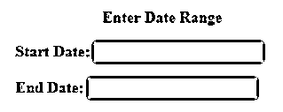
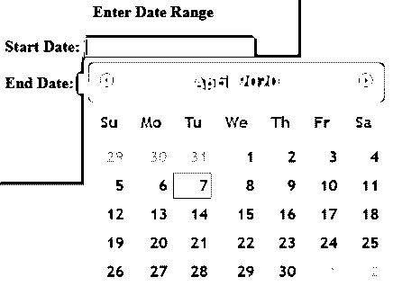

# jQuery 日期选择器

> 原文：<https://www.educba.com/jquery-datepicker/>




## jQuery 日期选择器简介

*   jQueryUI Datepicker 是一种将日期输入到输入字段的简单方法，它允许用户从弹出式或交互式内嵌日历中选择一个日期或日期范围。
*   日期选择器通常附加到文本框，以便将选定的日期从日历移动到文本框。
*   它是高度可定制的，允许用户:

*   jQueryUI 提供了一个 datepicker()方法来创建 datepicker，并通过添加新的 CSS 类来更改 HTML 元素的外观。
*   一个日期选择器可以很容易地附加到一个文本字段或内嵌在一个、或<input>控件中，并有适当的默认设置。
*   当附加的文本字段获得焦点时，交互式日历在一个小的覆盖图中打开。
*   对于内嵌日历，datepicker 可以附加到一个或元素。
*   选择日期后，单击页面上的任意位置可以将所选日期输入到附加的文本字段中。
*   要关闭弹出窗口，可以单击关闭链接，也可以单击页面上的任意位置

**语法:**

jQueryUI datepicker()方法有两种用法。

<small>网页开发、编程语言、软件测试&其他</small>

*   **$(选择器，上下文)。datepicker (options)方法。**

这个方法基本上声明了一个<input>元素或者

或者元素应该作为一个日期选择器来管理。




其中，options 参数是指指定 datepicker 元素的行为和外观的对象。

可以提供一个或多个选项，如下所示。


*   **$(选择器，上下文)。datepicker ("actions "，[params])方法。**

这个方法基本上是在日历上执行一个操作，比如选择一个新的日期。




其中，action 是该方法的第一个参数，它基本上是一个以字符串形式使用的 jQuery 方法。基于给定的操作，参数可以是一个或多个。

### jQuery 日期选择器的实现示例

以下是 jQuery Datepicker 的示例:

#### 示例#1

下面的例子说明了 **datepicker** 功能如何在不向 **datepicker** **()** 方法传递任何参数的情况下工作。

**代码:**

```
<!DOCTYPE html>
<head>
<title>jQuery UI Datepicker Example</title>
<link href="https://code.jquery.com/ui/1.10.4/themes/ui-lightness/jquery-ui.css" rel="stylesheet"/>
<script src="https://code.jquery.com/jquery-1.12.4.min.js"></script>
<script src="https://code.jquery.com/ui/1.10.4/jquery-ui.js"></script>
<script>
$(function () {
$("#datepick").datepicker();
});
</script>
<style>
#divstyle {
background-color: cadetblue;
width: 400px;
height: 300px;
margin-left: 100px;
padding-top: 30px;
padding-left: 30px;
}
</style>
</head>
<body>
<div id="divstyle">
<p style="font-weight: bold;">Date: <input type="text" id="datepick" /></p>
</div>
</body>
</html>
```

**输出**

*   下面的屏幕截图是在上面的代码执行后，页面第一次加载到浏览器中时拍摄的。




*   默认情况下，系统日期在日历中保持选中状态。
*   可以通过从日历中选择一个新日期来更改该日期，如下面的屏幕截图所示。




*   选择日期后，您可以单击页面上的任意位置来关闭日历弹出窗口。


#### 实施例 2

以下示例说明了 **jQueryUI** 的**内联** **日期选择器**功能。

**代码:**

```
<!DOCTYPE html>
<head>
<meta charset="utf-8" />
<title>jQuery UI Datepicker Example</title>
<link
href="https://code.jquery.com/ui/1.10.4/themes/ui-lightness/jquery-ui.css"
rel="stylesheet"
/>
<script src="https://code.jquery.com/jquery-1.12.4.min.js"></script>
<script src="https://code.jquery.com/ui/1.10.4/jquery-ui.js"></script>
<script>
$(function () {
$("#datepick").datepicker();
});
</script>
<style>
#divstyle {
background-color: cadetblue;
width: 350px;
height: 320px;
margin-left: 100px;
padding-top: 5px;
padding-left: 30px;
}
</style>
</head>
<body>
<div id="divstyle">
<p style="font-weight: bold;">Date</p>
<div id="datepick"></div>
</div>
</body>
</html>
```

**输出**

*   下面的屏幕截图是在上面的代码执行后，页面第一次在浏览器中加载时拍摄的。




在本例中，**、<、** div、**、>、**元素被用来获取内嵌日期选择器。

#### 实施例 3

以下示例说明了选项 appendText、dateFormat、altField 和 altFormat 与 jQueryUI datepicker 功能的用法。

**代码:**

```
<!DOCTYPE html>
<head>
<title>jQuery UI Datepicker Example</title>
<link
href="https://code.jquery.com/ui/1.10.4/themes/ui-lightness/jquery-ui.css"
rel="stylesheet"
/>
<script src="https://code.jquery.com/jquery-1.12.4.min.js"></script>
<script src="https://code.jquery.com/ui/1.10.4/jquery-ui.js"></script>
<script>
$(function () {
$("#datepick").datepicker({
dateFormat: "dd-mm-yy",
altField: "#datepick_1",
altFormat: "DD, d MM, yy",
});
});
</script>
<style>
#divstyle {
background-color: cadetblue;
width: 350px;
height: 200px;
margin-left: 100px;
padding-top: 5px;
padding-left: 30px;
}
</style>
</head>
<body>
<div id="divstyle">
<p style="font-weight: bold;">Date(dd-mm-yy): <input type="text" id="datepick" /></p>
<p style="font-weight: bold;">Alternate Date:   <input type="text" id="datepick_1" /></p>
</div>
</body>
</html>
```

**输出**

*   下面的屏幕截图显示了在执行上述代码后，第一次在浏览器中加载页面时的页面。




*   从日历中选择日期后，该日期将以 dd-mm-yy 格式输入文本字段。
*   第二个文本字段中显示的日期是相同的日期，但格式为“日、月、年”。




#### 实施例 4

以下示例说明了 jQueryUI datepicker 功能的 prevText、nextText、show Other Months 和 select Other Months 选项的用法。

**代码:**

```
<!DOCTYPE html>
<head>
<title>jQuery UI Datepicker Example</title>
<link
href="https://code.jquery.com/ui/1.10.4/themes/ui-lightness/jquery-ui.css"
rel="stylesheet"
/>
<script src="https://code.jquery.com/jquery-1.10.2.js"></script>
<script src="https://code.jquery.com/ui/1.10.4/jquery-ui.js"></script>
<script>
$(function () {
$("#datepick").datepicker({
prevText: "click for previous months",
nextText: "click for next months",
showOtherMonths: true,
selectOtherMonths: false,
});
$("#datepick_1").datepicker({
prevText: "click for previous months",
nextText: "click for next months",
showOtherMonths: true,
selectOtherMonths: true,
});
});
</script>
<style>
#divstyle {
background-color: cadetblue;
width: 300px;
height: 200px;
margin-left: 100px;
padding-top: 5px;
padding-left: 30px;
}
</style>
</head>
<body>
<div id="divstyle">
<p style="font-weight: bold; text-align: center;">Enter Date Range</p>
<p style="font-weight: bold;">
Start Date: <input type="text" id="datepick" />
</p>
<p style="font-weight: bold;">
End Date: <input type="text" id="datepick_1" />
</p>
</div>
</body>
</html>
```

**输出**

*   下面的截图是在上面的代码执行后，页面第一次加载到浏览器中时拍摄的。




*   现在，您可以在文本字段中选择并输入日期，还可以更改选择。




*   做出选择后，页面如下所示。


### 结论

*   在本文中，我们讨论了 jQueryUI datepicker 功能，这是一种通过使用内嵌日历在输入字段中选择和输入数据的更简单的方法。
*   该方法提供了自定义日期格式、限制日期范围、选择日期范围等选项。

### 推荐文章

这是一个 jQuery 日期选择器的指南。在这里，我们讨论 jQueryUI Datepicker 功能及其示例和代码实现。您也可以浏览我们推荐的其他文章，了解更多信息——

1.  [什么是 jQuery empty()？(例题)](https://www.educba.com/jquery-empty/)
2.  [如何使用 jQuery insertAfter()方法？](https://www.educba.com/jquery-insertafter/)
3.  [jQuery unload()方法的实现？](https://www.educba.com/jquery-unload/)
4.  [jQuery 验证示例指南](https://www.educba.com/jquery-validate/)
5.  [jQuery 包含](https://www.educba.com/jquery-contains/)的例子
6.  [jQuery 过滤器|示例](https://www.educba.com/jquery-filter/)
7.  [jQuery 工具提示示例](https://www.educba.com/jquery-tooltip/)


