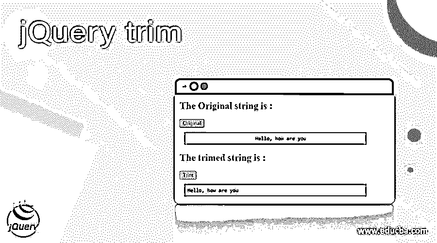
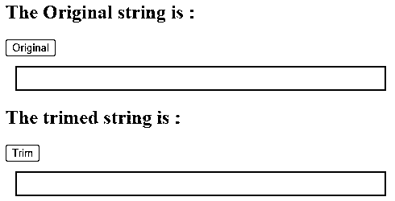
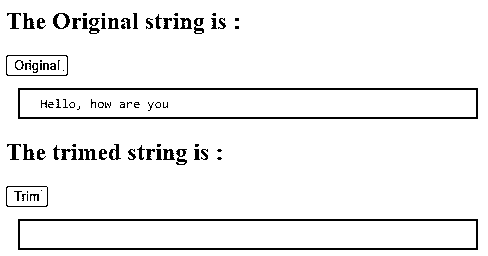
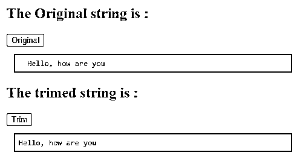
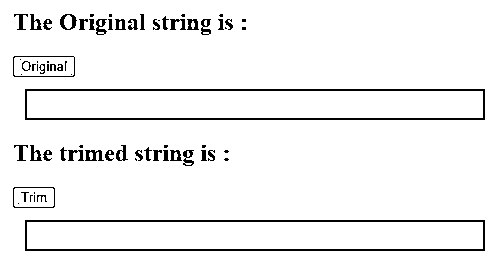
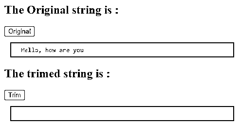
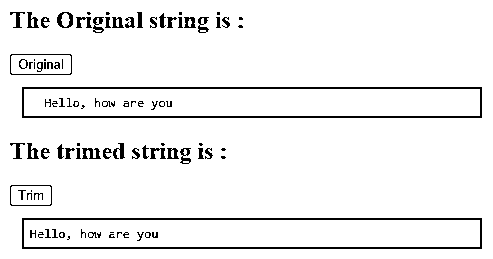
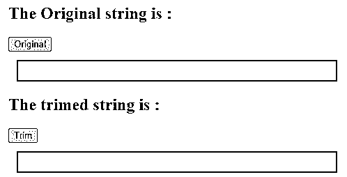
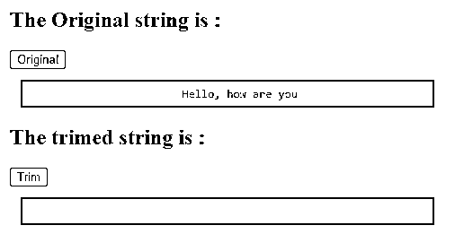
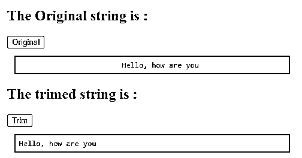

# jQuery trim

> 原文：<https://www.educba.com/jquery-trim/>




## jQuery trim 的定义

jQuery UI trim()方法用于删除字符串两端的空格。jQuery UI trim()方法是一个内置方法。有时我们需要修剪字符串，删除字符串开头和结尾的空白，但是保留字符串中间的空白，因此 jQuery 为此提供了 trim()方法。trim()方法是一个字符串方法，所以当我们调用这个方法时，我们将传递一个字符串参数。

JQuery trim()方法的语法。

<small>网页开发、编程语言、软件测试&其他</small>

```
jQuery.trim( mystr ) ;
```

参数–

*   **mystr–**这不是一个可选参数，它指定一个要被修剪的字符串。
*   **返回值-**这个方法的返回值是去掉两端空格后的字符串。

### jQuery trim 的示例

将字符串作为参数传递的 jQuery UI trim()方法示例。

接下来，我们编写 HTML 代码，通过下面的示例更清楚地理解 jQuery UI trim()方法，其中 trim()方法用于删除字符串两边的空格，如下所示。

#### 示例#1

**代码:**

```
<!doctype html>
<html lang = "en">
<head>
<meta charset="utf-8">
<title> This is an example for jQuery trim() method </title>
<script src= "https://ajax.googleapis.com/ajax/libs/jquery/3.3.1/jquery.min.js">
</script>
<style>
pre {
display : block;
border : 2px solid green;
color : red;
padding : 6px;
margin : 12px;
}
</style>
<script>
$(document).ready(function(){
$("#btn1").click(function(){
var str= "  Hello, how are you  ";
$(".original").html(str);
});
$("#btn2").click(function(){
var str= " Hello, how are you ";
var trimstr = jQuery.trim( str );
$(".trimmed").html(trimstr);
});
});
</script>
</head>
<body>
<h2> The Original string is : </h2>
<button id= "btn1"> Original </button>
<pre class= "original"> </pre>
<h2> The trimed string is : </h2>
<button id= "btn2">Trim</button>
<pre class= "trimmed"> </pre>
</body>
</html>
```

上述代码的输出是:




一旦我们点击“原始”按钮，输出是




一旦我们单击“Trim”按钮，输出就是:




在上面的程序中，字符串“Hello，how are you”存储在 str 变量中，如果我们看到这个字符串在字符串的开头和结尾包含空格。因此，为了删除这些空格，使用了 trim()方法，该方法接受“Hello，how are you”字符串并返回输出“Hello，how are you”，正如我们在输出中看到的那样。

字符串调用的 jQuery UI trim()方法示例。

接下来，我们编写 html 代码，通过下面的示例更清楚地理解 jQuery UI trim()方法，其中 trim()方法用于通过只对字符串调用 trim()方法来删除字符串左侧的空格，如下所示

#### 实施例 2

**代码:**

```
<!doctype html>
<html lang = "en">
<head>
<meta charset="utf-8">
<title> This is an example for jQuery trim() method </title>
<script src = "https://ajax.googleapis.com/ajax/libs/jquery/3.3.1/jquery.min.js">
</script>
<style>
pre {
display : block;
border : 2px solid green;
color : red;
padding : 6px;
margin : 12px;
}
</style>
<script>
$(document).ready(function(){
$("#btn1").click(function(){
var str= "  Hello, how are you";
$(".original").html(str);
});
$("#btn2").click(function(){
var str = " Hello, how are you";
str = str.trim( str );
$(".trimmed").html(str);
});
});
</script>
</head>
<body>
<h2> The Original string is : </h2>
<button id= "btn1"> Original </button>
<pre class= "original"> </pre>
<h2> The trimed string is : </h2>
<button id= "btn2">Trim</button>
<pre class= "trimmed"> </pre>
</body>
</html>
```

上述代码的输出是:




一旦我们点击“原始”按钮，输出是




一旦我们单击“Trim”按钮，输出就是




在上面的程序中，字符串“Hello，how are you”存储在 str 变量中，如果我们看到这个字符串只在前面包含空格。为了删除这个空格，使用 trim()方法，该方法接受“Hello，how are you”字符串并返回输出“Hello，how are you”，因此 trim()方法不会从字符串末尾删除任何内容，因为它在末尾不包含任何空格，正如我们在输出中看到的那样。

从字符串前端删除制表符的 jQuery UI trim()方法示例

接下来，我们编写 HTML 代码来理解 jQuery UI trim()方法，其中 trim()方法用于删除字符串左侧的制表符。

#### 实施例 3

**代码:**

```
<!doctype html>
<html lang = "en">
<head>
<meta charset="utf-8">
<title> This is an example for jQuery trim() method </title>
<script src = "https://ajax.googleapis.com/ajax/libs/jquery/3.3.1/jquery.min.js">
</script>
<style>
pre {
display : block;
border : 2px solid green;
color : red;
padding : 6px;
margin : 12px;
}
</style>
<script>
$(document).ready(function(){
$("#btn1").click(function(){
var str= "                         Hello, how are you";
$(".original").html(str);
});
$("#btn2").click(function(){
var str= "                         Hello, how are you";
var trimstr = jQuery.trim( str );
$(".trimmed").html(trimstr);
});
});
</script>
</head>
<body>
<h2> The Original string is : </h2>
<button id= "btn1"> Original </button>
<pre class= "original"> </pre>
<h2> The trimed string is : </h2>
<button id= "btn2">Trim </button>
<pre class= "trimmed"> </pre>
</body>
</html>
```

上述代码的输出是:




一旦我们点击“原始”按钮，输出是:




一旦我们单击“Trim”按钮，输出就是:




在上面的程序中，字符串“Hello，how are you”存储在 str 变量中，如果我们看到这个字符串只在前面包含制表符。为了删除这个空格，使用 trim()方法，该方法接受“Hello，how are you”字符串并返回输出“Hello，how are you”。

### 结论

jQuery UI trim()方法是一个内置方法，用于删除字符串两端的空格，而不是中间的空格。

### 推荐文章

这是一个 jQuery trim 的指南。在这里，我们还将讨论 jQuery UI trim()方法的描述和示例及其代码实现。您也可以看看以下文章，了解更多信息–

1.  [jQuery 查找子节点](https://www.educba.com/jquery-find-child/)
2.  [jQuery UI 可删除](https://www.educba.com/jquery-ui-droppable/)
3.  [JQuery attr()](https://www.educba.com/jquery-attr/)
4.  [jQuery 禁用按钮](https://www.educba.com/jquery-disable-button/)


