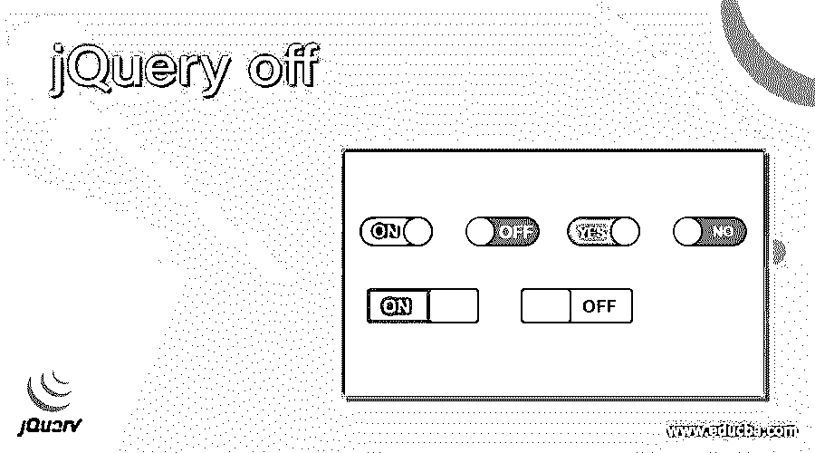
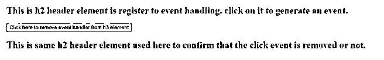
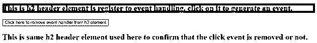
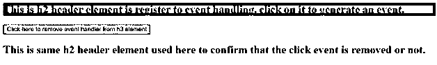
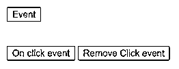
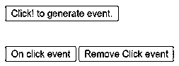
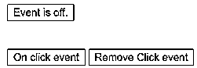
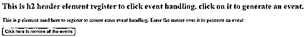
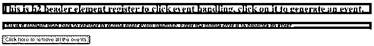
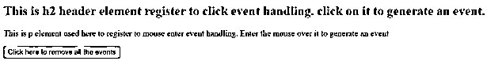

# jQuery 关闭

> 原文：<https://www.educba.com/jquery-off/>




## jQuery off 的定义

jQuery off()方法用于移除事件处理程序。jQuery off()方法是 jQuery 中的内置方法。off()方法通过 on()方法移除附加到 html 元素的事件处理程序。unbind()、die()和 undelegate()方法被 off()方法取代，这为 API 带来了很大的一致性。不带任何参数的 off()方法删除附加到该元素的所有处理程序。要删除特定的处理程序，可以传递事件名称、选择器、命名空间或处理程序函数名称。

**语法:**

<small>网页开发、编程语言、软件测试&其他</small>

```
$( selector ).off( event, selector, function( eventObj ), map);
```

**参数:**

*   **选择器**–这不是一个可选参数，指定要删除其附加事件处理程序的元素。
*   **event**–这不是一个可选参数，它指定事件或命名空间或来自所选元素的 to。如果有多个事件，那么每个事件用空格隔开。
*   **Function(event obj)**–这是一个可选参数，指定要运行以处理事件的函数的名称。
*   **map**–这不是一个可选参数，它指定一个事件映射，该映射是一个键-值对，其中键指定事件，值指定各自的处理函数。

### jQuery off()方法的工作原理

jQuery off()方法用于移除由 on()方法附加到元素的事件处理程序。例如，一个简单的事件“click”被传递给 off()方法，所有“click”类型的事件都从元素中移除。请注意，传递给 off()方法的选择器字符串必须与传递给 on()方法的字符串相匹配。通过在 off()方法中使用特殊字符“**”，从一个元素中删除所有委托事件，而不删除非委托事件。

### jQuery off()方法的示例

接下来，我们编写 html 代码，通过下面的示例更清楚地理解 jQuery off()方法，其中 off()方法用于从 h3 元素中删除单击事件处理程序，如下所示

#### 示例 1–删除单个事件处理程序

**代码:**

```
<!doctype html>
<html lang = "en">
<head>
<meta charset="utf-8">
<title> This is an example for jQuery off() method </title>
<script src="https://ajax.googleapis.com/ajax/libs/jquery/3.5.1/jquery.min.js"> </script>
<script>
$(document).ready(function() {
$("h2").on("click", function() {
$(this).css("background-color", "red");
});
$("button").click(function() {
$("h2").off("click");
});
});
</script>
</head>
<body>
<h2> This is h2 header element register to event handling. click on it to generate an event. </h2>
<button> Click here to remove event handler from h3 element </button>
<h2> This is same h2 header element used here to confirm that the click event is removed or not. </h2>
</body>
</html>
```

**输出:**




一旦我们点击上方的 h2 元素内容，输出是:




接下来点击“点击此处删除 h3 元素的事件处理程序”，并点击下方的 h2 内容。现在，它不会生成任何事件，因为该事件已从 h2 元素中移除，输出为–




在上面的代码中，h2 元素注册到 click 事件，稍后通过使用按钮内部的 off()方法移除 click 事件。因此，一旦我们单击按钮，off()方法就会得到一个调用，并删除该事件。那是当我们点击下方 h2 内容的按钮后，它的背景没有变成红色。

#### 示例 2–用处理函数删除事件处理程序

接下来，我们编写 HTML 代码来理解 jQuery off()方法，其中 off()方法用于从按钮元素中移除 click 事件处理程序，并将处理程序函数名传递给它来处理事件，如下所示

**代码:**

```
<!doctype html>
<html lang = "en">
<head>
<meta charset="utf-8">
<title> This is an example for jQuery off() method </title>
<script src="https://ajax.googleapis.com/ajax/libs/jquery/3.5.1/jquery.min.js"> </script>
</head>
<body>
<button id="id1" > Event </button> <br><br><br>
<button id="on"> On click event </button>
<button id="off"> Remove Click event </button>
<div style="display:none;"> Event Generated and Handled </div>
<script>
function flash() {
$( "div" ).show().fadeOut( "slow" );
}
$( "#on" ).click(function() {
$( "body" )
.on( "click", "#id1", flash )
.find( "#id1" )
.text( "Click! to generate event." );
});
$( "#off" ).click(function() {
$( "body" )
.off( "click", "#id1", flash )
.find( "#id1" )
.text( "Event is off." );
});
</script>
</body>
</html>
```

**输出:**




一旦我们点击“点击事件”按钮，输出是




现在事件就在那个按钮上，如果我们点击“点击！为了生成事件”，它以淡出样式显示“事件生成和处理”文本。

接下来，当我们单击“删除点击事件”按钮时，输出是




与上面的程序一样，创建了三个按钮。“event”按钮是通过使用 on()方法为 click 事件注册的。“点击事件”按钮用于打开“事件”按钮上的事件，最后一个“删除点击事件”按钮用于关闭“事件”按钮上的“事件”。

#### 示例 3–从多个元素中移除多个事件处理程序

接下来，我们编写 HTML 代码来理解 jQuery off()方法，其中 off()方法用于从多个元素中删除多个不同类型的事件处理程序，如下所示

**代码:**

```
<!doctype html>
<html lang = "en">
<head>
<meta charset="utf-8">
<title> This is an example for jQuery off() method </title>
<script src="https://ajax.googleapis.com/ajax/libs/jquery/3.5.1/jquery.min.js"> </script>
<script>
$(document).ready(function() {
$("h2").on("click", function() {
$(this).css("background-color", "red");
});
$("p").on("mouseenter", function() {
$(this).css("background-color", "red");
});
$("button").click(function() {
$("*").off();
});
});
</script>
</head>
<body>
<h2> This is h2 header element register to click event handling. click on it to generate an event. </h2>
<p> This is p element used here to register to mouse enter event handling. Enter the mouse over it to generate an event </p>
<button> Click here to remove all the events </button>
</body>
</html>
```

**输出:**




一旦我们单击 h3 内容，并将鼠标放在 p 内容上，就会生成事件，如下面的输出所示。




接下来刷新页面，点击“单击此处删除所有事件”按钮，然后点击 h3 内容，将鼠标放在不会生成事件的 p 内容上，因为此按钮调用 off()方法，从不同的元素中删除所有不同类型的事件，如下面的输出所示。




### 结论

jQuery off()方法是一个内置方法，用于从元素中移除事件处理程序，这些事件处理程序由 on()方法附加。

### 推荐文章

这是一个 jQuery off 的指南。这里我们分别讨论 jQuery off 的描述、jQuery off()方法的语法、参数和工作方式，并给出例子。您也可以看看以下文章，了解更多信息–

1.  [jQuery 扩展](https://www.educba.com/jquery-extend/)
2.  [jQuery 修剪](https://www.educba.com/jquery-trim/)
3.  [jQuery 第一个孩子](https://www.educba.com/jquery-first-child/)
4.  [jQuery UI 可删除](https://www.educba.com/jquery-ui-droppable/)


