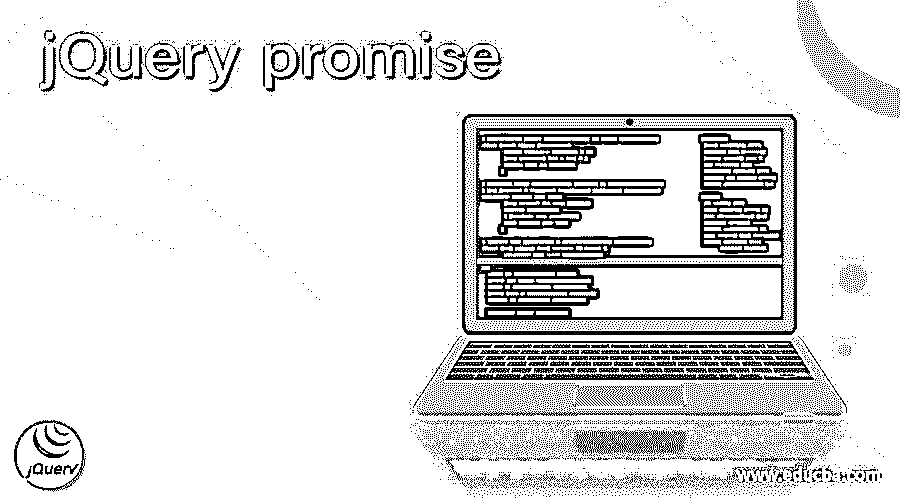
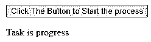
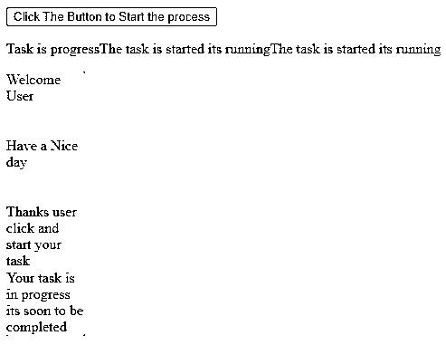
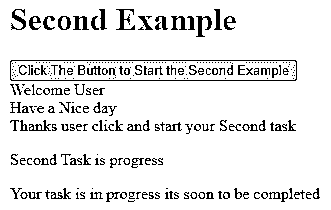
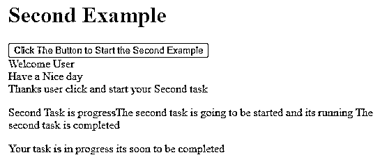
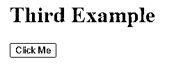
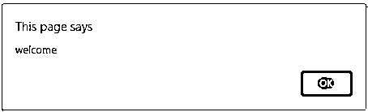
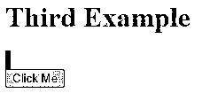

# jQuery 承诺

> 原文：<https://www.educba.com/jquery-promise/>




## jQuery promise 简介

jQuery promise()是默认方法之一，用于返回不需要的或未确认的对象，无论是静态类型还是动态类型，但已经执行了一些用户事件、操作和其他操作，这些操作可以在所有部分(如集合、堆栈、队列等)中解决，但默认情况下，一些参数应在 promise()中传递，如“type”和“target ”,这两个参数已返回数据类型，如 string、integer、 等等，队列对象计算了这个类型，目标参数就像另一个已经存在的对象一样，所以它将附加路径，并且可以使用 promise()方法进行验证。

**语法:**

<small>网页开发、编程语言、软件测试&其他</small>

jQuery 是 javascript 库之一，用于创建更复杂的网页。它有自己的默认方法、变量和关键字。同样，promise()是一个默认方法，它必须返回 promise 对象，该对象已经执行了用户定义的操作和其他带有某些实用程序类型(如集合和队列)的事件。在 jQuery 中使用 promise()方法的基本语法如下。

```
<html>
<head>
<script src=”[https://code.jquery.com/jquery-3.5.0.js](https://code.jquery.com/jquery-3.5.0.js)”>
</script>
<body>
<script>
$("html tags").default method("click", function(){
$("html tags"). default method ("user operations");
------same like above UI codes which is required depends upon the project----
$("html tags").promise().done(function() {
$("html tags").append("it can be checked the user operations its already worked in the background or not if its there it has been confirmed using these promise() method");
-----some jQuery UI codes based on the requirements---
</script>
</body>
</html>
```

### jQuery 中的 promise 函数是如何工作的？

promise()方法主要用于后台监控用户输入事件、动作等，每当在 web 应用中执行动作时，实例在内存中被创建，它将被分配到堆存储空间。通过使用这种方法，这将被确认和监视的行动，所以它可以通过像集合，触发器，队列和堆栈等实用程序承诺。在 jquery 中，实例是在需要的地方创建的，它将用于分配内存空间。promise()方法将返回对象来收集和观察所有的东西，如用户定义的具有特定类型的动作，如数据集合、队列和堆栈等。它用于动态地解析输入动作、按钮、触发器和事件，以便通过 promise()方法返回对象。在 promise()中，方法将传递类似“类型”和“目标”的参数，这两个参数在满足所有条件的情况下通过方法传递。类型可以是任何数据类型，如字符串、整数等。数据通过队列过程收集和形成，主要用户输入数据是字符串和整数，其中字符串是此类型参数的最重要部分。target 参数是可以通过 promise 方法满足的对象类型之一，它已经在现有对象的帮助下得到验证。在类型参数中，使用自定义动作，如动画、图像等。这些动作在用户输入的帮助下执行和触发。promise 方法中使用的对象将验证其行为，并且延迟的对象也将使用默认的方法进行存储，如。每个 HTML 输入标记元素的 data()。

同样，如果输入数据已经存在并且被覆盖，那么可以使用 remove()方法删除它，那么可以使用 data()方法添加输入数据。因为 remove()方法将删除 HTML 数据元素，所以它可以是不需要的或未确认的对象，它可以被解析。在 remove 方法执行之前，它将确认 dom 元素将被解析，以便可以使用 promise()方法附加和分离现有对象。

### 例子

让我们讨论 jQuery promise 的例子。

#### 示例#1

**代码:**

```
<!doctype html>
<html lang="en">
<head>
<meta charset="utf-8">
<title>Welcome To My Domain</title>
<style>
div {
height: 73px;
width: 87px;
float: center;
margin-right: 17px;
display: none;
background-color: Pink;
}
</style>
<script src="https://code.jquery.com/jquery-3.5.0.js"></script>
</head>
<body>
<button>Click The Button to Start the process</button>
<p> Task is progress</p>
<div> Welcome User</div>
<div> Have a Nice day</div>
<div> Thanks user click and start your task</div>
<div> Your task is in progress its soon to be completed</div>
<script>
$( "button" ).on( "click", function() {
$( "p" ).append( "The task is started its running" );
$( "div" ).each(function( j ) {
$( this ).fadeIn().fadeOut( 6300 * ( j + 3 ) );
});
$( "div" ).promise().done(function() {
$( "p" ).append( " The task is completed " );
});
});
</script>
</body>
</html>
```

**输出:**







#### 实施例 2

**代码:**

```
<!doctype html>
<html lang="en">
<head>
<meta charset="utf-8">
<title>Welcome To My Domain</title>
<style>
ex34 {
height: 77px;
width: 67px;
float: left;
margin-right: 19px;
}
</style>
<script src="https://code.jquery.com/jquery-3.5.0.js"></script>
</head>
<body>
<h1 style="color:red">
Second Example
</h1>
<button>Click The Button to Start the Second Example</button>
<div> Welcome User</div>
<div> Have a Nice day</div>
<div> Thanks user click and start your Second task</div>
<p> Second Task is progress</p>
<div> Your task is in progress its soon to be completed</div>
<script>
$( "button" ).on( "click to start the second task", function() {
$( "p" ).append( "The second task is going to be started and its running" );
$( "ex34" ).each(function( ) {
$( this ).fadeOut(78655);
});
$( "ex34" ).promise().done(function() {
$( "p" ).append( " The second task is completed " );
});
});
</script>
</body>
</html>
```

**输出:**







#### 实施例 3

**代码:**

```
<!doctype html>
<html lang="en">
<head>
<script src="https://code.jquery.com/jquery-3.5.0.js"></script>
<style>
first {
width: 506px;
height: 213px;
border: 3px solid blue;
}
</style>
</head>
<body>
<h1 style="color:red">
Third Example
</h1>
<div id="i1"></div>
<button>
Click Me
</button>
<script>
var vr = $("<first/>").attr({
id: "third element"
});
$("button").on("click", function() {
$("#i1").append(vr);
demo().done(function() {
alert("welcome");
});
})
function demo() {
return $("#third element").fadeOut(3200).promise();
}
</script>
</body>
</html>
```

**输出:**










### 结论

该方法的 jQuery 实现 promise()将会以各种方式使用，并且它还允许用户输入来避免一些将会在前端和后端过程中发生的同步任务。通过使用 deferred 和其他一些 promise 方法将在应用程序中处理这些任务。

### 推荐文章

这是一个 jQuery promise 的指南。这里我们也讨论一下 jQuery 中的 promise 函数的介绍和工作原理？以及不同的示例及其代码实现。您也可以看看以下文章，了解更多信息–

1.  [jQuery 引用](https://www.educba.com/jquery-reference/)
2.  [jQuery 扩展](https://www.educba.com/jquery-extend/)
3.  [jQuery UI 可删除](https://www.educba.com/jquery-ui-droppable/)
4.  [jQuery 小部件](https://www.educba.com/jquery-widgets/)


