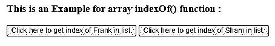
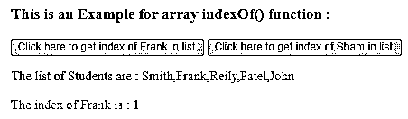
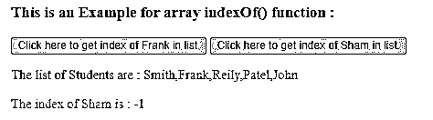
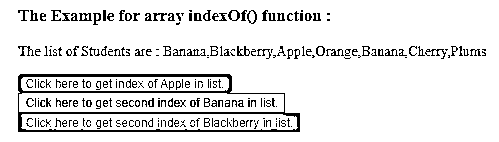
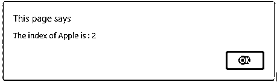
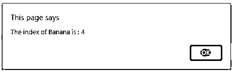
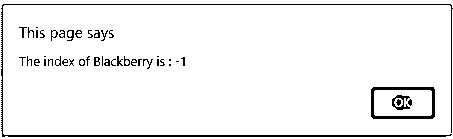
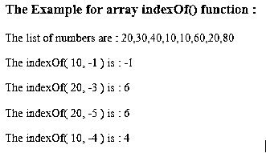

# jQuery 索引 Of

> 原文：<https://www.educba.com/jquery-indexof/>


## **jQuery 索引的定义**

jQuery array indexOf()函数用于返回给定数组中特定元素的第一个匹配项的索引。jQuery 数组 indexOf()函数是 jQuery 中的内置函数。jQuery array indexOf()函数在给定的数组中搜索指定的元素，如果元素找到了，则返回从左开始第一次出现的元素，如果在数组中没有找到，则返回-1。对元素的搜索也可以从指定的索引或位置开始，如果未指定起始索引，则搜索从索引为 0 的起点开始。要从末尾开始搜索，我们可以使用 lastIndexOf()函数。

**语法:**

<small>网页开发、编程语言、软件测试&其他</small>

```
array.indexOf(element, startIndex);
```

**参数:**

*   **元素**–这不是可选参数。它指定要在数组中搜索的元素。
*   **startIndex**–这是一个可选参数。它指定开始搜索元素的索引值。
*   **返回值-**该函数的返回值是指定元素的索引值。

### JQuery 数组 indexOf()函数的工作原理

JQuery array indexOf()函数接受两个参数，第一个参数是要在给定数组中搜索的元素，第二个参数是搜索开始处的索引值。假设我们有一个主题数组" subject = [ "English "，" Hindi "，" Science" ]"，现在我们需要得到" Science "主题的索引。所以我们可以使用数组 indexOf()函数作为“subject.indexOf( "Science ")”，它将返回 2 作为输出，这是 subject 数组中“Science”元素的索引。

### 例子

获取元素索引值的 jQuery 数组 indexOf()函数示例

#### 示例#1

```
<!doctype html>
<html lang="en">
<head>
<meta charset="utf-8">
<script src="https://code.jquery.com/jquery-3.5.0.js"></script>
<title> This is an example for jQuery array indexOf() function </title>
<style>
#p1 {
color: blue;
}
#p2 {
color: red;
}
</style>
</head>
<body>
<h3> This is an Example for array indexOf() function : </h3>
<button onclick = "checkPosRes()" > Click here to get index of Frank in list. </button>
<button onclick = "checkNegRes()" > Click here to get index of Sham in list. </button>
<br>
<p id = "p1"> </p>
<p id = "p2"> </p>
<script>
var Student = [ "Smith", "Frank", "Reily", "Patel", "John" ];
function checkPosRes()
{
$( "#p1" ).text("The list of Students are : " + Student);
var res = Student.indexOf( "Frank" );
$( "#p2" ).text("The index of Frank is : " + res);
}
function checkNegRes()
{
$( "#p1" ).text("The list of Students are : " + Student);
var res = Student.indexOf( "Sham" );
$( "#p2" ).text("The index of Sham is : " + res);
}
</script>
</body>
</html>
```

上述代码的输出是




一旦我们点击第一个按钮，输出是




一旦我们点击第二个按钮，输出是




在上面的代码中，创建了包含学生姓名的数组。接下来，使用 indexOf()函数从学生数组中获取 Frank 和 Sham 的索引，作为“Student . index of(" Frank ")；”和" student . index of(" Sham ")；"对于 Frank，索引值返回为 1，对于 Sham，索引值返回为-1，因为 Sham 不在数组中。

jQuery array indexOf()函数的示例，使用搜索的 startIndex 值从给定数组中获取元素的索引

#### 实施例 2

**代码:**

```
<!doctype html>
<html lang="en">
<head>
<meta charset="utf-8">
<script src="https://code.jquery.com/jquery-3.5.0.js"></script>
<title> This is an example for jQuery array indexOf() function </title>
</head>
<body>
<h3> The Example for array indexOf() function : </h3>
<p id = "p1"> </p>
<button onclick = "checkRes()" style = "background-color : green" > Click here to get index of Apple in list. </button>
<br>
<button onclick = "checkPosRes()" style = "background-color : yellow" > Click here to get second index of Banana in list. </button>
<br>
<button onclick = "checkNegRes()" style = "background-color : grey" > Click here to get second index of Blackberry in list. </button>
<br>
<script>
var fruits = [ "Banana", "Blackberry", "Apple", "Orange", "Banana", "Cherry", "Plums" ];
$( "#p1" ).text("The list of Students are : " + fruits);
function checkRes()
{
var res = fruits.indexOf( "Apple", 1 );
alert("The index of Apple is : " + res);
}
function checkPosRes()
{
var res = fruits.indexOf( "Banana", 3 );
alert("The index of Banana is : " + res);
}
function checkNegRes()
{
var res = fruits.indexOf( "Blackberry", 2 );
alert("The index of Blackberry is : " + res);
}
</script>
</body>
</html>
```

上述代码的输出是




一旦我们点击第一个按钮，输出是




一旦我们点击第二个按钮，输出是




一旦我们单击第三个按钮，输出是




在上面的代码中，创建了包含一些水果名称的数组。接下来，使用数组 indexOf()函数获取苹果、香蕉和黑莓的索引，作为“fruits.indexOf( "Apple "，1)；”，" fruits.indexOf( "Banana "，3)；"以及“fruits.indexOf(“黑莓”，2)；”.函数返回苹果的索引 2(从索引 1 开始搜索到最后一个，在索引 2 之间找到苹果)，返回香蕉的索引 4(从索引 2 开始搜索到最后一个，在索引 4 之间找到香蕉)和返回黑莓的索引 1(从索引 2 开始搜索到最后一个，在索引 2 之间没有找到黑莓)。

jQuery array indexOf()函数的示例，使用负 startIndex 值从给定数组中获取元素的索引，以便进行搜索

#### 实施例 3

**代码:**

```
<!doctype html>
<html lang="en">
<head>
<meta charset="utf-8">
<script src="https://code.jquery.com/jquery-3.5.0.js"></script>
<title> This is an example for jQuery array indexOf() function </title>
</head>
<body>
<h3> The Example for array indexOf() function : </h3>
<p id = "p1"> </p>
<p id = "p2"> </p>
<p id = "p3"> </p>
<p id = "p4"> </p>
<p id = "p5"> </p>
<br>
<script>
var no = [ 20, 30, 40, 10, 10, 60, 20, 80 ];
$( "#p1" ).text("The list of numbers are : " + no);
var res = no.indexOf( 10, -1 );
$( "#p2" ).text("The indexOf( 10, -1 ) is : " + res);
var res = no.indexOf( 20, -3 );
$( "#p3" ).text("The indexOf( 20, -3 ) is : " + res);
var res = no.indexOf( 20, -5 );
$( "#p4" ).text("The indexOf( 20, -5 ) is : " + res);
var res = no.indexOf( 10, -4 );
$( "#p5" ).text("The indexOf( 10, -4 ) is : " + res);
</script>
</body>
</html>
```

上述代码的输出是–




在上面的代码中，创建了包含一些数字的数组。接下来，使用数组 indexOf()函数获取一些起始索引为负的数字的索引。当我们传递负的 startIndex 值时，搜索从数组的长度加上 startIndex 值开始，-1 表示最后一个元素，-2 表示最后第二个元素，依此类推，正如我们在上面的输出中看到的，搜索是从索引 0 执行到数组的长度加上指定的索引。

### 结论

jQuery array indexOf()函数是一个内置函数，用于获取给定数组中特定元素第一次出现的索引。

### 推荐文章

这是一个 jQuery indexOf 的指南。这里我们讨论 JQuery 数组 indexOf()函数的描述、语法、工作原理，以及代码实现的例子。您也可以看看以下文章，了解更多信息–

1.  [jQuery removeClass()](https://www.educba.com/jquery-removeclass/)
2.  [jQuery 延期](https://www.educba.com/jquery-deferred/)
3.  [jQuery 窗口](https://www.educba.com/jquery-window/)
4.  [jQuery 移动元素](https://www.educba.com/jquery-move-element/)


