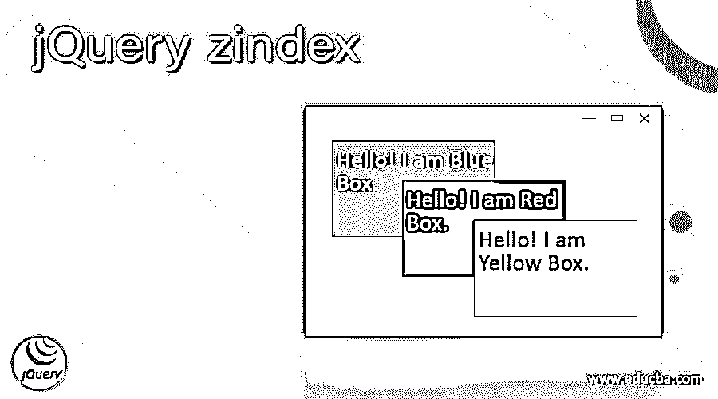
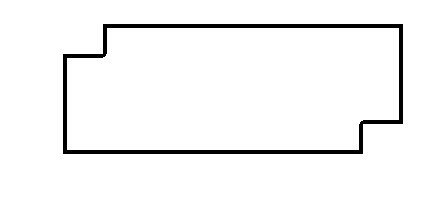
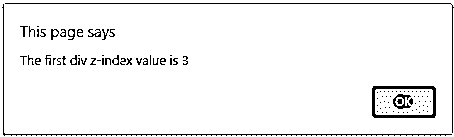
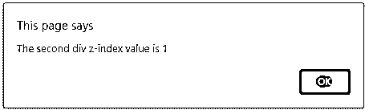
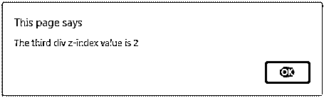
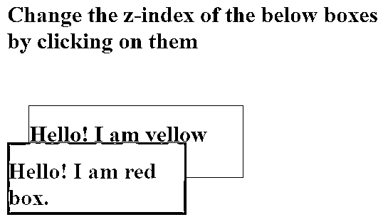
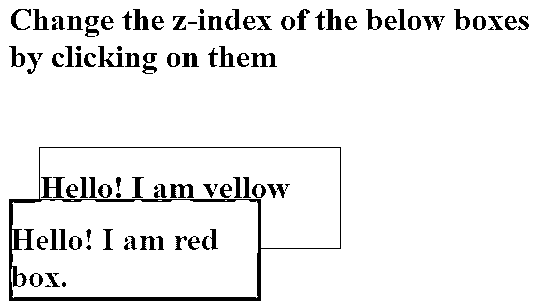

# jQuery zindex

> 原文：<https://www.educba.com/jquery-zindex/>




## jQuery zindex 的定义

jQuery zindex()函数用于设置或获取元素的 z 索引。jQuery zindex()函数是 jQuery 中的内置函数。不带任何参数的 zindex()函数用于获取元素的 z 索引。带有参数(z-index 属性值)的 zindex()函数用于设置元素的 z-index 值。z-index 指定元素的堆栈顺序。具有最高堆叠顺序的元素总是出现在具有最低堆叠顺序的元素之前。z-index 使用定位元素，如 position: absolute、position: relative、position: sticky 或 position: fixed。z 索引的默认值是 auto。不推荐使用的 zindex()函数已经从 jQuery UI 1.10 版本库中移除，取而代之的是，我们可以将它用作 css 属性。

**语法:**

<small>网页开发、编程语言、软件测试&其他</small>

获取元素的 z 索引值的语法:

```
.zIndex();
```

**返回值–**该函数的返回值是元素的 z 索引属性值。

设置元素的 z 索引值的语法–

```
.zIndex(zindex);
```

**参数:**

**zindex–**这不是可选参数，指定 z-index 属性的值。

### jQuery zindex()函数的工作原理

jQuery zindex()函数用于设置或获取元素的 z 索引属性值。如果我们没有传递任何参数，那么 zindex()函数返回一个元素的 z-index 值，无论 z-index 是直接设置在元素上还是设置在它的一个祖先上。为了找到 z 索引值，zindex()函数从指定的元素开始，遍历 DOM，直到确定一个已经定位并设置了 z 索引的元素。但是如果没有这样的元素，那么 zindex()函数将返回 0 值。

函数的作用是:设置一个元素的 z 索引值。它的性能与相同。css("zIndex "，zIndex)属性有。

### jQuery zIndex()函数示例

接下来，我们通过下面的例子编写 HTML 代码来更清楚地理解这个函数，其中 jQuery zindex 属性用于获取元素的 zindex 值，如下所示。

#### 示例#1

**代码:**

```
<!doctype html>
<html lang = "en">
<head>
<meta charset="utf-8">
<title> This is an example for jQuery zindex function </title>
<script src = "https://ajax.googleapis.com/ajax/libs/jquery/3.3.1/jquery.min.js"> </script>
</head>
<script>
$(document).ready(function() {
$("#id1").on("click", function() {
alert("The first div z-index value is "+$('#id1').css('z-index'));
});
$("#id2").on("click", function() {
alert("The second div z-index value is "+$('#id2').css('z-index'));
});
$("#id3").on("click", function() {
alert("The third div z-index value is "+$('#id3').css('z-index'));
});
});
</script>
<body>
<body>
<br><br>
<div id = "id1"; style = "background-color:red;
width :300px;
height :100px;
top :10px;
left :80px;
position :relative;
z-index :3;">
</div>
</div>
<div id = "id3"; style = "background-color:yellow;
width :300px;
height :100px;
top :-60px;
left :35px;
position :relative;
z-index :2;">
</div>
<div id = "id2"; style = "background-color:green;
width :300px;
height :100px;
top :-220px;
left :120px;
position :relative;
z-index :1;">
</div>
</body>
</html>
```

上述代码的输出是:




一旦我们点击红框，输出是:




当我们单击绿色方框时，输出是:




当我们单击黄色框时，输出是:




与上面的程序一样，创建了三个盒子，并为它们分配了一些 z 索引值以进行堆叠。后来，每个框都被附加到“onclick”事件上，所以一旦我们单击它，事件就开始生成，z-index 值通过使用这个“$('#id ')打印出来。css('z-index ')"代码。

用于单参数传递的 jQuery zIndex()函数示例-

接下来，我们编写 html 代码来理解 jQuery zIndex()函数，其中 zIndex()函数用于执行该函数并将单个对象传递给该函数，如下所示。

#### 实施例 2

**代码:**

```
<!doctype html>
<html lang = "en">
<head>
<meta charset="utf-8">
<title> This is an example for jQuery zindex() function </title>
<script src = "https://ajax.googleapis.com/ajax/libs/jquery/3.3.1/jquery.min.js"> </script>
</head>
<script>
function fun1() {
document.getElementById("id1").style.zIndex = "-1";
}
function fun2() {
document.getElementById("id2").style.zIndex = "-1";
}
</script>
<body>
<h1> Change the z-index of the below boxes by clicking on them </h1>
<div id = "id2" onclick = "fun2()" style="background-color: yellow;
position: relative;
width: 300px;
height: 100px;
top: 50px;
left: 30px;
border: 1px solid black;" >
<h1> Hello! I am yellow box. </h1>
</div>
<div id = "id1" onclick = "fun1()" style="background-color: red;
position: absolute;
width: 250px;
height: 100px;
border: 1px solid black;">
<h1> Hello! I am red box. </h1>
</div>
</body>
</html>
```

上述代码的输出是:




一旦我们点击“红框”，输出是:


一旦我们点击“黄框”，输出是:




与上面的程序一样，创建了两个盒子。稍后，当我们单击相应的框时，将设置每个框的 z 索引值，正如我们在上面的输出中看到的那样。单击该框后，将显示使用 document . getelementbyid(" my div ")style . zindex = "-1 "设置的各个框的 z 索引值；“代码。

### 结论

jQuery zIndex()函数是 jQuery 中的内置函数，但现在已被弃用并被移除。jQuery zIndex()函数用于设置或获取元素的 z 索引。

### 推荐文章

这是一个 jQuery zindex 的指南。在这里，我们还将讨论 jQuery zindex()函数的描述和工作方式，以及不同的示例和代码实现。您也可以看看以下文章，了解更多信息–

1.  [jQuery Easing](https://www.educba.com/jquery-easing/)
2.  [jQuery 扩展](https://www.educba.com/jquery-extend/)
3.  [jQuery 修剪](https://www.educba.com/jquery-trim/)
4.  [jQuery UI Selectmenu](https://www.educba.com/jquery-ui-selectmenu/)


