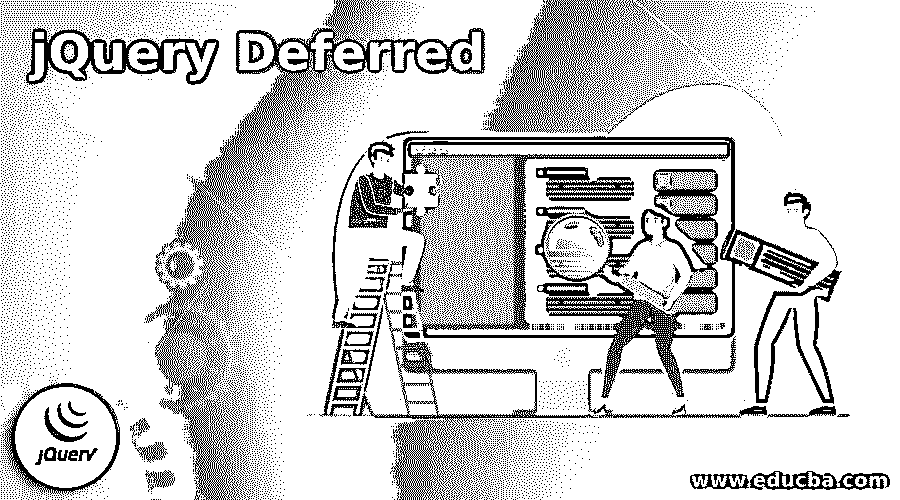
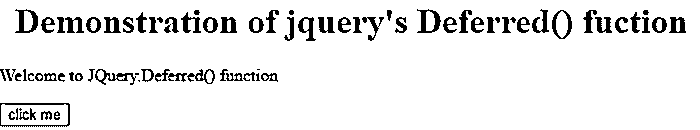
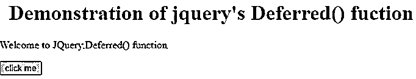
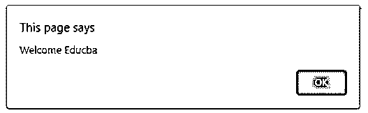
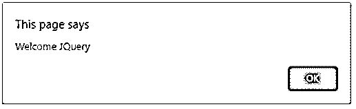

# jQuery 延迟

> 原文：<https://www.educba.com/jquery-deferred/>




## jQuery 简介延期

在 jQuery 中，deferred()是一个函数，它被定义为通过调用 deferred()函数来创建延迟对象的函数，deferred()函数是 JQuery 可链接的实用程序对象。因为 jquery 对象是可链接的，所以这个方法也有自己的方法，通过直接链接对象创建或保存可以存储在变量中的对象，我们可以使用这些链接的方法中的任何一个，这些方法可以在具有延迟对象的变量上调用。一般来说，deferred()函数被定义为用于创建延迟对象的函数，该延迟对象用于注册回调队列中的许多回调，还用于调用回调以及指定诸如失败或成功、异步或同步函数之类的状态。

### jQuery 中 deferred()函数的工作原理

在本文中，我们将讨论 JQuery deferred()方法，该方法又有许多不同的方法链接到 deferred()函数，该函数用于注册多个回调，这些回调位于回调队列中，回调队列调用用于指定方法状态的回调，例如同步和异步函数的成功或失败。这个 deferred()函数返回并创建一个新的延迟对象。现在让我们看看下面的语法和例子:

<small>网页开发、编程语言、软件测试&其他</small>

**语法:**

```
jquery.Deferred([beforestart])
```

**参数:**

*   **Beforestart:** 该参数用于指定在构造函数返回之前调用的函数。在本文中，我们还将看到与这个 deferred()函数相关联的不同方法，其中一些方法定义如下:
*   **deferred.notify():在延迟对象创建后对该函数的任何调用都将被忽略、拒绝或解决。**
*   **deferred.then():**
*   **deferred.promise():** 该函数也用于返回被延期人的承诺对象。此函数防止其他代码中断内部请求的执行或状态，这是异步函数所允许的。
*   **deferred.state():** 该函数用于以字符串格式标识当前被延迟对象的状态，其中被延迟对象可以是挂起、解析或拒绝。该功能主要用于调试。
*   **Deferred.when():** 当我们需要回调函数基于零个以上的 then able 对象执行时，使用该函数，并且该函数返回 resolved promise，没有参数传递给该函数。

### jQuery 延迟的示例

让我们来看一个 Jquery 的 deferred()函数的例子，它使用了一些上面提到的可链接的函数:

#### 示例#1

**代码:**

```
<!DOCTYPE HTML>
<html>
<head>
<title>Educba Institution
</title>
<script src="https://code.jquery.com/jquery-3.5.0.js">
</script>
</head>
<body style="text-align:left;">
<h1 style="color:blue;text-align: center;">
Demonstration of jquery's Deferred() fuction
</h1>
<p id="FUNC_UP">
</p>
<button onclick = "def_meth();">
click me
</button>
<p id="FUNC_DOWN">
</p>
<script>
varv_up = document.getElementById("FUNC_UP");
v_up.innerHTML = "Welcome to JQuery.Deferred() function";
function def_Func1(value, div){
$(div).append("This call is from doneCallbacks - " + value);
}
function def_Func2(value, div){
$(div).append("This call is from failCallbacks - " + value);
}
function def_Func3(value, div){
$(div).append("This call is from progressCallbacks - " + value);
}
function def_meth() {
vardef_obj = $.Deferred();
def_obj.then(def_Func1, def_Func2, def_Func3);
def_obj.notify( 'Deferred "def" is notified.<br/>', '#FUNC_DOWN');
def_obj.resolve( 'Deferred "def" is resolved.<br/>', '#FUNC_DOWN');
$('#FUNC_DOWN').text('In this the deferred state is ' + def_obj.state() + ' ');
}
</script>
</body>
</html>
```

**输出:**




在上面的截图中，当你点击“点击我”按钮时。




在上面的程序中，我们首先使用 jquery 中使用的 on click 命令创建了一个按钮“click me ”,因此当单击该按钮时，使用 deferred()函数在 function meth()中新创建的延迟对象也是由 function 命令定义的。然后，为了显示按钮描述，我们创建了 id 为“FUNC_UP”的标签

,它将显示一条消息“欢迎使用 JQuery”。Deferred() function”，然后我们为每个回调定义函数 def_Func1、def_Func2 和 def_Func3，当它由 doneCallbacks 完成时，对于回调的失败，我们使用 failCallbacks，对于仍在进行中的回调，我们分别为所有 3 个函数使用 progress Callbacks，我们将值和 div 作为参数传递给所有这 3 个函数， 这 3 个函数作为参数传递给 deferred.then()函数，以便它可以在解析延迟对象“def_obj”时或在使用 notify()函数通知并使用 resolve()函数解析的过程中调用添加处理程序。 在这段代码中，我们还使用了 state()函数，当在 then()和 resolves()函数之前定义或声明该函数时，延迟对象的状态将为 pending，如果 state()函数在 then()和 resolve()函数之后定义，则延迟对象的状态将显示为 resolved。上面的截图可以看到上面代码的输出。

#### 实施例 2

在下面的例子中，让我们看看 Deferred()函数的 promise()方法。

**代码:**

```
<!DOCTYPE HTML>
<html>
<head>
<title>Educba Institution
</title>
<script src="https://code.jquery.com/jquery-3.5.0.js">
</script>
</head>
<body style="text-align:left;">
<h1 style="color:blue;text-align: center;">
Demonstration of jquery's Deferred() function
</h1>
<script>
var v= {
txt: function( name )
{
alert( "Welcome " + name );
}
},
def_obj = $.Deferred();
def_obj.promise( v);
def_obj.resolve( "Educba" );
v.done(function( name ) {
v.txt( name );
}).txt( "JQuery" );
</script>
</body>
</html>
```

**输出:**







在上面的程序中，我们可以看到我们只是使用 Deferred()函数的 promise()函数来显示欢迎消息，方法是返回变量“v”的 def_obj 对象，该对象又定义了一个函数来打印带有连接名称的欢迎消息。

### 结论

在本文中，我们得出结论，jquery 中的 retried Deferred()函数主要是一个实用程序对象，它包含 state()、then()、when()、promise()等链式方法，用于将回调注册到回调队列中。在本文中，我们看到了如何声明和定义 deferred()函数，以及如何创建一个新对象和使用上面示例中的链接函数。

### 推荐文章

这是一个 jQuery 延迟指南。这里我们还讨论了 jquery 中 deferred()函数的介绍和工作原理，以及不同的例子和代码实现。您也可以看看以下文章，了解更多信息–

1.  [jQuery 引用](https://www.educba.com/jquery-reference/)
2.  [jQuery 修剪](https://www.educba.com/jquery-trim/)
3.  [jQuery UI 可删除](https://www.educba.com/jquery-ui-droppable/)
4.  [jQuery 扩展](https://www.educba.com/jquery-extend/)


