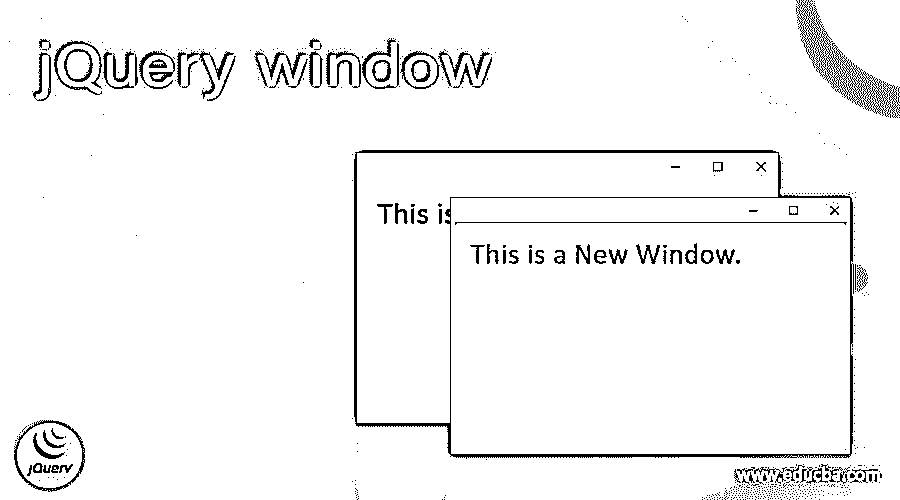
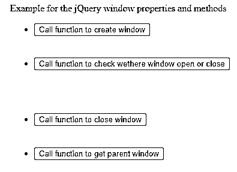
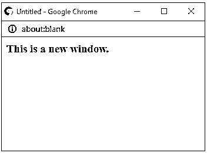
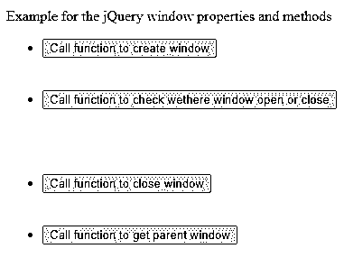
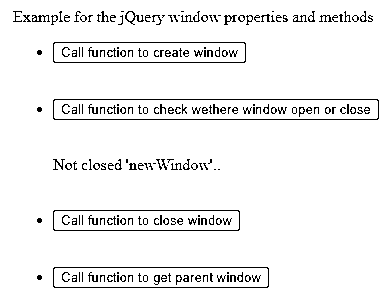
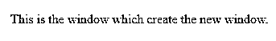

# jQuery 窗口

> 原文：<https://www.educba.com/jquery-window/>




## jQuery 窗口的定义

jQuery window 对象表示浏览器中打开的窗口。窗口对象由浏览器自动创建。假设我们的文档包含多个框架，那么浏览器为 HTML 文档创建一个窗口对象，并为每个框架创建额外的窗口对象。窗口对象不是 jQuery 或 JavaScript 的对象，它是浏览器的对象。几乎所有的浏览器都支持窗口对象，但是没有适用于窗口对象的公共标准。

### jQuery 窗口的属性

窗口对象的属性包括:

<small>网页开发、编程语言、软件测试&其他</small>

*   **closed–**该属性表示一个窗口是否关闭，它返回一个布尔值。
*   **控制台–**该属性返回控制台对象，用于登录到浏览器的控制台。
*   这个属性用来设置或获取窗口状态栏的默认文本。
*   **Document–**该属性用于获取窗口的文档对象。
*   **frame element—**该属性用于获取当前窗口中的< iframe >元素。
*   **frames—**这个属性用来获取当前窗口中所有的< iframe >元素。
*   **History–**该属性用于获取窗口的历史对象。
*   **inner height–**这个属性用来获取带有滚动条的窗口的内容区域的高度。
*   **inner width–**该属性用于获取带有滚动条的窗口内容区域的宽度。
*   **length—**该属性用于获取当前窗口中的< iframe >元素的数量
*   **local storage–**该属性允许在 web 浏览器中存储没有截止日期的键/值对。
*   **Location–**该属性用于获取窗口的位置对象。
*   **name–**该属性用于设置或获取窗口的名称。
*   **navigator–**该属性用于获取窗口的 navigator 对象。
*   **opener–**该属性用于获取创建该窗口的窗口的引用。
*   **outer height–**该属性用于获取浏览器窗口的高度，包括滚动条或工具栏。
*   **outer width–**该属性用于获取浏览器窗口的宽度，包括滚动条或工具栏。
*   **pageXOffset–**该属性用于获取当前文档在窗口左上角(水平方向)的滚动像素。
*   **page yo offset–**该属性用于从窗口的左上角(垂直方向)获取当前文档的滚动像素。
*   **parent–**该属性用于获取当前窗口的父窗口。
*   **Screen–**该属性用于获取窗口的屏幕对象。
*   这个属性用来获取窗口相对于屏幕的水平坐标。
*   这个属性用来获取窗口相对于屏幕的垂直坐标。
*   这个属性用来获取窗口相对于屏幕的水平坐标。
*   这个属性用来获取窗口相对于屏幕的垂直坐标。
*   **session storage–**该属性允许在 web 浏览器中存储一个会话的键/值对数据。
*   **scrollX–**这是 pageXOffset 的别名。
*   **scrollY–**这是 pageYOffset 的别名。
*   **self–**这个属性用来获取当前窗口。
*   **status–**该属性用于获取或设置窗口的状态栏文本。
*   **top–**该属性用于获取最顶层的浏览器窗口。

### jQuery 窗口的方法

*   **alert–**该方法用于显示一个警告框，其中包含一些消息和一个 OK 按钮。
*   **确认–**该方法用于显示一个对话框，其中包含一些信息、一个确定和一个取消按钮。
*   **atob–**该方法用于解码使用 Base64 编码的数据串。
*   **btoa–**该方法用于使用 base-64 编码一串数据。
*   **模糊–**该方法用于从当前窗口移除焦点。
*   **focus—**该方法用于在当前窗口设置焦点。
*   **clear interval–**该方法用于取消由 setInterval()设置的定时器。
*   **clear time out–**该方法用于取消由 setTimeout()设置的定时器。
*   **打开-**该方法用于打开新的浏览器窗口。
*   **关闭-**该方法用于关闭当前窗口。
*   **getComputedStyle–**该方法用于获取应用元素的当前 CSS 样式。
*   **get Selection–**该方法用于获取选择对象，该对象指定用户选择的文本，如一个范围。
*   **match media–**该方法用于获取 MediaQueryList 对象，该对象指定最常用的方法和属性对，即 matches 属性。
*   **move by–**该方法用于相对于当前位置移动窗口
*   **move to–**该方法用于将窗口移动到特定位置
*   **打印-**该方法用于打印当前窗口的内容。
*   **提示—**该方法用于提示用户输入。
*   **requestAnimationFrame–**该方法用于请求浏览器进行动画更新，以在下一次重画之前调用一个函数。
*   **resize to–**该方法用于将窗口调整到给定的宽度和高度。
*   **resize by–**该方法用于根据给定像素调整窗口大小。
*   **scroll to–**该方法用于将文档滚动到给定的坐标。这是不推荐使用的 scroll()方法的替换方法。
*   **scroll by–**该方法用于将文档滚动到给定的像素数。
*   **setTimeout–**该方法用于在给定的毫秒数后计算表达式或调用函数。
*   **setInterval–**该方法用于计算表达式或调用函数，或以毫秒为单位的给定时间间隔。
*   **停止-**该方法用于停止窗口的加载。

### 例子

jQuery 窗口对象使用属性和方法的示例。接下来，我们编写 HTML 代码，通过下面的例子更清楚地理解 jQuery 窗口对象，在这个例子中，我们使用窗口对象的属性和方法，如下所示

**代码:**

```
<!doctype html>
<html lang = "en">
<head>
<meta charset="utf-8">
<title> This is an example for jQuery window object </title>
<script src = "https://ajax.googleapis.com/ajax/libs/jquery/3.3.1/jquery.min.js">
</script>
</head>
<script>
var nwindow;
function fun_open() {
nwindow = window.open("", "newWindow", "width=500, height=500");
nwindow.document.write("<h3>This is a new window.</h3>");
}
function property_apply() {
if (!nwindow) {
document.getElementById("text").innerHTML = "Not opened 'newWindow'.";
} else {
if (nwindow.closed) {
document.getElementById("text").innerHTML = "Closed 'newWindow'.";
} else {
document.getElementById("text").innerHTML = " Not closed 'newWindow'..";
}
}
}
function get_parent_window()
{
nwindow.opener.document.write("<p>This is the window which create the new window.</p>");
}
function fun_close() {
if (nwindow) {
nwindow.close();
}
}
</script>
</head>
<body>
<p> Example for the jQuery window properties and methods</p>
<ul>
<li>
<button onclick="fun_open()">Call function to create window</button></li>
<br><br>
<li><button onclick="property_apply()"> Call function to check wethere window open or close</button></li>
<br><br>
<div id="text"></div>
<br><br>
<li><button onclick="fun_close">Call function to close window</button></li>
<br><br>
<li> <button onclick="get_parent_window()">Call function to get parent window</button></li>
<br><br>
</body>
</html>
```

**输出:**




一旦我们点击“调用函数创建窗口”按钮，输出是:




一旦我们点击“调用函数关闭窗口”按钮，新创建的窗口就会关闭。




接下来，当我们单击“调用函数检查窗口是打开还是关闭”按钮时，输出是–




接下来，当我们单击“调用函数以获取父窗口”按钮时，会打开一个新窗口，并显示为




上面的程序演示了一些窗口属性和方法的使用。与上面的代码一样，它使用了 document 和 opener 属性以及 open()、close()函数。

### 结论

jQuery 窗口对象是浏览器对象，由浏览器自动创建。

### 推荐文章

这是一个 jQuery 窗口指南。这里我们讨论描述，属性，方法，代码实现的例子。您也可以看看以下文章，了解更多信息–

1.  [jQuery 承诺](https://www.educba.com/jquery-promise/)
2.  [jQuery zindex](https://www.educba.com/jquery-zindex/)
3.  [jQuery 当](https://www.educba.com/jquery-when/)
4.  [jQuery off](https://www.educba.com/jquery-off/)


