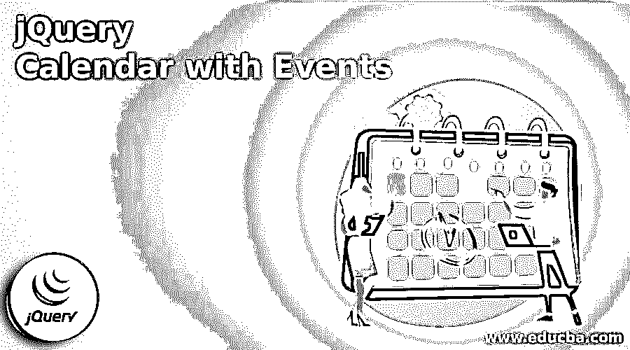
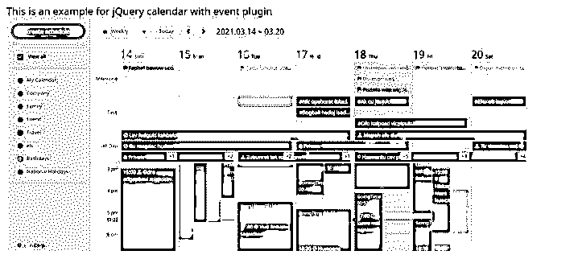

# 带有事件的 jQuery 日历

> 原文：<https://www.educba.com/jquery-calendar-with-events/>




## 带事件的 jQuery 日历简介

带有事件的 jQuery 日历用于在网站上显示事件。带有事件的日历可以在可用的 jQuery 插件的帮助下执行。jQuery 插件只是一个用来扩展 jQuery 原型对象的新函数。所有 jQuery 对象都通过扩展原型对象来继承所有添加的功能。所以插件被用来扩展日历对象或元素的功能。许多插件是可用的，这有助于开发人员为 web 应用程序创建一个有吸引力的日历。

### 带有事件的不同 jQuery 日历

下面给出了带有事件的不同 jQuery 日历:

<small>网页开发、编程语言、软件测试&其他</small>

*   tui . calendar:tui . calendar 是一个功能丰富的日历库，可用于在常规、每周和每月视图中显示自定义活动、日程和任务。
*   这个 FullCalendar 是一个轻量级但功能强大的 JavaScript 库，用于在现代 web 应用程序上创建可定制、可拖动的事件日历，对开发人员非常友好。
*   这是一个简单的、轻量级的、交互式的、动画的事件日历插件，当你选择一个日期时，它会在弹出窗口中显示事件信息。
*   **evo-calendar:** 该插件提供灵活的活动日历创建，使用灵敏、现代外观的日历界面来查看活动。
*   **calendarJS:** 这是一个在最新的 Bootstrap 4 框架中使用的 jQuery 插件，它允许您构建一个简单、敏感的日历部件。
*   这个 jQuery 插件允许过滤日期、启用/禁用过去的日期、设置可用的日期/工作日等等。这是一个简单、轻量级的 JavaScript 内嵌日历。
*   pbcalendar: 这是一个轻量级插件，允许你在网站上查看月历，并在特定日期动态安排事件。

### 带有事件插件的 jQuery 日历示例

下面是提到的例子:

使用 tui.calender 插件的带有事件插件的 jQuery 日历示例。

使用 tui.calender 插件的步骤如下:

*   首先，下载 tui.calender 插件并解压。解压缩文件夹包含文件和文件夹。
*   接下来，开始在示例文件夹中创建我们的 html 文件网页。

**代码:**

```
<!DOCTYPE html>
<html >
<head>
<meta http-equiv = "Content-Type" content = "text/html; charset = utf-8" />
<title> This is an example for jQuery calendar with event plugin </title>
<link rel = "stylesheet" href = "https://maxcdn.bootstrapcdn.com/bootstrap/3.3.2/css/bootstrap.min.css">
<link rel = "stylesheet" type = "text/css" href = "../dist/tui-calendar.css">
<link rel = "stylesheet" type = "text/css" href = "https://uicdn.toast.com/tui.time-picker/latest/tui-time-picker.css">
<link rel = "stylesheet" type = "text/css" href = "./css/icons.css">
<link rel = "stylesheet" type = "text/css" href = "https://uicdn.toast.com/tui.date-picker/latest/tui-date-picker.css">
<link rel = "stylesheet" type = "text/css" href = "./css/default.css">
</head>
<body>
<h3> This is an example for jQuery calendar with event plugin </h3>
<div id = "lnb">
<div class = "lnb-new-schedule">
<button id = "btn-new-schedule" type = "button" class = "btn btn-default btn-block lnb-new-schedule-btn" data-toggle = "modal">
create schedule</button>
</div>
<div id = "lnb-calendars" class = "lnb-calendars">
<div>
<div class = "lnb-calendars-item">
<label>
<input class = "tui-full-calendar-checkbox-square" type = "checkbox" value = "all" checked>

<strong> View all </strong>
</label>
</div>
</div>
<div id = "calendarList" class = "lnb-calendars-d1">
</div>
</div>
<div class = "lnb-footer">
© NHN Corp.
</div>
</div>
<div id = "right">
<div id = "menu">

<button id = "dropdownMenu-calendarType" class = "btn btn-default btn-sm dropdown-toggle" type = "button" data-toggle = "dropdown"
aria-haspopup = "true" aria-expanded = "true">
<i id = "calendarTypeIcon" class = "calendar-icon ic_view_month" style = "margin-right : 4px;"></i>
 select  &nbsp;
<i class = "calendar-icon tui-full-calendar-dropdown-arrow"></i>
</button>
<ul class = "dropdown-menu" role = "menu" aria-labelledby = "dropdownMenu-calendarType">
<li role = "presentation">
<a class = "dropdown-menu-title" role = "menuitem" data-action = "toggle-monthly">
<i class = "calendar-icon ic_view_month"> </i> Month
</a>
</li>
<li role = "presentation">
<a class = "dropdown-menu-title" role = "menuitem" data-action = "toggle-weekly">
<i class = "calendar-icon ic_view_week"> </i> Weekly
</a>
</li>
<li role="presentation">
<a class = "dropdown-menu-title" role = "menuitem" data-action = "toggle-daily">
<i class = "calendar-icon ic_view_day"> </i> Daily
</a>
</li>
<li role = "presentation">
<a class = "dropdown-menu-title" role = "menuitem" data-action = "toggle-weeks2">
<i class = "calendar-icon ic_view_week"> </i> 2 weeks
</a>
</li>
<li role = "presentation">
<a class = "dropdown-menu-title" role = "menuitem" data-action = "toggle-weeks3">
<i class = "calendar-icon ic_view_week"> </i> 3 weeks
</a>
</li>
<li role = "presentation" class = "dropdown-divider"> </li>
<li role = "presentation">
<a role = "menuitem" data-action = "toggle-workweek">
<input type = "checkbox" class = "tui-full-calendar-checkbox-square" value = "toggle-workweek" checked>
  Show weekends
</a>
</li>
<li role = "presentation">
<a role = "menuitem" data-action = "toggle-start-day-1">
<input type = "checkbox" class = "tui-full-calendar-checkbox-square" value = "toggle-start-day-1">
  Start Week on Monday
</a>
</li>
<li role = "presentation">
<a role = "menuitem" data-action = "toggle-narrow-weekend">
<input type = "checkbox" class = "tui-full-calendar-checkbox-square" value = "toggle-narrow-weekend">
  Narrower than weekdays
</a>
</li>
</ul>


<button type = "button" class = "btn btn-default btn-sm move-today" data-action = "move-today"> Today </button>
<button type = "button" class = "btn btn-default btn-sm move-day" data-action = "move-prev">
<i class = "calendar-icon ic-arrow-line-left" data-action = "move-prev"></i>
</button>
<button type = "button" class = "btn btn-default btn-sm move-day" data-action = "move-next">
<i class = "calendar-icon ic-arrow-line-right" data-action = "move-next"></i>
</button>

 
</div>
<div id = "calendar"></div>
</div>
<script src = "https://code.jquery.com/jquery-3.2.1.slim.min.js" integrity = "sha384-KJ3o2DKtIkvYIK3UENzmM7KCkRr/rE9/Qpg6aAZGJwFDMVNA/GpGFF93hXpG5KkN"
crossorigin = "anonymous"> </script>
<script src = "https://maxcdn.bootstrapcdn.com/bootstrap/3.3.2/js/bootstrap.min.js"></script>
<script src = "https://uicdn.toast.com/tui.code-snippet/v1.5.2/tui-code-snippet.min.js"></script>
<script src = "https://cdnjs.cloudflare.com/ajax/libs/moment.js/2.20.1/moment.min.js"></script>
<script src = "https://uicdn.toast.com/tui.date-picker/v4.0.3/tui-date-picker.min.js"></script>
<script src = "https://uicdn.toast.com/tui.time-picker/v2.0.3/tui-time-picker.min.js"></script>
<script src = "https://cdnjs.cloudflare.com/ajax/libs/chance/1.0.13/chance.min.js"></script>
<script src = "./js/data/schedules.js"></script>
<script src = "../dist/tui-calendar.js"></script>
<script src = "./js/data/calendars.js"></script>
<script src="./js/app.js"></script>
</body>
</html>
```

**输出:**




在上面的代码中，创建了带有事件的日历。接下来，我们可以创建一个新事件，按月份、周和所有时间查看事件，正如我们在上面的输出中看到的。

### 结论

它们用于扩展日历的功能；有不同类型的带有事件插件的日历，这些插件具有特定的功能。这些用于创建带有事件的日历，以向网站的访问者显示事件。

### 推荐文章

这是一个带有事件的 jQuery 日历指南。在这里，我们讨论的介绍，不同的 jQuery 日历与事件和例子。您也可以看看以下文章，了解更多信息–

1.  [jQuery 选择选项](https://www.educba.com/jquery-select-option/)
2.  [jQuery zindex](https://www.educba.com/jquery-zindex/)
3.  [jQuery 宽度](https://www.educba.com/jquery-width/)
4.  [jQuery id 选择器](https://www.educba.com/jquery-id-selector/)


