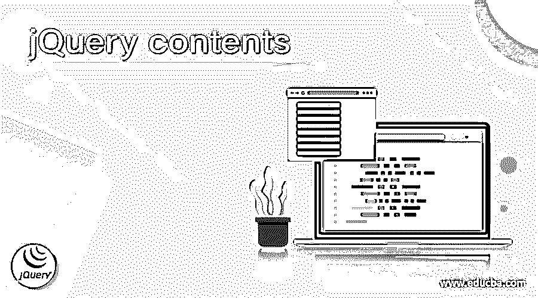
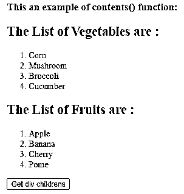
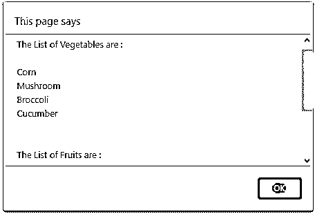
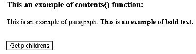
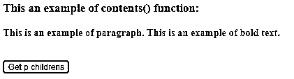
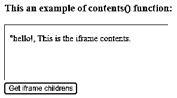
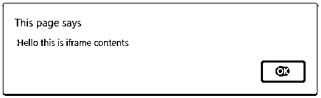

# jQuery 内容

> 原文：<https://www.educba.com/jquery-contents/>




## jQuery 内容描述

jQuery contents()函数用于获取匹配集中每个元素的直接子元素，包括注释和文本节点。jQuery contents()函数是 jQuery 中的内置函数。jQuery contents()函数在 DOM 树中搜索这些元素的直接子元素，并创建一个新的 jQuery 对象。这个函数的执行类似于 children()函数，只是它在生成的新 jQuery 对象中包含了 comment 和 text HTML 元素。如果 iframe 在同一个域中，它还返回 iframe 的内容文档。

**语法:**

<small>网页开发、编程语言、软件测试&其他</small>

```
$(selector).contents();
```

**参数:**

它不需要任何参数。

*   **返回值——**该函数的返回值是选择器的所有直接子 HTML 元素。

### jQuery contents()函数的工作原理

JQuery contents()函数不接受任何参数。假设 HTML 页面中有一个 div 元素，其中包含一些子元素。现在我们需要获得 div 元素的所有子元素，因此我们可以将 contents()函数用作“$(“div”)。contents()”，它返回包含内容的 div 元素的所有子元素。

### 例子

jQuery contents()函数示例显示了 contents()函数的工作原理

#### 示例#1

**代码:**

```
<!doctype html>
<html lang="en">
<head>
<meta charset="utf-8">
<script src="https://code.jquery.com/jquery-3.5.0.js"></script>
<title> This is an example for jQuery contents() function </title>
<script>
function disp()
{
var content = $( "div" ).contents().text();
alert( content );
}
</script>
</head>
<body>
<h3> This an example of contents() function: </h3>
<div>
<h2> The List of Vegetables are : </h2>
<ol>
<li> Corn </li>
<li> Mushroom </li>
<li> Broccoli </li>
<li> Cucumber </li>
</ol>
</div>
<div>
<h2> The List of Fruits are : </h2>
<ol>
<li> Apple </li>
<li> Banana </li>
<li> Cherry </li>
<li> Pome </li>
</ol>
</div>
<button onclick = "disp()"> Get div childrens </button>
</body>
</html>
```

上述代码的输出是




一旦我们点击按钮，输出是




在上面的代码中，有一些 div 元素将“h2”、“ol”和“li”作为子元素。接下来，使用 contents()函数以“$(“div”)的形式获取 div 元素的子元素。内容()。text()；"，它返回“h2”、“ol”和“li”元素，这些元素通过使用 text()函数显示，且在我们单击按钮时显示在警告中。

jQuery contents()函数与 contents()函数和 filter()函数一起工作的示例

#### 实施例 2

**代码:**

```
<!doctype html>
<html lang="en">
<head>
<meta charset="utf-8">
<script src = "https://code.jquery.com/jquery-3.5.0.js"></script>
<title> This is an example for jQuery contents() function </title>
<style>
p {
color : blue;
}
</style>
</head>
<body>
<h3> This an example of contents() function: </h3>
<p> This is an example of paragraph. <b> This is an example of bold text. </b>
</p>
<br>
<button onclick = "disp()" style = "background-color : yellow" > Get p childrens</button>
<script>
function disp()
{
$( "p" )
.contents()
.filter(function(){
return this.nodeType !== 2;
})
.wrap( "<b> </b>" );
}
</script>
</body>
</html>
```

上述代码的输出是–




一旦我们点击“获取 p 个子节点”按钮，输出是




在上面的代码中，有一个以“b”为子元素的“p”元素。接下来，使用 contents()函数获取“p”元素的子元素，并通过使用 filter()和 wrap()函数将粗体样式应用于“p”元素及其子元素，单击按钮后就会执行该函数，如上面的输出所示。

获取 iframe 内容的 jQuery grep()函数示例

#### 实施例 3

首先，我们创建一个 iframe.html 文件，在主 HTML 页面中给出 iframe 的内容。

**代码:**

```
<!doctype html>
<html lang="en">
<head>
<meta charset="utf-8">
<script src = "https://code.jquery.com/jquery-3.5.0.js"></script>
<title> This is an example for jQuery contents() function </title>
<style>
p {
color: blue;
}
</style>
</head>
</head>
<body>
<p> "hello!, This is the iframe contents. </p>
</body>
</html>
```

接下来，我们创建主 HTML 页面文件。

```
<!doctype html>
<html lang = "en">
<head>
<meta charset = "utf-8">
<script src = "https://code.jquery.com/jquery-3.5.0.js"></script>
<title> This is an example for jQuery contents() function </title>
<style>
p {
color: blue;
}
</style>
</head>
<script>
function disp( )
{
var content = $( "iframe" ).contents().text( );
alert( content );
}
</script>
</head>
<body>
<h3> This an example of contents() function: </h3>
<iframe src = "iframe.html" width = "300" height = "100" title = "Iframe Example" > Hello this is iframe contents</iframe>
<br>
<button onclick = "disp()" style = "background-color : yellow" > Get iframe childrens </button>
</body>
</html>
```

上述代码的输出是




一旦我们点击“获取 p 个子节点”按钮，输出是




在上面的代码中，首先创建 HTML 文件以包含 iframe 中的内容。接下来，创建主页 HTML 文件，这样就有一个包含一些内容的 iframe 元素。contents()函数用于以$(“iframe”)的形式获取 iframe 元素的子元素。内容()。text()；”，它返回使用 text()函数显示的元素，并在我们单击按钮后显示在警告中。

### 结论

jQuery contents()函数是一个内置函数，用于获取匹配集中每个元素的直接子元素，包括注释和文本节点。

### 推荐文章

这是 jQuery 内容指南。这里我们分别讨论 jQuery contents()函数示例的描述、工作原理和代码实现。您也可以看看以下文章，了解更多信息–

1.  [jQuery 当](https://www.educba.com/jquery-when/)
2.  [jQuery zindex](https://www.educba.com/jquery-zindex/)
3.  [jQuery off](https://www.educba.com/jquery-off/)
4.  [jQuery 扩展](https://www.educba.com/jquery-extend/)


